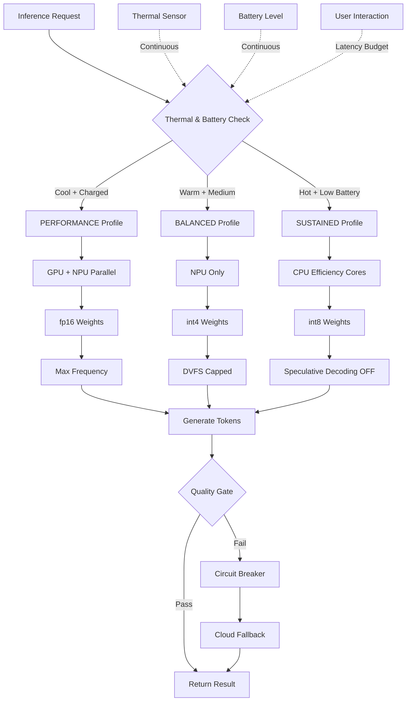

# Your phone is AI's newest hardware

## Introduction

We spent the last decade training ourselves to think of the phone as a dumb terminal. Tap a button, fire a REST call, wait for a GPU cluster to hallucinate a response, render it on screen. That mental model is dead. The latency budget doesn't work. The bandwidth costs don't work. The privacy regulations don't work. And when your DAU hits eight figures, the COGS will bury you.

The phone is a heterogeneous compute node. It has a CPU with latency-optimized cores, a GPU with massive parallel throughput, an NPU designed specifically for matrix math at wattages under 500mW, and a DSP handling sensor fusion in the background. It also has a battery, a thermal envelope, and 8GB of shared memory that the OS is actively fighting you for.

Building AI inference for this platform requires a fundamentally different architecture than cloud deployment. This article covers what that looks like in practice — the runtime stack, the memory patterns, the power-aware scheduling, and the escape hatches when local inference breaks.

## Why This Matters

Here's the production reality we hit last year. We shipped an on-device summarization feature. Cloud fallback worked fine in staging with 10,000 users. At 2 million DAU, the egress bill alone was $47K/month. P99 latency was 1.2 seconds because users were on 4G in elevators. And GDPR compliance meant we couldn't even log the prompts without a legal review cycle that took three months.

Local-first inference solves all three problems simultaneously. Zero egress. Sub-100ms TTFT. Data never leaves the sandbox. But it introduces a new set of hard problems: thermal throttling mid-generation, memory fragmentation killing long chat sessions, and vendor driver bugs that surface only on Samsung Galaxy A53s running Android 14.

The engineers who treat the phone like a small cloud instance will ship broken stuff. The engineers who treat it as the constrained heterogeneous device it is will ship something fast, private, and cheap.

## How It Works

The core mechanism is a power-aware inference scheduler that dynamically selects compute resources based on thermal state, battery level, and user latency requirements. Here's the flow:



The scheduler runs as a finite state machine. It reads the thermal zone temperature from the kernel (`/sys/class/thermal/thermal_zone0/temp`), checks the battery discharge rate, and queries the app's foreground/background state. Based on these inputs, it selects one of three compute profiles. Each profile locks the DVFS governor, pins the appropriate cores, and configures the NPU driver's power domain.

The critical detail most teams miss: the thermal governor doesn't just throttle — it *preempts*. If temperature crosses 42°C during generation, the scheduler pauses the current decode step, drops to the next lower profile, and resumes. The KV cache stays resident in memory so we don't recompute prompt embeddings.

When local inference fails — OOM, driver crash, quality gate failure — a circuit breaker triggers cloud fallback. We serialize the KV cache and prompt context, send it to the cloud endpoint, and stream the remaining tokens back. The user sees a 200ms hiccup, not a full re-generation.

## Core Concepts

**Heterogeneous Compute Mapping.** The phone SoC isn't "a GPU." It's four different execution units with different instruction sets, memory access patterns, and power profiles. The NPU excels at int8 matrix multiply but can't do floating-point attention masking. The GPU handles fp16 well but burns power. CPU efficiency cores are slow but thermally invisible. Your runtime must map ops to the right unit — and that mapping changes as thermal conditions change.

**The Memory Wall.** Desktop GPUs have 24GB of discrete VRAM with 900GB/s bandwidth. Your phone has 8GB of unified memory shared with the OS, the camera pipeline, and the browser. Zero-copy isn't an optimization — it's a survival strategy. Every `memcpy` between CPU and GPU buffers costs you milliseconds and battery cycles.

**Arena Allocation.** Standard `malloc`/`free` patterns fragment memory over long chat sessions. After 40 turns of conversation, you'll get allocation failures not because you've exceeded total memory, but because the heap is too fragmented. Arena allocators pre-allocate a contiguous block at session start and bump a pointer for each tensor allocation. Reset the pointer on session end. Zero syscalls during generation.

**Quantization Strategy.** PTQ works for CNNs. For transformers, it fails on outlier channels — a few extreme values destroy the precision of int8 rounding. QAT is mandatory for LLMs on device. Mixed precision is the practical sweet spot: int4 weights, int8 KV cache, fp16 attention logits. The savings are real — a 7B model drops from 14GB to under 4GB with int4.

**KV Cache Persistence.** Recomputing prompt tokens burns battery and latency. Disk-backed KV cache with mmap lets you evict cold context to storage and pull it back on demand. Quantize the stored K/V to int8, dequant to fp16 on-the-fly during the attention matmul. The overhead is measurable but acceptable for context windows beyond 4K tokens.

## Examples & Code Walkthrough

### ThermalAwareScheduler — Power Profile State Machine

```kotlin
// ThermalAwareScheduler.kt
// Manages inference compute profiles based on real-time thermal/battery state.
// Integrates with Android Thermal API and BatteryManager.

enum class PowerProfile {
    PERFORMANCE,  // GPU+NPU, fp16, max freq — cool device, charging
    BALANCED,     // NPU only, int4, DVFS capped — warm, medium battery
    SUSTAINED     // CPU eff cores, int8, no speculative — hot, low battery
}

data class ThermalState(
    val zoneTempCelsius: Float,
    val batteryLevel: Int,           // 0-100
    val dischargeRateMA: Int,        // positive = discharging
    val isCharging: Boolean,
    val isForeground: Boolean,
    val throttleEvents: Int          // rolling window count
)

class ThermalAwareScheduler(
    private val thermalZonePath: String = "/sys/class/thermal/thermal_zone0/temp",
    private val fallbackDelegate: InferenceDelegate? = null
) {
    private var currentProfile: PowerProfile = PowerProfile.BALANCED
    private val throttleThreshold = 42.0f   // °C — pause generation above this
    private val perfTempThreshold = 35.0f
    private val sustainedTempThreshold = 38.0f

    /**
     * Reads raw thermal zone value from kernel.
     * Values are typically in millidegrees (e.g., 42000 = 42°C).
     */
    fun readThermalZone(): Float {
        return try {
            File(thermalZonePath).readText().trim().toFloat() / 1000.0f
        } catch (e: Exception) {
            // Fallback: assume safe temp if sensor unavailable
            30.0f
        }
    }

    /**
     * Core decision function. Called before each inference session.
     * Returns the selected PowerProfile and configures the runtime.
     */
    fun selectProfile(state: ThermalState): PowerProfile {
        val temp = state.zoneTempCelsius

        val profile = when {
            // Performance: cool device, charging or high battery, foreground
            temp < perfTempThreshold &&
            (state.isCharging || state.batteryLevel > 30) &&
            state.isForeground -> PowerProfile.PERFORMANCE

            // Sustained: hot device, low battery, or too many throttle events
            temp >= sustainedTempThreshold ||
            state.batteryLevel < 15 ||
            state.throttleEvents > 3 -> PowerProfile.SUSTAINED

            // Balanced: everything else
            else -> PowerProfile.BALANCED
        }

        if (profile != currentProfile) {
            applyProfile(profile)
            currentProfile = profile
        }

        return profile
    }

    /**
     * Applies the selected profile to the runtime.
     * This is where you'd configure NNAPI, CoreML, or Vulkan delegates.
     */
    private fun applyProfile(profile: PowerProfile) {
        when (profile) {
            PowerProfile.PERFORMANCE -> {
                // Lock GPU + NPU, set governor to "performance"
                // Use fp16 precision, enable speculative decoding
                configureNnapiDelegate(precision = Precision.FP16, threads = 4)
            }
            PowerProfile.BALANCED -> {
                // NPU only, int4 weights, DVFS capped at 1.8GHz
                configureNnapiDelegate(precision = Precision.INT4, threads = 2)
            }
            PowerProfile.SUSTAINED -> {
                // CPU efficiency cores only, int8, speculative decoding OFF
                configureCpuDelegate(cores = "little", precision = Precision.INT8)
            }
        }
    }

    /**
     * Checks if current thermal state requires throttling mid-generation.
     * Returns true if generation should pause and degrade profile.
     */
    fun shouldThrottle(currentTemp: Float): Boolean {
        return currentTemp >= throttleThreshold
    }
}
```

### ArenaAllocator — Zero-Fragmentation Tensor Memory

```rust
// arena_allocator.rs
// Pre-allocates a contiguous memory block for inference session tensors.
// Uses pointer bumping for O(1) allocation, reset-on-session-end for zero fragmentation.

use std::alloc::{alloc, dealloc, Layout};
use std::ptr::NonNull;

pub struct ArenaAllocator {
    base: NonNull<u8>,
    capacity: usize,
    offset: usize,
    allocations: Vec<Allocation>,  // for debugging/validation
}

struct Allocation {
    ptr: NonNull<u8>,
    size: usize,
    label: &'static str,
}

impl ArenaAllocator {
    /// Pre-allocates `capacity` bytes. Called once at session start.
    /// Panics if system alloc fails — this is a fatal error, not retryable.
    pub fn new(capacity: usize) -> Self {
        let layout = Layout::from_size_align(capacity, 64).expect("Invalid layout");
        let ptr = unsafe { alloc(layout) };
        if ptr.is_null() {
            panic!("ArenaAllocator: failed to allocate {capacity} bytes");
        }
        ArenaAllocator {
            base: unsafe { NonNull::new_unchecked(ptr) },
            capacity,
            offset: 0,
            allocations: Vec::new(),
        }
    }

    /// Allocates `size` bytes with 64-byte alignment.
    /// Returns null pointer if insufficient space — caller must handle OOM.
    /// Complexity: O(1) — just a pointer bump and alignment check.
    pub fn alloc(&mut self, size: usize, label: &'static str) -> *mut u8 {
        // Align offset to 64-byte boundary (cache line)
        let aligned = (self.offset + 63) & !63;
        if aligned + size > self.capacity {
            return std::ptr::null_mut();
        }

        let ptr = unsafe { self.base.as_ptr().add(aligned) };
        self.offset = aligned + size;
        self.allocations.push(Allocation {
            ptr: unsafe { NonNull::new_unchecked(ptr) },
            size,
            label,
        });
        ptr
    }

    /// Resets the arena to zero offset. All previous allocations are invalidated.
    /// Called at end of inference session. Zero deallocations — the entire block is freed at once.
    pub fn reset(&mut self) {
        self.offset = 0;
        self.allocations.clear();
    }

    /// Returns remaining bytes. Useful for pre-flight OOM checks.
    pub fn remaining(&self) -> usize {
        self.capacity - self.offset
    }
}

impl Drop for ArenaAllocator {
    fn drop(&mut self) {
        let layout = Layout::from_size_align(self.capacity, 64).unwrap();
        unsafe { dealloc(self.base.as_ptr(), layout) };
    }
}
```

## Best Practices

**Profile your model on the cheapest device in your support matrix.** If it runs on a Moto G Power (2022) with 4GB RAM, it'll run anywhere. Testing only on flagship devices hides the memory pressure that kills your median user experience.

**Use ONNX or ExecuTorch as your IR, not TFLite or CoreML directly.** Vendor runtime bugs are inevitable. When CoreML decides your `silu` activation is unsupported on iOS 16.4, you want to be retargeting a single IR, not rewriting your model definition. Build-time backend selection lets you ship one model file with platform-specific delegates.

**Quantize KV caches separately from weights.** Weights are static — quantize once at build time. KV caches are dynamic and allocation-heavy — quantize at runtime with a fast dequant path in your attention kernel. The throughput difference is 2-3x on memory-bound decode steps.

**Batch your telemetry uploads.** You get roughly 5MB of log quota before the OS kills your background process. Compress metrics into binary protobuf, batch them, and upload only on WiFi + charging. The `tokens/sec` and `energy_per_token` metrics are worth more than any error log.

**Expose power profile selection to product.** Don't hide this behind a middleware flag. Let product teams A/B test "battery saver mode" vs "best quality" and measure conversion impact. The thermal scheduler is a feature, not an implementation detail.

## Common Mistakes & Anti-Patterns

**Mistake 1: Ignoring thermal feedback in the inference loop.**
Teams profile latency on a cool device, ship the model, and get bug reports of "random hangs" from users. The model isn't hanging — it's thermally throttling mid-generation and the decode step is taking 800ms instead of 20ms.

*Fix:* Insert thermal checks between decode steps. If temperature exceeds threshold, drop precision or switch to CPU and resume. Never block the UI thread — yield and poll.

**Mistake 2: Using standard malloc for tensor lifetimes.**
Each `malloc`/`free` pair during generation fragments the
