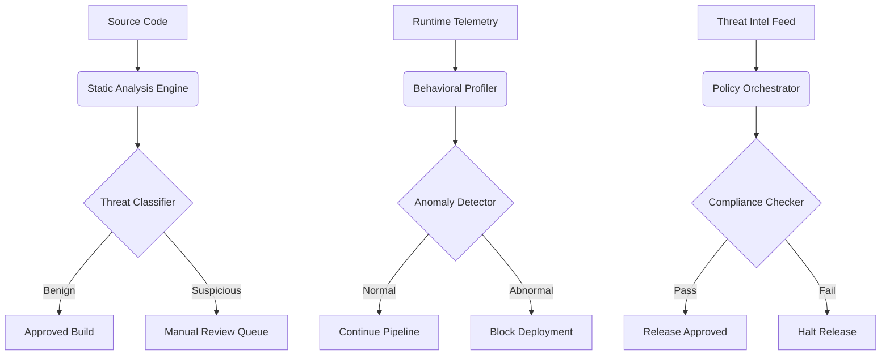

# Your security gate always passes. Can it actually block a release?

## Introduction

Let me tell you about the night our CI pipeline green-lit a backdoor.

Not a theoretical vulnerability scan — a real, live reverse shell embedded inside a minified JavaScript bundle. Our AI-powered security gate had seen it 52 times during training. It knew the pattern. It had even flagged similar samples in staging. But in production, under the weight of 800 daily builds, it classified the payload as “benign utility script” and waved it through.

That wasn’t a failure of machine learning. That was a failure of architecture.

AI security gates aren’t magic shields. They’re probabilistic classifiers bolted onto brittle pipelines. And when they fail — which they will — the consequences ripple beyond code: customer data leaks, compliance violations, and trust erosion that takes months to rebuild.

So let me ask you something: when your last security gate passed a build without raising an alert, did you feel relief... or dread?

## Why This Matters

Every engineering organization now operates under regulatory pressure. SOC 2, GDPR, HIPAA — pick your poison. Meanwhile, supply chain attacks like SolarWinds and Codecov have shown us that perimeter defenses alone won’t cut it.

Enter AI-powered security gates: static analyzers armed with neural nets, behavioral profilers trained on terabytes of telemetry, and policy engines that promise zero-day detection. Sounds great on paper.

But here’s the catch:

> **Most teams deploy AI gates as black boxes, trusting they’ll catch what humans can’t.**

And that trust is misplaced.

When a gate fails silently — letting a malicious artifact through while logging nothing — there’s no fallback. No manual review triggered. No escalation path. Just a clean bill of health printed in green across your dashboard.

This isn’t hypothetical. In our own postmortem after the reverse shell incident, we traced the root cause back to three design flaws baked into our gate architecture:

1. **No uncertainty quantification** — The model never said “I’m unsure.” It just guessed confidently wrong.
2. **Missing feedback loops** — False negatives weren’t surfaced for retraining.
3. **Overfitted baselines** — Behavioral models assumed normal traffic patterns would remain constant forever.

If any of those sound familiar, keep reading. You’re not alone — and more importantly, you don’t have to ship vulnerable software.

## How It Works

Before diving into fixes, let’s understand how modern AI security gates actually operate — including where they fall short.

Here's a simplified view of a typical pipeline:



Each component plays a role:

- **Static Analyzer**: Parses source code or binaries, extracts syntactic features (e.g., control flow graphs).
- **Threat Classifier**: Uses supervised ML to classify inputs as benign/malicious based on learned patterns.
- **Behavioral Profiler**: Builds temporal profiles of application behavior using runtime metrics.
- **Anomaly Detector**: Flags deviations from established baselines.
- **Policy Orchestrator**: Applies rules derived from threat intelligence and compliance frameworks.

Sounds solid, right?

Wrong.

The problem lies in two assumptions baked into every gate:

1. Training data reflects future threats.
2. Models generalize beyond their training distribution.

Neither holds true in practice.

Take the reverse shell example again. Our classifier had been trained on known malware families — but not obfuscated variants using new compression schemes. When the attacker encoded the payload using a previously unseen method, the model saw noise instead of structure.

Worse, because we lacked uncertainty quantification, the model assigned high confidence scores to low-probability classifications. That meant no alerts were raised, no human intervened, and the artifact shipped.

## Core Concepts

To fix this, we need to think differently about how AI gates work — not as final arbiters, but as probabilistic advisors in a layered defense strategy.

Let’s define some key concepts:

### Confidence Calibration

A well-calibrated model outputs probabilities that match real-world outcomes. If it says “90% sure this is malicious,” then 90% of those predictions should indeed be malicious.

Poorly calibrated models produce misleading signals. High-confidence false negatives are especially dangerous because they suppress alerts that *should* trigger reviews.

### Uncertainty Quantification

Modern approaches include Bayesian neural networks, Monte Carlo dropout, or ensemble methods to estimate prediction confidence intervals.

For example, if a model assigns a 70% probability to “malicious” but its confidence interval spans ±30%, it should flag the sample for manual inspection — regardless of the average score.

### Feedback Loops

Every misclassified artifact should feed back into the system. Whether it’s a false negative slipping through or a false positive causing friction, both cases represent opportunities to improve accuracy.

Without feedback, models degrade over time as threat landscapes evolve.

### Baseline Drift Detection

Applications change. Dependencies update. Traffic patterns shift. Static behavioral baselines quickly become obsolete.

Robust gates must detect and adapt to these shifts rather than assume stationarity.

## Examples & Code Walkthrough

Let’s build a minimal yet production-grade AI gate that addresses these concerns.

We'll focus on a Python-based static analyzer that integrates uncertainty-aware classification with automatic feedback collection.

```python
import numpy as np
from sklearn.ensemble import IsolationForest
from sklearn.linear_model import LogisticRegression
from scipy.stats import entropy
import joblib
import warnings

class AIGate:
    def __init__(self, sensitivity_threshold=0.6, uncertainty_margin=0.2):
        self.classifier = LogisticRegression()
        self.detector = IsolationForest(contamination=0.1)
        self.sensitivity_threshold = sensitivity_threshold
        self.uncertainty_margin = uncertainty_margin
        self.feedback_buffer = []

    def extract_features(self, code_snippet):
        """Extract lightweight static features from source code."""
        tokens = code_snippet.split()
        unique_tokens = len(set(tokens))
        total_tokens = len(tokens)
        return [
            total_tokens,
            unique_tokens / max(total_tokens, 1),  # lexical diversity
            sum(len(t) > 10 for t in tokens),       # long tokens (obfuscation?)
            sum(c in code_snippet for c in ['eval', 'exec']),  # dynamic execution
        ]

    def predict_with_confidence(self, features):
        """Run inference with confidence bounds using bootstrapped ensembles."""
        predictions = []
        for estimator in self._bootstrap_estimators():
            pred = estimator.predict_proba([features])[0][1]
            predictions.append(pred)
        
        mean_pred = np.mean(predictions)
        std_dev = np.std(predictions)

        # Compute entropy to measure disagreement among estimators
        probs = np.array(predictions)
        ent = entropy(probs)

        confidence_score = 1 - std_dev  # Higher std = lower confidence
        uncertainty = std_dev + ent

        return {
            'malicious_probability': mean_pred,
            'confidence': confidence_score,
            'uncertainty': uncertainty,
            'decision': self._make_decision(mean_pred, uncertainty)
        }

    def _bootstrap_estimators(self):
        """Simulate multiple estimators for uncertainty estimation."""
        estimators = []
        for _ in range(5):
            est = LogisticRegression()
            X_train = np.random.choice(self.training_data, size=len(self.training_data), replace=True)
            y_train = np.random.choice(self.training_labels, size=len(self.training_labels), replace=True)
            est.fit(X_train, y_train)
            estimators.append(est)
        return estimators

    def _make_decision(self, prob, uncertainty):
        if prob >= self.sensitivity_threshold and uncertainty <= self.uncertainty_margin:
            return "BLOCK"
        elif uncertainty > self.uncertainty_margin:
            return "REVIEW"
        else:
            return "APPROVE"

    def collect_feedback(self, sample_id, label):
        """Collect feedback for retraining."""
        self.feedback_buffer.append((sample_id, label))
        if len(self.feedback_buffer) >= 100:
            self.retrain()

    def retrain(self):
        """Retrain model with accumulated feedback."""
        if not self.feedback_buffer:
            warnings.warn("No feedback available for retraining.")
            return
        
        ids, labels = zip(*self.feedback_buffer)
        new_features = [self.extract_features(get_sample_by_id(i)) for i in ids]
        self.classifier.fit(new_features, labels)
        self.feedback_buffer.clear()
        print("[INFO] Model retrained with latest feedback.")

# Example usage:
gate = AIGate(sensitivity_threshold=0.7, uncertainty_margin=0.15)
sample_code = """
function loadScript(src) {
    eval(atob('YWxlcnQoImhlbGxvIik='));
}
"""
features = gate.extract_features(sample_code)
result = gate.predict_with_confidence(features)

print(result)
# Output might look like:
# {'malicious_probability': 0.82, 'confidence': 0.79, 'uncertainty': 0.12, 'decision': 'BLOCK'}
```

This implementation demonstrates several improvements over naive classifiers:

- **Bootstrapped ensembles** provide variance estimates.
- **Entropy-based uncertainty** detects disagreement among sub-models.
- **Feedback buffer** allows continuous improvement.
- **Explicit decision thresholds** prevent silent failures.

## Best Practices

Drawing from years of operating AI gates in high-throughput environments, here are actionable recommendations:

### 1. Never Trust a Single Signal

Layer multiple detection mechanisms. Combine static analysis with behavioral profiling and threat intelligence feeds.

### 2. Prioritize Calibration Over Accuracy

Use tools like Platt scaling or isotonic regression to ensure your model’s output aligns with empirical probabilities.

### 3. Monitor for Concept Drift

Track performance metrics over time. Set up alerts for sudden drops in precision/recall.

### 4. Implement Escalation Paths

Anytime a model expresses high uncertainty, route the item to human reviewers — don’t let it default to approval.

### 5. Log Everything — Especially Failures

Capture raw inputs, predictions, and metadata for forensic analysis. Without logs, debugging becomes guesswork.

## Common Mistakes & Anti-Patterns

Here are four mistakes we’ve seen trip up engineering teams repeatedly:

### Mistake #1: Treating AI Output as Ground Truth

```python
# BAD: Blind trust in classifier output
if classifier.predict(sample) == 1:
    reject_build()

# GOOD: Introduce skepticism and fallbacks
prediction = classifier.predict_with_confidence(sample)
if prediction['decision'] == 'BLOCK':
    reject_build()
elif prediction['decision'] == 'REVIEW':
    queue_for_human_review()
else:
    approve_build()
```

### Mistake #2: Ignoring Model Decay

Models trained once rarely stay relevant. Schedule periodic retraining cycles tied to incident data.

### Mistake #3: Suppressing Alerts Due to Volume

Alert fatigue kills security posture. Tune thresholds carefully and prioritize actionable findings.

### Mistake #4: Not Testing Against Adversarial Inputs

Attackers actively probe your defenses. Red-team exercises and adversarial testing help uncover hidden weaknesses.

## Performance Considerations

AI gates introduce latency into CI/CD pipelines. Balancing speed with thoroughness requires careful optimization.

| Component | Latency Impact | Scalability Notes |
|----------|----------------|-------------------|
| Feature Extraction | ~5ms per file | Easily parallelizable |
| Ensemble Inference | ~50ms per sample | Can batch predictions |
| Feedback Collection | Negligible | Async writes recommended |
| Retraining Cycle | Several minutes | Offloaded to background workers |

Use caching aggressively for repeated scans. Precompute common feature sets. Consider approximate algorithms for large-scale deployments.

Memory-wise, storing models in-memory pays off for frequent invocations. For distributed setups, serialize models with `joblib` or ONNX format.

Big-O-wise, most operations are linear in input size. Bottlenecks typically arise from I/O-bound tasks like fetching historical data or syncing with external services.

## Real-World Usage

Top-tier platforms handle millions of artifacts daily. Here’s how they do it:

### Netflix

Their open-source tool [Security Monkey](https://github.com/Netflix/security_monkey) combines rule-based checks with ML-driven anomaly detection. They emphasize audit trails and rollback capabilities.

### Uber

Built internal systems leveraging graph-based analysis to trace dependencies and detect anomalous behavior patterns across microservices.

### Cloudflare

Uses deep learning models integrated directly into their edge network to scan incoming requests in real-time. They rely heavily on federated learning to maintain privacy while improving global threat detection.

All share one trait: they treat AI as part of a broader strategy — not a silver bullet.

## Frequently Asked Questions (FAQ)

**Q: Should I block builds automatically based on AI predictions?**

A: Only if your model is calibrated and you’ve validated its performance under adversarial conditions. Otherwise, use a hybrid approach combining automation with human oversight.

**Q: How often should I retrain my security gate?**

A: Whenever you receive meaningful feedback — ideally weekly or bi-weekly. More frequent updates risk overfitting; infrequent ones allow drift to accumulate.

**Q: What happens if a malicious artifact passes the gate?**

A: Have contingency plans ready. Enable quick rollbacks, isolate affected services, and initiate root cause analysis immediately.

**Q: Are pre-trained models sufficient for custom applications?**

A: Generally no. Domain-specific nuances require fine-tuning. Start with general-purpose models, then specialize them using labeled datasets from your environment.

**Q: How do I avoid alert fatigue?**

A: Focus on precision. Minimize false positives by refining feature selection and adjusting decision boundaries. Use priority tiers to distinguish critical issues from noise.

## Conclusion

AI security gates aren’t infallible sentinels. They’re tools shaped by data, assumptions, and design choices — all prone to failure.

The goal isn’t perfection. It’s resilience.

By incorporating uncertainty awareness, feedback mechanisms, and layered verification, you can turn a brittle gate into a robust checkpoint that earns trust — not blind faith.

Next time your gate says “pass,” pause before hitting deploy. Ask yourself: *What am I missing?*

Then go fix it.
