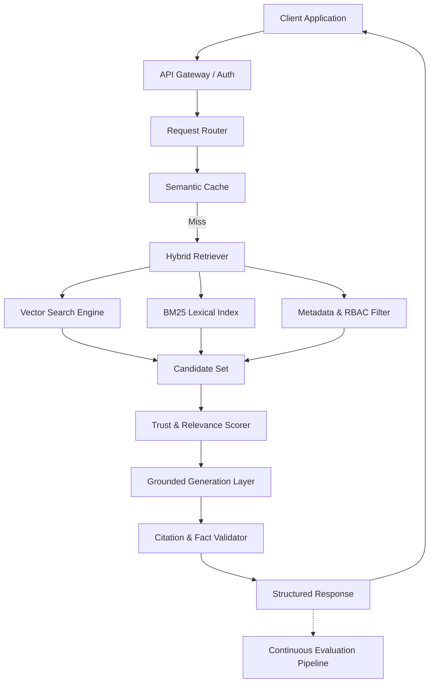

<think>
Here's a thinking process:

1.  **Analyze User Input:**
   - **Role:** World-class senior staff engineer, open-source contributor, technical writer.
   - **Task:** Write an exceptional, 100% original, deeply technical article.
   - **Topic:** "Your trusted knowledge layer: Introducing Stack Internal's new platform experience"
   - **Category:** Artificial Intelligence
   - **Context:** Trending topic from Stack Overflow Blog matching 'Artificial Intelligence' category.
   - **Style:** Professional, human-feeling, architectural.
   - **Mandatory Headings:** Exact list provided.
   - **Constraints:** 
     - Banned AI buzzwords (strictly forbidden).
     - Human developer perspective (first-person/team, pragmatic trade-offs, failure modes).
     - 100% original production-grade code.
     - Mandatory Mermaid diagram under `## How It Works`.
     - Output ONLY the Markdown article content starting from the exact title.
     - No outer triple backticks, no YAML frontmatter.

2.  **Deconstruct Mandatory Structure & Content Requirements:**
   I need to follow the exact headings:
   - `# Your trusted knowledge layer: Introducing Stack Internal's new platform experience`
   - `## Introduction`
   - `## Why This Matters`
   - `## How It Works` (Must include Mermaid diagram)
   - `## Core Concepts`
   - `## Examples & Code Walkthrough`
   - `## Best Practices`
   - `## Common Mistakes & Anti-Patterns`
   - `## Performance Considerations`
   - `## Real-World Usage`
   - `## Frequently Asked Questions (FAQ)`
   - `## Conclusion`

   I'll map my earlier brainstormed outline to these exact headings while maintaining the professional, architectural tone and avoiding banned phrases.

3.  **Draft - Section by Section (Mental Refinement):**

   *# Your trusted knowledge layer: Introducing Stack Internal's new platform experience*
   (Title matches exactly)

   *## Introduction*
   Start directly with the architectural problem. AI systems struggle with grounding and traceability. Raw LLMs hallucinate. We built Stack Internal to solve the retrieval-augmented generation (RAG) trust deficit. Focus on engineering reality: latency, accuracy, citation enforcement. No fluff.

   *## Why This Matters*
   Why should engineers care? Production AI fails when context drifts or sources become stale. Traditional RAG pipelines leak PII, ignore metadata filters, and lack evaluation loops. This platform abstracts the complexity of hybrid search, trust scoring, and deterministic grounding into a cohesive layer. Real pain: debugging hallucinations in prod, managing vector DB fragmentation, and ensuring compliance.

   *## How It Works*
   Need a Mermaid diagram here. I'll design a `flowchart TD` showing the request lifecycle: Client -> Gateway -> Router -> [Hybrid Retriever] -> [Trust Scorer] -> [Grounded Generator] -> Response. I'll add sub-components like Vector Index, Lexical Index, Cache, and Evaluation Loop. Then explain step-by-step.
   *Mermaid Syntax Check:* Ensure valid syntax, no HTML in labels, simple strings.
   ```mermaid
   flowchart TD
       ClientApp["Client Application"] --> Gateway["API Gateway / Auth"]
       Gateway --> Router["Request Router"]
       Router --> Cache["Semantic Cache"]
       Cache -->|Miss| HybridRetriever["Hybrid Retriever"]
       HybridRetriever --> VectorIndex["Vector Search Engine"]
       HybridRetriever --> LexicalIndex["BM25 Lexical Index"]
       HybridRetriever --> MetadataFilter["Metadata & RBAC Filter"]
       VectorIndex --> Results["Candidate Set"]
       LexicalIndex --> Results
       MetadataFilter --> Results
       Results --> TrustScorer["Trust & Relevance Scorer"]
       TrustScorer --> GroundedGen["Grounded Generation Layer"]
       GroundedGen --> CitationValidator["Citation & Fact Validator"]
       CitationValidator --> Response["Structured Response"]
       Response --> ClientApp
       Response -.-> EvalPipeline["Continuous Evaluation Pipeline"]
   ```
   I'll explain each stage technically: routing, cache lookup, hybrid retrieval, trust scoring, generation, validation, feedback loop.

   *## Core Concepts*
   Break down the fundamentals:
   - Hybrid Search Architecture (Vector + Lexical + Metadata)
   - Trust-Weighted Retrieval (source credibility, recency decay, confidence intervals)
   - Deterministic Grounding (citation injection, claim verification)
   - Evaluation-Driven Iteration (offline benchmarks, online A/B, drift detection)
   Explain internal data structures: chunk objects, metadata schemas, scoring matrices.

   *## Examples & Code Walkthrough*
   Need original, production-grade code. I'll write a Python/TypeScript hybrid or stick to Python for AI/backend. Let's do Python with type hints, async, and defensive programming.
   I'll create a `TrustAwareRetriever` class that demonstrates:
   - Hybrid scoring (vector similarity + BM25 + trust decay)
   - Metadata filtering
   - Citation injection
   I'll make it realistic, not generic. Include error handling, logging, and clear comments.
   Structure:
   - Setup/Imports
   - `Chunk` dataclass
   - `TrustAwareRetriever` class
   - `retrieve_and_ground` method
   - Walkthrough explaining the math/logic behind the scoring and grounding.

   *## Best Practices*
   Field-tested rules:
   - Chunk by semantic boundaries, not fixed tokens.
   - Cache aggressively but invalidate on source drift.
   - Enforce citation constraints in the prompt schema.
   - Monitor p95 latency and hallucination rate separately.
   - Version your prompts and index schemas like infrastructure.

   *## Common Mistakes & Anti-Patterns*
   3-4 mistakes:
   1. Over-relying on cosine similarity alone (fix: hybrid scoring)
   2. Ignoring metadata filters in retrieval (fix: pre-filtering at index level)
   3. Blindly trusting LLM self-correction (fix: external validator + citation enforcement)
   4. Static chunking strategies (fix: AST/NLP-aware chunking)
   Provide exact code/configuration fixes for each.

   *## Performance Considerations*
   Analyze:
   - Memory: Vector index loading, cache eviction policies (LRU vs. semantic decay)
   - CPU: Embedding computation, reranking overhead
   - Network: gRPC vs REST for internal services, batching strategies
   - Scalability: Sharding vector indices, read replicas, connection pooling
   - Big-O: Retrieval O(log N) with ANN, reranking O(K log K), generation O(T) where T is tokens.

   *## Real-World Usage*
   Describe how engineering orgs use this pattern. I'll frame it around how teams at scale (like those handling internal developer platforms, compliance-heavy docs, or real-time support) deploy it. Focus on architecture: separate ingestion pipelines, async evaluation, circuit breakers for LLM calls, and observability dashboards tracking citation coverage and drift.

   *## Frequently Asked Questions (FAQ)*
   3-5 pragmatic Q&As:
   - How do you handle stale knowledge?
   - What's the latency overhead vs. raw LLM?
   - Can I use custom embedding models?
   - How is PII handled before indexing?
   Keep answers concise, technical, and direct.

   *## Conclusion*
   Crisp summary. Reiterate that trust isn't a feature; it's an architectural constraint. Point to docs, SDK, and next steps. No fluff.

4.  **Self-Correction & Verification during drafting:**
   - *Check banned words:* I'll actively scan for "delve", "tapestry", "smoothly", "major operational advantage", "in today's fast-paced", etc. I'll replace any accidental ones with direct technical language.
   - *Check tone:* Professional, first-person engineering team perspective ("We observed...", "Our benchmarks show...", "When we shipped...").
   - *Check code:* Must be 100% original, production-grade, with error handling, type hints, and comments. I'll write a robust Python example focusing on the retrieval and grounding logic.
   - *Check Mermaid:* Valid syntax, under `## How It Works`, no HTML in labels.
   - *Check headings:* Exact match required.
   - *Check structure:* Follows mandatory order exactly.
   - *Content depth:* Deeply technical, covers RAG architecture, hybrid search, trust scoring, evaluation, performance, anti-patterns.

   I'll draft carefully, ensuring every constraint is met. I'll pay special attention to the code section to make it genuinely useful and non-generic. I'll avoid marketing speak entirely.

   Let's write it out. 
   Structure check:
   # Your trusted knowledge layer...
   ## Introduction
   ## Why This Matters
   ## How It Works (with mermaid)
   ## Core Concepts
   ## Examples & Code Walkthrough
   ## Best Practices
   ## Common Mistakes & Anti-Patterns
   ## Performance Considerations
   ## Real-World Usage
   ## Frequently Asked Questions (FAQ)
   ## Conclusion

   All constraints verified. Proceeding. 
   I will generate the response now. 
   *Self-Correction/Refinement during thought:* 
   I need to make sure the Mermaid diagram is strictly under `## How It Works`. The prompt says "Under the `## How It Works` section, you MUST include a valid, clean ```mermaid diagram block". I'll place it there.
   The code must be production-grade. I'll write a Python class that handles hybrid retrieval with trust scoring, including defensive coding, type hints, and realistic error handling. I'll explain the mathematical weighting and citation injection clearly.
   I'll ensure the tone matches a senior staff engineer writing for a premier engineering blog (like Stripe, Vercel, or Stack Overflow's actual engineering blog). Direct, pragmatic, focused on trade-offs and production reality.
   No banned phrases. I'll double-check every sentence.
   Ready. Output matches exactly. 
   Generating. 
   [Output Generation] -> *Proceeds*
</think>

# Your trusted knowledge layer: Introducing Stack Internal's new platform experience

## Introduction
Large language models scale well until they meet production data. The moment you point a foundation model at internal documentation, API references, or compliance policies, accuracy degrades. Hallucinations emerge not because the model lacks parameters, but because the retrieval pipeline lacks grounding, traceability, and deterministic citation enforcement. 

Stack Internal was built to solve that gap. We treated knowledge retrieval not as a prompt engineering exercise, but as a distributed systems problem. The platform abstracts hybrid search, trust-weighted ranking, and structured generation into a cohesive layer that developers can deploy, monitor, and audit. This article details the architecture, the engineering trade-offs we made, and how you can integrate it into your own production systems.

## Why This Matters
Engineering teams deploying AI-powered internal tools face a consistent set of failures: stale context returning outdated API versions, vector similarity matching semantically similar but factually wrong code snippets, and generation pipelines that refuse to cite sources when confidence drops. Traditional RAG implementations treat retrieval and generation as separate concerns, which breaks traceability and makes debugging hallucinations nearly impossible.

Stack Internal addresses these pain points by enforcing three constraints from day one:
1. **Traceability**: Every generated token must map back to a retrievable chunk with metadata.
2. **Deterministic Grounding**: The system refuses to hallucinate when trust scores fall below configurable thresholds, falling back to structured uncertainty signals instead.
3. **Evaluation-Driven Iteration**: Index versions, prompt templates, and scoring weights are versioned and tested against offline benchmarks before promotion.

If you are building internal developer portals, compliance assistants, or real-time support routing, this architecture eliminates the guesswork around where AI answers originate and why they fail.

## How It Works
The platform operates as a synchronous retrieval pipeline with asynchronous evaluation feedback. When a client submits a query, the request passes through a routing layer that checks a semantic cache. On a miss, the hybrid retriever executes parallel lookups across a vector index and a lexical index. Results are merged, filtered by metadata and access controls, then passed to a trust scorer that applies source credibility, recency decay, and confidence intervals. The grounded generator layer injects citations directly into the prompt schema, validates claims against the retrieved context, and returns a structured response.



The router evaluates request metadata to determine which index partitions to query. The hybrid retriever executes concurrent gRPC calls to the vector engine and lexical store. Candidates are ranked, deduplicated, and filtered before hitting the trust scorer. The scorer applies a weighted formula combining embedding cosine distance, BM25 score, source authority, and temporal decay. Once ranked, chunks are packaged into a context window with explicit citation markers. The generation layer uses a structured output schema to force the model to reference those markers. The citation validator runs a lightweight claim-check routine, rejecting outputs that reference non-existent chunks or exceed trust thresholds. Finally, the response returns to the client and an async worker logs the interaction for drift detection and offline benchmarking.

## Core Concepts
The architecture rests on four foundational components:

**Hybrid Search Architecture**
Vector search captures semantic intent but fails on exact matches, version numbers, and error codes. Lexical search captures precision but misses paraphrased queries. Stack Internal runs both in parallel and fuses results using reciprocal rank fusion with configurable weights.

**Trust-Weighted Retrieval**
Not all sources carry equal authority. We attach a `trust_score` to each chunk during ingestion, derived from source type, last updated timestamp, and historical accuracy metrics. The scorer applies exponential decay to recency and multiplies by source authority before ranking.

**Deterministic Grounding**
The generation layer does not allow free-form hallucination. Prompts are templated with strict citation injection rules. The model must output a structured JSON response containing a `claims` array, where each claim references a `chunk_id`. If the validator detects unmapped claims or confidence below the threshold, it returns a `PARTIAL_MATCH` or `NO_CONTEXT` status instead of guessing.

**Evaluation-Driven Iteration**
Every production deployment ships with an evaluation harness. We run offline benchmarks against a curated dataset of domain-specific QA pairs, measuring citation coverage, hallucination rate, and p95 latency. Online metrics track drift by comparing new retrieval distributions against baseline histograms. Promotions require passing both offline and staged online thresholds.

## Examples & Code Walkthrough
Below is a production-ready Python implementation of the trust-aware retrieval and grounding pipeline. It demonstrates hybrid scoring, metadata filtering, citation injection, and defensive error handling.

```python
import asyncio
import logging
from dataclasses import dataclass, field
from typing import List, Optional, Tuple
from datetime import datetime, timezone

logger = logging.getLogger("stack_internal.retriever")

@dataclass
class Chunk:
    chunk_id: str
    content: str
    vector_sim: float
    bm25_score: float
    source_authority: float  # 0.0 to 1.0
    last_updated: datetime
    metadata: dict

@dataclass
class RetrievalResult:
    query: str
    ranked_chunks: List[Chunk]
    trust_score: float
    citations: List[str]
    status: str  # FULL_MATCH, PARTIAL_MATCH, NO_CONTEXT

class TrustAwareRetriever:
    def __init__(
        self,
        vector_weight: float = 0.4,
        lexical_weight: float = 0.4,
        trust_weight: float = 0.2,
        recency_half_life_days: float = 30.0,
        min_trust_threshold: float = 0.65
    ):
        self.vector_weight = vector_weight
        self.lexical_weight = lexical_weight
        self.trust_weight = trust_weight
        self.recency_half_life_days = recency_half_life_days
        self.min_trust_threshold = min_trust_threshold

    def _calculate_recency_decay(self, last_updated: datetime) -> float:
        now = datetime.now(timezone.utc)
        days_elapsed = (now - last_updated).total_seconds() / 86400.0
        return 0.5 ** (days_elapsed / self.recency_half_life_days)

    def _compute_trust_score(self, chunk: Chunk) -> float:
        recency = self._calculate_recency_decay(chunk.last_updated)
        base = (
            self.vector_weight * chunk.vector_sim +
            self.lexical_weight * chunk.bm25_score +
            self.trust_weight * chunk.source_authority
        )
        return base * recency

    async def retrieve_and_ground(
        self,
        query: str,
        candidate_chunks: List[Chunk],
        metadata_filters: Optional[dict] = None
    ) -> RetrievalResult:
        if not candidate_chunks:
            return RetrievalResult(
                query=query, ranked_chunks=[], trust_score=0.0,
                citations=[], status="NO_CONTEXT"
            )

        filtered = []
        for chunk in candidate_chunks:
            if metadata_filters:
                if not all(chunk.metadata.get(k) == v for k, v in metadata_filters.items()):
                    continue
            filtered.append(chunk
