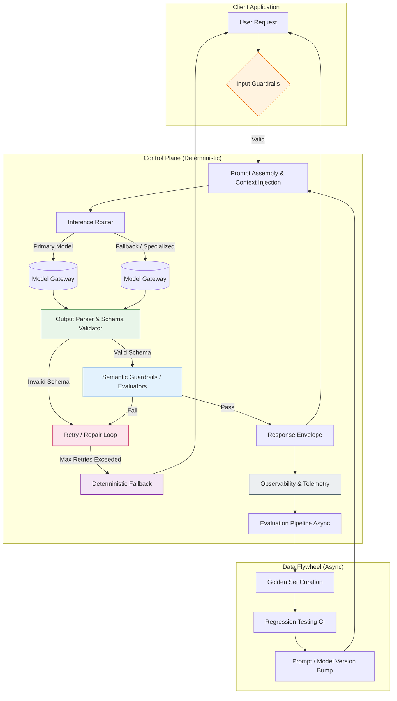

# 𝗙𝗨𝗡𝗗𝗔𝗠𝗘𝗡𝗧𝗔𝗟𝗦 𝗦𝗧𝗜𝗟𝗟 𝗠𝗔𝗧𝗧𝗘𝗥 𝗜𝗡 𝗧𝗛𝗘 𝗔𝗜 𝗘𝗥𝗔

## Introduction

Last quarter, our on-call rotation got paged at 2 AM because a "simple" LLM feature—automated support ticket categorization—started routing 40% of P0 billing issues to the "General Inquiry" queue. The model hadn't changed. The prompt hadn't changed. What changed was the input distribution: a new payment provider rolled out, injecting error codes the few-shot examples never covered. The model hallucinated a category with high confidence, and because we treated the LLM as a magic black box instead of a probabilistic component requiring rigorous contracts, the failure propagated silently into the business logic.

That incident didn't teach us anything new about transformers. It reminded us of something old: **probabilistic outputs require deterministic engineering.**

The industry narrative suggests foundation models abstract away complexity. My production scars suggest the opposite. They shift complexity from *code logic* to *data contracts, evaluation pipelines, and observability gaps*. If you cannot write a unit test for it, you cannot ship it. If you cannot observe it, you cannot debug it. The fundamentals—CI/CD, schema validation, latency budgets, canary deployments—didn't disappear. They just got harder.

## Why This Matters

Software engineers are currently incentivized to optimize for "time to first demo." Vibe coding a RAG pipeline over a weekend feels productive. Operating that pipeline at 5k RPM with sub-200ms p99 latency, strict PII redaction, and an audit trail for compliance is a different job entirely.

The pain points aren't theoretical:
*   **Silent Data Corruption:** An LLM returning valid JSON with semantically wrong values (e.g., `status: "refunded"` vs `status: "approved"`) breaks downstream state machines worse than a 500 error.
*   **Evaluation Drift:** Prompt templates that worked on `gpt-4-0613` degrade silently on `gpt-4o` or `claude-3.5-sonnet` because instruction following behavior shifts.
*   **Cost Explosions:** Unbounded context windows and retry loops without token budgets turn variable inference costs into a Denial of Wallet attack on your own cloud bill.
*   **Regulatory Liability:** "The AI did it" is not a valid defense for leaking PII in a support transcript summary sent to a third-party analytics vendor.

We treat LLMs like unreliable microservices written by a chaotic third party. We wouldn't deploy a Go service without health checks, circuit breakers, and integration tests. We shouldn't deploy model inference without the same rigor.

## How It Works

A production-grade AI system isn't a prompt template. It is a control loop wrapping a stochastic compute primitive. The architecture separates the **Inference Plane** (the model call) from the **Control Plane** (validation, routing, evaluation, observability).



**Step-by-Step Breakdown:**

1.  **Input Guardrails (Deterministic):** Before tokens hit the GPU, we run fast regex/heuristic checks: PII detection, prompt injection classifiers (e.g., `detect-injection` library), token length enforcement, and schema pre-validation for structured inputs. This costs microseconds and saves dollars.
2.  **Prompt Assembly:** Not string concatenation. We use a templating engine (Jinja2/Pydantic) with strict variable typing. Context injection (RAG chunks, user history) is truncated by a *token budget allocator*, not character count.
3.  **Inference Router:** Implements the "Model Gateway" pattern. Routes based on complexity (cheap model for classification, expensive for reasoning), cost ceilings, and latency SLAs. Handles API key rotation, retry-with-backoff, and provider failover (OpenAI -> Anthropic -> Local).
4.  **Output Parser & Schema Validator:** The *only* trust boundary. We parse raw string output into a Pydantic/Zod model. If it fails, we trigger a **Repair Loop** (re-prompt with error context) rather than crashing. Max 2 retries.
5.  **Semantic Guardrails:** Schema validity $\neq$ correctness. We run lightweight evaluators: "Does the SQL query execute without error?", "Is the sentiment score consistent with the text?", "Does the citation exist in the retrieved context?". These are fast, deterministic checks (or cheap LLM-as-judge calls).
6.  **Deterministic Fallback:** If the model fails repeatedly, we *must* return a valid response shape. We route to a rules-based heuristic (keyword matching, regex) or return a structured "Escalate to Human" object. The client *always* gets a valid contract.
7.  **Observability & Async Eval:** Every request logs: input hash, prompt version, model version, latency, token usage, guardrail results, and user feedback (thumbs up/down). This feeds the nightly Evaluation Pipeline.

## Core Concepts

### 1. Evaluation-Driven Development (EDD)
TDD writes tests before code. EDD writes **evals before prompts**. You define a "Golden Set" of 50–200 representative inputs + expected outputs (or criteria). Every prompt change, model upgrade, or RAG config tweak runs against this set in CI. No merge without passing evals.

### 2. The Guardrail Hierarchy
Not all checks are equal. Order them by **cost and latency**:
*   **Tier 0 (Client-side):** Length, format, PII regex. (µs)
*   **Tier 1 (Gateway):** Schema validation, JSON repair, stop sequences. (ms)
*   **Tier 2 (Application):** Deterministic logic (SQL execution, API call simulation, citation verification). (10–100ms)
*   **Tier 3 (Semantic):** LLM-as-Judge, Embedding similarity, Faithfulness. (100ms–2s) — Run async or on sampled traffic.

### 3. Token Budgets over Context Windows
Models have context limits (128k, 1M+). Your *system* has a latency/cost budget. A `TokenBudgetAllocator` reserves tokens: `System Prompt (500) + Few-shots (1500) + RAG Context (Variable) + User Query (500) + Output Reserve (2000) < Budget`. RAG chunks get dynamically summarized or dropped to fit.

### 4. Versioning the "Software 2.0" Artifacts
Prompts, few-shot examples, and model parameters *are* source code. They live in Git. `prompts/v42/triage.j2` is reviewed like `services/triage/handler.go`. The model identifier (`gpt-4o-2024-08-06`) is a pinned dependency in a lockfile, not `latest`.

## Examples & Code Walkthrough

Here is a production-hardened **Inference Gateway** implementation. It handles the control loop: routing, validation, repair, fallback, and telemetry.

```python
# ai_gateway/core.py
import asyncio
import json
import time
import uuid
from abc import ABC, abstractmethod
from dataclasses import dataclass, field
from enum import Enum
from typing import Generic, TypeVar, Callable, Awaitable, Optional
from pydantic import BaseModel, ValidationError
import structlog

# --- Domain Models ---

class ModelProvider(str, Enum):
    OPENAI = "openai"
    ANTHROPIC = "anthropic"
    LOCAL = "local"

@dataclass(frozen=True)
class ModelSpec:
    name: str
    provider: ModelProvider
    max_tokens: int
    cost_per_1k_input: float
    cost_per_1k_output: float
    latency_sla_ms: int

# Pinned versions. No "latest".
AVAILABLE_MODELS = {
    "classifier-fast": ModelSpec("gpt-4o-mini-2024-07-18", ModelProvider.OPENAI, 16384, 0.15, 0.60, 800),
    "reasoner-heavy": ModelSpec("claude-3-5-sonnet-20240620", ModelProvider.ANTHROPIC, 8192, 3.00, 15.00, 2500),
    "local-fallback": ModelSpec("llama-3.1-8b-instruct", ModelProvider.LOCAL, 4096, 0.0, 0.0, 1200),
}

T = TypeVar("T", bound=BaseModel)

@dataclass
class InferenceResult(Generic[T]):
    data: Optional[T] = None
    error: Optional[str] = None
    model_used: str = ""
    latency_ms: int = 0
    input_tokens: int = 0
    output_tokens: int = 0
    guardrail_passed: bool = False
    fallback_used: bool = False
    trace_id: str = field(default_factory=lambda: str(uuid.uuid4()))

# --- Interfaces ---

class ModelClient(ABC):
    @abstractmethod
    async def complete(self, prompt: str, spec: ModelSpec, **kwargs) -> tuple[str, dict]: # raw_text, usage
        pass

class Guardrail(ABC, Generic[T]):
    @abstractmethod
    async def check(self, input_data: str, output_data: T) -> tuple[bool, Optional[str]]: # pass, reason
        pass

# --- Core Gateway ---

class InferenceGateway(Generic[T]):
    """
    Orchestrates the inference lifecycle: Route -> Generate -> Validate -> Repair -> Fallback.
    """

    def __init__(
        self,
        response_model: type[T],
        clients: dict[ModelProvider, ModelClient],
        primary_model_key: str,
        fallback_model_key: str,
        guardrails: list[Guardrail[T]],
        max_retries: int = 2,
        token_budget: int = 8000,
    ):
        self.response_model = response_model
        self.clients = clients
        self.primary_spec = AVAILABLE_MODELS[primary_model_key]
        self.fallback_spec = AVAILABLE_MODELS[fallback_model_key]
        self.guardrails = guardrails
        self.max_retries = max_retries
        self.token_budget = token_budget
        self.logger = structlog.get_logger("inference_gateway")

    def _build_prompt(self, template: str, context: dict) -> str:
        # In reality: use Jinja2 with sandbox, strict undefined checks.
        # Here: simple format for brevity.
        try:
            return template.format(**context)
        except KeyError as e:
            raise ValueError(f"Missing prompt variable: {e}")

    async def _call_model(self, prompt: str, spec: ModelSpec) -> tuple[str, dict]:
        client = self.clients[spec.provider]
        # Timeout enforcement is critical. Client side timeout < spec.latency_sla_ms
        return await asyncio.wait_for(
            client.complete(prompt, spec, max_tokens=spec.max_tokens),
            timeout=spec.latency_sla_ms / 1000.0 + 1.0 # buffer
        )

    async def _validate_and_guardrail(self, raw_output: str) -> tuple[Optional[T], Optional[str]]:
        # 1. Schema Validation (Tier 1)
        try:
            # Handle markdown code fences if model leaks them
            cleaned = raw_output.strip().removeprefix("```json").removesuffix("```").strip()
            parsed = self.response_model.model_validate_json(cleaned)
        except (ValidationError, json.JSONDecodeError) as e:
            return None, f"Schema validation failed: {e}"

        # 2. Semantic Guardrails (Tier 2/3)
        for guard in self.guardrails:
            passed, reason = await guard.check(raw_output, parsed)
            if not passed:
                return None, f"Guardrail '{guard.__class__.__name__}' failed: {reason}"
        
        return parsed, None

    async def infer(
        self, 
        prompt_template: str, 
        context: dict, 
        trace_id: Optional[str] = None
    ) -> InferenceResult[T]:
        trace_id = trace_id or str(uuid.uuid4())
        start_time = time.monotonic()
        
        prompt = self._build_prompt(prompt_template, context)
        
        # Token budget check (rough heuristic: 1 token ~= 4 chars)
        if len(prompt) > self.token_budget * 3.5:
            return InferenceResult(
                error="Prompt exceeds token budget", 
                trace_id=trace_id, 
                fallback_used=True
            )

        current_spec = self.primary_spec
        last_error = "Unknown error"
        
        for attempt in range(self.max_retries + 1):
            attempt_start = time.monotonic()
            try:
                self.logger.info("inference_attempt", trace_id=trace_id, model=current_spec.name, attempt=attempt)
                
                raw_output, usage = await self._call_model(prompt, current_spec)
                
                validated_data, error = await self._validate_and_guardrail(raw_output)
                
                if validated_data:
                    latency = int((time.monotonic() - start_time) * 1000)
                    return InferenceResult(
                        data=
