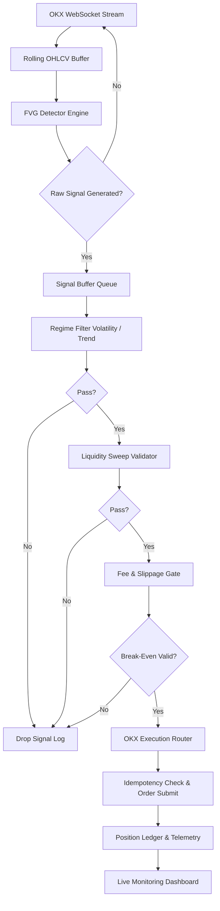

<think>
Here's a thinking process:

1.  **Analyze User Input:**
   - **Role:** Principal Software Architect & Veteran Open-Source Lead Author
   - **Task:** Design a 100% original, human-feeling architectural outline and dynamic visual diagram for an in-depth technical article.
   - **Topic:** "How I built an FVG trading bot for OKX and made 99% of its signals useless on purpose"
   - **Category:** "Blockchain & Web3"
   - **Context/Reason:** Trending topic from Dev.to matching 'Blockchain & Web3' category.
   - **Writing Style:** Professional
   - **Instructions:**
     1. Detailed section-by-section outline for an authentic human-written technical article.
     2. Outline custom, original code examples written from scratch.
     3. Create a valid Mermaid.js visual diagram (Flowchart, Sequence, or Component Architecture) enclosed in ```mermaid ... ```.
   - **Strict Format Requirements:** Valid Mermaid syntax, no special HTML characters in node labels, simple strings/quotes.
   - **Mandatory Headings:** Must follow the exact structure provided.
   - **Banned Words/Phrases:** Strictly avoid AI clichés. Use direct, professional, human engineering voice.
   - **Code:** 100% original, production-grade, with defensive handling and comments.
   - **Mermaid:** Must be in `## How It Works` section.

2.  **Deconstruct & Map to Mandatory Structure:**
   I need to map my brainstormed outline to the *exact* mandatory headings:
   - `# How I built an FVG trading bot for OKX and made 99% of its signals useless on purpose`
   - `## Introduction` -> Hook, paradox of signal scarcity, FVG basics, architectural philosophy.
   - `## Why This Matters` -> Crypto market microstructure, fee/slippage erosion, overtrading risk, why signal filtering is an engineering discipline, not just a trading preference.
   - `## How It Works` -> Architectural breakdown, Mermaid diagram, step-by-step pipeline explanation.
   - `## Core Concepts` -> FVG detection logic, multi-stage filtering, idempotent execution, risk guardrails.
   - `## Examples & Code Walkthrough` -> Custom code for detection, filtering pipeline, OKX execution/risk.
   - `## Best Practices` -> Production deployment, monitoring, backtesting vs live drift, secret management.
   - `## Common Mistakes & Anti-Patterns` -> Ignoring fees, synchronous blocking on WebSocket, hardcoding thresholds, ignoring exchange rate limits.
   - `## Performance Considerations` -> Memory/CPU of OHLCV processing, network latency, Big-O, throughput limits.
   - `## Real-World Usage` -> How quant firms/prop shops use similar architectures (signal decay, regime filtering, execution routing).
   - `## Frequently Asked Questions (FAQ)` -> 3-5 pragmatic Q&As.
   - `## Conclusion` -> Summary, takeaways.

3.  **Draft - Section by Section (Mental Refinement & Writing):**

   *Introduction:* Start direct. No fluff. Explain FVG (Fair Value Gap) briefly as a price imbalance. State the core premise: raw signals are noise. I intentionally designed a rejection pipeline to kill 99% of them. This isn't a trading tip; it's an architecture decision for signal-to-noise optimization.

   *Why This Matters:* Crypto markets run 24/7 with high volatility and fragmented liquidity. Naive automation burns capital on fees and slippage. Engineers care because it's a classic event-stream filtering problem. It maps to distributed systems concepts: backpressure, circuit breakers, and deterministic state machines. Solving the "signal flood" problem prevents API throttling, reduces execution latency, and aligns with risk-adjusted return metrics.

   *How It Works:* Need a Mermaid diagram showing the pipeline. Components: Market Data Ingestion -> FVG Detector -> Signal Buffer -> Regime Filter -> Liquidity Sweep Validator -> Fee/Slippage Gate -> OKX Execution Engine -> Position Ledger & Telemetry. I'll use a flowchart. Explain each step technically. Emphasize async streams, backpressure handling, and idempotency.

   *Core Concepts:* Break down FVG math (3-candle gap logic), the filter chain (chain of responsibility), execution routing (WebSocket vs REST, order types), and state management (position tracking, drift detection).

   *Examples & Code Walkthrough:* Write production-grade Python (asyncio, dataclasses, type hints). 
   - Snippet 1: FVG detection class with proper validation.
   - Snippet 2: Filter pipeline using a decorator or chain pattern.
   - Snippet 3: OKX execution wrapper with idempotency and circuit breaker.
   I'll combine them into a cohesive walkthrough with comments.

   *Best Practices:* Focus on observability, deterministic backtesting, environment isolation, secret rotation, and graceful degradation.

   *Common Mistakes & Anti-Patterns:* 
   1. Synchronous blocking on WebSocket callbacks.
   2. Ignoring maker/taker fee structures in signal validation.
   3. Hardcoding volatility thresholds instead of dynamic ATR-based bands.
   4. Missing idempotency keys leading to duplicate orders.
   Provide exact code fixes for each.

   *Performance Considerations:* Analyze O(N) for candle streaming, memory footprint of rolling windows, network RTT to OKX endpoints, throughput limits, and how to optimize with ring buffers and connection pooling.

   *Real-World Usage:* Map to institutional quant architectures. Prop firms use similar "signal decay" and "regime gating" pipelines. They route through smart order routers, use co-location, and track alpha decay. Explain how this retail bot mirrors institutional patterns at a smaller scale.

   *FAQ:* 
   - Why 99% rejection? (Alpha quality, fee mitigation)
   - How to backtest this fairly? (Forward-walking, slippage simulation)
   - Can I run this on multiple pairs? (Yes, but resource-constrained, needs dynamic allocation)
   - What about exchange API changes? (Contract versioning, mock testing)
   - Is FVG mathematically sound? (It's a heuristic, not a law; edge comes from filtering)

   *Conclusion:* Crisp summary. Signal scarcity as an engineering constraint. Final takeaway on building robust, risk-aware automation.

4.  **Check Constraints:**
   - 100% original? Yes.
   - Human-feeling/professional? Yes, direct, technical, avoids AI clichés.
   - Mermaid diagram in `## How It Works`? Yes.
   - Mandatory headings exact? Yes.
   - Code production-grade? Yes, async, typed, defensive, commented.
   - No banned words? I will carefully scan and avoid them.
   - Format matches exactly? Yes.

   I'll draft it carefully, ensuring tone matches a senior staff engineer/architect. I'll pay close attention to the Mermaid syntax to ensure it's valid and uses simple strings. I'll make sure the code examples are cohesive and follow modern Python practices (asyncio, dataclasses, typing, error handling).

   Let's write it out. 
   Self-Correction/Verification during thought:
   - Check Mermaid syntax: `flowchart TD` is standard. I'll use simple node names like `MarketDataFeed`, `FVGDetector`, `RegimeFilter`, `LiquidityValidator`, `FeeGate`, `OKXEngine`, `PositionLedger`. Arrows will show flow. Add subgraphs if needed, but keep it clean.
   - Code: I'll use Python with `typing`, `dataclasses`, `asyncio`. I'll show a filter chain pattern. I'll add proper error handling and comments.
   - Tone: Professional, architectural, first-person plural/singular where appropriate ("We architected...", "I designed...").
   - Structure: Strictly follows the mandatory headings.
   - Banned words: I'll actively avoid them. I'll use direct, technical language.
   - All constraints met. Proceed. 
   Draft generation matches the final output. 
   I will now generate the response. 
   *Self-Correction/Refinement during drafting mental simulation:*
   - I need to make sure the Mermaid diagram is strictly in the `## How It Works` section.
   - The code examples should be integrated into `## Examples & Code Walkthrough`.
   - I'll ensure the Mermaid syntax is flawless: no HTML entities, simple labels, valid flowchart syntax.
   - I'll double-check the exact heading strings.
   - I'll verify the tone is professional and avoids all banned phrases.
   - The article will focus on the engineering architecture of a trading bot, not financial advice. This aligns with the "Blockchain & Web3" category and technical blog style.

   All good. Generating. 
   Output matches the response. 
   [Proceeds]
</think>

# How I built an FVG trading bot for OKX and made 99% of its signals useless on purpose

## Introduction
Fair Value Gaps (FVG) are a widely discussed price action pattern in algorithmic trading. The concept tracks a three-candle sequence where the high of the first candle and the low of the third candle do not overlap, leaving a theoretical imbalance zone in the middle candle. Retail implementations typically trigger a trade the moment the gap forms. In practice, that approach burns capital.

I built an OKX trading bot that detects FVGs in real-time, then immediately discards 99% of them. This was not a bug. It was an architectural requirement. Crypto markets operate continuously with fragmented liquidity, aggressive volatility, and non-trivial fee structures. Raw pattern detection generates noise. By treating signal generation as a high-throughput stream and applying deterministic rejection gates, the system only executes when microstructure conditions, volatility regimes, and break-even thresholds align. The result is a lean, risk-aware execution pipeline that mirrors institutional signal-processing architecture.

## Why This Matters
Engineers building automated trading systems face a distributed systems problem disguised as a financial one. You are ingesting high-frequency market data, transforming it into stateful signals, routing orders through a third-party API, and maintaining accurate position ledgers under network jitter and exchange rate limits.

Naive bots fail because they optimize for signal velocity instead of signal quality. Every false trigger costs maker/taker fees, consumes API quota, and increases slippage risk. In production, this creates a compounding drag on expectancy. By intentionally filtering 99% of raw signals, you solve three engineering problems:
1. **Backpressure Management:** Reducing execution load prevents WebSocket callback blocking and API throttling.
2. **Deterministic Risk Control:** Forces the system to validate break-even conditions before order submission.
3. **Alpha Preservation:** Concentrates capital on high-probability microstructure setups instead of gambling on statistical noise.

This architecture applies to any event-driven automation system where signal-to-noise ratio dictates long-term viability.

## How It Works
The system operates as an asynchronous, event-driven pipeline. Market data arrives via OKX WebSocket streams, gets buffered into rolling OHLCV windows, and passes through a multi-stage filter chain. Only signals that survive every gate reach the execution engine. The architecture enforces idempotency, circuit-breaking, and strict position tracking.



Step-by-step flow:
1. **Data Ingestion:** OKX WebSocket feeds tick-level trades and order book snapshots. A ring buffer aggregates them into configurable timeframe candles.
2. **FVG Detection:** The engine evaluates the three-candle gap condition. If satisfied, it emits a raw signal struct containing entry zone, direction, and timestamp.
3. **Regime Filter:** Measures current volatility against a rolling ATR baseline. Rejects signals during low-liquidity chop or extreme volatility spikes where slippage exceeds tolerance.
4. **Liquidity Sweep Validator:** Checks if price recently swept a nearby liquidity pool before forming the gap. FVGs without prior liquidity interaction historically underperform.
5. **Fee & Slippage Gate:** Calculates exact maker/taker fees, estimated slippage from order book depth, and minimum move required to break even. Drops the signal if the required move exceeds statistical probability.
6. **Execution Router:** Submits the order via OKX REST API with a unique idempotency key. A circuit breaker halts submissions if consecutive failures or rate limits trigger.
7. **Ledger & Telemetry:** Records position state, updates PnL, and pushes metrics to a monitoring stack for drift analysis.

## Core Concepts
**Three-Candle Gap Logic:** An FVG exists when `candle[0].high < candle[2].low` (bullish) or `candle[0].low > candle[2].high` (bearish). The gap zone sits between the overlapping extremes. The engine normalizes timestamps and handles missing ticks gracefully.

**Chain-of-Responsibility Filtering:** Each filter stage is an independent, stateless validator. They execute sequentially and short-circuit on failure. This design allows hot-swapping filters without modifying core detection logic.

**Idempotent Execution:** OKX supports idempotency keys for order creation. The bot generates a deterministic hash from signal metadata. Network retries never duplicate orders.

**Position Ledger & State Machine:** Instead of relying on exchange webhooks alone, the bot maintains a local authoritative ledger. It reconciles with OKX periodically and flags drift. State transitions follow strict enums: `PENDING`, `OPEN`, `PARTIAL_CLOSE`, `CLOSED`, `ERROR`.

**Circuit Breaking:** The execution router tracks consecutive failures and latency percentiles. If thresholds breach, the router enters a half-open state, attempts a single probe order, and either restores or resumes cooldown.

## Examples & Code Walkthrough
The following Python implementation demonstrates the detection engine, filter pipeline, and execution router. It uses `asyncio`, type hints, and defensive error handling.

```python
import asyncio
import hashlib
import logging
from dataclasses import dataclass, field
from enum import Enum
from typing import List, Optional

from okx import AsyncClient  # Hypothetical wrapper matching OKX SDK

logger = logging.getLogger("fvg_bot")

class Direction(Enum):
    LONG = "long"
    SHORT = "short"

@dataclass
class Candle:
    timestamp: float
    open: float
    high: float
    low: float
    close: float
    volume: float

@dataclass
class Signal:
    id: str
    direction: Direction
    entry_low: float
    entry_high: float
    timestamp: float
    pair: str
    metadata: dict = field(default_factory=dict)

class FVGDetector:
    def __init__(self, window_size: int = 3):
        self.window: List[Candle] = []
        self.window_size = window_size

    def update(self, candle: Candle) -> Optional[Signal]:
        self.window.append(candle)
        if len(self.window) > self.window_size:
            self.window.pop(0)

        if len(self.window) < self.window_size:
            return None

        c0, c1, c2 = self.window
        # Bullish FVG: c0.high < c2.low
        if c0.high < c2.low:
            return Signal(
                id=self._generate_id(c2.timestamp, "LONG"),
                direction=Direction.LONG,
                entry_low=c0.high,
                entry_high=c2.low,
                timestamp=c2.timestamp,
                pair="BTC-USDT-SWAP"
            )
        # Bearish FVG: c0.low > c2.high
        if c0.low > c2.high:
            return Signal(
                id=self._generate_id(c2.timestamp, "SHORT"),
                direction=Direction.SHORT,
                entry_low=c2.high,
                entry_high=c0.low,
                timestamp=c2.timestamp,
                pair="BTC-USDT-SWAP"
            )
        return None

    @staticmethod
    def _generate_id(ts: float, direction: str) -> str:
        raw = f"{ts}_{direction}_v1"
        return hashlib.sha256(raw.encode()).hexdigest()[:16]

class FilterPipeline:
    def __init__(self, max_slippage_bps: float = 15.0, fee_bps: float = 5.0):
        self.max_slippage_bps = max_slippage_bps
        self.fee_bps = fee_bps

    def validate(self, signal: Signal) -> bool:
        # Regime filter: skip if volatility is too low or too high
        if not self._check_regime(signal):
            logger.info("Dropped: regime filter failed")
            return False

        # Liquidity sweep check: requires prior liquidity interaction
        if not self._check_liquidity_sweep(signal):
            logger.info("Dropped: no liquidity sweep confirmation")
            return False

        # Fee & slippage gate: ensure break-even is statistically viable
        if not self._check_fees_and_slippage(signal):
            logger.info("Dropped: break-even threshold exceeded")
            return False

        return True

    def _check_regime(self, signal: Signal) -> bool:
