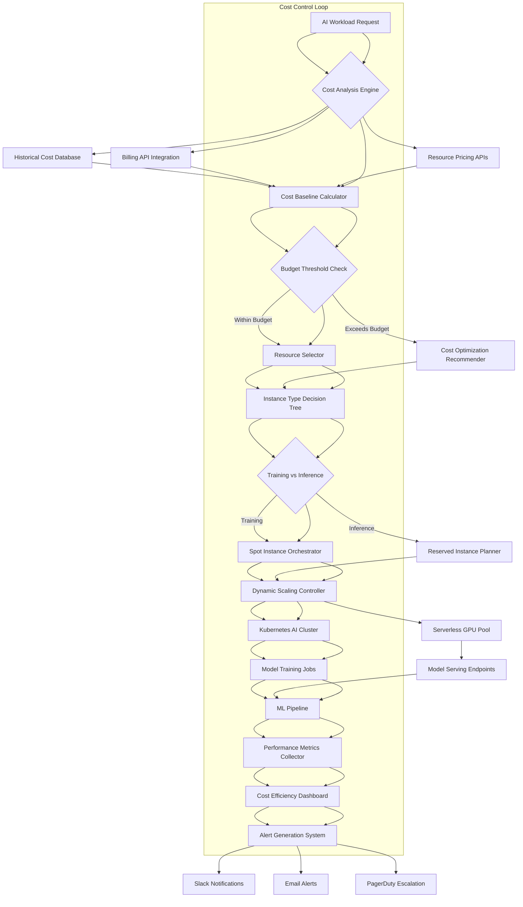

# AI Infrastructure Costs Are Exploding: Here's How Cloud Teams Are Fighting Back

## Introduction
Last month our GPU bill jumped 40 % without a single new model going into production. The culprit was a combination of larger training runs, higher inference traffic, and a default reliance on on‑demand instances. Cloud teams across the industry are hitting the same wall, and the old playbook of “throw more resources at it” no longer works. This article lays out a concrete, engineering‑first approach to regaining control over AI infrastructure spend.

## Why This Matters
If you own or operate ML workloads, your cost line items are becoming the fastest‑growing part of the budget. Every extra GPU hour, every terabyte of data egress, and every unnecessary reserved instance eats into the team’s ability to experiment, ship, and scale. Ignoring these costs leads to surprise bills, stalled projects, and ultimately a competitive disadvantage. Understanding where the money goes and applying systematic optimizations is now a core engineering skill.

## How It Works
The cost‑control system we built works as a closed loop. A workload request first passes through a cost‑analysis engine that consults historical usage, current pricing APIs, and budget thresholds. If the projected spend stays within limits, a resource selector picks the cheapest viable instance type. When the estimate exceeds the budget, an optimization recommender suggests alternatives such as spot instances, compressed models, or autoscaling policies. The chosen resources are provisioned via Kubernetes or a serverless GPU pool, and the resulting jobs feed performance metrics back into a cost‑efficiency dashboard. Alerts fire when anomalies are detected, completing the feedback loop.



**Step‑by‑step breakdown**

1. **Request intake** – A job description (model size, batch size, latency SLA) arrives.
2. **Cost analysis** – The engine queries billing history, current spot/on‑demand prices, and data‑egress rates.
3. **Baseline calculation** – A projected cost is computed using a weighted average of recent usage.
4. **Budget check** – If the projection exceeds the allocated budget, the optimizer suggests alternatives.
5. **Instance selection** – A decision tree maps workload characteristics to the cheapest instance that meets performance constraints.
6. **Provisioning** – Training jobs are dispatched to spot instances; inference endpoints land on reserved or serverless GPUs.
7. **Scaling** – A dynamic controller adjusts replica counts based on real‑time utilization.
8. **Observability** – Metrics (GPU memory, latency, request volume) flow into a dashboard.
9. **Alerting** – When spend deviates from the baseline by a configurable factor, notifications are sent.

## Core Concepts
- **GPU/TPU pricing tiers** – On‑demand, spot, and reserved each have distinct cost curves and interruption rates.
- **Spot instances** – Cheapest but can be reclaimed; ideal for fault‑tolerant training.
- **Reserved instances** – Predictable, lower hourly rate; best for steady inference workloads.
- **Serverless GPU** – Pay‑per‑use pricing with automatic scaling, reducing idle capacity.
- **Model compression** – Quantization (e.g., FP32 → INT8) and pruning shrink model size, cutting memory and compute requirements.
- **Autoscaling policies** – Define target utilization, cooldown periods, and replica limits to balance cost and latency.
- **Cost anomaly detection** – Statistical thresholds flag unexpected spend spikes.

## Examples & Code Walkthrough
Below are three production‑ready snippets that illustrate how we integrate cost logic into our ML platform.

### 1. AI Resource Optimizer
```python
import math
from typing import Dict, List

class AIResourceOptimizer:
    """
    Selects the most cost‑effective instance for a given workload.
    """
    def __init__(self, workload_type: str):
        self.workload_type = workload_type
        # Load pricing table from a central config or API
        self.pricing = self._load_pricing()

    def _load_pricing(self) -> Dict[str, float]:
        # In production this would call a pricing API; here we use a static map.
        return {
            "gpu_spot": 0.45,
            "gpu_on_demand": 1.20,
            "gpu_reserved": 0.75,
            "cpu_spot": 0.08,
            "cpu_on_demand": 0.20,
        }

    def _calculate_compute_needs(self, batch_size: int) -> float:
        """
        Rough estimate of FLOPs required per batch.
        """
        # Assume a linear relationship for demonstration.
        return batch_size * 2.5  # arbitrary units

    def calculate_optimal_instance(self, model_size_gb: float, batch_size: int) -> str:
        """
        Returns the instance type that meets requirements at lowest cost.
        """
        # Add 50 % memory headroom
        memory_required = model_size_gb * 1.5
        compute_required = self._calculate_compute_needs(batch_size)

        # Filter instances that satisfy both constraints
        candidates: List[str] = []
        for instance, price in self.pricing.items():
            if instance.startswith("gpu"):
                # Assume each GPU provides 16 GB memory and 10 compute units
                if 16 >= memory_required and 10 >= compute_required:
                    candidates.append((instance, price))
            else:
                # CPU fallback for very small models
                if 8 >= memory_required and 4 >= compute_required:
                    candidates.append((instance, price))

        if not candidates:
            raise ValueError("No instance meets requirements")

        # Choose cheapest candidate
        cheapest = min(candidates, key=lambda x: x[1])
        return cheapest[0]

# Example usage
optimizer = AIResourceOptimizer(workload_type="training")
instance = optimizer.calculate_optimal_instance(model_size_gb=8, batch_size=64)
print(f"Selected instance: {instance}")
```

### 2. Autoscaling Policy (YAML)
```yaml
autoscaling_policy:
  metric_type: "ai_utilization"      # Custom metric exported by the exporter
  target_value: 75                  # Aim for 75 % GPU utilization
  scale_out_cooldown: 300           # 5 min between scale‑out actions
  scale_in_cooldown: 600            # 10 min between scale‑in actions
  max_replicas: 50
  min_replicas: 2
```

### 3. Cost Anomaly Detector
```python
import time
from typing import Dict, Optional

class AICostMonitor:
    """
    Detects abnormal spend patterns and triggers alerts.
    """
    def __init__(self, threshold_multiplier: float = 1.5):
        self.threshold_multiplier = threshold_multiplier
        self.baseline_costs: Dict[str, float] = {}

    def _generate_alert(self, service:
