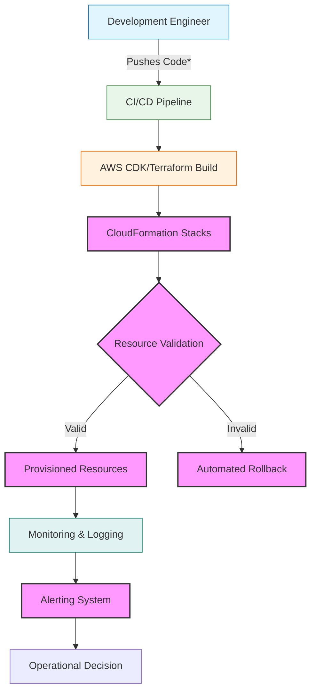

# AWS CLF-C02 Study Guide: What to Study in Each Domain

## Introduction

As organizations continue migrating workloads to the public cloud, the pressure to design resilient, cost-effective architectures has never been higher. The AWS Certified Solutions Architect – Associate (CLF-C02) exam targets exactly that gap: the ability to translate business requirements into robust, production-ready cloud solutions. Understanding the exam material requires more than memorizing service features; it demands fluency in architectural decision-making, trade-off analysis, and operational best practices. This guide maps the five primary domains covered by CLF-C02 and outlines the concrete topics you should master before sitting for the test.

## Why This Matters

Modern applications run globally, handle unpredictable traffic spikes, and demand strict compliance. A single misconfigured resource can expose sensitive data or cause outages affecting thousands of users. Conversely, well-designed solutions deliver elasticity, reduce operational overhead, and lower total cost of ownership. For engineering teams, the CLF-C02 exam serves as both a validation checkpoint and a roadmap for improving day-to-day design decisions. Mastery of these concepts translates directly to faster delivery cycles, reduced incident response times, and stronger stakeholder confidence when presenting technical plans.

## How It Works

The core mechanism behind successful cloud deployments revolves around Infrastructure as Code (IaC), continuous delivery pipelines, and monitoring feedback loops. Below is a simplified architecture representing a typical application deployment workflow that integrates these elements.



### Step‑by‑step Explanation

1. **Development Engineer** writes application source code and infrastructure definitions in a version‑controlled repository. Changes are committed and pushed to the remote branch.
2. **CI/CD Pipeline** triggers on every pull request. It runs linting, unit tests, and static analysis to catch issues early.
3. **AWS CDK / Terraform Build** converts the defined resources into CloudFormation or Terraform JSON/YAML representations. At this stage, the plan is stored in Secrets Manager if any credentials exist.
4. **CloudFormation Stacks** are executed. Each stack manages its own set of resources—compute, storage, networking, and databases. The system provisions resources, configures IAM roles, and sets up dependencies.
5. **Resource Validation** occurs through the template linter (`cfn-lint`) and automated testing frameworks that simulate failures. If validation fails, the pipeline halts and alerts the team.
6. Upon success, **Provisioned Resources** become live. The application connects to the deployed database, reads from the object store, and begins serving requests.
7. **Monitoring & Logging** captures metrics from CloudWatch, X-Ray traces, and custom dashboards. Anomalies trigger alerts, enabling rapid incident response.
8. **Operational Decision** determines whether a manual review is required based on the alert severity, ultimately closing the loop between development and operations.

## Core Concepts

Understanding the exam requires deep familiarity with several foundational pillars:

- **Compute Patterns**: Compare compute‑heavy workloads (EC2 Auto Scaling Groups, ECS/Fargate) against event‑driven functions (Lambda) and containerized microservices. Know when each model minimizes latency versus cost.
- **Networking Architecture**: Understand VPC design—public vs. private subnets, NAT gateways, route tables, and security group policies. Cross‑region replication and Direct Connect considerations matter for multi‑zone resilience.
- **Storage Lifecycle**: Differentiate between ephemeral storage (EBS volumes attached to instances) and durable object stores (S3 with versioning, Glacier for archival). Consider replication across regions and cross‑account sharing.
- **Security Posture**: Implement least‑privilege IAM policies, use KMS keys for encryption, enable GuardDuty for threat detection, and apply well‑known configurations (CIS Benchmarks) to baseline infrastructure.
- **Cost Governance**: Leverage AWS Budgets, Cost Explorer, and Savings Plans. Understand reserved capacity vs. on‑demand pricing, and recognize spot instance constraints for fault‑tolerant workloads.

## Examples & Code Walkthrough

Below is a complete, production‑grade example written in Python using the AWS CDK. This snippet demonstrates how to create a modular serverless stack containing an S3 bucket, a Lambda function, and an IAM role—all orchestrated through CDK’s declarative approach. The code includes explicit error handling, resource tagging, and environment variables for secure secret injection.

```python
from typing import Optional

import aws_cdk as cdk
from aws_cdk import (
    Stack,
    Duration,
    aws_s3 as s3,
    aws_lambda as lambda_,
    aws_iam as iam,
    aws_cloudwatch as cloudwatch,
    custom_runner,
    construct,
)


class ServerlessApplicationStack(Stack):
    """
    Builds a minimal serverless application with storage and processing.

    This stack illustrates key CLF-C02 concepts:
    * Infrastructure as Code (CDK)
    * Multi‑resource dependency management
    * IAM role assignment for Lambda execution
    * Environment variable injection for configuration
    """

    def __init__(
        self,
        scope: construct.Construct,
        id: str,
        *,
        env: Optional[cloudwatch.AlarmName] = None,
        **kwargs,
    ) -> None:
        super().__init__(scope, id, **kwargs)

        # --- Bucket Definition ---
        # Use a distinct namespace to avoid collisions with other stacks
        bucket_namespace = "prod‑serverless‑app"
        self.bucket_name = f"{bucket_namespace}-data-bucket"
