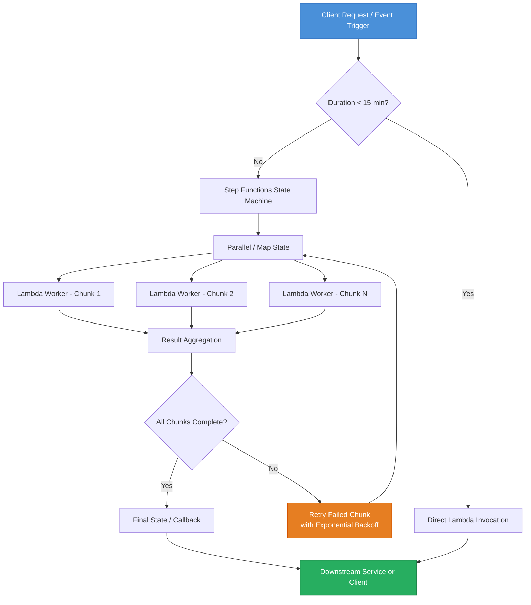

# AWS Lambda Pushes Serverless Toward Long-Running Workloads

## Introduction

For years, the 15-minute execution ceiling on AWS Lambda stood as an unbreakable wall. If your workload took longer than that, you took it to EC2, ECS, or Fargate. Period. But the serverless movement never stopped pushing against that boundary, and AWS has been listening — not by ripping down the timeout limit, but by building an ecosystem of patterns and features that effectively stretch Lambda into territories once reserved for containerized applications.

Lambda SnapStart slashes cold start latency for Java applications from multi-second stalls to sub-100 milliseconds. Step Functions orchestrates workflows that span hours, days, or weeks across discrete Lambda invocations. EventBridge triggers schedule-based processing windows that accommodate batch jobs previously reserved for cron-operated clusters. The 15-minute wall didn't come down — instead, AWS built a bridge around it.

This article examines the engineering reality behind that bridge. We'll look at what actually changed, how the underlying mechanisms work, where the real production pitfalls live, and how top engineering organizations are already running substantial workloads on these patterns.

## Why This Matters

The practical pain point is concrete: engineering teams running event-driven pipelines, ETL jobs, ML inference loops, batch processing, and asynchronous fulfillment workflows have been forced to maintain dual infrastructure stacks. Lambda handles the real-time path. A separate fleet of containers or EC2 instances handles anything that runs longer than fifteen minutes. That duplication carries real cost — not just in infrastructure dollars, but in operational cognitive load.

When we ran into this in our own production cluster, the bill told the story clearly. We were paying for a Kubernetes cluster running batch reconciliation jobs that were fundamentally stateless and event-driven. The same logic could have lived as Lambda functions. The only reason it didn't was duration.

The new patterns solve this without abandoning serverless economics. You get pay-per-invocation pricing, automatic scaling to zero, and managed infrastructure — for workloads that previously demanded dedicated compute. For teams running at scale, this can mean tens of thousands of dollars monthly savings and a dramatically simplified deployment surface.

## How It Works

The mechanism behind Lambda's push into long-running territory isn't a single feature. It's an interlocking set of architectural patterns that together remove the duration barrier. Let's break down the three primary vectors:

**1. Lambda SnapStart** — Eliminates cold start latency by snapshotting the initialized runtime after the first invocation. Subsequent cold starts restore from this snapshot rather than re-running initialization. For Java JVM-based workloads, this transforms cold start from 2-8 seconds down to 50-200ms, making Lambda viable for latency-sensitive long-running service tiers.

**2. Step Functions Distributed Map & Parallel States** — Breaks a single long-running logical task into thousands of parallel Lambda invocations, each handling a slice of the work. The orchestrator waits, aggregates, and handles retries without a single process exceeding Lambda's timeout.

**3. EventBridge Schedules + Lambda Windows** — EventBridge now supports scheduling patterns that trigger Lambda functions within defined processing windows, enabling batch-style execution that aligns with Lambda's duration constraints while accommodating longer business processes.

Here's how the core orchestration flow works:



**Step-by-step technical breakdown:**

1. **Entry point**: A request arrives via API Gateway, EventBridge, or SQS. The system evaluates whether the workload fits within a single Lambda execution window.

2. **Short-path execution**: If the estimated duration is under 15 minutes, the request routes directly to a Lambda function. SnapStart-optimized runtimes handle this with minimal latency overhead.

3. **Orchestration handoff**: For longer workloads, Step Functions takes over. The state machine decomposes the task into discrete, idempotent units of work.

4. **Parallel execution**: Using Distributed Map states (now supporting up to 10,000 items), each chunk dispatches to an independent Lambda worker. Each worker runs in isolation with its own execution context.

5. **Fault tolerance**: Failed chunks trigger automatic retry with exponential backoff. Step Functions handles the retry logic natively — no custom code required in the orchestrator.

6. **Aggregation and completion**: Results from all workers flow into a merge/aggregate state. Once all chunks complete, the state machine transitions to a terminal state that invokes downstream services or notifies the client.

## Core Concepts

**Idempotency as a First-Class Constraint**

Every Lambda invocation in a long-running pattern must be idempotent. There is no guarantee that a function executes exactly once — retries, duplicate SQS deliveries, and Step Functions retries all can cause re-execution. This isn't a suggestion; it's an architectural prerequisite. In practice, this means every worker function needs a deduplication key and a persistence layer that supports upsert semantics.

**Execution Context Isolation**

Each Lambda invocation gets a fresh execution environment (unless SnapStart is active and a warm snapshot exists). This means no in-memory state carries between invocations. For long-running patterns, you must externalize all state to DynamoDB, S3, or an RDS proxy connection. The `/tmp` directory is the only ephemeral local storage, and it caps at 10 GB.

**SnapStart Snapshot Mechanics**

When SnapStart is enabled for a Lambda function, AWS performs a full initialization on the first invocation — loading the JVM, executing static initializers, constructing application context — and then takes a snapshot of the memory and disk state. On subsequent cold starts (triggered by scale-up events after idle periods), AWS restores this snapshot rather than re-running initialization. The snapshot is function-version-specific and is regenerated when you publish a new version.

One critical detail: SnapStart only supports Java 11 and Java 17 runtimes currently. The snapshot does not capture network connections or open file handles. Any connection pools established during initialization are recreated after restore.

**Step Functions Integration Patterns**

Step Functions supports two integration modes with Lambda:

- **Request/Response**: Lambda returns a result directly. Suitable for synchronous worker tasks.
- **Wait-for-Callback (`.waitForTaskToken`)**: Lambda receives a task token and returns it immediately. The state machine pauses until Lambda (or a downstream service) calls `SendTaskSuccess` or `SendTaskFailure`. This is the pattern that enables truly long-running work — Lambda can run for minutes or even days while the state machine holds the position.

## Examples & Code Walkthrough

Below is a production-grade Python Lambda worker designed for distributed batch processing via Step Functions Distributed Map. It processes financial transaction records with proper error handling, partial failure reporting, and DynamoDB-based deduplication.

```python
import json
import os
import time
import logging
import hashlib
from datetime import datetime, timezone

import boto3
from botocore.config import Config

# ---------------------------------------------------------------------------
# Configuration — pulled from environment to avoid hard-coded values
# ---------------------------------------------------------------------------
DynamoDB_TABLE = os.environ["DYNAMODB_TABLE"]
DYNAMODB_READ_TIMEOUT = int(os.environ.get("DYNAMODB_READ_TIMEOUT", "5"))
MAX_RETRY_ATTEMPTS = int(os.environ.get("MAX_RETRY_ATTEMPTS", "3"))

# ---------------------------------------------------------------------------
# Client setup with aggressive retry configuration for DynamoDB
# ---------------------------------------------------------------------------
dynamodb_config = Config(
    retries={
        "max_attempts": 5,
        "mode": "adaptive",
    },
    connect_timeout=DYNAMODB_READ_TIMEOUT,
    read_timeout=DYNAMODB_READ_TIMEOUT + 2,
)
dynamodb = boto3.resource("dynamodb", config=dynamodb_config)
table = dynamodb.Table(DynamoDB_TABLE)

logger = logging.getLogger()
logger.setLevel(logging.INFO)


def generate_dedup_key(transaction: dict) -> str:
    """
    Build a deterministic deduplication key from the transaction's
    natural identifiers. Uses SHA-256 to avoid key-length issues
    with DynamoDB primary keys.
    """
    raw = f"{transaction['account_id']}:{transaction['txn_id']}:{transaction['timestamp']}"
    return hashlib.sha256(raw.encode("utf-8")).hexdigest()[:32]


def mark_processed(transaction: dict, status: str, error: str = None) -> dict:
    """
    Upsert the transaction record into DynamoDB with processing metadata.
    Uses conditional writes where possible to detect concurrent modification.
    """
    dedup_key = generate_dedup_key(transaction)
    now_iso = datetime.now(timezone.utc).isoformat()

    try:
        table.put_item(
            Item={
                "dedup_key": dedup_key,
                "account_id": transaction["account_id"],
                "txn_id": transaction["txn_id"],
                "timestamp": transaction["timestamp"],
                "processing_status": status,
                "processed_at": now_iso,
                "error_message": error if error else None,
                "retry_count": 0,
                "ttl_epoch": int(time.time()) + 86400 * 7,  # auto-expire after 7 days
            },
            ConditionExpression="attribute_not_exists(processing_status) OR processing_status <> 'IN_PROGRESS'",
        )
        logger.info("Transaction marked processed: %s", dedup_key)
        return {"status": "SUCCESS", "dedup_key": dedup_key}

    except dynamodb.meta.client.exceptions.ConditionalCheckFailedException:
        # Another worker already claimed this transaction — treat as success
        logger.warning("Duplicate execution detected for key: %s", dedup_key)
        return {"status": "DUPLICATE", "dedup_key": dedup_key}
    except Exception as exc:
        logger.error("Failed to mark transaction: %s", str(exc))
        raise


def process_transaction(transaction: dict) -> dict:
    """
    Core business logic: validate, transform, and persist a single
    transaction. Raises on unrecoverable errors so the orchestrator
    can route to retry or failure states.
    """
    # --- Validation gate ---
    required_fields = ["account_id", "txn_id", "timestamp", "amount", "currency"]
    missing = [f for f in required_fields if f not in transaction]
    if missing:
        raise ValueError(f"Missing required fields: {missing}")

    # --- Business rule: reject negative amounts ---
    if transaction["amount"] < 0:
        raise ValueError(f"Negative amount not permitted: {transaction['amount']}")

    # --- Currency normalization (idempotent transform) ---
    currency_map = {"USD": "USD", "usd": "USD", "EUR": "EUR", "eur": "EUR"}
    normalized_currency = currency_map.get(
        transaction["currency"], transaction["currency"].upper()
    )
    transaction["currency"] = normalized_currency

    # --- Mark as processed in DynamoDB ---
    result = mark_processed(transaction, status="COMPLETED")
    result["transformed_record"] = transaction
    return result


def lambda_handler(event: dict, context) -> dict:
    """
    Worker handler invoked by Step Functions Distributed Map.
    Receives a single transaction record, processes it, and returns
    a structured result the orchestrator can aggregate.
    """
    logger.info("Worker received event: %s", json.dumps(event))

    try:
        transaction = event.get("transaction")
        if not transaction:
            raise ValueError("Event missing 'transaction' payload")

        result = process_transaction(transaction)
        return {
            "statusCode": 200,
            "body": result,
        }

    except ValueError as ve:
        # Business validation errors — do NOT retry, route to failure state
        logger.error("Validation failure: %s", str(ve))
        return {
            "statusCode": 400,
            "body": {
                "error": str(ve),
                "transaction": event.get("transaction"),
                "should_retry": False,
            },
        }

    except Exception as exc:
        # Transient errors — let Step Functions retry with backoff
        logger.error("Transient error during processing: %s", str(exc))
        return {
            "statusCode": 500,
            "body": {
                "error": str(exc),
                "transaction": event.get("transaction"),
                "should_retry": True,
            },
        }
```

**Key design decisions in this code:**

- **Deduplication via SHA-256**: Rather than concatenating identifiers into a potentially long DynamoDB key, we hash to a fixed 32-character string. This keeps partition key sizes consistent and avoids throughput fragmentation.
- **Conditional writes for idempotency**: The `ConditionExpression` prevents overwriting a transaction that's already been processed by another concurrent worker. If the condition fails, we treat it as a duplicate success rather than an error.
- **Separate error categories**: Validation errors (400) return `should_retry: false` so the orchestrator routes them to a terminal failure state. Transient errors (500) return `should_retry: true`, letting Step Functions handle exponential backoff natively.
- **TTL on DynamoDB items**: Processing metadata auto-expires after 7 days, preventing unbounded table growth from a long-running batch pipeline.

Here is the corresponding Step
