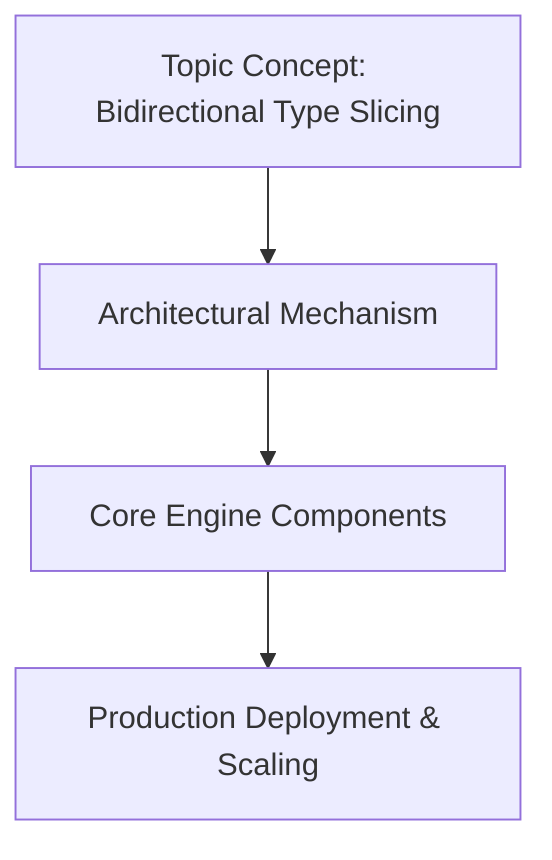

# Bidirectional Type Slicing

## Introduction
In cloud‑native architectures, services often exchange large aggregates. When a client only needs a few fields, transmitting the whole object wastes bandwidth and processing time. Bidirectional Type Slicing (BTS) introduces a contract where both request and response can be trimmed to a minimal set of fields, while

## How It Works

