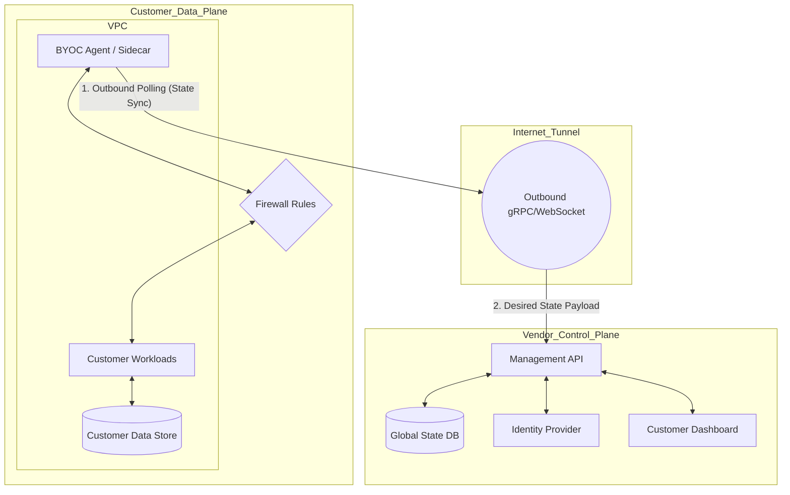

# BYOC Is Not Just 'Deploy into Their Cloud'

## Introduction

If you’ve ever tried to move a SaaS product into a Bring Your Own Cloud (BYOC) model, you know the feeling: you ship what you think is a simple cross-account IAM role, and suddenly your entire infrastructure starts falling apart.

That’s because BYOC isn’t just deploying into someone else’s cloud. It’s building a distributed system where part of your code runs in your data center—and the rest lives inside a customer’s VPC, behind firewalls you can’t touch, governed by policies you didn’t write.

We learned this the hard way at a fintech startup I worked with. We built a compliance tool that scanned customer logs for regulatory violations. Initially, it ran entirely in our AWS account. Then came the enterprise deals—banks, insurers, healthcare providers—all demanding that their data never leave their perimeter.

So we pivoted to BYOC. And boy, did we underestimate the complexity.

This article breaks down what real BYOC looks like under the hood—not the marketing version, but the gritty reality of managing state across untrusted networks, securing telemetry without violating privacy, and operating infrastructure you don’t control.

## Why This Matters

Today’s customers aren’t asking whether your service is SaaS anymore—they’re asking if they can run it themselves. Especially in regulated industries like finance, government, and healthcare, data sovereignty isn’t optional.

But here’s the catch: most teams treat BYOC as a deployment problem. They slap on some IAM roles, spin up a few EC2 instances in the customer’s account, and call it a day. That approach works until something goes wrong.

And when it does—say, a network partition, a misconfigured firewall, or a sudden spike in workload—the whole system collapses. Because there was no resilience built in. No fallback plan. Just fragile coupling between two very different environments.

BYOC is more than just infrastructure sharing. It's a fundamental shift in how you architect systems for trust, autonomy, and fault tolerance.

## How It Works

At its core, a true BYOC architecture separates concerns into two planes:

- **Control Plane**: Operated by the vendor. Manages identity, billing, configuration, and orchestration.
- **Data Plane**: Deployed within the customer’s environment. Handles actual compute, storage, and data processing.

Communication flows only outbound—from the customer’s environment to yours—via secure tunnels or agents.

Let me show you how this plays out in practice.



Here’s how it works:

1. **Agent Polling**: An agent deployed inside the customer's VPC polls the vendor’s control plane over an outbound connection (HTTPS/gRPC/WebSocket).
2. **Desired State Fetch**: The control plane responds with the current desired state—configurations, version numbers, policies.
3. **Local Reconciliation**: The agent applies changes locally, updating workloads, restarting services, syncing secrets.
4. **Telemetry Push**: Logs, metrics, and events are pushed back securely, respecting data residency rules.

This model ensures that even if the customer loses connectivity, their workloads keep running based on the last known good state.

## Core Concepts

### Control Plane vs. Data Plane Separation

Think of the Control Plane as your brain—it decides what should happen. The Data Plane is your body—it executes those decisions.

By decoupling these planes, you gain:
- **Security Isolation**: Critical operations never touch customer data directly.
- **Operational Independence**: You can upgrade or scale either plane independently.
- **Compliance Flexibility**: Customers retain ownership of their data while benefiting from centralized management.

### Reverse Tunnel Pattern

Since inbound access is blocked by default in most enterprise environments, you need an agent that establishes outbound connections only.

Common implementations include:
- Lightweight sidecar containers using gRPC streaming
- WebSocket-based polling agents for browser-friendly setups
- Embedded SDKs in existing applications

### Asynchronous State Synchronization

Rather than relying on real-time commands, BYOC systems use reconciliation loops to ensure eventual consistency.

Example: If a new policy update arrives while the customer is offline, the agent queues it and applies it once connectivity resumes.

### Zero Trust Networking

Every interaction must be authenticated and authorized, regardless of network location.

Techniques include:
- Mutual TLS authentication
- Short-lived tokens rotated frequently
- Scoped IAM roles with minimal permissions

## Examples & Code Walkthrough

Let’s build a simplified reconciliation loop that mimics how a real BYOC agent behaves.

```python
import time
import uuid
import json
import hashlib
from typing import Dict, Any

class BYOCAgent:
    def __init__(self, control_plane_url: str, customer_id: str):
        self.control_plane_url = control_plane_url
        self.customer_id = customer_id
        self.agent_id = str(uuid.uuid4())
        self.current_config: Dict[str, Any] = {}
        self.is_running = True
        self.last_heartbeat = None
        self.reconnect_attempts = 0

    def fetch_desired_state(self) -> Dict[str, Any]:
        """
        Simulate fetching desired state from Control Plane.
        In production, this would be a secure gRPC or HTTPS call.
        """
        print(f"[Agent {self.agent_id}] Fetching desired state...")
        # Mock response simulating dynamic config
        mock_response = {
            "worker_count": 3,
            "image_tag": "v2.1.0",
            "log_level": "INFO",
            "policy_version": "policy-v3"
        }
        return mock_response

    def apply_configuration(self, config: Dict[str, Any]) -> bool:
        """
        Apply configuration changes to local environment.
        Returns True if successful.
        """
        if config != self.current_config:
            print(f"[Agent] Applying config change: {self.current_config} -> {config}")
            try:
                # Simulate applying config via Terraform/K8s/etc.
                self._update_worker_pool(config["worker_count"], config["image_tag"])
                self._set_log_level(config["log_level"])
                self.current_config = config
                return True
            except Exception as e:
                print(f"[Error] Failed to apply config: {e}")
                return False
        return False

    def _update_worker_pool(self, count: int, image_tag: str):
        """Simulate updating worker nodes."""
        print(f"Updating worker pool to {count} nodes with image tag '{image_tag}'")

    def _set_log_level(self, level: str):
        """Simulate setting log verbosity."""
        print(f"Setting log level to '{level}'")

    def run_reconciliation_loop(self):
        """
        Main reconciliation loop.
        Polls Control Plane periodically and reconciles local state.
        """
        while self.is_running:
            try:
                desired_state = self.fetch_desired_state()
                success = self.apply_configuration(desired_state)
                if success:
                    self.last_heartbeat = time.time()
                    self.reconnect_attempts = 0
                else:
                    self.reconnect_attempts += 1
            except Exception as e:
                print(f"[Error] Lost connection to Control Plane: {e}")
                self.reconnect_attempts += 1

            # Exponential backoff
            delay = min(5 * (2 ** self.reconnect_attempts), 60)
            time.sleep(delay)

# Example usage
if __name__ == "__main__":
    agent = BYOCAgent(
        control_plane_url="https://api.vendor-saas.com/v1/sync",
        customer_id="cust_99_enterprise"
    )
    agent.run_reconciliation_loop()
```

This example shows how an agent might poll for desired state and reconcile its local environment accordingly. In production, you'd add retry logic, circuit breakers, and robust error handling.

## Best Practices

### Design for Disconnected Operation

Never assume constant connectivity. Build systems that degrade gracefully when offline.

Use techniques like:
- Local caching of critical configs
- Offline-first databases (e.g., SQLite with sync layers)
- Graceful degradation of non-critical features

### Secure All Communication Channels

Always encrypt traffic end-to-end. Use mutual TLS or signed JWTs for inter-service auth.

Avoid long-lived credentials. Rotate keys automatically and enforce least privilege rigorously.

### Monitor Without Violating Privacy

Implement sidecar telemetry collectors that aggregate stats without exposing raw data.

Use hashing and anonymization to preserve insights while protecting sensitive info.

### Version Everything

Track versions of:
- Agent binaries
- Configuration schemas
- Data formats

Enable rollbacks easily when upgrades fail.

### Test Against Real Environments

Don’t simulate customer networks—you’ll miss edge cases.

Deploy staging agents into actual customer-like VPCs and stress-test them thoroughly.

## Common Mistakes & Anti-Patterns

### 1. Treating BYOC Like Traditional Deployment

Many assume that because they’ve containerized their app, moving it to a customer’s cloud is trivial.

Reality check: now you're dealing with unknown network topologies, varying security postures, and unpredictable resource availability.

Fix: Treat every deployment as a unique environment requiring tailored configurations.

### 2. Ignoring Network Latency & Partitioning

Latency spikes or temporary outages shouldn’t break your system.

Fix: Implement timeouts, retries, and circuit breakers throughout your stack.

### 3. Hardcoding Dependencies on External Services

If your agent depends on external endpoints that may not be reachable from inside the customer’s network, expect failures.

Fix: Make dependencies configurable and support offline fallbacks wherever possible.

### 4. Overlooking Credential Management

Long-lived tokens stored insecurely are a major risk.

Fix: Use short-lived certs/tokens issued dynamically by a trusted authority.

## Performance Considerations

### Memory Overhead

Agents typically run lightweight processes—usually under 100MB RAM—but memory leaks can accumulate over time.

Optimize garbage collection cycles and monitor heap usage closely.

### CPU Usage

Polling intervals impact CPU load. Too frequent = waste; too infrequent = lag.

Balance responsiveness against efficiency using adaptive polling strategies.

### Bandwidth Consumption

Telemetry uploads consume bandwidth, especially in high-volume scenarios.

Compress payloads, batch transmissions, and prioritize essential signals.

### Scalability Limits

As you onboard thousands of customers, each with dozens of agents, scaling becomes challenging.

Design horizontally scalable backends capable of handling millions of concurrent connections.

## Real-World Usage

Companies like Datadog, New Relic, and Snowflake have successfully adopted BYOC models for enterprise customers.

For instance, Datadog offers a PrivateLink-enabled agent that runs inside customer VPCs, collecting metrics without requiring public internet exposure.

Snowflake provides Virtual Private Snowflake (VPS), allowing customers to isolate compute and storage within their own cloud accounts.

These solutions rely heavily on asynchronous state sync, secure tunneling, and zero-trust access patterns—all hallmarks of mature BYOC architectures.

## Frequently Asked Questions (FAQ)

### Q: Does BYOC require significant changes to existing SaaS products?

A: Yes—especially around state management, security boundaries, and deployment pipelines. Assume nothing transfers cleanly.

### Q: Can I reuse my existing Kubernetes operators in a BYOC setup?

A: Possibly—but you’ll need to adapt them for restricted environments where certain APIs or services aren’t accessible.

### Q: How do I handle upgrades when agents are offline?

A: Queue updates server-side and deliver them during next heartbeat. Use semantic versioning to prevent incompatible rollouts.

### Q: What tools help manage BYOC deployments?

A: Tools like HashiCorp Nomad, ArgoCD, and custom-built orchestration layers designed for multi-cloud, disconnected environments.

### Q: Is BYOC suitable for small startups?

A: Only after achieving product-market fit. Early-stage companies benefit more from focusing on core functionality before tackling complex infra challenges.

## Conclusion

Bring Your Own Cloud isn’t just another deployment option—it’s a complete rethink of how software delivers value in a world where trust, privacy, and autonomy matter more than ever.

Building resilient, secure, and observable systems in untrusted environments requires careful attention to architectural fundamentals: clear separation of control and data planes, robust communication contracts, and relentless focus on failure modes.

Whether you’re building a compliance platform, analytics engine, or AI inference pipeline, getting BYOC right means thinking like a distributed systems engineer—not just a cloud operator.

Start simple. Test exhaustively. Learn fast.

Because once you ship that first enterprise deal, there’s no going back.
