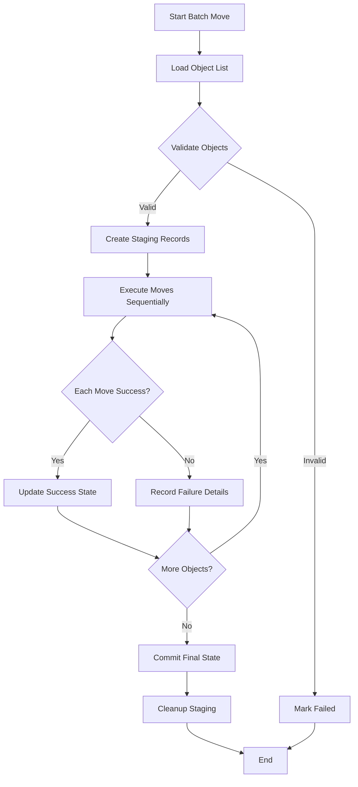

# Designing a Batch Move That Handles Partial Failure

## Introduction

When you're moving thousands of objects between cloud storage buckets—whether it's migrating legacy data, rebalancing workloads, or implementing disaster recovery—you can't afford to lose data to transient failures. Yet most batch operations either succeed completely or fail catastrophically, leaving teams manually reconciling partial results. The real challenge isn't just moving data; it's designing a system that survives partial failures without manual intervention.

I've seen this exact problem cause weekend outages at multiple companies. A migration job fails halfway through, and suddenly you have inconsistent state across regions, with no clear audit trail of what succeeded versus what needs retry. Building a robust batch move mechanism requires careful attention to atomicity boundaries, failure isolation, and recovery semantics.

## Why This Matters

Batch moves are everywhere in cloud infrastructure. Data lakes get reorganized, compliance requirements mandate cross-region replication, and microservices architectures demand data locality optimization. When these operations fail, the impact ripples through dependent systems.

Consider a media processing pipeline where video assets must be moved from hot storage to archival tiers. If 10,000 files transfer successfully but the operation aborts on file 10,001, you can't just restart from scratch—you'd duplicate work and potentially create inconsistent metadata. Worse, if you don't track what succeeded, you risk reprocessing files that were actually moved, leading to data corruption.

The core issue is that traditional database transactions don't translate cleanly to distributed file operations. You need a pattern that gives you atomic semantics within reasonable bounds while tolerating network partitions, service throttling, and hardware failures.

## How It Works

The solution centers on treating each batch move as a state machine with explicit phases: preparation, execution, and finalization. Rather than attempting a single monolithic operation, we decompose the batch into independently verifiable steps that can be tracked and retried.



The key insight is that we maintain a persistent work queue with explicit state tracking. Each object in the batch gets its own status record that survives process restarts. This allows us to resume from the point of failure rather than starting over.

The workflow proceeds in three stages:

1. **Preparation Phase**: Load the object list, validate each entry, and create staging records in durable storage. Invalid entries are marked immediately.
2. **Execution Phase**: Process objects sequentially, updating their status as we go. Failed moves are logged with error details but don't halt progress.
3. **Finalization Phase**: Once all objects are processed (success or failure), we commit the final state and clean up intermediate artifacts.

This approach trades some parallelism for predictability. We could move objects concurrently, but then we'd need distributed locking or idempotency guarantees that are harder to reason about. Sequential processing with persistent state gives us clear audit trails and simpler recovery logic.

## Core Concepts

Understanding this pattern requires grasping several foundational concepts:

**Idempotent Operations**: Every move operation must be safe to retry. If a move partially completes and we attempt it again, we shouldn't corrupt data or lose the file. This typically means checking for destination existence before initiating transfers.

**State Tracking**: We maintain a work queue with explicit states (PENDING, IN_PROGRESS, COMPLETED, FAILED). This isn't just logging—it's persisted metadata that drives our execution logic.

**Transactional Boundaries**: We don't achieve ACID transactions across all objects, but we do get atomicity within each individual move operation. The batch itself becomes eventually consistent.

**Failure Isolation**: One object's failure doesn't cascade to others. Each object is processed independently, with its own retry logic and error handling.

**Recovery Points**: By persisting state after each successful move, we create natural checkpoints. If the process crashes, we resume from the last committed state rather than losing all progress.

These concepts work together to create a system that's both robust and understandable. You can trace exactly what happened to each object, and you can reason about recovery paths without complex distributed coordination.

## Examples & Code Walkthrough

Let me show you what this looks like in practice. Here's a complete implementation using Python and a simple SQLite backend for state tracking:

```python
import sqlite3
import os
import logging
from enum import Enum
from typing import List, Optional, Dict, Any
from dataclasses import dataclass
from datetime import datetime
import hashlib

class ObjectStatus(Enum):
    PENDING = "pending"
    IN_PROGRESS = "in_progress"
    COMPLETED = "completed"
    FAILED = "failed"

@dataclass
class MoveOperation:
    source_path: str
    dest_path: str
    status: ObjectStatus = ObjectStatus.PENDING
    error_message: Optional[str] = None
    attempt_count: int = 0
    last_attempt: Optional[datetime] = None
    checksum: Optional[str] = None

class BatchMoveManager:
    def __init__(self, db_path: str, max_retries: int = 3):
        self.db_path = db_path
        self.max_retries = max_retries
        self._init_database()
    
    def _init_database(self):
        """Initialize SQLite database with work queue table."""
        conn = sqlite3.connect(self.db_path)
        cursor = conn.cursor()
        
        cursor.execute('''
            CREATE TABLE IF NOT EXISTS move_operations (
                id INTEGER PRIMARY KEY AUTOINCREMENT,
                source_path TEXT NOT NULL,
                dest_path TEXT NOT NULL,
                status TEXT NOT NULL,
                error_message TEXT,
                attempt_count INTEGER DEFAULT 0,
                last_attempt TIMESTAMP,
                checksum TEXT,
                created_at TIMESTAMP DEFAULT CURRENT_TIMESTAMP,
                UNIQUE(source_path, dest_path)
            )
        ''')
        
        # Create index for fast status queries
        cursor.execute('''
            CREATE INDEX IF NOT EXISTS idx_status ON move_operations(status)
        ''')
        
        conn.commit()
        conn.close()
    
    def load_object_list(self, objects: List[Dict[str, str]]) -> int:
        """Load list of objects to move into work queue."""
        conn = sqlite3.connect(self.db_path)
        cursor = conn.cursor()
        
        loaded_count = 0
        for obj in objects:
            source = obj['source']
            dest = obj['destination']
            
            # Validate paths exist
            if not os.path.exists(source):
                logging.warning(f"Source path does not exist: {source}")
                continue
            
            # Calculate checksum for integrity verification
            checksum = self._calculate_checksum(source)
            
            try:
                cursor.execute('''
                    INSERT OR REPLACE INTO move_operations 
                    (source_path, dest_path, status, checksum)
                    VALUES (?, ?, ?, ?)
                ''', (source, dest, ObjectStatus.PENDING.value, checksum))
                loaded_count += 1
            except sqlite3.Error as e:
                logging.error(f"Failed to insert {source}: {e}")
        
        conn.commit()
        conn.close()
        return loaded_count
    
    def _calculate_checksum(self, filepath: str) -> str:
        """Calculate SHA-256 checksum of file."""
        sha256_hash = hashlib.sha256()
        with open(filepath, "rb") as f:
            for chunk in iter(lambda: f.read(4096), b""):
                sha256_hash.update(chunk)
        return sha256_hash.hexdigest()
    
    def execute_batch(self) -> Dict[str, int]:
        """Execute all pending move operations."""
        results = {"completed": 0, "failed": 0, "skipped": 0}
        
        while True:
            conn = sqlite3.connect(self.db_path)
            cursor = conn.cursor()
            
            # Get next pending operation
            cursor.execute('''
                SELECT id, source_path, dest_path FROM move_operations 
                WHERE status = ? LIMIT 1
            ''', (ObjectStatus.PENDING.value,))
            
            row = cursor.fetchone()
            if not row:
                conn.close()
                break
            
            op_id, source, dest = row
            
            # Mark as in progress
            cursor.execute('''
                UPDATE move_operations SET 
                status = ?, attempt_count = attempt_count + 1,
                last_attempt = ? WHERE id = ?
            ''', (ObjectStatus.IN_PROGRESS.value, datetime.now(), op_id))
            conn.commit()
            conn.close()
            
            # Attempt the move
            success = self._move_single_object(source, dest)
            
            if success:
                # Mark completed
                conn = sqlite3.connect(self.db_path)
                cursor = conn.cursor()
                cursor.execute('''
                    UPDATE move_operations SET status = ? WHERE id = ?
                ''', (ObjectStatus.COMPLETED.value, op_id))
                conn.commit()
                conn.close()
                results["completed"] += 1
            else:
                # Check if we should retry
                conn = sqlite3.connect(self.db_path)
                cursor = conn.cursor()
                cursor.execute('SELECT attempt_count FROM move_operations WHERE id = ?', (op_id,))
                attempt_count = cursor.fetchone()[0]
                conn.close()
                
                if attempt_count < self.max_retries:
                    # Reset to pending for retry
                    conn = sqlite3.connect(self.db_path)
                    cursor = conn.cursor()
                    cursor.execute('''
                        UPDATE move_operations SET status = ? WHERE id = ?
                    ''', (ObjectStatus.PENDING.value, op_id))
                    conn.commit()
                    conn.close()
                else:
                    # Mark as permanently failed
                    conn = sqlite3.connect(self.db_path)
                    cursor = conn.cursor()
                    cursor.execute('''
                        UPDATE move_operations SET status = ?, error_message = ?
                        WHERE id = ?
                    ''', (ObjectStatus.FAILED.value, "Max retries exceeded", op_id))
                    conn.commit()
                    conn.close()
                    results["failed"] += 1
        
        return results
    
    def _move_single_object(self, source: str, dest: str) -> bool:
        """Move a single object with integrity verification."""
        try:
            # Check if destination already exists
            if os.path.exists(dest):
                logging.info(f"Destination already exists: {dest}")
                # Verify checksum matches
                current_checksum = self._calculate_checksum(dest)
                conn = sqlite3.connect(self.db_path)
                cursor = conn.cursor()
                cursor.execute('SELECT checksum FROM move_operations WHERE source_path = ?', (source,))
                expected_checksum = cursor.fetchone()[0]
                conn.close()
                
                if current_checksum == expected_checksum:
                    logging.info(f"Destination verified, skipping: {source}")
                    return True
                else:
                    logging.warning(f"Checksum mismatch, will overwrite: {source}")
            
            # Perform the actual move
            os.makedirs(os.path.dirname(dest), exist_ok=True)
            os.rename(source, dest)
            
            # Verify the move succeeded
            if not os.path.exists(dest):
                raise IOError(f"Move verification failed: {dest} not found")
            
            # Verify checksum
            actual_checksum = self._calculate_checksum(dest)
            conn = sqlite3.connect(self.db_path)
            cursor = conn.cursor()
            cursor.execute('SELECT checksum FROM move_operations WHERE source_path = ?', (source,))
            expected_checksum = cursor.fetchone()[0]
            conn.close()
            
            if actual_checksum != expected_checksum:
                # Rollback by moving back
                logging.error(f"Checksum mismatch after move: {source}")
                os.rename(dest, source)
                return False
            
            return True
            
        except Exception as e:
            logging.error(f"Move failed for {source} -> {dest}: {e}")
            return False
    
    def get_summary(self) -> Dict[str, int]:
        """Get current status summary of all operations."""
        conn = sqlite3.connect(self.db_path)
        cursor = conn.cursor()
        
        cursor.execute('''
            SELECT status, COUNT(*) FROM move_operations GROUP BY status
        ''')
        
        results = {}
        for row in cursor.fetchall():
            results[row[0]] = row[1]
        
        conn.close()
        return results
    
    def cleanup_completed(self):
        """Remove completed operations from database."""
        conn = sqlite3.connect(self.db_path)
        cursor = conn.cursor()
        
        cursor.execute('DELETE FROM move_operations WHERE status = ?', 
                      (ObjectStatus.COMPLETED.value,))
        
        deleted_count = cursor.rowcount
        conn.commit()
        conn.close()
        
        return deleted_count

# Usage example
def main():
    # Initialize the batch move manager
    manager = BatchMoveManager("/tmp/batch_moves.db")
    
    # Define objects to move
    objects_to_move = [
        {"source": "/data/large_file_1.bin", "destination": "/archive/large_file_1.bin"},
        {"source": "/data/config_file.json", "destination": "/archive/config_file.json"},
        {"source": "/data/missing_file.txt", "destination": "/archive/missing_file.txt"},  # Will fail validation
    ]
    
    # Load objects into work queue
    loaded = manager.load_object_list(objects_to_move)
    print(f"Loaded {loaded} objects for processing")
    
    # Execute the batch
    results = manager.execute_batch()
    print(f"Batch results: {results}")
    
    # Show final summary
    summary = manager.get_summary()
    print(f"Final status: {summary}")

if __name__ == "__main__":
    main()
```

This implementation demonstrates several key patterns:

1. **State Persistence**: We use SQLite for durability, but this could easily be PostgreSQL, DynamoDB, or any other persistent store.
2. **Retry Logic**: Failed operations get retried up to a configurable limit before being marked permanently failed.
3. **Integrity Verification**: Checksums ensure we catch corruption or incomplete transfers.
4. **Idempotency**: Checking for existing destinations prevents duplicate processing.
5. **Clear Audit Trail**: Every state change is recorded, making debugging straightforward.

## Best Practices

Based on running these systems in production, here are the rules that save you from midnight pages:

**Always Validate Before Execution**: Check that source objects exist and are readable before queuing them. Invalid entries waste resources and complicate error reporting.

**Use Checksums for Integrity**: Don't trust that a file copied successfully without verification. Network issues, disk corruption, and partial writes are real threats.

**Implement Exponential Backoff**: When retries are needed, increase delays between attempts. This prevents overwhelming already-stressed services and gives transient issues time to resolve.

**Separate Concerns Clearly**: Keep state management, business logic, and I/O operations in distinct modules. This makes testing easier and reduces cognitive load during debugging.

**Make State Visible**: Expose current progress, success rates, and failure reasons through metrics or APIs. Teams need to understand what the system is doing without digging through logs.

**Plan for Large Batches**: Don't load thousands of objects into memory at once. Stream them from storage or process in chunks to avoid memory exhaustion.

## Common Mistakes & Anti-Patterns

**Mistake 1: No State Persistence**
```python
# Anti-pattern: Everything in memory
def bad_batch_move(objects):
    for obj in objects:
        try:
            shutil.move(obj.source, obj.dest)
        except Exception as e:
            print(f"Failed: {e}")
            # Process dies here, no way to resume
```

Fix: Persist state to durable storage before starting work.

**Mistake 2: Ignoring Idempotency**
```python
# Anti-pattern: Blind overwrites
def bad_move(source, dest):
    shutil.move(source, dest)  # Fails if dest exists
```

Fix: Check destination existence and verify content before moving.

**Mistake 3: All-or-Nothing Thinking**
```python
# Anti-pattern: Abort on first failure
try:
    for obj in objects:
        shutil.move(obj.source, obj.dest)
except Exception:
    # Nothing moved gets rolled back
    pass
```

Fix: Process each object independently with individual error handling.

**Mistake 4: No Retry Strategy**
```python
# Anti-pattern: Immediate fail
def move_with_no_retry(source, dest):
    try:
        shutil.move(source, dest)
    except Exception:
        raise  # Gives up immediately
```

Fix: Implement configurable retry logic with backoff.

## Performance Considerations

The sequential approach I've outlined trades throughput for reliability. In high-throughput scenarios, you might consider parallel processing, but this introduces complexity around rate limiting, connection pooling, and distributed locking.

Memory usage scales linearly with batch size in the naive implementation. For large batches (millions of objects), you'll want to stream from the database rather than loading everything into memory:

```python
def stream_pending_operations(self, batch_size=10
