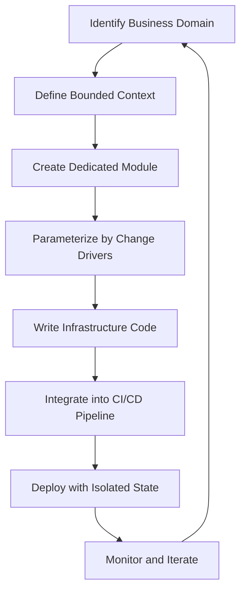

# Domain-Driven Infrastructure: Organize Your Terraform by Reason to Change

## Introduction

If you've ever run `terraform plan` on a sprawling monolith and watched your terminal scroll past hundreds of unrelated resource diffs, you know the feeling. A single tweak to a database parameter group triggers a cascade of plan noise across networking, IAM, and logging layers. The root cause isn't Terraform—it's how we organize our infrastructure code.

Most teams treat Terraform like a giant configuration file dump. Resources get lumped together by provider or environment, and over time, the configuration becomes a tangled web where changing one business rule forces you to re-evaluate everything else. That’s not just annoying—it’s dangerous. Every extra line in your plan increases the risk of unintended changes slipping into production.

The fix isn’t better tooling. It’s better structure.

By borrowing a page from Domain-Driven Design (DDD), we can reorganize Terraform around **bounded contexts**—logical groupings of resources that change for the same reasons. When your payment gateway switches from Stripe to PayPal, only the payment module should react. When your inventory service scales, the shipping context shouldn’t need a plan rerun.

This article walks through how to apply DDD thinking to Terraform, turning infrastructure chaos into predictable, modular evolution.

## Why This Matters

Engineers don’t care about abstract architecture patterns until they hit a wall.

We hit ours during a migration from a legacy monolith to microservices. Our Terraform repo had grown into a 5,000-line mess of intertwined resources. When marketing asked us to spin up a new promotional campaign with custom caching rules, it triggered a full-stack plan that touched VPCs, ECS clusters, RDS instances, and CloudWatch alarms—all unrelated to caching.

That’s the cost of poor separation of concerns.

When infrastructure doesn’t mirror your domain boundaries, every change becomes a negotiation between teams. The networking team blocks because they see ECS changes. The database team panics over IAM role updates. And meanwhile, your feature sits in limbo because nobody can agree on whether those changes are safe.

Organizing Terraform by reason to change flips this dynamic. Instead of asking “What cloud resources do we need?” you ask “Which parts of our system evolve together?” That shift in framing leads to cleaner modules, fewer merge conflicts, and faster deployments.

More importantly, it aligns infrastructure ownership with business outcomes. Your payment module owns everything related to transactions—not just the Lambda functions, but also the KMS keys, API Gateway routes, and WAF rules that protect them. When someone owns the whole context, they own the outcomes.

## How It Works

The core idea is simple: group Terraform resources by the business capability they support, not by technical layer.

Here’s the workflow:



Let’s break this down:

1. **Identify Business Domain**: Start with your domain model. What are the core capabilities of your system? Orders, payments, inventory, shipping—whatever drives value for users.
2. **Define Bounded Context**: Each domain becomes a bounded context. Inside this boundary, all resources share the same lifecycle and change drivers.
3. **Create Dedicated Module**: Build a Terraform module scoped to that context. No cross-domain references allowed unless explicitly sanctioned.
4. **Parameterize by Change Drivers**: Expose variables that reflect how the domain changes—payment provider, region, instance types—not internal implementation details.
5. **Write Infrastructure Code**: Implement the resources within the module. Keep it focused and cohesive.
6. **Integrate into CI/CD Pipeline**: Set up pipelines that validate, plan, and apply per-module. Gate merges on passing tests.
7. **Deploy with Isolated State**: Use remote backends (like S3 + DynamoDB) to isolate state per domain. This prevents accidental coupling.
8. **Monitor and Iterate**: Track deployment frequency, rollback rates, and plan sizes per module. If a module grows too large, split it further.

The feedback loop closes when you realize that some domains were incorrectly bounded. Maybe “orders” and “payments” should be separate after all. Or maybe “inventory” needs its own sub-context for warehouse-specific logic.

This isn’t a one-time refactor—it’s an ongoing practice.

## Core Concepts

### Bounded Context

In DDD, a bounded context defines the limits of a model. Outside those limits, terms may have different meanings or behaviors. In infrastructure, this translates to grouping resources that share the same operational concerns.

Example: Your `payment` context includes:
- Lambda functions handling transaction processing
- SQS queues for async fulfillment
- KMS keys securing card data
- WAF rules protecting payment endpoints

All of these change together when compliance requirements shift or when you switch processors.

### Reason to Change

This principle comes from the Single Responsibility Principle applied to infrastructure. If two resources are likely to change for the same reason, they belong in the same module.

Ask yourself:
> Who decides what gets deployed here?

If multiple stakeholders influence the same set of resources, you’ve got a cohesion problem.

### Module Versioning

Each module should be versioned independently. Use semantic versioning (`v1.2.3`) to signal breaking changes, new features, and patches. Store releases in Git tags or a private module registry.

Versioning enables safe rollouts. You can upgrade one context without affecting others.

### State Isolation

Never share state across bounded contexts. Each module should manage its own remote backend. This ensures:
- Independent rollbacks
- Reduced plan noise
- Clear ownership boundaries

Use workspaces or separate backend configurations per environment.

## Examples & Code Walkthrough

Let’s build a simplified e-commerce platform with four domains: **order**, **payment**, **inventory**, and **shipping**.

Directory layout:
```
terraform/
├── modules/
│   ├── order/
│   │   ├── main.tf
│   │   └── variables.tf
│   ├── payment/
│   │   ├── main.tf
│   │   └── variables.tf
│   ├── inventory/
│   │   ├── main.tf
│   │   └── variables.tf
│   └── shipping/
│       ├── main.tf
│       └── variables.tf
└── environments/
    ├── dev/
    │   └── main.tf
    └── prod/
        └── main.tf
```

### Order Module (`modules/order/main.tf`)

Handles order intake and processing:

```hcl
resource "aws_sqs_queue" "order_queue" {
  name = "${var.environment}-order-processing-queue"
  visibility_timeout_seconds = 300
  message_retention_seconds  = 1209600
}

resource "aws_lambda_function" "process_order" {
  function_name = "${var.environment}-process-order"
  handler       = "index.handler"
  runtime       = "python3.12"
  role          = aws_iam_role.lambda_exec.arn
  filename      = data.archive_file.order_lambda.output_path

  environment {
    variables = {
      QUEUE_URL = aws_sqs_queue.order_queue.id
    }
  }
}

resource "aws_iam_role" "lambda_exec" {
  name = "${var.environment}-order-lambda-role"

  assume_role_policy = jsonencode({
    Version = "2012-10-17"
    Statement = [{
      Action = "sts:AssumeRole"
      Effect = "Allow"
      Principal = { Service = "lambda.amazonaws.com" }
    }]
  })
}

output "queue_url" {
  value = aws_sqs_queue.order_queue.url
}
```

Variables:
```hcl
variable "environment" {
  description = "Deployment environment (dev/staging/prod)"
  type        = string
}

variable "max_retries" {
  description = "Maximum retry attempts for failed orders"
  type        = number
  default     = 3
}
```

### Payment Module (`modules/payment/main.tf`)

Supports pluggable payment gateways:

```hcl
locals {
  gateway_configs = {
    stripe = {
      endpoint = "https://api.stripe.com/v1"
      timeout  = 30
    }
    paypal = {
      endpoint = "https://api.paypal.com"
      timeout  = 45
    }
  }
}

resource "aws_lambda_function" "charge_customer" {
  function_name = "${var.environment}-charge-customer"
  handler       = "index.handler"
  runtime       = "python3.12"
  role          = aws_iam_role.lambda_exec.arn
  filename      = data.archive_file.payment_lambda.output_path

  environment {
    variables = {
      GATEWAY_ENDPOINT = local.gateway_configs[var.payment_gateway].endpoint
      TIMEOUT_SECONDS  = local.gateway_configs[var.payment_gateway].timeout
    }
  }
}

resource "aws_apm_server" "payment_monitoring" {
  count = var.enable_apm ? 1 : 0
  name  = "${var.environment}-apm-payment"
}

variable "payment_gateway" {
  description = "Payment processor to use (stripe|paypal)"
  type        = string
  validation {
    condition     = contains(["stripe", "paypal"], var.payment_gateway)
    error_message = "Only 'stripe' or 'paypal' supported."
  }
}

variable "enable_apm" {
  description = "Whether to enable APM monitoring"
  type        = bool
  default     = false
}
```

Usage in environment:
```hcl
module "payment_dev" {
  source            = "../../modules/payment"
  environment       = "dev"
  payment_gateway   = "stripe"
  enable_apm        = true
}
```

This design isolates payment logic. Switching gateways requires updating only the module input—no changes to Lambda code or IAM roles.

## Best Practices

✅ **One bounded context per module**: Resist the urge to combine unrelated services. If you find yourself writing cross-module dependencies, reconsider your boundaries.

✅ **Parameterize by business rules, not implementation**: Variables should reflect business decisions (e.g., `payment_gateway`) rather than technical minutiae (e.g., `lambda_memory_size`).

✅ **Immutable infrastructure**: Never mutate live resources directly. Always go through Terraform.

✅ **Automated testing**: Use Terratest to verify module behavior before applying. Test both happy paths and error conditions.

✅ **Documentation**: Document the *why* behind each resource. Future developers will thank you.

✅ **Version pinning**: Pin external module versions (`source = "git::https://example.com/repo.git?ref=v1.0.0"`). Avoid floating references.

✅ **Least privilege IAM**: Assign minimal permissions required for each module. Don’t grant blanket access.

## Common Mistakes & Anti-Patterns

❌ **Over-modularization**: Creating dozens of tiny modules leads to management overhead. Aim for 5–10 well-defined contexts, not 50 micro-modules.

❌ **Cross-context references**: Referencing resources from another module breaks encapsulation. If unavoidable, expose outputs carefully and document the dependency.

❌ **Shared state buckets**: Putting multiple environments in the same bucket increases collision risks. Use separate buckets or prefixes per environment.

❌ **Hardcoded values**: Avoid embedding secrets or hardcoded IDs in code. Use parameter stores or secrets managers.

❌ **Ignoring plan size**: Large plans indicate unclear boundaries. If your payment module touches networking, something’s wrong.

❌ **Skipping validation**: Not validating inputs invites misconfigurations. Add `validation` blocks to catch errors early.

## Performance Considerations

While Terraform itself is fast, poorly structured configurations can slow down planning significantly.

### Plan Time Complexity

A flat configuration with N resources has O(N) plan time. But if those resources are scattered across tightly coupled modules, interdependencies cause exponential slowdowns.

Well-isolated modules reduce this complexity. You only plan the affected domain, not the entire stack.

### Memory Usage

Terraform loads all providers and resources into memory during execution. Modules help compartmentalize this load. Smaller, focused modules consume less peak memory than monolithic configs.

For very large deployments (>10k resources), consider splitting into multiple root modules managed by separate Terraform Cloud workspaces.

### Concurrency Limits

AWS APIs impose rate limits. With isolated modules, you can control parallelism per context. For example, limit concurrent Lambda creations in the `order` module while allowing unrestricted EC2 provisioning in `shipping`.

## Real-World Usage

Companies like Netflix, Shopify, and HashiCorp itself have adopted DDD-inspired infrastructure layouts.

Shopify famously restructured their Terraform around service boundaries, reducing average apply times from 90 minutes to under 10. They treat each service as a bounded context, complete with its own CI pipeline and state backend.

Netflix uses Spinnaker alongside Terraform to enforce domain isolation. Each team owns their pipeline and infrastructure modules, ensuring that changes in one domain don’t block another.

Even smaller organizations benefit. At my previous startup, we split our infrastructure into six primary domains: auth, billing, analytics, notifications, media, and core. Deployment velocity improved dramatically—we went from weekly releases to daily deployments without incident.

## Frequently Asked Questions (FAQ)

**Q: Should I create a module for every microservice?**

Not necessarily. Microservice boundaries and domain boundaries aren’t always aligned. Focus on cohesive business capabilities first. Some modules might host several related services.

**Q: How do I handle shared infrastructure like VPCs?**

Create a dedicated `network` module. Other domains consume it via outputs. Be explicit about what’s shared versus isolated.

**Q: What about secrets management?**

Store sensitive data in AWS Secrets Manager or Parameter Store. Reference them in modules via data sources. Never commit credentials to code.

**Q: Can I mix this approach with Terragrunt?**

Absolutely. Terragrunt complements modular Terraform by adding environment-level composition. Use Terragrunt wrappers to manage module versions and inputs per environment.

**Q: How do I migrate an existing monolith to this structure?**

Start small. Pick one domain—say, payments—and extract it into its own module. Once confident, migrate additional domains incrementally. Avoid big-bang refactors.

## Conclusion

Organizing Terraform by reason to change isn’t just about aesthetics—it’s about making infrastructure evolve predictably alongside your business.

When your modules reflect real-world domains, changes become localized, reviews become meaningful, and deployments become routine. You stop fighting your tools and start collaborating effectively.

The journey starts with one question: *Who owns this piece of infrastructure, and why would it change?*

Answer that honestly, and your Terraform will follow suit.
