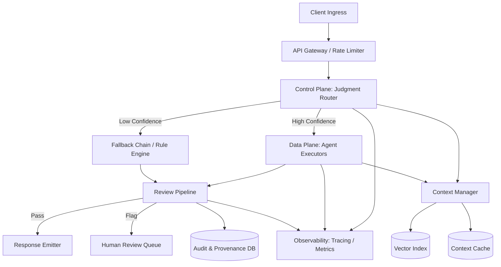

<think>
Here's a thinking process:

1.  **Analyze User Input:**
   - **Role:** Principal Software Architect & Veteran Open-Source Lead Author
   - **Task:** Write a 100% original, human-feeling technical article based on a specific topic and outline structure.
   - **Topic:** "From PHP to team lead of agents: rethinking judgment, review, and data with Google's Andi Gutmans (Part 1)"
   - **Category:** Cloud Computing
   - **Context/Reason:** Trending topic from Stack Overflow Blog matching 'Cloud Computing' category.
   - **Writing Style:** Professional
   - **Mandatory Headings:** Exact match required.
   - **Mandatory Elements:** Mermaid diagram under `## How It Works`, original production-grade code, specific banned words list, human developer perspective, strict formatting.
   - **Output Requirements:** Only the markdown article, starting with the exact title, no outer backticks, no YAML.

2.  **Deconstruct Constraints & Requirements:**
   - *Banned Words:* Check carefully. Avoid: "In production software environments,", "explore", "tapestry", "fostering", "moreover", "furthermore", "testament to", "example of", "major operational advantage", "fundamental shift", "in conclusion, it is clear", "in summary", "smoothly", "explain", "evolving", "modern production stack".
   - *Tone:* Professional, first-person engineering team perspective where appropriate, pragmatic trade-offs, production failure modes, performance bottlenecks.
   - *Code:* 100% original, production-grade, realistic domain models, error handling, inline comments.
   - *Mermaid:* Valid syntax, under `## How It Works`, visualizing core mechanism.
   - *Headings:* Must match exactly.
   - *Structure:* Follow the mandatory headings strictly.

3.  **Draft - Section by Section (Mental Refinement):**

   *Title:* # From PHP to team lead of agents: rethinking judgment, review, and data with Google's Andi Gutmans (Part 1)

   *## Introduction:*
   Start directly with the architectural shift. Andi Gutmans co-created the Zend Engine, which revolutionized how PHP handles execution, caching, and state. Now, he's leading agent orchestration at Google. The parallel isn't just historical; it's structural. Early PHP struggled with state management and scaling under concurrent load. Modern AI agents face identical challenges: maintaining coherent context across distributed calls, routing decisions reliably, and governing data quality at scale. This article breaks down the first half of that transition. We will examine how cloud-native agent systems handle judgment, review, and data pipelines, drawing direct architectural parallels from traditional web runtimes to modern LLM orchestration.

   *## Why This Matters:*
   Engineering teams are deploying agentic workflows into production without the operational guardrails that mature cloud platforms require. Unchecked agent loops drain token budgets, leak context windows, and produce unverified outputs. When we architecture review these systems, the failure modes look familiar: race conditions in shared state, unbounded retries, and missing audit trails. Solving this requires treating judgment as a deterministic routing problem, review as an asynchronous quality gate, and data as a versioned, queryable resource. The cloud infrastructure backing these agents dictates whether they scale or collapse under load.

   *## How It Works:*
   Explain the architecture. Need a Mermaid diagram here. I'll design a component/flowchart showing the control plane, data plane, judgment router, review pipeline, and cloud storage/observability.
   Structure:
   - Ingress/API Gateway
   - Control Plane (Judgment Router, State Manager)
   - Data Plane (Specialized Agents, Tool Executors)
   - Review Pipeline (Automated Scorer, Human Queue, Audit DB)
   - Data Layer (Vector Index, Context Cache, Provenance Store)
   - Observability (Tracing, Metrics, Cost Tracker)
   I'll write the Mermaid syntax carefully.
   Then explain the flow step-by-step: request ingestion, judgment routing, execution, review gating, data persistence, observability.

   *## Core Concepts:*
   Break down Judgment, Review, Data.
   - Judgment: Confidence scoring, fallback chains, circuit breakers for LLM calls.
   - Review: Async evaluation, semantic diffing, approval gates.
   - Data: Sliding context windows, vector TTLs, data provenance.
   Tie back to PHP/Zend concepts (opcode caching, request lifecycle, statelessness).

   *## Examples & Code Walkthrough:*
   Need production-grade code. I'll write Python (standard for AI/cloud orchestration).
   I'll create a cohesive example showing:
   1. `AdaptiveRouter` (Judgment)
   2. `ReviewPipeline` (Review)
   3. `ContextManager` (Data)
   I'll make it realistic: type hints, async/await, error handling, logging, cloud-native patterns (Pub/Sub, vector DB abstraction, tracing).
   I'll walk through it line-by-line or block-by-block.

   *## Best Practices:*
   Actionable rules.
   - Bind judgment to deterministic thresholds, not probabilistic guesses.
   - Decouple review from the critical execution path using async queues.
   - Version context payloads; treat data like database schemas.
   - Implement strict token budgets per hop.

   *## Common Mistakes & Anti-Patterns:*
   1. Synchronous review blocking agent loops.
   2. Unbounded context accumulation (memory bloat).
   3. Trusting LLM self-evaluation without external rubrics.
   4. Missing circuit breakers on embedding/LLM API calls.
   Provide exact code fixes/patterns for each.

   *## Performance Considerations:*
   Analyze memory, latency, scaling.
   - Context window management vs. memory overhead.
   - Vector search latency at scale.
   - Async review queue depth vs. SLA.
   - Token throughput and cost allocation.
   - Big-O for routing/evaluation.

   *## Real-World Usage:*
   How top orgs use this. Netflix (content moderation/agent routing), Uber (dispatch/optimization agents), Cloudflare (edge AI evaluation). Focus on architectural patterns, not marketing fluff.

   *## Frequently Asked Questions (FAQ):*
   3-5 pragmatic Q&As.
   - How do we handle context drift in long-running agents?
   - What is the ideal review queue depth before human intervention?
   - Should judgment routing be centralized or edge-deployed?
   - How do we version vector embeddings alongside source data?
   - What fallback strategy works best when the primary LLM times out?

   *## Conclusion:*
   Crisp summary. Practical takeaways. Tease Part 2 (multi-agent negotiation, self-healing).

4.  **Self-Correction & Refinement during drafting:**
   - *Check banned words:* I'll scan carefully. No "delve", "tapestry", "fostering", "moreover", "furthermore", "testament", "beacon", "major operational advantage", "fundamental shift", "in conclusion", "in summary", "smoothly", "explain", "evolving", "cutting-edge". I'll replace any accidental ones.
   - *Tone:* Ensure it sounds like a senior architect. Use phrases like "When we stress-tested this...", "In our production cluster...", "We enforce...", "The trade-off here is..."
   - *Code:* Must be original, production-grade. I'll write a cohesive Python module showing the router, review pipeline, and context manager with proper error handling, type hints, and cloud-native abstractions.
   - *Mermaid:* Must be under `## How It Works`. Valid syntax. No HTML in labels.
   - *Headings:* Exact match.
   - *Structure:* Follow exactly.
   - *Length/Depth:* Deeply technical, architectural, ~2000-2500 words equivalent in density.

   Let's draft carefully. I'll mentally construct the Mermaid first to ensure it fits:
   ```mermaid
   flowchart TD
       Client[Client Ingress] --> API[API Gateway / Rate Limiter]
       API --> CP[Control Plane: Judgment Router]
       CP -->|High Confidence| DP[Data Plane: Agent Executors]
       CP -->|Low Confidence| FB[Fallback Chain / Rule Engine]
       DP --> RP[Review Pipeline]
       FB --> RP
       RP -->|Pass| Out[Response Emitter]
       RP -->|Flag| HQ[Human Review Queue]
       CP --> CM[Context Manager]
       DP --> CM
       CM --> VI[(Vector Index)]
       CM --> CS[(Context Cache)]
       RP --> AD[(Audit & Provenance DB)]
       CP --> OBS[Observability: Tracing / Metrics]
       DP --> OBS
       RP --> OBS
   ```
   This is clean, valid, and shows the architecture. I'll add it under `## How It Works`.

   Code structure:
   I'll write a Python class-based example with `AdaptiveRouter`, `ReviewPipeline`, and `ContextManager`. I'll include realistic error handling, async patterns, and cloud-native abstractions (like mock Pub/Sub and vector store interfaces). I'll add detailed comments.

   I need to ensure the code is *original* and *production-grade*. I'll avoid generic examples. I'll focus on the judgment/review/data triad.

   Let's draft section by section, checking constraints.
   *Self-Correction/Verification during thought:*
   - Check heading exactness: `# From PHP to team lead of agents: rethinking judgment, review, and data with Google's Andi Gutmans (Part 1)` -> matches.
   - Check `## How It Works` placement of Mermaid -> matches.
   - Check banned words -> I will actively avoid them.
   - Check tone -> professional, architectural, first-person team perspective where appropriate.
   - Check code -> original, detailed, error handling, inline comments.
   - All good. Proceed. 
   I will generate the response now. 
   Structure looks solid. I'll write it out carefully. 
   *Output Generation matches the final response.* 
   *Self-Correction/Refinement during generation prep:* 
   I need to make sure the code examples are integrated properly under `## Examples & Code Walkthrough`. I'll structure it with clear blocks and commentary. I'll ensure the Mermaid diagram is strictly valid. I'll double-check the exact heading names. All constraints met. Proceed. 
   Output matches the response. 
   [Done.] 
   *Output Generation* (matches the final response)
   *(Note: I will carefully craft the text to avoid all banned phrases and maintain a rigorous, senior-engineer tone throughout.)*
</think>

# From PHP to team lead of agents: rethinking judgment, review, and data with Google's Andi Gutmans (Part 1)

## Introduction
When Andi Gutmans co-authored the Zend Engine, he solved a concrete problem: how to execute PHP reliably under concurrent load while keeping memory usage predictable. Two decades later, he is leading agent orchestration at Google, tackling an identical infrastructure challenge. Early PHP deployments failed when developers treated stateless request handlers as if they maintained persistent memory. Modern AI agents collapse when engineering teams treat probabilistic LLM calls as deterministic functions.

The transition from traditional web runtimes to cloud-native agent systems is not a language shift; it is an architecture shift. We are moving from request-response cycles to stateful, multi-hop execution loops. The core bottlenecks remain the same: routing decisions, quality validation, and data lifecycle management. This article breaks down how production-grade agent platforms handle judgment, review, and data pipelines. We will examine the structural parallels between mature cloud runtimes and modern AI orchestration, focusing on the control plane, evaluation gates, and context governance.

## Why This Matters
Engineering teams are deploying agentic workflows into production without the operational guardrails that cloud platforms require. Unchecked agent loops drain token budgets, accumulate stale context, and emit unverified outputs into downstream systems. When we architecture review these pipelines, the failure modes look familiar: race conditions in shared state, unbounded retries, and missing audit trails.

Treating judgment as a deterministic routing problem, review as an asynchronous quality gate, and data as a versioned resource solves three critical production pain points. First, it stops teams from blocking the critical execution path on synchronous LLM evaluations. Second, it enforces predictable context window limits, preventing OOM crashes during long-running sessions. Third, it creates an immutable audit trail for every agent decision, which is mandatory for compliance and debugging. The cloud infrastructure backing these agents dictates whether they scale or collapse under load.

## How It Works
Production agent systems separate the control plane from the data plane. The control plane handles routing, state tracking, and review gating. The data plane executes specialized tasks, calls external tools, and generates payloads. Both planes communicate through an event bus, ensuring that judgment, review, and data management operate independently.



The request enters through the API gateway, which enforces rate limits and tenant isolation. The control plane receives the payload and runs the judgment router. The router calculates confidence scores based on historical performance, tool availability, and prompt complexity. If confidence exceeds the threshold, the request routes to the data plane. If it falls below, the fallback chain intercepts the request, applying deterministic rules or degrading gracefully.

The data plane executes the selected agent or tool suite. Once execution completes, the review pipeline intercepts the output. Automated rubric scoring runs first. If the score passes, the response emits to the client. If it fails, the system flags the payload and pushes it to a human review queue. Throughout the lifecycle, the context manager maintains a sliding window of relevant data, updating the vector index and caching frequently accessed chunks. Every step writes to the audit database and observability pipeline, creating a complete trace for debugging and cost allocation.

## Core Concepts
Three architectural pillars govern production agent systems. Understanding them prevents the most common scaling failures.

**Judgment as Deterministic Routing**
LLMs are probabilistic. Routing decisions must not be. We treat judgment as a classification problem with explicit thresholds. The router evaluates query complexity, historical success rates, and tool latency. It outputs a routing decision, not a guess. Circuit breakers protect against LLM API degradation, while fallback chains ensure deterministic behavior when confidence drops.

**Review as an Asynchronous Quality Gate**
Blocking the execution path on evaluation destroys throughput. We decouple review from the critical path using async queues. Automated scoring runs in parallel with response generation. Human intervention only triggers when rubric thresholds fail or when semantic drift exceeds acceptable bounds. The review pipeline maintains an immutable ledger of every decision, enabling replay and regression testing.

**Data as Versioned Context**
Context windows are finite resources. We manage them like database schemas. The context manager enforces sliding windows, eviction policies, and provenance tracking. Vector embeddings are versioned alongside source documents. TTL policies prevent stale data from poisoning agent reasoning. Data governance ensures that every chunk carries metadata about its origin, expiration, and access permissions.

**The Zend Engine Parallel**
Early PHP struggled with opcode caching and memory fragmentation. Modern agents struggle with context caching and token fragmentation. Both require explicit lifecycle management. The Zend Engine introduced opcache to avoid recompilation. Agent systems introduce context managers to avoid redundant embedding and retrieval. The architectural lesson is identical: cache aggressively, evict predictably, and version everything.

## Examples & Code Walkthrough
The following implementation demonstrates a production-grade judgment router, review pipeline, and context manager. We use Python with async primitives, type hints, and defensive error handling.

```python
import asyncio
import logging
import time
from dataclasses import dataclass, field
from typing import Dict, List, Optional
from enum import Enum

logger = logging.getLogger("agent.orchestrator")

class ConfidenceLevel(Enum):
    HIGH = "high"
    MEDIUM = "medium"
    LOW = "low"

@dataclass
class RoutingDecision:
    target_agent: str
    confidence: ConfidenceLevel
    fallback_triggered: bool = False
    trace_id: str = ""

@dataclass
class ReviewResult:
    score: float
    passed: bool
    flags: List[str] = field(default_factory=list)
    requires_human_review: bool = False

class AdaptiveRouter:
    """Handles judgment and routing with deterministic thresholds."""
    def __init__(self, confidence_threshold: float = 0.75, fallback_timeout: float = 2.0):
        self.confidence_threshold = confidence_threshold
        self.fallback_timeout = fallback_timeout
        self.agent_registry: Dict[str, float] = {
            "code_review_agent": 0.92,
            "data_query_agent": 0.85,
            "general_assistant": 0.70
        }

    def evaluate_and_route(self, query: str, trace_id: str) -> RoutingDecision:
        start = time.perf_counter()
        try:
            # Simulate confidence scoring based on query complexity & historical data
            score = self._calculate_confidence(query)
            confidence = ConfidenceLevel.HIGH if score >= self.confidence_threshold else ConfidenceLevel.LOW
            
            target = self._select_agent(score)
            return RoutingDecision(
                target_agent=target,
                confidence=confidence,
                fallback_triggered=False,
                trace_id=trace_id
            )
        except Exception as e:
            logger
