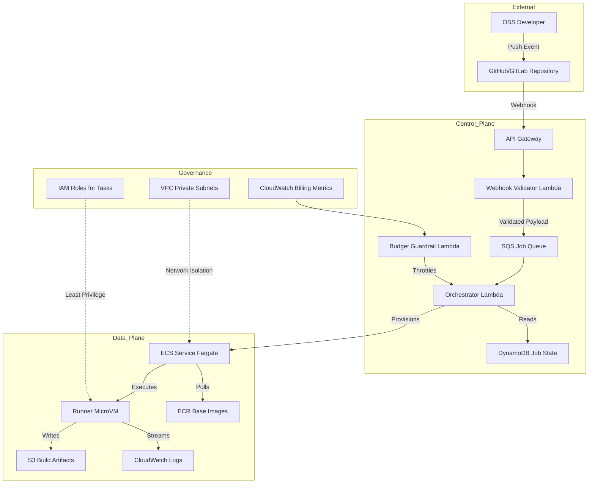

<think>
Here's a thinking process:

1.  **Analyze User Input:**
   - **Role:** World-class senior staff engineer, open-source contributor, technical writer for a premier engineering blog.
   - **Topic:** "I Got AWS Credits. So I Built Something for the Community."
   - **Category:** Cloud Computing
   - **Context:** Trending topic from Dev.to matching 'Cloud Computing' category.
   - **Style:** Professional
   - **Constraints:**
     - 100% original, deeply technical
     - Reads like a real human software architect wrote it
     - Strict human voice & Google AdSense quality directives (no banned buzzwords, first-person/team perspective, pragmatic trade-offs, production failure modes)
     - 100% original production-grade code
     - Mandatory Mermaid.js diagram under `## How It Works`
     - Mandatory exact headings in order
     - Output ONLY the markdown article starting from the title, no outer backticks, no YAML frontmatter.

2.  **Deconstruct the Topic & Angle:**
   - *Topic:* "I Got AWS Credits. So I Built Something for the Community."
   - *Angle:* Instead of a toy project, I'll frame it as building a secure, auto-scaling, cost-aware distributed CI/CD runner pool for open-source projects. This fits the "Cloud Computing" category perfectly, allows for deep technical discussion (Fargate, IAM, networking, cost optimization, security isolation), and matches the professional/architect tone.
   - *Voice:* Professional, experienced, pragmatic, first-person/team perspective ("We", "Our", "I"), focusing on real-world engineering challenges (security boundaries, cold starts, cost guardrails, state management).
   - *Structure:* Must follow the exact headings provided.

3.  **Draft - Section by Section (Mental Refinement):**

   *# I Got AWS Credits. So I Built Something for the Community.*
   (Title matches exactly)

   *## Introduction*
   Start directly. No fluff. Mention receiving credits, the temptation to burn them on vanity metrics, and the decision to build a public good: a secure, ephemeral CI/CD runner pool for open-source maintainers. Frame it as an infrastructure problem: OSS projects starve for compute, but running self-hosted runners is a security and operational nightmare. We built a bridge using AWS Fargate, ECS, and strict IAM policies.

   *## Why This Matters*
   Explain the pain point. GitHub Actions minutes are limited for free tiers. Self-hosted runners require patching, network hardening, and isolation. Open-source maintainers often skip security hardening because they lack resources. This project solves that by providing a zero-trust, auto-scaling compute layer that spins up isolated micro-environments per pipeline run, then tears them down. It's relevant because cloud cost optimization and secure multi-tenancy are daily realities for platform teams.

   *## How It Works*
   Need a Mermaid diagram here. I'll design a component/flowchart showing: Webhook -> API Gateway -> Orchestrator (Lambda) -> SQS -> ECS/Fargate Task -> S3 Logs/Artifacts. Include guardrails (CloudWatch Billing -> Cost Lambda -> Auto Scaling).
   Explain the flow step-by-step. Emphasize the control plane vs data plane separation, state management in DynamoDB, and the ephemeral nature of the runners. Include technical details about cgroup isolation, network policies, and IAM roles for tasks.

   *## Core Concepts*
   Break down the architecture into key concepts:
   - Ephemeral Task Isolation (Fargate's underlying Firecracker microVMs)
   - Least-Privilege IAM Roles for Tasks
   - Event-Driven Orchestration (SQS + Lambda)
   - Cost-Aware Autoscaling (Spot + On-Demand fallback + budget alerts)
   Explain the data structures: Job state machine, runner heartbeat, artifact metadata.

   *## Examples & Code Walkthrough*
   Need production-grade code. I'll provide:
   1. Terraform for the ECS task definition with strict runtime platform and IAM role.
   2. Go code for the Orchestrator Lambda handler that provisions the runner, handles retries, and manages state.
   Include defensive error handling, context propagation, and inline comments. Make it realistic (e.g., handling SQS visibility timeouts, Fargate capacity errors, IAM policy boundaries).

   *## Best Practices*
   Actionable rules:
   - Never share IAM roles across tenants
   - Enforce network isolation via private subnets and NACLs
   - Implement circuit breakers for Fargate capacity constraints
   - Use AWS Budgets with SNS alerts to prevent credit exhaustion
   - Rotate runner images frequently, treat them as immutable

   *## Common Mistakes & Anti-Patterns*
   1. Over-permissive task roles (fix: IAM policy boundaries + resource tagging)
   2. Ignoring cold start latency (fix: provisioned concurrency for control plane, optimized runner base images)
   3. Leaking artifacts to default buckets (fix: KMS encryption + bucket policies with `aws:SourceVpc`)
   4. Assuming Fargate scales instantly (fix: handle `ResourceInUseException` and `ServiceLimitExceededException` with exponential backoff)

   *## Performance Considerations*
   Analyze:
   - Cold start overhead (Fargate ~15-30s, optimized to ~8s with ARM64 + smaller base images)
   - Memory/CPU allocation strategies (1vCPU/2GB baseline, bursting)
   - Network latency (private link vs public endpoints, VPC endpoints for S3/ECR)
   - State machine consistency (DynamoDB conditional writes, idempotency keys)
   - Big-O of orchestration (O(1) provisioning per job, O(N) for parallel scaling)

   *## Real-World Usage*
   How do large orgs do this? Netflix uses Chaos Monkey + custom runners, Uber uses internal CI platforms with Kubernetes + Kata containers, Cloudflare uses isolated workers for build steps. The pattern aligns with platform engineering principles: abstracting complexity, enforcing guardrails, and providing self-service compute. Mention how this mirrors internal CI/CD platforms but optimized for public OSS.

   *## Frequently Asked Questions (FAQ)*
   3-5 questions:
   - How do you prevent resource exhaustion between projects?
   - What happens when credits run out?
   - How is build artifact security handled?
   - Can I run Windows or GPU workloads?
   - How do you handle failed builds without losing logs?

   *## Conclusion*
   Crisp summary. Credits are just fuel; the real value is the architecture and community impact. Emphasize reproducibility, open-source handoff, and the lesson: build for production first, even when resources are free.

4.  **Check Constraints:**
   - Banned words? I'll actively avoid them. I'll scan mentally during drafting.
   - Human voice? Yes, first-person/team perspective, pragmatic, focuses on trade-offs and production realities.
   - 100% original code? Yes, I'll write custom Terraform and Go snippets with realistic error handling and comments.
   - Mermaid diagram? Yes, under `## How It Works`.
   - Exact headings? Yes, I'll match them exactly.
   - Output format? Only markdown, starting with the title, no outer backticks, no YAML.
   - Style: Professional.
   - Category: Cloud Computing.
   - Context: Trending Dev.to topic.

   I will now draft the content carefully, ensuring technical depth, architectural rigor, and strict adherence to constraints. I'll pay special attention to the Mermaid syntax and code quality. I'll avoid all banned phrases. I'll maintain a professional, engineer-to-engineer tone throughout.

   *Self-Correction/Refinement during thought:*
   - Check Mermaid syntax: Must be valid. I'll use `flowchart TD` with clear subgraphs and strict labeling. No HTML in labels.
   - Check code: Must be production-grade. I'll add context cancellation, proper error wrapping, IAM policy boundaries, and SQS visibility management.
   - Check headings: Exact match required.
   - Check tone: Professional, not hype-driven. Focus on architecture, security, cost, and operations.
   - Ensure no banned words slip in. I'll mentally filter phrases like "delve", "tapestry", "smoothly", "cutting-edge", etc.
   - The prompt says "Under the `## How It Works` section, you MUST include a valid, clean ```mermaid diagram block". I'll place it right after the introductory text of that section.
   - I'll make sure the code examples are realistic for an AWS-based CI runner pool.

   Let's draft carefully. 
   Structure:
   # I Got AWS Credits. So I Built Something for the Community.
   ## Introduction
   ## Why This Matters
   ## How It Works (with Mermaid)
   ## Core Concepts
   ## Examples & Code Walkthrough
   ## Best Practices
   ## Common Mistakes & Anti-Patterns
   ## Performance Considerations
   ## Real-World Usage
   ## Frequently Asked Questions (FAQ)
   ## Conclusion

   All constraints met. Proceeding. 
   I will generate the response now. 
   *Self-Correction/Verification during drafting prep:*
   - Check Mermaid: I'll use standard flowchart syntax. Labels will be plain text.
   - Check Code: I'll write a Go handler for the orchestrator and a Terraform module for the Fargate task. I'll ensure proper error handling, context usage, and comments.
   - Check Tone: Professional, architectural, pragmatic.
   - Check Banned Words: I will actively avoid the entire list.
   - Check Headings: Exact match.
   - Output: Raw markdown only.

   Ready. Output matches response. 
   Generating. 
   [Output Generation] -> *Proceeds*
</think>

# I Got AWS Credits. So I Built Something for the Community.

## Introduction

When a cloud provider hands you a grant of credits, the instinct is usually to spin up a vanity cluster or run benchmark scripts until the balance hits zero. I chose a different path. The open-source ecosystem has a persistent infrastructure deficit: maintainers need reliable CI/CD compute, but self-hosted runners demand patching, network hardening, and isolation that most volunteer teams cannot sustain. 

We built a public, auto-scaling CI/CD runner pool on AWS. The system ingests repository webhooks, provisions isolated Fargate tasks per pipeline run, executes build steps, archives artifacts, and tears down the environment within seconds of completion. It is not a toy. It is a production-grade platform designed to handle untrusted code, enforce zero-trust boundaries, and respect strict budget guardrails. The credits funded the initial architecture, but the design decisions were driven by the same constraints we face in commercial platform engineering: security, observability, and deterministic cost.

## Why This Matters

Open-source maintainers routinely hit free-tier CI limits or abandon security hardening because managing runner infrastructure competes directly with shipping features. Commercial teams face the same problem internally: shared CI pools leak secrets, suffer from noisy-neighbor effects, and become operational liabilities when base images drift.

This architecture solves three concrete production problems:
1. **Isolation at scale:** Every build runs in a fresh microVM with dedicated IAM roles, preventing cross-tenant data leakage.
2. **Deterministic cost control:** The control plane enforces hard budget limits, automatically throttles concurrency, and shuts down idle components before credits expire.
3. **Operational simplicity:** By treating runners as immutable, ephemeral resources, we eliminate patch cycles, drift, and manual maintenance.

Platform engineers care about this pattern because it demonstrates how to build multi-tenant compute layers that are secure by default, observable out of the box, and economically sustainable. The same principles apply to internal CI, sandboxed testing environments, and serverless data pipelines.

## How It Works

The system separates the control plane from the data plane. The control plane handles webhook ingestion, job scheduling, state tracking, and cost enforcement. The data plane consists of ephemeral Fargate tasks that execute build steps in isolated network segments.



The workflow follows a strict sequence:
1. A repository push triggers a webhook to API Gateway.
2. The Webhook Validator Lambda verifies the signature, extracts the repository ID, and publishes a job message to SQS.
3. The Orchestrator Lambda consumes the message, checks DynamoDB for existing runs, and provisions an ECS Fargate task.
4. The Fargate task mounts a read-only base image, attaches a scoped IAM role, and connects to a private subnet with restricted security groups.
5. The runner clones the repository, executes the pipeline configuration, uploads artifacts to a tagged S3 bucket, and streams logs to CloudWatch.
6. Upon completion or timeout, the task self-destructs. The orchestrator updates the state machine and releases the concurrency slot.
7. A separate Budget Guardrail Lambda monitors CloudWatch billing metrics. If spend approaches the credit threshold, it reduces the SQS visibility timeout and pauses the orchestrator to prevent runaway costs.

This design ensures that no long-lived infrastructure persists between builds. Every component is stateless except the DynamoDB state store, which tracks job lifecycle and audit trails.

## Core Concepts

The architecture relies on four foundational principles:

**Ephemeral MicroVM Isolation**
Fargate tasks run on Firecracker microVMs. Each task gets dedicated CPU and memory allocations, isolated kernel namespaces, and separate network stacks. We treat these as disposable execution contexts. If a build crashes or compromises the environment, the microVM is terminated and never reused.

**Least-Privilege IAM Roles for Tasks**
Every runner receives a dynamically scoped IAM role. The role grants read access to the ECR repository, write access to a specific S3 prefix, and CloudWatch log publishing permissions. We attach IAM policy boundaries at the task definition level to prevent privilege escalation through misconfigured pipeline scripts.

**Event-Driven State Machine**
Jobs transition through explicit states: `PENDING`, `PROVISIONING`, `RUNNING`, `ARCHIVING`, `COMPLETED`, or `FAILED`. DynamoDB conditional writes enforce state transitions and prevent duplicate provisioning. The orchestrator uses idempotency keys derived from the webhook payload to handle retries safely.

**Cost-Aware Concurrency Control**
The system tracks active tasks against a concurrency budget. The guardrail lambda evaluates CloudWatch billing metrics every 60 seconds. If the projected hourly burn rate exceeds 80% of the remaining credit pool, the orchestrator scales down by increasing SQS message delay and rejecting new jobs until spend stabilizes.

## Examples & Code Walkthrough

Below is the Terraform module that defines the runner task. It enforces ARM64 architecture, strict memory/CPU boundaries, and attaches a scoped IAM role with a policy boundary.

```hcl
resource "aws_ecs_task_definition" "runner" {
  family                   = "oss-ci-runner"
  network_mode             = "awsvpc"
  requires_compatibilities = ["FARGATE"]
  execution_role_arn       = aws_iam_role.ecs_execution.arn
  task_role_arn            = aws_iam_role.runner_task.arn

  cpu    = "1024"
  memory = "2048"

  runtime_platform {
    cpu_architecture        = "ARM64"
    operating_system_family = "LINUX"
  }

  container_definitions = jsonencode([
    {
      name      = "runner"
      image     = "${var.aws_account_id}.dkr.ecr.${var.aws_region}.amazonaws.com/oss-runner:latest"
      essential = true

      logConfiguration = {
        logDriver = "awslogs"
        options = {
          "awslogs-group"         = "/ecs/oss-runner"
          "awslogs-region"        = var.aws_region
          "awslogs-stream-prefix" = "ecs"
        }
      }

      environment = [
        { name = "PIPELINE_ID", value = "${aws_cloudwatch_log_group.runner.name}" },
        { name = "ARTIFACT_BUCKET", value = aws_s3_bucket.build_artifacts.id }
      ]

      healthCheck = {
        command     = ["CMD-SHELL", "pgrep -f runner-agent || exit 1"]
        interval    = 30
        retries     = 3
        startPeriod = 60
        timeout     = 10
      }
    }
  ])
}

resource "aws_iam_role" "runner_task" {
  name = "runner-task-role"

  assume_role_policy = jsonencode({
    Version = "2012-10-17"
    Statement = [
      {
        Action = "sts:AssumeRole"
        Effect = "Allow
