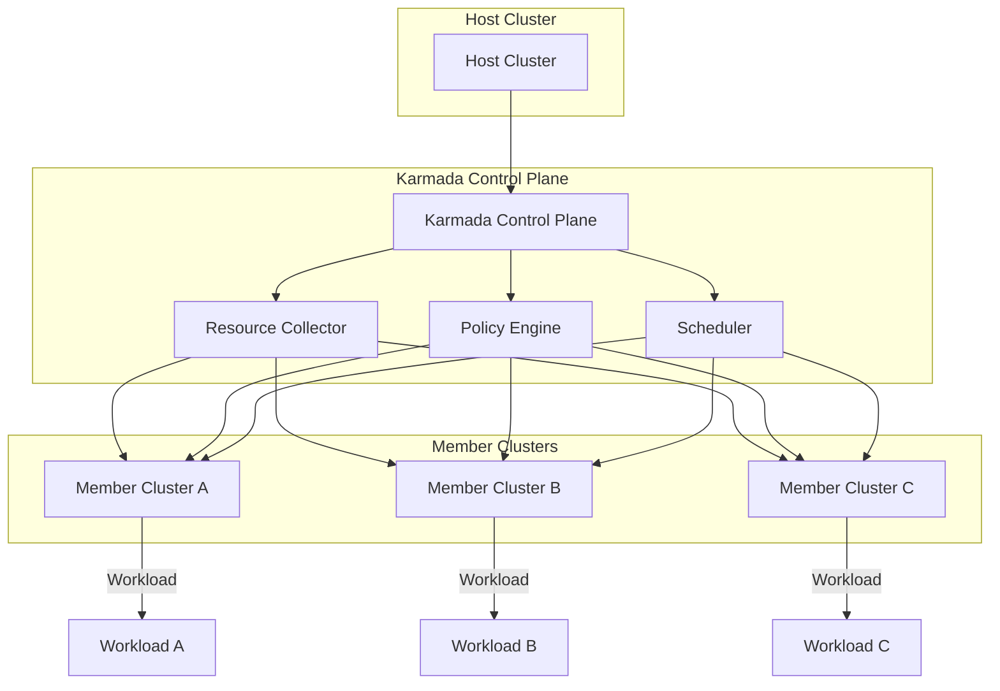

# Kubernetes Multi-Cluster Project Karmada Reaches CNCF Graduation

## Introduction
Our team wrestled with the operational overhead of running services across dozens of Kubernetes clusters. Each environment had its own networking, storage, and policy constraints, and we needed a unified way to place workloads where they made sense—geographically close to users, balanced across capacity, and governed by corporate policies. The recent CNCF graduation of Karmada validates a solution that abstracts multi‑cluster scheduling, policy enforcement, and resource federation into a single control plane. This article walks through why that matters, how the system works, and what engineers should keep in mind when they start adopting it.

## Why This Matters
Production teams today face three intertwined challenges:

* **Cluster sprawl** – departments spin up new clusters for new projects, leading to fragmented management.
* **Global latency** – users distributed worldwide need services placed near them without manual intervention.
* **Policy consistency** – compliance rules differ by region, and a single source of truth for placement is essential.

Karmada tackles these pain points by decoupling workload definition from the cluster where it runs. It introduces a declarative policy model that can be applied across many member clusters from a central admin cluster. The result is deterministic placement, reduced operational blast radius, and a clear audit trail for where each workload lives.

## How It Works
Karmada’s architecture can be visualized as a feedback loop between the control plane and member clusters. The following flowchart illustrates the primary data flow:

**Step‑by‑step breakdown**

1. **Cluster Registration** – The Resource Collector periodically queries the Host Cluster to discover new Member Clusters. It stores cluster metadata (labels, capacity, network topology) in an internal cache.
2. **Policy Definition** – Engineers define `ClusterPropagationPolicy` or `ClusterOverridePolicy` resources in the Host Cluster. The Policy Engine validates syntax, checks for conflicts, and translates policies into placement decisions.
3. **Scheduling Decision** – The Scheduler consumes the filtered list of Member Clusters, applies affinity/anti‑affinity rules, and evaluates resource utilization metrics. It produces a `ClusterDecision` object that records the chosen cluster for each workload.
4. **Workload Propagation** – The Control Plane constructs the required Kubernetes manifests (Deployments, Services, etc.) and pushes them to the selected Member Cluster via its API server. The Manifest Controller on the Member side reconciles the applied resources.
5. **Observation Loop** – Member Clusters report back health, resource usage, and any scheduling errors. The Resource Collector updates its state, feeding fresh data into the next scheduling cycle.

The loop repeats every few minutes, ensuring that workload placement stays aligned with policy updates and cluster capacity changes.

## Core Concepts
* **Admin Cluster** – The central Kubernetes cluster that holds Karmada’s control‑plane components (CP, PE, SC, RC). All policy CRDs reside
