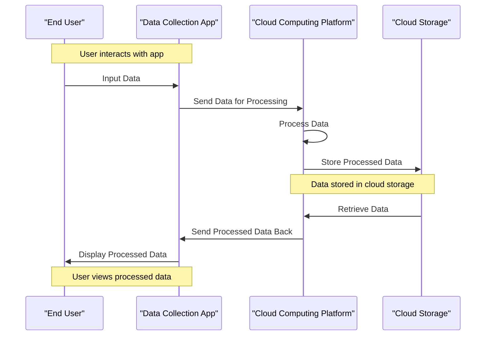

# Meta's blockbuster trial draws parallels to big tobacco
## Introduction
The recent Meta trial has sent shockwaves through the tech industry, with many drawing parallels to the big tobacco saga of the 1990s. At its core, the trial revolves around allegations of Meta's mishandling of user data, sparking concerns over data privacy and the role of cloud computing in facilitating such practices. As we explore the details of the trial and its implications, it becomes increasingly evident that the tech industry's handling of user data bears a striking resemblance to the tobacco industry's practices of yesteryear. In this article, we will explore the Meta trial, its significance in the context of cloud computing, and the alarming similarities between the tech industry's data handling practices and those of the tobacco industry.

## Why This Matters
The Meta trial is not just a isolated incident; it represents a symptom of a broader issue plaguing the tech industry. As cloud computing continues to grow in prominence, the importance of data privacy and security cannot be overstated. The ease with which data can be collected, processed, and stored in the cloud has created a false sense of security, leading many to overlook the potential risks associated with such practices. The parallels between the big tobacco trials and the Meta trial serve as a stark reminder of the need for stringent regulations and transparency in the tech industry. As software engineers, it is crucial that we prioritize data privacy and security, recognizing the potential consequences of our actions on the users we serve.

## How It Works
To understand the implications of the Meta trial, it is essential to grasp the underlying mechanics of cloud computing and its role in facilitating data collection and processing. The following sequence diagram illustrates the workflow of data collection, processing, and storage in cloud computing:

This diagram highlights the multiple points where data privacy and security measures are crucial, underscoring the need for robust regulations and transparency in the tech industry.

## Core Concepts
At the heart of the Meta trial lies the concept of "data addiction," where tech companies prioritize data collection and processing over user privacy and security. This phenomenon is reminiscent of the tobacco industry's practices, where the pursuit of profit led to the downplaying of health risks associated with smoking. The tech industry's handling of user data has created a culture of complacency, where the ease of data collection and processing has led to a lack of accountability and transparency.

## Examples & Code Walkthrough
To illustrate the challenges of data privacy in cloud computing, consider a simple example written in Python, utilizing the AWS SDK to interact with an S3 bucket:
```python
import boto3
from botocore.exceptions import NoCredentialsError

def upload_to_s3(local_file, bucket, s3_file):
    s3 = boto3.client('s3', aws_access_key_id='YOUR_ACCESS_KEY',
                      aws_secret_access_key='YOUR_SECRET_KEY')
    
    try:
        s3.upload_file(local_file, bucket, s3_file)
        print("Upload Successful")
        return True
    except FileNotFoundError:
        print("The file was not found")
        return False
    except NoCredentialsError:
        print("Credentials not available")
        return False

# Example usage
upload_to_s3('local_file.txt', 'your_bucket_name', 's3_file.txt')
```
This example highlights the ease with which data can be uploaded to cloud storage, but also underscores the need for secure credential management and access controls to protect user data.

## Best Practices
To ensure a safer and more transparent digital ecosystem, it is essential to adopt best practices that prioritize data privacy and security. These include:

* Implementing robust access controls and credential management
* Utilizing end-to-end encryption for data in transit and at rest
* Conducting regular security audits and penetration testing
* Providing transparent and easily accessible privacy policies
* Empowering users with control over their data and preferences

## Common Mistakes & Anti-Patterns
The tech industry's handling of user data is riddled with common mistakes and anti-patterns, including:

* Downplaying the risks associated with data collection and processing
* Failing to implement robust security measures and access controls
* Ignoring user concerns and preferences
* Prioritizing profit over user privacy and security
* Lacking transparency in data handling practices and privacy policies

## Performance Considerations
The collection, processing, and storage of user data in the cloud have significant performance implications, including:

* Increased latency and network overhead
* Higher computational complexity and resource utilization
* Greater risk of data breaches and unauthorized access
* Potential for decreased user trust and engagement

## Real-World Usage
Industry leaders are increasingly recognizing the importance of data privacy and security in cloud computing. Companies like Google, Microsoft, and Amazon are investing heavily in developing secure and transparent data handling practices, including:

* Implementing robust access controls and credential management
* Utilizing end-to-end encryption for data in transit and at rest
* Conducting regular security audits and penetration testing
* Providing transparent and easily accessible privacy policies

## Frequently Asked Questions (FAQ)
1. What is the significance of the Meta trial in the context of cloud computing?
The Meta trial highlights the need for stringent regulations and transparency in the tech industry, particularly in regards to data privacy and security in cloud computing.
2. How can tech companies prioritize data privacy and security in cloud computing?
Tech companies can prioritize data privacy and security by implementing robust access controls and credential management, utilizing end-to-end encryption, and providing transparent and easily accessible privacy policies.
3. What are the potential consequences of ignoring data privacy and security in cloud computing?
Ignoring data privacy and security in cloud computing can lead to decreased user trust and engagement, increased risk of data breaches and unauthorized access, and potential regulatory repercussions.

## Conclusion
The Meta trial serves as a stark reminder of the need for stringent regulations and transparency in the tech industry, particularly in regards to data privacy and security in cloud computing. As software engineers, it is crucial that we prioritize data privacy and security, recognizing the potential consequences of our actions on the users we serve. By adopting best practices, avoiding common mistakes and anti-patterns, and recognizing the performance implications of data collection and processing, we can work towards creating a safer and more transparent digital ecosystem.
