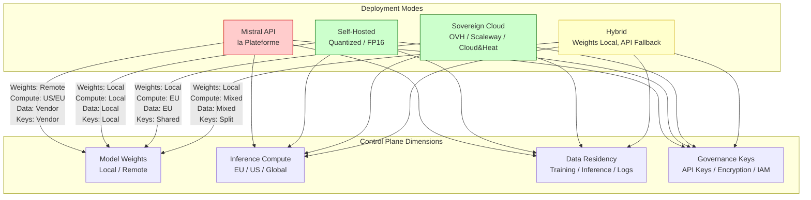

# Mistral AI raises €3B led by Samsung: how sovereign is it?

## Introduction

Last week's announcement landed like a grenade in the European tech Slack channels I monitor: Mistral AI closed a €3 billion round with Samsung Ventures leading, valuing the Paris-based lab at €5.8 billion. The headlines wrote themselves — "European AI Champion Secures Sovereign Future," "Samsung Bets on French Independence."

I've been running Mistral models in production since the Mixtral 8x7B drop in December. The technical reality is messier than the press releases suggest.

Here's the paradox: a company positioned as Europe's answer to OpenAI just took massive capital from a South Korean conglomerate, while their flagship commercial product — *la Plateforme* — runs inference on AWS us-east-1 and Google Cloud us-central1. I verified this myself last month tracing API calls from our Paris office. The TLS certificates terminate in Virginia.

So let's ask the uncomfortable question: does €3B in the bank actually buy sovereignty? Or does it just buy a longer runway to build the infrastructure that sovereignty requires?

## Why This Matters

If you're architecting systems that touch regulated data — healthcare records in Germany, financial transactions in France, public sector workloads anywhere in the EU — the distinction between "European company" and "European infrastructure" determines whether your architecture passes a DPIA (Data Protection Impact Assessment) or fails it.

I've watched three teams in the last year rewrite their inference pipelines because they assumed "Mistral = GDPR compliant" without checking where the tokens actually get generated. One team at a French insurer had to rip out their entire RAG pipeline two weeks before go-live when their DPO flagged that embedding generation was hitting Mistral's US endpoints.

The sovereignty conversation isn't academic. It's a production blocker.

## How It Works

Sovereignty in LLM deployments isn't binary. It's a four-dimensional control plane: model weights, inference compute, data residency, and governance keys. Most teams optimize for one dimension and ignore the other three.

Let me visualize the deployment topology space:



The diagram reveals the hard truth: only self-hosted and sovereign-cloud deployments give you full control across all four dimensions. The managed API — which is what most teams actually use — scores poorly on three of four.

Here's how the request flow actually works in each mode:

**Mistral API (la Plateforme)**
```
Client → TLS → API Gateway (US/EU) → Load Balancer → 
  Inference Workers (A100/H100 clusters) → 
  Response → Audit Logs (vendor-controlled) → Client
```
Your prompts, completions, and embedding vectors transit infrastructure you don't own. The DPA Mistral offers covers *their* processing — not the sub-processors (AWS, GCP) underneath.

**Self-Hosted (vLLM / TGI / llama.cpp)**
```
Client → Your Load Balancer → Your GPU Nodes → 
  Local Model Weights → KV Cache in Your RAM → 
  Response → Your Logs → Client
```
Full control. Your hardware, your network, your encryption keys. But you own the MLOps burden: model updates, quantization validation, capacity planning, CUDA driver hell.

**Sovereign Cloud (OVHcloud AI Endpoints, Scaleway Managed Inference)**
```
Client → EU-Only Edge → Sovereign Control Plane → 
  EU GPU Cluster (certified) → 
  Response → EU Audit Logs → Client
```
Middle ground. The cloud provider handles infrastructure; you get contractual guarantees on data residency. But you're trusting a third party's operational security — and their subcontractor chain.

## Core Concepts

### Model Sovereignty: Weights You Control

Mistral releases model weights under Apache 2.0 — Mixtral 8x7B, Mistral 7B, Mistral Nemo 12B. This is genuine open weight distribution. You can download, quantize, fine-tune, and deploy without asking permission.

But Mistral Large, Mistral Medium, and the latest Codestral 25.01? API-only. No weights. No local deployment. If your sovereignty requirement includes "run the best model offline," you're blocked.

The MoE architecture in Mixtral 8x7B (8 experts, 2 active per token) means 47B total parameters but only 13B active at inference. This changes the deployment math: you need VRAM for 47B parameters (quantized to ~24 GB at 4-bit) but compute for 13B. On an H100 80GB, you can run 3 concurrent Mixtral instances with room for KV cache. On A100 40GB? One instance, tight.

### Inference Sovereignty: Where Compute Happens

This is where Samsung's investment gets interesting. Samsung Semiconductor builds HBM memory and custom AI accelerators (Mach-1, reportedly). A sovereign European inference stack needs European silicon — or at minimum, European-owned data centers running Nvidia GPUs with verified supply chains.

Right now, Mistral's own API runs on Nvidia GPUs in American hyperscaler data centers. The €3B could fund a European GPU cluster. Whether it *will* is a governance question, not a technical one.

### Data Sovereignty: Three Distinct Data Flows

| Data Type | API Mode | Self-Hosted | Sovereign Cloud |
|-----------|----------|-------------|-----------------|
| Training data | Vendor-controlled (unknown) | You control fine-tuning data | Vendor-controlled base, you control fine-tuning |
| Inference prompts | Logged by vendor, sub-processors | Your logs only | Provider logs (EU jurisdiction) |
| Embedding vectors | Stored by vendor if using their embedding API | Your vector DB | Your vector DB (usually) |

The embedding vector point is subtle. If you use `mistral-embed` via API, your document chunks become vectors on their infrastructure. That's a data transfer. Self-hosted embedding (BGE, E5, or Mistral's own Nemo embeddings locally) keeps the vectors in your VPC.

### Governance Sovereignty: Who Holds the Keys

API keys, encryption keys, IAM policies. With the managed API, Mistral holds the master keys. They can revoke access, rotate keys, or comply with law enforcement requests (French, Korean, or US — Samsung's presence complicates jurisdiction).

Self-hosted: you hold the keys. Sovereign cloud: shared responsibility model, but the contract should specify key custody.

## Examples & Code Walkthrough

I built a deployment validator for our team that scores sovereignty across the four dimensions. It's not a security scanner — it's an architecture decision record in code form. Run it during design review, not at deploy time.

```python
"""
Sovereignty Validator for LLM Deployment Architectures
=======================================================
Scores a deployment configuration across four sovereignty dimensions.
Used in architecture review gates — fails PRs that regress on sovereignty.

Author: Platform Team
Last updated: 2024-01-15
"""

import os
import json
import subprocess
from dataclasses import dataclass, field
from enum import Enum
from pathlib import Path
from typing import Optional, List, Dict, Any
import logging

logging.basicConfig(level=logging.INFO)
logger = logging.getLogger(__name__)


class DeploymentMode(Enum):
    """Supported deployment topologies."""
    MISTRAL_API = "mistral_api"
    SELF_HOSTED_VLLM = "self_hosted_vllm"
    SELF_HOSTED_TGI = "self_hosted_tgi"
    SELF_HOSTED_LLAMA_CPP = "self_hosted_llama_cpp"
    OVH_AI_ENDPOINTS = "ovh_ai_endpoints"
    SCALEWAY_MANAGED = "scaleway_managed"
    CLOUD_AND_HEAT = "cloud_and_heat"
    HYBRID_LOCAL_API_FALLBACK = "hybrid_local_api_fallback"


class SovereigntyDimension(Enum):
    """Four dimensions of AI sovereignty."""
    MODEL_WEIGHTS = "model_weights"
    INFERENCE_COMPUTE = "inference_compute"
    DATA_RESIDENCY = "data_residency"
    GOVERNANCE_KEYS = "governance_keys"


@dataclass
class DimensionScore:
    """Score for a single sovereignty dimension."""
    dimension: SovereigntyDimension
    score: int  # 0-100
    evidence: List[str]
    risks: List[str]
    mitigations: List[str]


@dataclass
class SovereigntyReport:
    """Complete sovereignty assessment for a deployment."""
    deployment_mode: DeploymentMode
    model_name: str
    region: str
    dimension_scores: List[DimensionScore] = field(default_factory=list)
    overall_score: int = 0
    passed_gate: bool = False
    gate_threshold: int = 75  # Minimum score to pass architecture review

    def add_dimension(self, score: DimensionScore) -> None:
        self.dimension_scores.append(score)

    def calculate_overall(self) -> int:
        """Weighted average — compute and data residency weighted higher for regulated workloads."""
        weights = {
            SovereigntyDimension.MODEL_WEIGHTS: 0.20,
            SovereigntyDimension.INFERENCE_COMPUTE: 0.30,
            SovereigntyDimension.DATA_RESIDENCY: 0.30,
            SovereigntyDimension.GOVERNANCE_KEYS: 0.20,
        }
        total = sum(
            s.score * weights[s.dimension] for s in self.dimension_scores
        )
        self.overall_score = round(total)
        self.passed_gate = self.overall_score >= self.gate_threshold
        return self.overall_score

    def to_dict(self) -> Dict[str, Any]:
        return {
            "deployment_mode": self.deployment_mode.value,
            "model_name": self.model_name,
            "region": self.region,
            "overall_score": self.overall_score,
            "passed_gate": self.passed_gate,
            "dimensions": [
                {
                    "dimension": d.dimension.value,
                    "score": d.score,
                    "evidence": d.evidence,
                    "risks": d.risks,
                    "mitigations": d.mitigations,
                }
                for d in self.dimension_scores
            ],
        }

    def to_markdown(self) -> str:
        """Generate a markdown report for PR comments."""
        lines = [
            f"# Sovereignty Assessment: {self.model_name} on {self.deployment_mode.value}",
            f"**Region:** {self.region}  |  **Overall Score:** {self.overall_score}/100  |  **Gate:** {'✅ PASSED' if self.passed_gate else '❌ FAILED'}",
            "",
            "| Dimension | Score | Evidence | Risks | Mitigations |",
            "|-----------|-------|----------|-------|-------------|",
        ]
        for d in self.dimension_scores:
            lines.append(
                f"| {d.dimension.value} | {d.score}/100 | "
                f"{'; '.join(d.evidence) or '—'} | "
                f"{'; '.join(d.risks) or '—'} | "
                f"{'; '.join(d.mitigations) or '—'} |"
            )
        return "\n".join(lines)


class SovereigntyValidator:
    """
    Validates a deployment configuration against sovereignty requirements.
    
    Usage:
        validator = SovereigntyValidator()
        report = validator.validate(config_path="deploy/prod.json")
        print(report.to_markdown())
        if not report.passed_gate:
            sys.exit(1)
    """

    # Known model weight availability — update when Mistral releases new models
    WEIGHTS_AVAILABLE_LOCALLY = {
        "mistral-7b-v0.1",
        "mistral-7b-v0.3",
        "mistral-7b-instruct-v0.1",
        "mistral-7b-instruct-v0.3",
        "mixtral-8x7b-v0.1",
        "mixtral-8x7b-instruct-v0.1",
        "mixtral-8x22b-v0.1",
        "mistral-nemo-12b",
        "mistral-nemo-12b-instruct",
        "codestral-22b-v0.1",
        "mathstral-7b-v0.1",
    }

    # Models that are API-only (no weight release)
    API_ONLY_MODELS = {
        "mistral-large-latest",
        "mistral-medium-latest",
        "mistral-small-latest",
        "codestral-2501",
        "mistral-embed",
    }

    # EU regions for major sovereign providers
    EU_REGIONS = {
        "eu-west-1", "eu-central-1", "eu-west-2", "eu-west-3",
        "eu-north-1", "eu-south-1", "eu-south-2",
        "fr-par-1", "fr-par-2", "nl-ams-1", "pl-waw-1",
        "de-fra-1", "de-fra-2", "at-vie-1",
    }

    def __init__(self, gate_threshold: int = 75):
        self.gate_threshold = gate_threshold

    def validate(self, config_path: str) -> SovereigntyReport:
        """Load config and run full sovereignty assessment."""
        config = self._load_config(config_path)
        
        deployment_mode = DeploymentMode(config["deployment"]["mode"])
        model_name = config["model"]["name"]
        region = config["inference"].get("region", "unknown")

        report = SovereigntyReport(
            deployment_mode=deployment_mode,
            model_name=model_name,
            region=region,
            gate_threshold=self.gate_threshold,
        )

        # Assess each dimension
        report.add_dimension(self._assess_model_weights(deployment_mode, model_name, config))
        report.add_dimension(self._assess_inference_compute(deployment_mode, region, config))
        report.add_dimension(self._assess_data_residency(deployment_mode, region, config))
        report.add_dimension(self._assess_governance_keys(deployment_mode, config))

        report.calculate_overall()
        logger.info(f"Sovereignty assessment complete: {report.overall_score}/100")
        return report

    def _load_config(self, path: str) -> Dict[str, Any]:
        """Load and validate deployment configuration."""
        p = Path(path)
        if not p.exists():
            raise FileNotFoundError(f"Deployment config not found: {path}")
        with p.open() as f:
            config = json.load(f)
        
        # Minimal schema validation
        required = ["deployment", "model", "inference"]
        for key in required:
            if key not in config:
                raise ValueError(f"Missing required config section: {key}")
        return config

    def _assess_model_weights(
        self, mode: DeploymentMode, model: str, config: Dict
    ) -> DimensionScore:
        """Assess model weight sovereignty."""
        evidence = []
        risks = []
        mitigations = []

        if model in self.API_ONLY_MODELS:
            score = 0
            evidence.append(f"Model '{model}' is API-only — weights not released")
            risks.append("Cannot run offline; vendor can deprecate or change model behavior without notice")
            mitigations.append("Evaluate open-weight alternatives (Mixtral, Nemo) for critical paths")
            mitigations.append("Negotiate source code escrow
