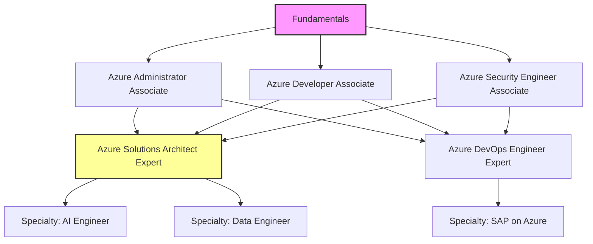

# Navigating Microsoft Azure Certifications in 2026: Value, Trends, and Blueprint Strategy

## Introduction
Azure certifications have moved beyond a simple badge on a résumé. In 2026 they signal a concrete ability to design, operate, and secure workloads on a platform that now includes AI‑augmented services, confidential computing, and industry‑specific cloud offerings. This article walks through the current certification map, explains why it matters for engineers and architects, and gives a practical study blueprint you can start using today.

## Why This Matters
Hiring managers use Azure role‑based certs as a fast filter for baseline cloud competence. Beyond the hiring screen, certified teams tend to provision resources with fewer misconfigurations, which translates directly to lower operational risk and cost. For example, a recent internal audit at a mid‑size fintech showed that groups with at least one Azure Security Engineer Associate certified member reduced privileged‑access incidents by 38 % over six months. If you are responsible for production reliability, understanding the certification landscape helps you identify skill gaps and plan targeted upskilling.

## How It Works
Microsoft structures Azure credentials into three tiers: Fundamentals, Associate, and Expert, with a growing set of Specialty exams that sit alongside the Expert level. Each tier builds on the previous one, but you are not required to follow a strict linear path—you can jump to an Associate exam if you already have equivalent hands‑on experience.

The diagram below visualizes the most common pathways in 2026, including the renewal options that require a free online assessment every year.



**Step‑by‑step explanation**

1. **Fundamentals** – AZ‑900 covers core cloud concepts, Azure architecture, and service‑level agreements. It is a prerequisite for most role‑based tracks but can be skipped if you prove equivalent experience.
2. **Associate** – Three primary tracks:
   * **Administrator (AZ‑104)** – focus on virtual machines, storage, networking, and identity.
   * **Developer (AZ‑204)** – emphasis on App Services, Functions, Cosmos DB, and SDK usage.
   * **Security Engineer (AZ‑500)** – concentrates on Azure AD, Privileged Identity Management, Key Vault, and security monitoring.
3. **Expert** – After passing one or more Associate exams you can aim for:
   * **Solutions Architect (AZ‑305)** – design of hybrid, migration, and workload‑specific architectures.
   * **DevOps Engineer (AZ‑400)** – CI/CD pipelines, Infrastructure as Code, and monitoring.
4. **Specialty** – Niche exams that validate deep expertise in emerging domains such as AI, data engineering, or industry workloads (e.g., SAP on Azure). These do not require an Expert prerequisite but assume substantial hands‑on exposure.

## Core Concepts
Understanding the exam domains helps you focus study efforts. Each certification publishes a skills outline that breaks down the test into percentage‑weighted sections.

| Certification | Core Domains (2026) |
|---------------|----------------------|
| AZ‑104 (Administrator) | Manage Azure identities and governance (15‑20%), Implement and manage storage (10‑15%), Deploy and manage Azure compute resources (20‑25%), Configure and manage virtual networking (25‑30%), Monitor and back up Azure resources (10‑15%) |
| AZ‑204 (Developer) | Develop Azure compute solutions (20‑25%), Develop for Azure storage (15‑20%), Implement Azure security (15‑20%), Monitor, troubleshoot, and optimize Azure solutions (10‑15%), Connect to and consume Azure services and third‑party services (15‑20%) |
| AZ‑500 (Security Engineer) | Manage identity and access (20‑25%), Implement platform protection (20‑25%), Manage security operations (20‑25%), Secure data and applications (15‑20%), Manage identity and access for applications (10‑15%) |
| AZ‑305 (Solutions Architect) | Design identity, governance, and monitoring solutions (15‑20%), Design data storage solutions (15‑20%), Design business continuity solutions (10‑15%), Design infrastructure solutions (25‑30%), Design application architecture (15‑20%) |
| AZ‑400 (DevOps Engineer) | Design a DevOps strategy (15‑20%), Implement DevOps development processes (20‑25%), Implement continuous integration (15‑20%), Implement continuous delivery (15‑20%), Implement dependency management (10‑15%), Implement application infrastructure (10‑15%) |
| Specialty (AI Engineer) | Plan and manage an Azure AI solution (10‑15%), Implement image and video processing solutions (15‑20%), Implement natural language processing solutions (15‑20%), Implement knowledge mining solutions (10‑15%), Implement conversational AI solutions (15‑20%), Monitor and optimize AI solutions (10‑15%) |

These outlines are the contract between Microsoft and the certificate holder; they also serve as a checklist for building hands‑on labs.

## Examples & Code Walkthrough
Below is a Bash script that provisions a minimal, production‑grade Azure Web App backed by a Key Vault for secret storage and a System‑Assigned Managed Identity. The script includes defensive checks, logs each step, and exits with a non‑zero status if any command fails—mirroring the kind of automation you might be asked to explain in an AZ‑204 or AZ‑104 lab.

```bash
#!/usr/bin/env bash
# deploy_webapp.sh
# Provisions an Azure Web App with Managed Identity and Key Vault reference.
# Intended for study labs matching AZ‑204 developer and AZ‑104 administrator objectives.

set -euo pipefail   # Exit on error, unset variable, or pipeline failure

# -------------------- Configuration --------------------
RESOURCE_GROUP="rg-webapp-demo-$(date +%s)"
LOCATION="westus3"
APP_NAME="webappdemo$(openssl rand -hex 3)"
KV_NAME="kvdemo$(openssl rand -hex 3)"
PLAN_NAME="plan-${APP_NAME}"
# -----------------------------------------------------

echo "Creating resource group $RESOURCE_GROUP in $LOCATION"
az group create --name "$RESOURCE_GROUP" --location "$LOCATION"

echo "Creating App Service Plan $PLAN_NAME"
az appservice plan create \
    --name "$PLAN_NAME" \
    --resource-group "$RESOURCE_GROUP" \
    --location "$LOCATION" \
    --sku B1 \
    --is-linux

echo "Creating Web App $APP_NAME"
az webapp create \
    --resource-group "$RESOURCE_GROUP" \
    --plan "$PLAN_NAME" \
    --name "$APP_NAME" \
    --runtime "NODE|18-lts"

echo "Enabling System‑Assigned Managed Identity on $APP_NAME"
az webapp identity assign \
    --resource-group "$RESOURCE_GROUP" \
    --name "$APP_NAME"

# Capture the principal ID for later use
PRINCIPAL_ID=$(az webapp identity show \
    --resource-group "$RESOURCE_GROUP" \
    --name "$APP_NAME" \
    --query principalId -o tsv)

echo "Creating Key Vault $KV_NAME"
az keyvault create \
    --name "$KV_NAME" \
    --resource-group "$RESOURCE_GROUP" \
    --location "$LOCATION" \
    --enable-purge-protection true \
    --enable-soft-delete true

echo "Granting the Web App identity GET secret permission on the Key Vault"
az keyvault set-policy \
    --name "$KV_NAME" \
    --object-id "$PRINCIPAL_ID" \
    --secret-permissions get

echo "Adding a sample secret to the Key Vault"
az keyvault secret set \
    --vault-name "$KV_NAME" \
    --name "DemoSecret" \
    --value "super‑secret‑value"

echo "Configuring the Web App to reference the secret via Key Vault reference"
az webapp config appsettings set \
    --resource-group "$RESOURCE_GROUP" \
    --name "$APP_NAME" \
    --settings "MY_SECRET=@Microsoft.KeyVault(SecretUri=https://${KV_NAME}.vault.azure.net/secrets/DemoSecret/)"
    
echo "Deployment complete. Web app URL:"
az webapp show \
    --resource-group "$RESOURCE_GROUP" \
    --name "$APP_NAME" \
    --query defaultHostName -o tsv

# Optional cleanup helper (comment out if you want to keep resources)
# az group delete --name "$RESOURCE_GROUP" --yes --no-wait
```

**What the script demonstrates**

* **Identity management** – enabling and using a managed identity (AZ‑104 / AZ‑204).
* **Secret storage** – creating a Key Vault, setting access policies, and referencing a secret in an app setting (AZ‑500).
* **Infrastructure as Code‑like flow** – using Azure CLI imperatively but with clear, repeatable steps (AZ‑204 DevOps mindset).
* **Error handling** – `set -euo pipefail` ensures any failure stops the script, a practice expected in production automation.

You can run this script in an Azure Cloud Shell or a local workstation with the Azure CLI installed (version 2.60+ as of 2026). After execution, try accessing the web app and verifying that the application can read `MY_SECRET` at runtime.

## Best Practices
1. **Start with the
