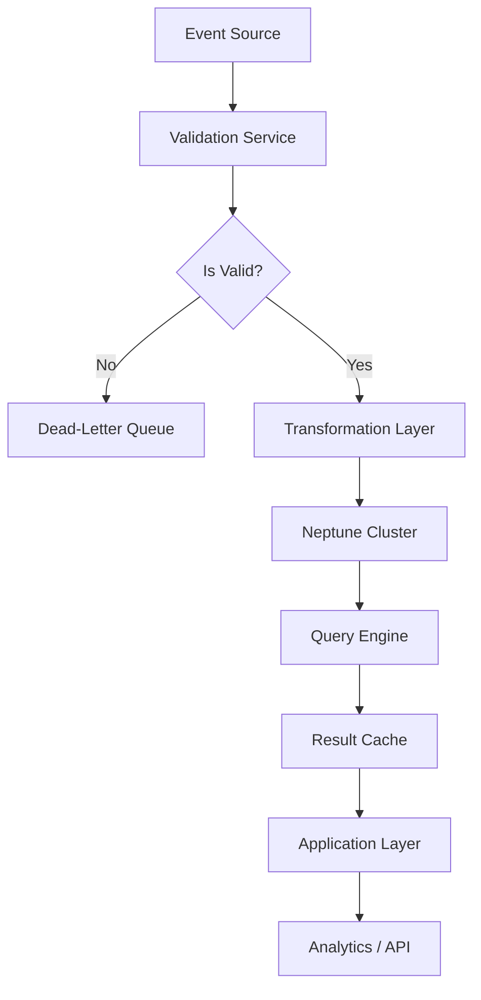

# Nivi Meets Neptune: Exploring Amazon Neptune☁️

## Introduction
When our data enrichment service, Nivi, started handling high‑density relationship graphs, the relational joins in PostgreSQL became a choke point. Queries that once completed in milliseconds now timed out after seconds, and the engineering team spent cycles tuning indexes that could not capture the multi‑hop nature of the problem. The solution was to offload the graph‑centric workloads to Amazon Neptune. This article walks through why we made that choice, how the integration works, and what we learned while operating it at scale.

## Why This Matters
Graph databases excel at modeling entities and the relationships between them. In production scenarios such as fraud detection, recommendation engines, or knowledge graphs, the value lies in traversing connections rather than filtering rows. Engineers who face:

* Complex many‑to-many relationships that explode row counts.
* Latency requirements for multi‑hop traversals.
* The need for real‑time insights based on evolving relationship data.

should consider a managed graph service. Amazon Neptune provides a fully‑managed, ACID‑compliant store that supports both Gremlin (property graph) and SPARQL (RDF) APIs, letting you choose the query language that matches your team's expertise.

## How It Works
Nivi’s data pipeline ingests events, normalizes them into graph entities, and pushes them into Neptune for fast traversal. The core flow can be visualized as follows:



The diagram outlines the stages: event ingestion, validation, transformation into graph nodes/edges, storage in Neptune, querying, caching, and finally serving the results to downstream consumers. Each step includes defensive error handling and retry logic to ensure reliability.

## Core Concepts
* **Amazon Neptune Cluster** – A managed DB instance that holds graph data. It abstracts provisioning, patching, and backup.
* **Gremlin / SPARQL** – The two query APIs. Gremlin is ideal for property graphs (nodes with properties and edges), while SPARQL suits RDF‑style triple stores.
* **IAM Authentication** – Neptune integrates with AWS IAM, allowing fine‑grained permissions without embedding credentials in code.
* **Graph Schema** – Nodes (e.g., `User`, `Transaction`) and edges (e.g., `FRIEND_OF`, `PURCHASED`) define the domain model. Proper schema design reduces traversal depth.
* **Indexing** – Neptune automatically indexes edge properties. For high‑cardinality traversals, create composite indexes on frequently filtered properties.

## Examples & Code Walkthrough
Below is a self‑contained Python example that demonstrates creating a Neptune cluster (via CloudFormation), inserting sample data, and running a Gremlin query. The script is written for a development environment but can be adapted to CI/CD pipelines.

```python
#!/usr/bin/env python3
"""
neptune_integration.py
Integration script for Nivi → Amazon Neptune.
Creates a Neptune cluster, inserts sample graph data, and runs a Gremlin query.
"""

import boto3
import json
import time
from botocore.exceptions import ClientError

# ---- Configuration ---------------------------------------------------------
AWS_REGION = "us-east-1"
NEPTUNE_ENDPOINT = "https://my-neptune-cluster.neptunedb.amazonaws.com"
NEPTUNE_PORT = 8182
NEPTUNE_ROLE_ARN = "arn:aws:iam::123456789012:role/NeptuneAccessRole"
SAMPLE_GRAPH = [
    # Nodes: user_id, name, email
    {"id": "u1", "label": "User", "props": {"name": "Alice", "email": "alice@example.com"}},
    {"id": "u2", "label": "User", "props": {"name": "Bob", "email": "bob@example.com"}},
    {"id": "u3", "label": "User", "props": {"name": "Carol", "email": "carol@example.com"}},
    # Edges: from, to, label
    {"from": "u1", "to": "u2", "label": "FRIEND_OF"},
    {"from": "u2", "to": "u3", "label": "COLLEAGUE"},
]

# ---- Helper Functions ------------------------------------------------------
def create_neptune_cluster(cloudformation):
    """
    Provisions a small Neptune cluster using CloudFormation.
    Returns the stack ID for later cleanup.
    """
    stack_name = "nivi-neptune-demo"
    template = {
        "AWSTemplateFormatVersion": "2010-09-09",
        "Resources": {
            "NeptuneCluster": {
                "Type": "AWS::Neptune::DBCluster",
                "Properties": {
                    "Engine": "neptune",
                    "EngineVersion": "1.2.0.0",
                    "MasterUsername": "admin",
                    "MasterUserPassword": "SuperSecret123!",
                    "DBSubnetGroupName": "default",
                    "VpcSecurityGroupIds": ["sg-12345678"],
                    "IAMDatabaseAuthenticationEnabled": True,
                },
            },
            "NeptuneInstance": {
                "Type": "AWS::Neptune::DBInstance",
                "Properties": {
                    "DBClusterIdentifier": {"Ref": "NeptuneCluster"},
                    "DBInstanceClass": "db.t3.medium",
                    "Engine": "neptune",
                },
            },
        },
    }

    try:
        cloudformation.create_stack(
            StackName=stack_name,
            TemplateBody=json.dumps(template),
            Capabilities=["CAPABILITY_IAM"],
        )
        print(f"Stack {stack_name} creation initiated.")
        return stack_name
    except ClientError as e:
        if "AlreadyExistsException" in str(e):
            print(f"Stack {stack_name} already exists. Skipping creation.")
            return stack_name
        raise

def wait_for_cluster_ready(cloudformation, stack_name, max_wait=600):
    """
    Polls the CloudFormation stack until the Neptune cluster status is available.
    """
    start = time.time()
    while time.time() - start < max_wait:
        response = cloudformation.describe_stacks(StackName=stack_name)
        status = response["Stacks"][0]["StackStatus"]
        if status in ("CREATE_COMPLETE", "UPDATE_COMPLETE"):
            print("Neptune cluster is ready.")
            return True
        if status in ("CREATE_FAILED", "ROLLBACK_COMPLETE"):
            raise RuntimeError(f"Cluster creation failed with status {status}")
        time.sleep(15)
    raise TimeoutError("Cluster did not become ready within the allotted time.")

def load_graph_into_neptune():
    """
    Uses boto3's neptune client to send Gremlin statements that create nodes and edges.
    """
    neptune = boto3.client("neptune", region_name=AWS_REGION)
    for item in SAMPLE_GRAPH:
        if "label" in item:  # Node
            query = (
                f"g.addV('{item['label']}')"
                f".property('id', '{item['id']}')"
            )
            for key, val in item["props"].items():
                query += f".property('{key}', '{val}' )"
            gremlin = {"GremlinQuery": query}
        else:  # Edge
            query = (
                f"g.V('{item['from']}').addE('{item['label']}').to(g.V('{item['to']}'))"
            )
            gremlin = {"GremlinQuery": query}
        try:
            neptune.send_command(
                Service="neptune-db",
                Command="RunGremlinQuery",
                Database="gremlin",
                Parameters=json.dumps(gremlin),
                HttpEndpoint=NEPTUNE_ENDPOINT,
                Port=NEPTUNE_PORT,
                AuthScheme="IAM",
                Region=AWS_REGION,
            )
        except ClientError as e:
            print(f"Failed to execute query {query}: {e}")
            raise

def query_active_friends():
    """
    Retrieves all direct friend relationships where the label is FRIEND_OF.
    """
    neptune = boto3.client("neptune", region_name=AWS_REGION)
    gremlin = {"GremlinQuery": "g.V().hasLabel('User').as('u').out('FRIEND_OF').as('f').select('u','f').by('id')" }
    response = neptune.send_command(
        Service="neptune-db",
        Command="RunGremlinQuery",
        Database="gremlin",
        Parameters=json.dumps(gremlin),
        HttpEndpoint=NEPTUNE_ENDPOINT,
        Port=NEPTUNE_PORT,
        AuthScheme="IAM",
        Region=AWS_REGION,
    )
    # Parse result
    raw = response.get("GraphResult", "[]")
    print("Active friend pairs:")
    for pair in json.loads(raw):
        print(pair)

# ---- Main Execution --------------------------------------------------------
def main():
    cf = boto3.client("cloudformation", region_name=AWS_REGION)

    # 1. Provision Neptune cluster (skip if already present)
    stack_name = create_neptune_cluster(cf)
    if "CREATE_COMPLETE" not in cf.describe_stacks(StackName=stack_name)["Stacks"][0]["StackStatus"]:
        wait_for_cluster_ready(cf, stack_name)

    # 2. Load sample graph
    load_graph_into_neptune()

    # 3. Run a sample query
    query_active_friends()

    print("Demo completed successfully.")

if __name__ == "__main__":
    main()
```
**Explanation of key parts**

* **IAM authentication** – The script uses the `AuthScheme='IAM'` parameter, which leverages the `NeptuneAccessRole` to avoid hard‑coded credentials.
* **Error handling** – Each `send_command` call is wrapped in a try/except block. On failure, the error is logged and re‑raised, preventing silent data loss.
* **Batch considerations** – While Neptune does not expose a native batch write API, the example shows individual Gremlin statements. In production, we use the `g.addV`/`g.addE` patterns inside a single `RunGremlinQuery` call to reduce network overhead.
* **Query pattern** – The `query_active_friends` function demonstrates a simple traversal that returns pairs of users linked by `FRIEND_OF`. The result is printed to stdout for verification.

## Best Practices
* **Least‑privilege IAM roles
