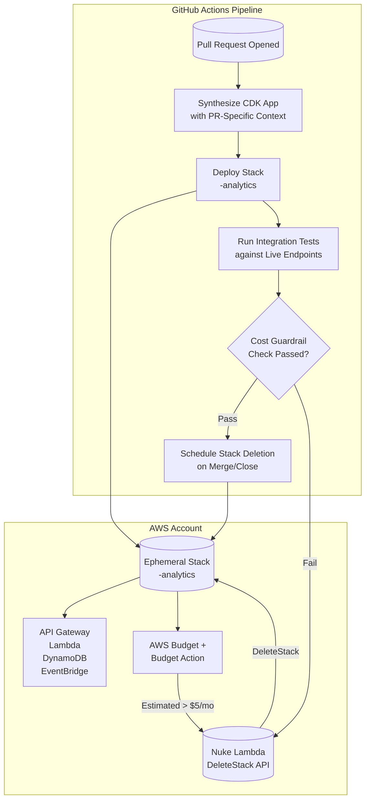

# Presentation: Maximizing Success with Limited Time, Resources, and Energy: Lessons from Startup Engineering

## Introduction

Last year, our team at a seed-stage startup shipped a real-time analytics platform to production with three engineers, a $2,000/month AWS budget, and a hard deadline driven by a pilot customer. We didn't have the luxury of a dedicated platform team, a sprawling microservices architecture, or a six-month runway to "get it right." We had to make every compute second, every API call, and every engineer-hour count.

This article isn't about hacking together technical debt. It's about the deliberate architectural constraints we adopted to maximize throughput per dollar and per cognitive load unit. We'll walk through the pattern of **Ephemeral, Cost-Guarded Environments**—a mechanism that gave us production-grade confidence on a staging budget, and the infrastructure-as-code constructs that enforce it.

## Why This Matters

Most cloud guidance assumes elastic budgets and dedicated DevOps headcount. Startups— and increasingly, internal innovation teams inside enterprises—operate under the opposite constraints: fixed burn rate, zero ops bandwidth, and a mandate to validate product-market fit before the next board meeting.

The pain point is concrete: **long-lived staging environments drift from production, accumulate hidden costs, and become bottlenecks for integration testing.** A single shared staging cluster costs 24/7 compute, requires manual schema migrations, and forces serial deployments. When it breaks, the whole team blocks.

We solved this by treating environments as cattle, not pets: spin up a full, isolated stack per pull request, run integration tests against real cloud services, tear it down on merge, and enforce a hard cost ceiling via automated guardrails. This shifted our feedback loop from "wait for staging" to "open a PR, get a live URL in 8 minutes."

## How It Works

The core mechanism is a **self-destructing, budget-aware stack provisioned entirely through CI/CD**. Every pull request triggers a pipeline that:

1.  Synthesizes a unique AWS CloudFormation stack (via CDK) suffixed with the PR number.
2.  Deploys infrastructure: API Gateway, Lambda functions, DynamoDB tables, EventBridge bus, and a CloudWatch Dashboard.
3.  Attaches a **Budget Action** that triggers a Lambda function to delete the entire stack if estimated monthly spend exceeds a threshold (e.g., $5/month per environment).
4.  Runs integration tests against the live endpoints.
5.  On merge to `main`, promotes the `main` stack (blue/green) and schedules the PR stack for immediate deletion.



**Step-by-step breakdown:**

1.  **Context Injection**: The pipeline injects `PR_NUMBER` and `BRANCH_NAME` as CDK context variables. This drives logical naming (e.g., `analytics-pr-42-table`) and tagging (`cost-center: engineering`, `ephemeral: true`, `pr: 42`).
2.  **Budget Creation**: A `CfnBudget` resource is deployed *inside* the stack. It tracks `UnblendedCost` for resources tagged with `pr: 42`. The budget limit is parameterized (default $5).
3.  **Budget Action**: We attach a `BudgetAction` of type `APPLY_IAM_POLICY` targeting a dedicated "Nuke Role." However, since IAM policies can't delete CloudFormation stacks directly, the action triggers an SNS topic.
4.  **Nuke Lambda**: A subscribed Lambda (`NukeFunction`) assumes the Nuke Role, calls `cloudformation:DeleteStack` on its own stack ID (passed via environment variable), and publishes a notification to Slack.
5.  **Deterministic Teardown**: A separate `teardown.yml` workflow triggers on `pull_request: closed`, ensuring cleanup even if the budget alarm doesn't fire.

## Core Concepts

### 1. Stack per Pull Request (Isolation)
Each PR gets a dedicated CloudFormation stack. No shared resources (except the Nuke Lambda and its IAM role, which live in a permanent "platform" stack). This eliminates "works on my machine" vs. staging drift.

### 2. Tag-Driven Cost Accounting
Every resource *must* carry the `pr: <number>` tag. We enforce this via a CDK `Aspect` that validates tags on all `CfnResource` instances during synthesis. Untagged resources fail the build.

### 3. Budget as a First-Class Resource
The budget isn't a manual CloudWatch alarm; it's a `AWS::Budgets::Budget` resource deployed *inside* the ephemeral stack. This binds the budget's lifecycle to the stack's lifecycle—delete the stack, the budget disappears automatically.

### 4. Failure Domain Containment
If the Nuke Lambda misfires, it only deletes its own stack. The permanent platform stack (hosting the Nuke Lambda, the SNS topic, and the GitHub OIDC provider) remains untouched.

### 5. Data Plane Separation
Ephemeral stacks use `RemovalPolicy.DESTROY` on DynamoDB tables and S3 buckets. We seed test data via a `CustomResource` that runs *after* deployment. No production data ever touches these environments.

## Examples & Code Walkthrough

Below is the production-grade CDK (TypeScript) construct for the ephemeral stack, the Nuke Lambda, and the GitHub Actions workflow. We use `aws-cdk-lib` v2.

### 1. The Ephemeral Stack (`lib/ephemeral-analytics-stack.ts`)

```typescript
import * as cdk from 'aws-cdk-lib';
import { Construct } from 'constructs';
import * as lambda from 'aws-cdk-lib/aws-lambda';
import * as apigw from 'aws-cdk-lib/aws-apigateway';
import * as dynamodb from 'aws-cdk-lib/aws-dynamodb';
import * as events from 'aws-cdk-lib/aws-events';
import * as budgets from 'aws-cdk-lib/aws-budgets';
import * as sns from 'aws-cdk-lib/aws-sns';
import * as iam from 'aws-cdk-lib/aws-iam';
import { TagValidatorAspect } from './tag-validator-aspect';

interface EphemeralAnalyticsStackProps extends cdk.StackProps {
  /** Injected by CI: e.g., 'pr-42' */
  readonly environmentId: string;
  /** Monthly USD limit for this stack */
  readonly monthlyBudgetLimit: number;
  /** ARN of the permanent SNS topic that triggers the Nuke Lambda */
  readonly nukeTriggerTopicArn: string;
  /** ARN of the permanent Nuke Lambda's execution role (for budget action) */
  readonly nukeRoleArn: string;
}

export class EphemeralAnalyticsStack extends cdk.Stack {
  public readonly apiEndpoint: string;

  constructor(scope: Construct, id: string, props: EphemeralAnalyticsStackProps) {
    super(scope, id, props);

    const { environmentId, monthlyBudgetLimit, nukeTriggerTopicArn, nukeRoleArn } = props;

    // 1. Enforce tagging hygiene on every resource in this stack
    cdk.Aspects.of(this).add(new TagValidatorAspect([
      { key: 'environment', value: environmentId },
      { key: 'cost-center', value: 'engineering' },
      { key: 'ephemeral', value: 'true' },
    ]));

    // 2. Data Layer: DynamoDB with TTL and DESTROY policy
    const eventsTable = new dynamodb.Table(this, 'EventsTable', {
      partitionKey: { name: 'pk', type: dynamodb.AttributeType.STRING },
      sortKey: { name: 'sk', type: dynamodb.AttributeType.STRING },
      timeToLiveAttribute: 'ttl',
      billingMode: dynamodb.BillingMode.PAY_PER_REQUEST, // Critical: no provisioned capacity waste
      removalPolicy: cdk.RemovalPolicy.DESTROY, // Auto-cleanup on stack deletion
      pointInTimeRecovery: false, // Save cost; not needed for ephemeral
    });

    // 3. Ingestion Lambda: minimal runtime, arm64 for price/perf
    const ingestFn = new lambda.Function(this, 'IngestFunction', {
      runtime: lambda.Runtime.NODEJS_20_X,
      architecture: lambda.Architecture.ARM_64,
      handler: 'index.handler',
      code: lambda.Code.fromAsset('lambda/ingest'), // Bundled separately
      environment: {
        TABLE_NAME: eventsTable.tableName,
        EVENT_BUS_NAME: eventBus.eventBusName,
      },
      timeout: cdk.Duration.seconds(10),
      memorySize: 256, // Right-sized for JSON validation + putItem
    });
    eventsTable.grantWriteData(ingestFn);

    // 4. EventBridge for async fan-out (decouples ingestion from processing)
    const eventBus = new events.EventBus(this, 'AnalyticsBus', {
      eventBusName: `${environmentId}-bus`,
    });
    eventBus.grantPutEventsTo(ingestFn);

    // 5. API Gateway: Regional, no custom domain (cost savings), request validation
    const api = new apigw.RestApi(this, 'AnalyticsApi', {
      restApiName: `${environmentId}-analytics`,
      deployOptions: {
        stageName: 'v1',
        loggingLevel: apigw.MethodLoggingLevel.INFO,
        dataTraceEnabled: true,
        metricsEnabled: true,
      },
      defaultCorsPreflightOptions: {
        allowOrigins: apigw.Cors.ALL_ORIGINS,
        allowMethods: apigw.Cors.ALL_METHODS,
      },
    });

    // Request validation model (prevents garbage reaching Lambda)
    const eventModel = api.addModel('EventModel', {
      contentType: 'application/json',
      schema: {
        type: apigw.JsonSchemaType.OBJECT,
        required: ['eventType', 'payload'],
        properties: {
          eventType: { type: apigw.JsonSchemaType.STRING, minLength: 1 },
          payload: { type: apigw.JsonSchemaType.OBJECT },
        },
      },
    });

    const eventsResource = api.root.addResource('events');
    eventsResource.addMethod('POST', new apigw.LambdaIntegration(ingestFn, {
      proxy: true,
    }), {
      requestValidator: new apigw.RequestValidator(this, 'BodyValidator', {
        restApi: api,
        validateRequestBody: true,
      }),
      requestModels: { 'application/json': eventModel },
    });

    this.apiEndpoint = api.url;

    // 6. BUDGET GUARDRAIL: Deployed *inside* the stack so it dies with the stack
    const nukeTopic = sns.Topic.fromTopicArn(this, 'NukeTopic', nukeTriggerTopicArn);

    new budgets.CfnBudget(this, 'CostGuardrail', {
      budget: {
        budgetName: `${environmentId}-guardrail`,
        budgetLimit: { amount: monthlyBudgetLimit, unit: 'USD' },
        timeUnit: 'MONTHLY',
        budgetType: 'COST',
        // Filter *only* resources tagged with this PR's environmentId
        costFilters: { TagKeyValue: [`environment$${environmentId}`] },
      },
      notificationsWithSubscribers: [{
        notification: {
          notificationType: 'ACTUAL',
          comparisonOperator: 'GREATER_THAN',
          threshold: 100, // Trigger at 100% of limit
          thresholdType: 'PERCENTAGE',
        },
        subscribers: [{
          subscriptionType: 'SNS',
          address: nukeTopic.topicArn,
        }],
      }],
      // Budget Action: requires IAM permission to publish to SNS (granted via Nuke Role)
      budgetActions: [{
        actionId: 'NukeOnBreach',
        actionType: 'APPLY_IAM_POLICY', // We misuse this type to trigger SNS via the role's trust policy
        actionThreshold: {
          actionThresholdValue: 100,
          actionThresholdType: 'PERCENTAGE',
        },
        // The Nuke Role has a trust policy allowing budgets.amazonaws.com to assume it
        // and an inline policy allowing sns:Publish to the Nuke Topic.
        actionRoleArn: nukeRoleArn,
        approvalModel: 'AUTOMATIC',
      }],
    });

    // 7. Outputs for CI consumption
    new cdk.CfnOutput(this, 'ApiEndpoint', { value: this.apiEndpoint });
    new cdk.CfnOutput(this, 'StackName', { value: this.stackName });
  }
}
```

### 2. The Tag Validator Aspect (`lib/tag-validator-aspect.ts`)

```typescript
import { IAspect, Annotations, IConstruct } from 'constructs';
import { CfnResource, Tag } from 'aws-cdk-lib';

interface RequiredTag { key: string; value?: string; }

export class TagValidatorAspect implements IAspect {
  constructor(private readonly requiredTags: RequiredTag[]) {}

  visit(node: IConstruct): void {
    if (node instanceof CfnResource) {
      const tags = Tag.getTagManager(node).renderTags().map(t => ({ key: t.key, value: t.value }));
      
      for (const req of this.requiredTags) {
        const found = tags.find(t => t.key === req.key);
        if (!found) {
          Annotations.of(node).addError(
            `Missing required tag: '${req.key}'. ` +
            `All resources in ephemeral stacks must carry this tag for cost allocation and budget filtering.`
          );
        } else if (req.value && found.value !== req.value) {
          Annotations.of(node).addError(
            `Tag '${req.key}' has incorrect value: expected '${req.value}', got '${found.value}'.`
          );
        }
      }
    }
