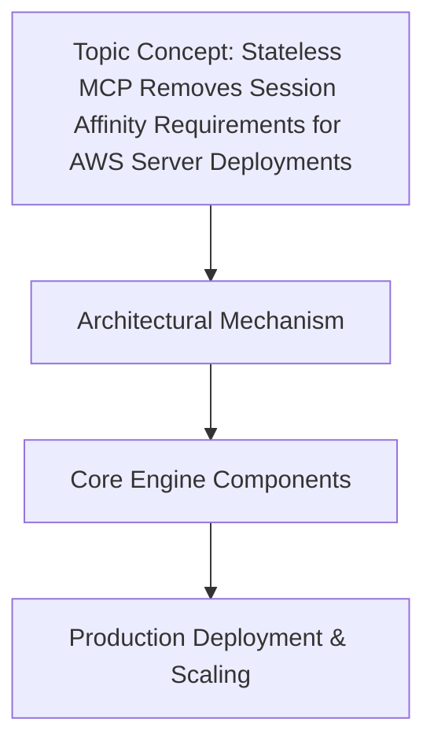

# Stateless MCP Removes Session Affinity Requirements for AWS Server Deployments

## Introduction

Session affinity—sticky sessions—has long been a necessary evil in cloud deployments. It binds a user’s session to a specific server instance, ensuring that all

## How It Works

