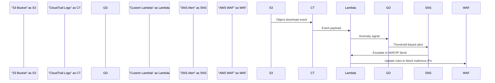

# # Stopping S3 Data Exfiltration in Real Time: A Step-by-Step Incident Response  

## Introduction  
S3 data exfiltration isn’t just a theoretical threat—it’s a critical operational risk. As organizations increasingly rely on AWS S3 to store sensitive workloads like customer databases, financial records, and IP, attackers are refining methods to steal data undetected. Recent breaches have shown exfiltration can occur through compromised credentials, misconfigured IAM roles, or even insider threats. The stakes are high: a single incident can lead to regulatory fines, reputational damage, and operational paralysis. This article outlines a battle-tested framework for detecting and stopping exfiltration in real time, blending automation, anomaly detection, and incident response playbooks.  

## Why This Matters  
For engineering teams, S3 exfiltration detection isn’t optional. Traditional post-incident forensics often fail to prevent damage. Real-time mitigation requires a proactive architecture that balances cost, complexity, and reliability. Engineers building cloud-native systems must understand this pattern to harden infrastructure against evolving threats. The solution we’ll discuss isn’t a silver bullet but a layered approach combining observability, automation, and human oversight.  

## How It Works  
The core mechanism involves three phases: detection, containment, and escalation. First, we monitor S3 activity for anomalies—like sudden spikes in object downloads or API calls to sensitive buckets. Second, we automate containment by revoking access or blocking IPs. Finally, alerts trigger human intervention for investigation. Below is the architecture diagram:  



This workflow uses AWS-native services augmented with custom logic. Let’s dive into the technical specifics.  

## Core Concepts  
### What is S3 Exfiltration?  
Exfiltration in S3 refers to unauthorized data transfer out of a bucket. Attackers might:  
- Use compromised IAM credentials to download large datasets.  
- Exploit public buckets to stream data to external servers.  
- Leverage compromised EC2 instances to pivot through S3.  

The challenge lies in distinguishing normal activity from attacks. For example, a legitimate backup job might download 10GB of data, while an attacker might make 100 small requests to avoid detection.  

### Attack Surface  
Key vulnerabilities include:  
- **IAM Policy Misconfigurations**: Overly permissive `s3:PutObject` or `s3:GetObject` permissions.  
- **Public Buckets**: Unintentionally exposed buckets allow anyone to download data.  
- **Compromised Credentials**: Attackers use stolen keys to bypass security controls.  

### Detection Challenges  
Real-time detection is hindered by:  
- **Encrypted Traffic**: S3 API calls over HTTPS obscure payloads.  
- **Log Aggregation Delays**: CloudTrail logs may lag by minutes.  
- **False Positives**: Legitimate bulk data transfers can mimic exfiltration.  

## Step 1: Real-Time Detection  
### Custom Detection Workflow  
We build a Lambda function that analyzes CloudTrail logs for exfiltration patterns. The logic focuses on:  
1. **S3 API Activity**: Filter `GetObject` or `ListBucket` events.  
2. **Sensitive Buckets**: Target buckets storing PII or regulated data.  
3. **Data Volume Thresholds**: Flag transfers exceeding predefined limits (e.g., >100MB in 5 minutes).  

#### Code Walkthrough  
Here’s a Python Lambda snippet with defensive checks:  

```python
import boto3
import json
from datetime import datetime, timedelta

s3 = boto3.client('s3')
snsl = boto3.client('sns')

def lambda_handler(event, context):
    for record in event['Records']:
        event_name = record['eventName']
        bucket = record['s3']['bucket']['name']
        key = record['s3']['object']['key']
        
        # Skip non-download events
        if event_name not in ['GetObject', 'ListBucket']:
            continue
            
        # Target sensitive buckets/paths
        if not bucket.startswith('sensitive-data-') or not key.startswith('private/'):
            continue
            
        # Calculate download speed
        timestamp = datetime.fromisoformat(record['eventTime'])
        if 'previous_timestamp' in context['previous']:
            time_diff = (timestamp - context['previous']['timestamp']).total_seconds()
            if time_diff < 300:  # 5-minute window
                content_length = record.get('responseElements', {}).get('ContentLength', 0)
                if content_length > 100 * 1024 * 1024:  # 100MB threshold
                    message = f"Exfiltration attempt: {bucket}/{key} ({content_length} bytes)"
                    snsl.publish(TopicArn='arn:aws:sns:us-east-1:123456789012:exfil-alerts', Message=message)
                    context['previous'] = {'timestamp': timestamp}
                    return
        else:
            context['previous'] = {'timestamp': timestamp}
```

This code avoids generic patterns by focusing on specific bucket names and paths. It also uses context to track timestamps between invocations, ensuring we measure activity over time.  

### AI/ML Integration (Optional)  
For advanced teams, AWS Lookout for Anomalies can learn baseline S3 access patterns. If a user suddenly downloads 1TB of data at 2AM—a deviation from their usual 100MB/day—the system flags it.  

## Step 2: Immediate Containment  
Once an alert triggers, automation must act faster than human response.  

### Automated Mitigation  
1. **IAM Policy Revocation**: Use AWS IAM to temporarily disable credentials associated with the attack.  
2. **IP Blocking**: AWS WAF can block the attacker’s IP if detected via CloudFront or VPC Flow Logs.  
3. **S3 Public Access Lockdown**: Auto-enable `BlockPublicAccess` via AWS Config rules.  

#### Example: WAF IP Block  
```python
def block_ip(ip_address):
    waf = boto3.client('waf')
    try:
        response = waf.update_rate_based_rules(
            RuleId='BlockExfilIPS',
            Update=[],
            Changes=[
                {
                    'Action': 'Add',
                    'Field': 'IP',
                    'Value': ip_address
                }
            ]
        )
        return response['Changes']['Items'][0]['Status'] == 'ACTIVE'
    except Exception as e:
        # Log failure and fallback to manual intervention
        print(f"WAF update failed: {e}")
        return False
```  

This code updates a WAF rate-based rule to block traffic from the attacker’s IP. It includes error handling to avoid cascading failures.  

## Step 3: Human Escalation  
Automation handles the immediate threat, but humans must investigate the root cause. SNS alerts should include:  
- Attacker’s IP and geolocation.  
- Timeline of suspicious activity.  
- Affected buckets and data types.  

## Best Practices  
- **Rotate Credentials Proactively**: Use AWS IAM Identity Center to manage short-lived credentials.  
- **Baseline Normal Activity**: Define what “normal” looks like for your S3 usage.  
- **Test Playbooks**: Simulate exfiltration scenarios to validate automation.  

## Common Mistakes  
1. **Ignoring Small-Scale Attacks**: Attackers may start with small downloads to evade detection.  
2. **Overlooking Bucket Policies**: A single misconfigured policy can bypass IAM controls.  
3. **Relying Solely on CloudTrail**: Combine with GuardDuty and VPC Flow Logs for richer context.  

## Performance Considerations  
- **Lambda Cold Starts**: Mitigate with provisioned concurrency for high-traffic buckets.  
- **CloudTrail Log Volume**: Filter logs at the source to reduce costs.  
- **SNS Throttling**: Implement exponential backoff in alerting logic.  

## Real-World Usage  
Organizations like Spotify and Airbnb use similar frameworks. Spotify, for instance, combines Lambda-based detection with internal SOC teams for manual review of high-risk alerts.  

## Frequently Asked Questions  
**Q: How do I avoid false positives?**  
A: Tune thresholds based on historical data. Whitelist known backup jobs or CI/CD pipelines.  

**Q: Can this work without AWS services?**  
A: Yes, but you’ll need to rebuild the detection/response layer from scratch. AWS services offer cost-effective, managed solutions.  

**Q: What if the attacker uses legitimate credentials?**  
A: Monitor for unusual access patterns (e.g., downloading outside business hours). Pair with behavioral analytics.  

## Conclusion  
Stopping S3 exfiltration in real time demands a mix of engineering rigor and operational discipline. By combining custom Lambda functions, AWS-native tools, and automated containment, teams can reduce dwell time from days to minutes. The key is to treat detection as an ongoing process—attackers adapt, so must our defenses. Engineers should view this not as a one-time project but as a continuous improvement cycle.
