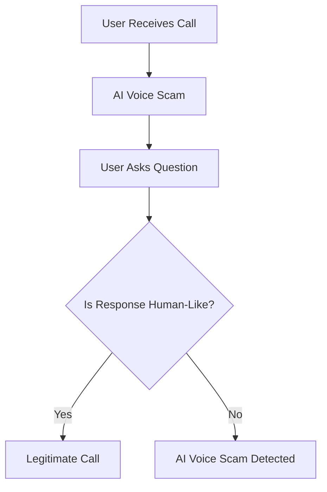

# The One Question That Stops an AI Voice Scam Cold

## Introduction
I still remember the first time I received a call from a "bank representative" claiming my account had been compromised. The voice on the other end was eerily convincing, using my name and referencing a recent transaction. It wasn't until they asked me to verify my account details that I realized it was a scam. As a software engineer, I've always been fascinated by the technology behind these AI-powered voice scams. But what if I told you there's a simple question that can stop these scams dead in their tracks?

## Why This Matters
AI voice scams are a growing concern, with millions of people falling victim every year. These scams can lead to significant financial losses, damage to credit scores, and even identity theft. As software engineers, it's our responsibility to stay ahead of these threats and develop solutions that can prevent them. By understanding how these scams work and identifying the weaknesses in their approach, we can create more robust security systems that protect users from these types of attacks.

## How It Works
The key to stopping AI voice scams lies in their inability to understand context and nuances of human conversation. By asking a simple question that requires critical thinking and empathy, we can determine whether the voice on the other end is human or AI-generated. Here's an architectural breakdown of how this works:

In this flowchart, the user receives a call from an AI voice scam. The user then asks a question that requires critical thinking and empathy, such as "Can you tell me about a time when you had to deal with a difficult customer?" If the response is human-like, the call is likely legitimate. However, if the response is scripted or lacks empathy, it's likely an AI voice scam.

## Core Concepts
To understand how AI voice scams work, it's essential to grasp the fundamental concepts behind voice synthesis and natural language processing. Voice synthesis refers to the process of generating human-like speech using computer algorithms. Natural language processing, on the other hand, involves the ability of computers to understand and generate human language. AI voice scams use a combination of these technologies to create convincing voice messages that can trick users into revealing sensitive information.

## Examples & Code Walkthrough
Here's an example of how you might implement a simple voice scam detector using Python:
```python
import speech_recognition as sr
import nltk
from nltk.sentiment import SentimentIntensityAnalyzer

def detect_voice_scam(audio_file):
    # Initialize speech recognition and sentiment analysis tools
    r = sr.Recognizer()
    sia = SentimentIntensityAnalyzer()

    # Transcribe audio file
    with sr.AudioFile(audio_file) as source:
        audio = r.record(source)
        try:
            transcript = r.recognize_google(audio)
        except sr.UnknownValueError:
            print("Google Speech Recognition could not understand audio")
            return False

    # Analyze sentiment of transcript
    sentiment = sia.polarity_scores(transcript)

    # If sentiment is neutral or lacks empathy, it may be an AI voice scam
    if sentiment['compound'] < 0.5:
        return True
    else:
        return False
```
This code uses the Google Speech Recognition API to transcribe an audio file and then analyzes the sentiment of the transcript using the NLTK library. If the sentiment is neutral or lacks empathy, it may indicate an AI voice scam.

## Best Practices
To prevent AI voice scams, it's essential to follow best practices when receiving calls from unknown numbers. Here are some actionable tips:

* Never reveal sensitive information, such as account details or passwords, over the phone.
* Ask questions that require critical thinking and empathy, such as "Can you tell me about a time when you had to deal with a difficult customer?"
* Be cautious of calls that use high-pressure sales tactics or create a sense of urgency.
* Hang up immediately if you suspect the call is an AI voice scam.

## Common Mistakes & Anti-Patterns
Here are some common mistakes engineers make when dealing with AI voice scams:

* Failing to implement robust security measures, such as two-factor authentication, to prevent unauthorized access to sensitive information.
* Not educating users about the risks of AI voice scams and how to prevent them.
* Using outdated or insecure voice synthesis and natural language processing technologies that can be easily exploited by scammers.
* Not monitoring and analyzing call data to detect and prevent AI voice scams.

## Performance Considerations
AI voice scams can have significant performance implications, including:

* Increased latency and network overhead due to the use of voice synthesis and natural language processing technologies.
* Higher computational complexity and memory usage due to the analysis of audio files and transcripts.
* Potential scalability issues if the number of calls increases significantly.

## Real-World Usage
Industry leaders are already leveraging AI voice scam detection technology in production. For example, banks and financial institutions are using machine learning algorithms to detect and prevent AI voice scams. Similarly, companies like Google and Amazon are using natural language processing and voice synthesis technologies to improve customer service and prevent AI voice scams.

## Frequently Asked Questions (FAQ)
Here are some frequently asked questions about AI voice scams:

* Q: How can I tell if a call is an AI voice scam?
A: Ask questions that require critical thinking and empathy, such as "Can you tell me about a time when you had to deal with a difficult customer?"
* Q: What are the consequences of falling victim to an AI voice scam?
A: Falling victim to an AI voice scam can lead to significant financial losses, damage to credit scores, and even identity theft.
* Q: How can I prevent AI voice scams?
A: Follow best practices, such as never revealing sensitive information over the phone and being cautious of calls that use high-pressure sales tactics or create a sense of urgency.

## Conclusion
AI voice scams are a growing concern, but by understanding how they work and identifying the weaknesses in their approach, we can create more robust security systems that protect users from these types of attacks. By asking a simple question that requires critical thinking and empathy, we can determine whether the voice on the other end is human or AI-generated. As software engineers, it's our responsibility to stay ahead of these threats and develop solutions that can prevent them. By following best practices and leveraging AI voice scam detection technology, we can create a safer and more secure environment for everyone.
