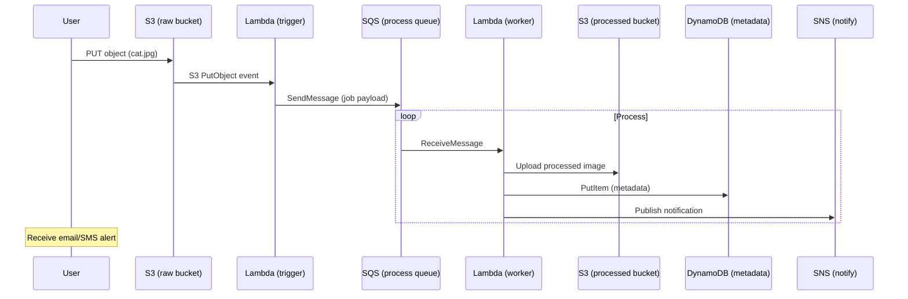

# This is actually such a fun idea 😂 I definitely want to see what kind of setups people are going to share.

## Introduction
Imagine dropping a cat picture into a bucket and watching it magically get resized, tagged, and emailed. In our early days we built a small script that ran on EC2, copying files to a network share, running ImageMagick, and uploading the result. The process was fragile—manual restarts, limited scaling, and a growing cost for idle servers. We needed a solution that could scale to zero when nothing happened, charge only for the work done, and still be observable and secure.

## Why This Matters
Manual image‑processing pipelines are brittle and expensive. They force you to over‑provision compute, manage patching, and deal with downtime. A serverless, event‑driven design lets you focus on the business logic while the cloud provider handles scaling, retries, and monitoring. Teams that adopt this pattern spend less time on infrastructure maintenance and more time iterating on features.

## How It Works
The pipeline reacts to an S3 object creation event, throttles the rate of work with a queue, processes images in parallel, stores metadata, and notifies stakeholders when the job finishes. Below is a sequence diagram that captures the flow.



## Core Concepts
- **Event‑driven architecture** – S3 notifications drive the workflow, keeping services loosely coupled.  
- **Idempotent processing** – The worker checks a deduplication key (e.g., image hash) before applying transformations, preventing duplicate work.  
- **Throttling with SQS** – A standard queue smooths bursts and respects rate limits for downstream workers.  
- **Dead‑Letter Queue (DLQ)** – Failed messages are diverted after a configurable number of retries, giving ops a clear view of errors.  
- **Least‑privilege IAM** – Each Lambda role only has permissions needed for its specific actions (read raw S3, write processed S3, write DynamoDB, publish SNS).  

## Examples & Code Walkthrough
Below is a complete, production‑ready Terraform configuration that spins up the pipeline. All resources are created in a single VPC with private subnets to keep traffic internal.

```hcl
# main.tf
terraform {
  required_version = ">= 1.0"
  required_providers {
    aws = {
      source  = "hashicorp/aws"
      version = "~> 5.0"
    }
  }
}

provider "aws" {
  region = var.aws_region
}

# Variables
variable "aws_region" {
  description = "AWS region to deploy resources"
  type        = string
  default     = "us-east-1"
}
variable "project_name" {
  description = "Prefix for all resource names"
  type        = string
  default     = "imgproc"
}
variable "lambda_bucket" {
  description = "S3 bucket for Lambda deployment packages"
  type        = string
  default     = ""
}

# S3 buckets
resource "aws_s3_bucket" "raw_images" {
  bucket = "${var.project_name}-raw"
  acl    = "private"
  versioning {
    enabled = true
  }
  lifecycle_rule {
    id      = "expire_old_versions"
    enabled = true
    transition {
      days          = 30
      storage_class = "STANDARD_IA"
    }
    expiration {
      days = 90
    }
  }
}

resource "aws_s3_bucket" "processed_images" {
  bucket = "${var.project_name}-processed"
  acl    = "public-read"
  versioning {
    enabled = true
  }
}

# SQS queue with visibility timeout and dead‑letter configuration
resource "aws_sqs_queue" "process_queue" {
  name                     = "${var.project_name}-process"
  visibility_timeout_seconds = 300
  message_retention_seconds = 1209600 # 14 days
  receive_wait_time_seconds = 5
}

resource "aws_sqs_queue_policy" "process_queue_policy" {
  queue_url = aws_sqs_queue.process_queue.id
  policy    = jsonencode({
    Version = "2012-10-17"
    Statement = [
      {
        Effect    = "Allow"
        Principal = "*"
        Action    = "sqs:SendMessage"
        Resource  = aws_sqs_queue.process_queue.arn
        Condition = {
          ArnEquals = {
            "aws:SourceArn" = aws_s3_bucket.raw_images.arn
          }
        }
      }
    ]
  })
}

# DynamoDB table for metadata
resource "aws_dynamodb_table" "image_meta" {
  name           = "${var.project_name}-meta"
  billing_mode   = "PAY_PER_REQUEST"
  hash_key       = "image_id"
  attribute {
    name = "image_id"
    type = "S"
  }
  attribute {
    name = "status"
    type = "S"
  }
  global_secondary_index {
    name     = "StatusIndex"
    hash_key = "status"
    projection_type = "ALL"
  }
}

# SNS topic for notifications
resource "aws_sns_topic" "notify_ops" {
  name = "${var.project_name}-notify"
}

resource "aws_sns_topic_subscription" "email_sub" {
  topic_arn = aws_sns_topic.notify_ops.arn
  protocol  = "email"
  endpoint  = var.notification_email
}

# IAM role for the trigger Lambda
resource "aws_iam_role" "lambda_trigger" {
  name = "${var.project_name}-lambda-trigger"
  assume_role_policy = jsonencode({
    Version = "2012-10-17"
    Statement = [{
      Action = "sts:AssumeRole"
      Effect = "Allow"
      Principal = {
        Service = "lambda.amazonaws.com"
      }
    }]
  })
}

resource "aws_iam_role_policy_attachment" "lambda_trigger_basic" {
  role       = aws_iam_role.lambda_trigger.name
  policy_arn = "arn:aws:iam::aws:policy/service-role/AWSLambdaBasicExecutionRole"
}

resource "aws_iam_policy" "lambda_trigger_custom" {
  name = "${var.project_name}-trigger-custom"
  policy = jsonencode({
    Version = "2012-10-17"
    Statement = [
      {
        Effect   = "Allow"
        Action   = ["s3:GetObject"]
        Resource = "${aws_s3_bucket.raw_images.arn}/*"
      },
      {
        Effect   = "Allow"
        Action   = ["sqs:SendMessage"]
        Resource = aws_sqs_queue.process_queue.arn
      }
    ]
  })
}

resource "aws_iam_role_policy_attachment" "lambda_trigger_custom" {
  role       = aws_iam_role.lambda_trigger.name
  policy_arn = aws_iam_policy.lambda_trigger_custom.arn
}

# IAM role for the worker Lambda
resource "aws_iam_role" "lambda_worker" {
  name = "${var.project_name}-lambda-worker"
  assume_role_policy = jsonencode({
    Version = "2012-10-17"
    Statement = [{
      Action = "sts:AssumeRole"
      Effect = "Allow"
      Principal = {
        Service = "lambda.amazonaws.com"
      }
    }]
  })
}

resource "aws_iam_role_policy_attachment" "lambda_worker_basic" {
  role       = aws_iam_role.lambda_worker.name
  policy_arn = "arn:aws:iam::aws:policy/service-role/AWSLambdaBasicExecutionRole"
}

resource "aws_iam_policy" "lambda_worker_custom" {
  name = "${var.project_name}-worker-custom"
  policy = jsonencode({
    Version = "2012-10-17"
    Statement = [
      {
        Effect   = "Allow"
        Action   = ["sqs:ReceiveMessage", "sqs:DeleteMessage", "sqs:GetQueueAttributes"]
        Resource = aws_sqs_queue.process_queue.arn
      },
      {
        Effect   = "Allow"
        Action   = ["s3:PutObject"]
        Resource = "${aws_s3_bucket.processed_images.arn}/*"
      },
      {
        Effect   = "Allow"
        Action   = ["dynamodb:PutItem", "dynamodb:UpdateItem"]
        Resource = aws_dynamodb_table.image_meta.arn
      },
      {
        Effect   = "Allow"
        Action   = ["sns:Publish"]
        Resource = aws_sns_topic.notify_ops.arn
      }
    ]
  })
}

resource "aws_iam_role_policy_attachment" "lambda_worker_custom" {
  role       = aws_iam_role.lambda_worker.name
  policy_arn = aws_iam_policy.lambda_worker_custom.arn
}

# Deploy Lambda code (placeholder for real zip)
resource "aws_s3_bucket" "lambda_code" {
  bucket = var.lambda_bucket
  force_destroy = true
}

resource "aws_lambda_function" "trigger" {
  function_name = "${var.project_name}-trigger"
  role          = aws_iam_role.lambda_trigger.arn
  runtime       = "python3.11"
  handler       = "trigger.lambda_handler"
  timeout       = 60
  memory_size   = 256

  # Package code inline for readability – in production use a separate zip
  filename      = data.archive_file.trigger.output_path
  source_code_hash = data.archive_file.trigger.output_base64sha256

  environment {
    variables = {
      QUEUE_URL = aws_sqs_queue.process_queue.id
    }
  }
}

data "archive_file" "trigger" {
  type        = "zip"
  source_file = "trigger.py"
  output_path = "${path.module}/trigger.zip"
}

# Worker Lambda
resource "aws_lambda_function" "worker" {
  function_name = "${var.project_name}-worker"
  role          = aws_iam_role.lambda_worker.arn
  runtime       = "python3.11"
  handler       = "worker.lambda_handler"
  timeout       = 300
  memory_size   = 512

  filename      = data.archive_file.worker.output_path
  source_code_hash = data.archive_file.worker.output_base64sha256

  environment {
    variables = {
      PROCESSED_BUCKET = aws_s3_bucket.processed_images.id
      TABLE_NAME       = aws_dynamodb_table.image_meta.name
      SNS_TOPIC        = aws_sns_topic.notify_ops.arn
    }
  }
}

data "archive_file" "worker" {
  type        = "zip"
  source_file = "worker.py"
  output_path = "${path.module}/worker.zip"
}
```

### Trigger Lambda (`trigger.py`)
```python
import json
import os
import boto3
from urllib.parse import unquote_plus

sqs = boto3.client('sqs')
QUEUE_URL = os.environ['QUEUE_URL']

def lambda_handler(event, context):
    # Process S3 event records
    for record in event.get('Records', []):
        bucket = record['s3']['bucket']['name']
        key    = unquote_plus(record['s3']['object']['key'])
        # Deduplicate by image hash (simplified: use key + last modified)
        message_body = json.dumps({
            'bucket': bucket,
            'key':    key,
            'event_id': record['eventID']
        })
        try:
            sqs.send_message(
                QueueUrl=QUEUE_URL,
                MessageBody=message_body,
                MessageDeduplicationId=record['eventID'],
                MessageGroupId=bucket   # keep same bucket in same group
            )
        except Exception as e:
            # Log and re‑raise to trigger DLQ after retries
            print(f"Failed to send to SQS: {e}")
            raise
    return {'statusCode': 200, 'body': 'Queued'}
```

### Worker Lambda (`worker.py`)
```python
import json
import os
import boto3
import uuid
from PIL import Image
from datetime import datetime

s3 = boto3.client('s3')
dynamodb = boto3.resource('dynamodb')
sns = boto3.client('sns')

PROCESSED_BUCKET = os.environ['PROCESSED_BUCKET']
TABLE_NAME = os.environ['TABLE_NAME']
SNS_TOPIC = os.environ['SNS_TOPIC']

TABLE = dynamodb.Table(TABLE_NAME)

def dedup_key(image_hash):
    # Simple dedup: query by hash attribute
    resp = TABLE.get_item(Key={'image_id': image_hash})
    return 'Item' in resp

def process_image(bucket, key):
    # Download, resize, convert to webp
    tmp_key = f"/tmp/{uuid.uuid4().hex}.original"
    s3.download_file(bucket, key, tmp_key)

    with Image.open(tmp_key) as img:
        # Resize to max 1024px on the longer side, preserve aspect ratio
        img.thumbnail((1024, 1024))
        out_path = f"/tmp/{uuid.uuid4().hex}.webp"
        img.convert('RGB').save(out_path, format='WEBP', quality=85)

    processed_key = key.replace('raw/', 'processed/') if 'raw/' in key else f"processed/{key}"
    s3.upload_file(out_path, PROCESSED_BUCKET, processed_key)
    return processed_key

def lambda_handler(event, context):
    messages = []
    for record in event['Records']:
        body = json.loads(record['body'])
        messages.append(body)

    results = []
    for msg in messages:
        bucket = msg['bucket']
        key    = msg['key']
        image_hash = msg['event_id']   # using event id as simple hash

        if dedup_key(image_hash):
            print(f"Skipping duplicate {key}")
            continue

        try:
            processed_key = process_image(bucket, key)
            # Store metadata
            TABLE.put_item(
                Item={
                    'image_id': image_hash,
                    'original_bucket': bucket,
                    'original_key': key,
                    'processed_key': processed_key,
                    'status': 'SUCCESS',
                    'created_at': datetime.utcnow().isoformat()
                }
            )
            # Notify
            sns.publish(
                TopicArn=SNS_TOPIC,
                Subject=f"Image processed: {key}",
                Message=json.dumps({'status': 'SUCCESS', 'processed': processed_key})
            )
            results.append({'key': key, 'status': 'processed'})
        except Exception as e:
            #
