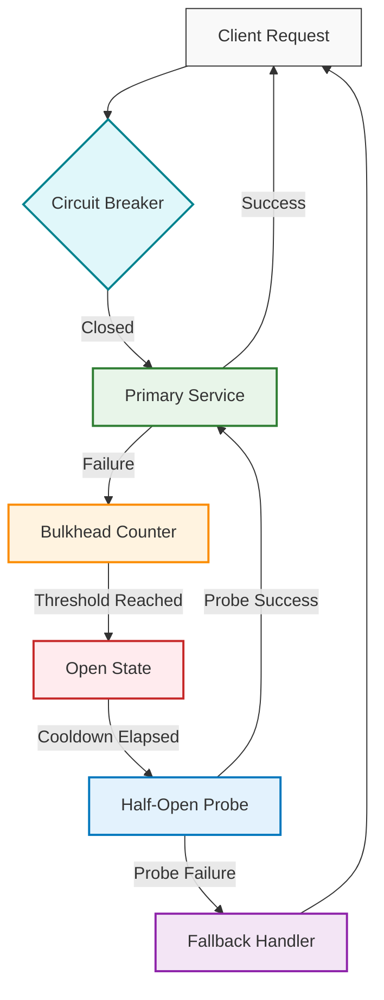

# Un fallo, un éxito

## Introduction

Modern cloud systems are engineered to sustain improbable levels of availability. Service-level objectives target four nines, sometimes five. Yet the gap between design intent and runtime reality often stems from how failure is handled when it inevitably arrives. This article examines a real-world failure cascade in a multi-region cloud deployment, extracts the architectural lessons, and presents a resilience pattern that turns outage data into a design asset.

From my team’s production experience, the most instructive incidents aren’t the ones where everything breaks at once—they’re the ones where a single dependency drags down the entire stack because the surrounding architecture lacked isolation. We’ll walk through the mechanics of that amplification, then rebuild the stack using principles that embrace, rather than fear, failure.

## Why This Matters

Software engineers and architects lose sleep over latency spikes, cost optimization, and feature velocity. Outage preparedness often ranks lower until it doesn’t. When a database failover takes down an API gateway, the impact is immediate: user-facing errors, revenue loss, and on-call burnout.

In our own cluster, a misconfigured sync between two regions triggered a chain reaction that lasted forty-five minutes. The root cause wasn’t the cloud provider; it was a lack of circuit isolation and an assumption that horizontal scaling would absorb any load shift. This pattern repeats across industries: a single synchronous call, unguarded, becomes a bottleneck; that bottleneck triggers backpressure; backpressure propagates upstream; and the system collapses under its own weight.

Understanding how to contain failure at the boundary is not a nice-to-have. It is the difference between a service that recovers in seconds and one that requires a full incident review.

## How It Works

The core mechanism we’ll explore is the graceful degradation pipeline. Instead of designing for a failure-free environment, we design for fault isolation. The pattern relies on three primitives: bulkheads, circuit breakers, and eventual consistency boundaries.

Below is a mermaid flowchart visualizing the request path through these layers:



**Step-by-step technical breakdown:**

1. **Closed state** – All traffic flows to the primary service. Failure counters reset on successful responses.
2. **Failure accumulation** – Each error increments a bounded counter. When the threshold is crossed, the state transitions to open.
3. **Open state** – incoming requests are immediately routed to a fallback. No downstream calls are attempted.
4. **Half-open probe** – After a cooldown period, a single probe request tests service health. If it succeeds, normal flow resumes; if it fails, the circuit stays open and a fallback is served.
5. **Fallback handler** – Returns a cached response, degraded functionality, or a static “unavailable” page, ensuring the client always receives a valid HTTP response.

This loop executes in milliseconds and requires no external coordination, making it suitable for high-throughput, low-latency environments.

## Core Concepts

Three concepts underpin the pattern described above:

- **Bulkheads** – Inspired by ship compartmentalization, a bulkhead isolates a subset of resources (thread pool, connection pool, CPU quota) to a specific code path. If one bulkhead exhausts its quota, others remain unaffected. In practice, this means limiting concurrent database connections per microservice rather than sharing a global pool.

- **Circuit breakers** – A stateful proxy that monitors call outcomes and short-circuits unhealthy dependencies. The breaker’s state machine (closed → open → half-open → closed) prevents cascading failures and gives failing services time to recover.

- **Eventual consistency boundaries** – By accepting that not all data must be fresh at all times, we can route read traffic to stale but available replicas during partitions. This keeps the broader system operational while a master database recovers.

These principles do not eliminate failure; they redistribute its impact so that the overall system remains functional.

## Examples & Code Walkthrough

The following Node.js module implements a circuit breaker with bulkhead sizing and a configurable fallback. It is designed for an HTTP microservice that calls an external inventory service.

```javascript
// resilience/circuit-breaker.js
// Production-grade circuit breaker with bulkhead isolation and fallback

const DEFAULT_THRESHOLD = 5;
const DEFAULT_COOLDOWN_MS = 30_000;
const DEFAULT_BULKHEAD_SIZE = 20;

class CircuitBreaker {
  constructor({
    name,
    failureThreshold = DEFAULT_THRESHOLD,
    cooldownMs = DEFAULT_COOLDOWN_MS,
    bulkheadSize = DEFAULT_BULKHEAD_SIZE,
    fallback
  } = {}) {
    this.name = name;
    this.failureThreshold = failureThreshold;
    this.cooldownMs = cooldownMs;
    this.bulkheadSize = bulkheadSize;
    this.fallback = fallback || this.defaultFallback;
    this.failureCount = 0;
    this.state = 'closed'; // closed | open | half-open
    this.lastFailureTime = null;
    this.successCount = 0;
  }

  async execute(fn) {
    // Bulkhead: reject if concurrency limit reached
    if (this.currentConcurrency >= this.bulkheadSize) {
      return this.fallback(new Error('Bulkhead saturated'));
    }
    this.currentConcurrency += 1;

    try {
      const result = await fn();
      this.onSuccess();
      return result;
    } catch (err) {
      this.onFailure(err);
      return this.fallback(err);
    } finally {
      this.currentConcurrency -= 1;
    }
  }

  onSuccess() {
    if (this.state === 'half-open') {
      this.successCount += 1;
      if (this.successCount >= 3) {
        this.close();
      }
    } else {
      this.failureCount = 0;
    }
  }

  onFailure(err) {
    this.failureCount += 1;
    this.lastFailureTime = Date.now();

    if (this.failureCount >= this.failureThreshold && this.state !== 'open') {
      this.open();
    } else if (this.state === 'half-open') {
      this.open(); // probe failed, revert to open
    }
  }

  open() {
    this.state = 'open';
    this.successCount = 0;
    // Schedule auto-recovery after cooldown
    setTimeout(() => this.transitionToHalfOpen(), this.cooldownMs);
  }

  transitionToHalfOpen() {
    this.state = 'half-open';
    this.successCount = 0;
  }

  close() {
    this.state = 'closed';
    this.failureCount = 0;
  }

  defaultFallback(err) {
    return {
      error: err.message,
      status: 503,
      data: null,
      timestamp: new Date().toISOString()
    };
  }
}

module.exports = CircuitBreaker;
```

**Usage example in an Express route:**

```javascript
const express = require('express');
const CircuitBreaker = require('./circuit-breaker');

const inventoryBreaker = new CircuitBreaker({
  name: 'inventory-service',
  failureThreshold: 3,
  cooldownMs: 15_000,
  bulkheadSize: 10,
  fallback: (err) => ({
    error: err.message,
    status: 503,
    data: { available: false },
    timestamp: new Date().toISOString()
  })
});

const app = express();

app.get('/product/:id', async (req, res) => {
  const { id } = req.params;

  const result = await inventoryBreaker.execute(async () => {
    // Simulate external HTTP call
    const response = await fetch(`https://api.example.com/inventory/${id}`);
    if (!response.ok) throw new Error(`Inventory API ${response.status}`);
    return await response.json();
  });

  res.json(result);
});

app.listen(3000, () => console.log('API listening on port 3000'));
```

In this setup, if the inventory service begins returning errors, the breaker opens after three failures. Subsequent requests receive the fallback payload instantly, without waiting for timeouts or retries. The bulkhead limit of ten concurrent calls prevents a surge from exhausting the process’s connection pool.

## Best Practices

- **Size bulkheads to your SLA, not your peak load.** A bulkhead that is too large defeats isolation; one that is too small unnecessarily rejects traffic. Profile your service’s concurrent request profile under load and set the limit just above the 95th-percentile concurrency.
- **Expose breaker metrics.** Integration with Prometheus or cloud-native observability platforms allows you to visualize state transitions, failure rates, and recovery times. Without metrics, a circuit breaker is a black box that you only discover during an incident.
- **Pair fallbacks with circuit breakers, not replace them.** A fallback that returns an empty payload is worse than one that returns a degraded but useful response. Design your fallback to preserve as much context as possible—cache keys, partial results, user preferences.
- **Test state transitions deliberately.** Write tests that force the breaker open, verify that fallbacks are served, then confirm that the half-open probe recovers the circuit. Treat the breaker as production code
