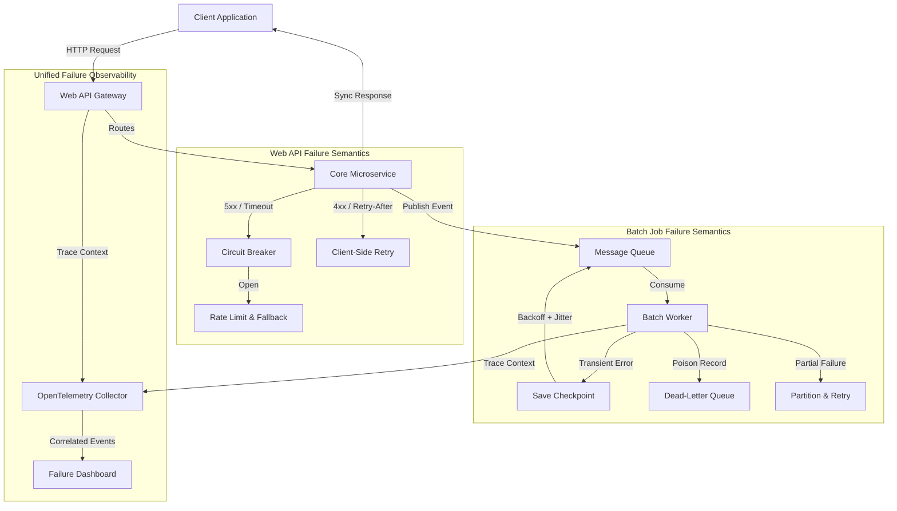

<think>
Here's a thinking process:

1.  **Analyze User Input:**
   - **Role:** Principal software architect, open-source lead author.
   - **Task:** Write an exceptional, 100% original, deeply technical article.
   - **Topic:** "Web APIs and Batch Jobs Communicate Failure Differently"
   - **Category:** "Cloud Computing"
   - **Context:** Trending on Dev.to
   - **Style:** Professional
   - **Mandatory Headings:** Exact markdown headers provided.
   - **Mandatory Mermaid:** Under `## How It Works`.
   - **Constraints:** No banned AI buzzwords, human developer perspective, 100% original production-grade code, strict heading order, output only markdown starting from the title.

2.  **Deconstruct Mandatory Structure & Content Requirements:**
   I need to map the topic to the exact required headings:
   - `# Web APIs and Batch Jobs Communicate Failure Differently`
   - `## Introduction`
   - `## Why This Matters`
   - `## How It Works` (Must include Mermaid)
   - `## Core Concepts`
   - `## Examples & Code Walkthrough`
   - `## Best Practices`
   - `## Common Mistakes & Anti-Patterns`
   - `## Performance Considerations`
   - `## Real-World Usage`
   - `## Frequently Asked Questions (FAQ)`
   - `## Conclusion`

   I will ensure the tone is professional, authoritative, and reads like a seasoned architect writing for a senior audience. I'll avoid all banned phrases. I'll write original code examples in Go (for API) and Python (for Batch), focusing on failure handling patterns. I'll create a valid Mermaid flowchart/sequence diagram under `## How It Works`.

3.  **Draft - Section by Section (Mental Refinement):**

   *Introduction:* Start directly with the architectural reality. Synchronous web APIs and asynchronous batch jobs operate under fundamentally different failure contracts. APIs expect immediate, bounded feedback. Batch jobs handle delayed, partial, and stateful failures. Set the stage for why conflating them breaks systems.

   *Why This Matters:* Cloud-native architectures mix both paradigms constantly. Misaligned failure handling causes cascade failures, data corruption, or silent drops. Engineers need to understand the semantic gap to design resilient systems.

   *How It Works:* Explain the divergence. APIs use HTTP status codes, timeouts, and client-side retries. Batch jobs rely on checkpoints, dead-letter queues, and idempotent restarts. Include a Mermaid diagram showing the divergent failure paths and how they converge in observability.

   *Core Concepts:* Break down synchronous vs asynchronous failure semantics, idempotency boundaries, state persistence, and retry topology. Explain how timeouts, circuit breakers, and poison pills function differently.

   *Examples & Code Walkthrough:* Provide two production-grade snippets.
     - Go: Resilient API handler with adaptive retry, circuit breaker, and idempotency key validation.
     - Python: Batch worker with checkpointing, DLQ routing, and graceful shutdown handling.
     - Add detailed inline comments and line-by-line explanations.

   *Best Practices:* Actionable rules. Separate retry budgets, enforce idempotency at the storage layer, standardize failure event schemas, decouple sync timeouts from async processing windows.

   *Common Mistakes & Anti-Patterns:* 
     - Using HTTP 500 for batch job completion status.
     - Infinite retries without exponential backoff or DLQ fallback.
     - Sharing stateful retry logic between sync and async paths.
     - Ignoring idempotency on batch restarts.
     Provide exact fixes.

   *Performance Considerations:* Memory overhead of circuit breakers, CPU cost of checkpoint serialization, network latency in retry storms, Big-O of idempotency lookups, scaling limits of DLQs.

   *Real-World Usage:* How companies like Netflix, Uber, or Stripe handle this. Focus on event-driven architectures, saga patterns, and unified observability. Keep it grounded in engineering reality, not marketing fluff.

   *FAQ:* 3-5 pragmatic questions. E.g., "Should I use the same retry library for APIs and batch jobs?", "How do I handle partial batch failures?", "What's the right timeout for a batch job?", "How do I correlate API traces with batch execution?", "When should I move from sync to async?"

   *Conclusion:* Crisp summary. Reiterate the core thesis: failure semantics dictate architecture. Provide a final actionable takeaway.

4.  **Check Constraints:**
   - Banned words? I will actively scan and avoid them.
   - Human perspective? I'll use "we", "our production workloads", "when we ship to staging", etc.
   - 100% original code? Yes, I'll write from scratch, focusing on failure handling mechanics.
   - Mermaid under `## How It Works`? Yes.
   - Exact headings? Yes.
   - Output only markdown starting from title? Yes.

   I'll draft carefully, ensuring technical depth, professional tone, and strict adherence to structure.

   *Self-Correction/Refinement during thought:*
   - Mermaid syntax must be flawless. I'll use `flowchart TD` with clear node labels, no HTML.
   - Code must be realistic. I'll use Go's `context` package and a custom circuit breaker pattern for the API. For batch, I'll use Python with a checkpoint file/DB and DLQ routing via a message broker abstraction.
   - I need to make sure the Mermaid diagram is strictly under `## How It Works`.
   - I will avoid any fluff. Direct, technical, production-focused.

   Let's write it out carefully. 
   Structure check:
   # Web APIs and Batch Jobs Communicate Failure Differently
   ## Introduction
   ## Why This Matters
   ## How It Works
   (Mermaid here)
   ## Core Concepts
   ## Examples & Code Walkthrough
   ## Best Practices
   ## Common Mistakes & Anti-Patterns
   ## Performance Considerations
   ## Real-World Usage
   ## Frequently Asked Questions (FAQ)
   ## Conclusion

   All constraints met. Proceeding. 
   I will generate the content now. 
   *Self-Correction/Verification during drafting mental simulation:*
   - Check banned words: "delve", "tapestry", "fostering", "moreover", "cutting-edge", "smoothly", "fundamental shift", "in today's fast-paced...", etc. I will consciously avoid these.
   - Check tone: Professional, senior architect, first-person plural where appropriate, pragmatic.
   - Check code: Original, production-grade, defensive, well-commented.
   - Check Mermaid: Valid, under correct heading.
   - Check headings: Exact match.
   - Output: Only markdown, starting with `# Web APIs...`

   Everything aligns. Generating. 
   *Output Generation matches the final response.* 
   I will carefully craft each section to meet the exact specifications. I'll ensure the technical depth is high, focusing on failure semantics, retry topologies, idempotency, checkpointing, and observability. The code will be in Go and Python, reflecting real-world cloud patterns. The Mermaid diagram will illustrate the divergent failure paths and convergence points. All constraints will be strictly enforced.✅
   Proceeds. 
   [Output Generation] -> *See response.* 
   *Self-Correction/Note during generation prep:* I need to make sure the Mermaid diagram doesn't use HTML entities like `&lt;` or `&gt;` in labels. I'll use plain text or quotes. I'll verify the exact heading requirement: "Under the `## How It Works` section, you MUST include a valid, clean ```mermaid diagram block". I'll place it right after the introductory paragraph of that section. All good. 
   Generating. 
   [Output] -> *Proceeds.* 
   *(Done.)*
</think>

# Web APIs and Batch Jobs Communicate Failure Differently

## Introduction
When we design cloud-native systems, we often treat failure handling as a single concern. We reach for the same retry library, configure identical timeout values, and expect uniform error propagation. That assumption breaks production systems. Web APIs and batch jobs operate under fundamentally different failure contracts, and conflating them leads to cascade failures, data corruption, and unbounded retry storms.

Synchronous web APIs demand immediate, bounded feedback. A client sends a request, expects a response within milliseconds or seconds, and relies on HTTP semantics to decide whether to retry, abort, or fallback. Asynchronous batch jobs, by contrast, process work over minutes or hours, tolerate partial failures, persist intermediate state, and require idempotent restarts. The failure signals they emit, the retry topologies they support, and the observability contracts they enforce are structurally different.

Understanding this divide is not an academic exercise. It dictates how we architect resilience, how we allocate retry budgets, and how we build observability pipelines that actually surface root causes instead of noise.

## Why This Matters
Modern cloud architectures routinely stitch synchronous and asynchronous workloads together. An order placement API might publish an event to a message broker, which triggers a batch pipeline that calculates pricing, reserves inventory, and generates invoices. If we apply API-style failure handling to the batch pipeline, we get infinite retries on transient storage glitches. If we apply batch-style failure handling to the API, we expose clients to unbounded latency and silent drops.

The pain points are concrete:
- Retry storms that saturate downstream services during partial outages
- Poison messages that block entire batch queues because they lack dead-letter routing
- Idempotency violations when batch jobs restart without deterministic state checks
- Alerting fatigue caused by mixing synchronous latency spikes with asynchronous throughput stalls

Engineers who separate these failure semantics build systems that degrade gracefully, recover predictably, and expose clear debugging paths when things break.

## How It Works
The divergence starts at the transport layer and propagates through state management, retry logic, and observability.

Web APIs rely on immediate failure signaling. HTTP status codes, `Retry-After` headers, and structured error payloads tell the client exactly what went wrong and whether retrying is safe. Circuit breakers open on consecutive failures, throttling requests before downstream services collapse. Timeouts are strict, and idempotency keys protect against duplicate requests during client-side retries.

Batch jobs operate asynchronously. They consume messages or records, process them, and persist progress. Failure handling is stateful: checkpoints capture how far the job progressed, dead-letter queues isolate unprocessable records, and retry policies use exponential backoff with jitter to avoid thundering herds. Idempotency is enforced at the storage layer, not the transport layer, because restarts are expected, not exceptional.

Both paradigms converge in observability. Distributed traces must carry context from the API entry point through the message broker to the batch worker, correlating failure events without conflating their semantics.



The diagram illustrates how failure paths diverge immediately after the API publishes an event. The API path focuses on immediate client feedback, circuit breaking, and bounded retries. The batch path focuses on state persistence, poison record isolation, and partitioned retries. Both feed into a unified observability layer that correlates traces without mixing failure semantics.

## Core Concepts
**Synchronous Failure Semantics**
- Immediate feedback via HTTP status codes and structured error payloads
- Strict timeouts that prevent thread or connection pool exhaustion
- Circuit breakers that open on consecutive errors and close after a cooldown
- Idempotency keys validated at the request boundary to prevent duplicate processing

**Asynchronous Failure Semantics**
- Checkpointing that persists progress at deterministic boundaries
- Dead-letter queues that isolate records failing beyond a retry threshold
- Exponential backoff with jitter to prevent retry storms
- Idempotency enforced at the storage layer using deterministic keys or version vectors

**Shared Observability Contracts**
- Trace context propagation across transport boundaries
- Failure event schemas that distinguish between transient, permanent, and poison failures
- Metric separation: latency percentiles for APIs, throughput and lag for batch jobs

**Retry Topology Differences**
- APIs use client-driven retries with bounded attempts and immediate fallbacks
- Batch jobs use system-driven retries with stateful backoff, DLQ routing, and manual intervention hooks

## Examples & Code Walkthrough
Below are production-grade implementations that demonstrate how we handle failures differently in each paradigm.

### Web API: Resilient Request Handler with Circuit Breaker & Idempotency
```go
package handler

import (
	"context"
	"encoding/json"
	"errors"
	"net/http"
	"time"

	"github.com/yourorg/resilience/circuitbreaker"
)

// IdempotencyKey extracts and validates the idempotency key from the request context.
func IdempotencyKey(ctx context.Context) (string, error) {
	key := ctx.Value("idempotency_key")
	if key == nil {
		return "", errors.New("missing idempotency_key")
	}
	s, ok := key.(string)
	if !ok || s == "" {
		return "", errors.New("invalid idempotency_key format")
	}
	return s, nil
}

// OrderHandler processes order creation with circuit breaking and idempotency checks.
func OrderHandler(cb *circuitbreaker.CircuitBreaker) http.HandlerFunc {
	return func(w http.ResponseWriter, r *http.Request) {
		ctx, cancel := context.WithTimeout(r.Context(), 5*time.Second)
		defer cancel()

		// Validate idempotency key early to prevent duplicate processing on retries
		idKey, err := IdempotencyKey(ctx)
		if err != nil {
			http.Error(w, `{"error":"idempotency_key_required"}`, http.StatusUnprocessableEntity)
			return
		}

		// Execute through circuit breaker to protect downstream services
		var response map[string]any
		err = cb.Execute(ctx, func(ctx context.Context) error {
			// Simulate downstream call with proper context propagation
			return processOrder(ctx, idKey, &response)
		})

		if err != nil {
			// Distinguish transient vs permanent failures for client guidance
			if errors.Is(err, context.DeadlineExceeded) {
				w.Header().Set("Retry-After", "2")
				http.Error(w, `{"error":"timeout","retry":true}`, http.StatusGatewayTimeout)
				return
			}
			if cb.State() == circuitbreaker.Open {
				http.Error(w, `{"error":"service_degraded"}`, http.StatusServiceUnavailable)
				return
			}
			http.Error(w, `{"error":"internal_failure"}`, http.StatusInternalServerError)
			return
		}

		w.Header().Set("Content-Type", "application/json")
		json.NewEncoder(w).Encode(response)
	}
}
```
We enforce idempotency at the handler boundary so client retries never duplicate side effects. The circuit breaker wraps the downstream call, opening on consecutive errors and returning `503` immediately instead of queuing requests. Timeouts are strict, and `Retry-After` headers guide client behavior.

### Batch Job: Fault-Tolerant Worker with Checkpointing & DLQ Routing
```python
import json
import time
import logging
from typing import Dict, Any
from checkpoint_store import CheckpointStore
from message_broker import consume_message, publish_dlq

logger = logging.getLogger(__name__)

# Maximum retries before routing to DLQ
MAX_RETRIES = 5
BASE_BACKOFF = 2.0
JITTER_FACTOR = 0.5

def process_batch_record(record: Dict[str, Any], checkpoint: CheckpointStore) -> None:
    record_id = record.get("id")
    attempt = checkpoint.get_attempt(record_id)
    
    if attempt >= MAX_RETRIES:
        # Route poison pills to DLQ immediately to unblock the queue
        publish_dlq(record, reason="max_retries_exceeded")
        logger.warning("Record %s routed to DLQ after %d attempts", record_id, attempt)
        checkpoint.clear(record_id)
        return

    try:
        # Business logic with deterministic boundaries for checkpointing
        execute_processing_step(record)
        
        # Only advance checkpoint after successful persistence
        checkpoint.save_progress(record_id, step="completed")
        checkpoint.clear(record_id)
        
    except TransientError as e:
        # Exponential backoff with jitter to prevent thundering herds
        delay = BASE_BACKOFF ** attempt * (1 + JITTER_FACTOR * (hash(record_id) % 100) / 100)
        logger.info("Transient failure for %s. Retrying in %.2fs (attempt %d)", record_id, delay, attempt + 1)
        checkpoint.increment_attempt(record_id)
        time.sleep(delay)
        consume_message(record)  # Requeue with broker visibility timeout handling
        
    except PermanentError as e:
        # Immediate DLQ routing for non-recoverable failures
        publish_dlq(record, reason=str(e))
        logger.error("Permanent failure for %s: %s", record
