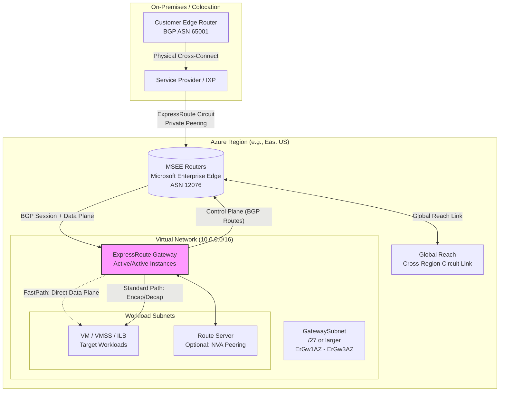

# Azure ExpressRoute Gateway

## Introduction

Hybrid connectivity is where cloud migrations either succeed or stall. You can lift-and-shift VMs all day, but if the network path between your on-premises data center and Azure regions introduces jitter, unpredictable latency, or compliance violations, the project stalls. Azure ExpressRoute Gateway is the control plane and data plane anchor for dedicated private connectivity. It terminates the circuits coming from your colocation provider or ISP, enforces routing policy, and bridges your virtual networks to the Microsoft Enterprise Edge (MSEE) routers—without ever touching the public internet.

This isn't just a VPN termination point. It's a managed Layer 3 router with programmable SKUs, BGP communities for traffic engineering, and a fast path option that bypasses the gateway VM entirely for data plane traffic. Understanding its internals is the difference between a hybrid architecture that scales and one that melts down during a failover event.

## Why This Matters

Most teams treat ExpressRoute as "plumbing"—request the circuit, hand the service key to the network team, peer the gateway, move on. That works until it doesn't.

*   **Predictable Latency:** Public internet routing changes daily. ExpressRoute gives you a deterministic AS path. For latency-sensitive workloads—sync replication for SQL Always On, SAP HANA sync, high-frequency trading—this is non-negotiable.
*   **Data Sovereignty & Compliance:** Regulations like GDPR, HIPAA, or FedRAMP often mandate that specific data flows never traverse public IP space. The gateway enforces this at the network boundary.
*   **Throughput Ceilings:** VPN Gateways top out at 10 Gbps (VpnGw5AZ). ExpressRoute Gateways scale to 100 Gbps (ErGw3AZ) with FastPath. If you're ingesting telemetry from a factory floor or replicating petabytes to Cosmos DB, VPN is a bottleneck.
*   **Failure Domain Isolation:** When an ISP has a BGP leak or a DDoS attack saturates a public peering point, your ExpressRoute circuit remains unaffected. The gateway is the demarcation point for that isolation.

In our production environment, moving a 50 TB SQL data warehouse sync from VPN to ExpressRoute Private Peering cut the initial seed window from 14 hours to 45 minutes. The gateway SKU sizing was the only variable we changed.

## How It Works

The ExpressRoute Gateway sits inside a dedicated subnet (`GatewaySubnet`) within your Virtual Network (VNet). It connects to the Microsoft Enterprise Edge (MSEE) routers via the ExpressRoute Circuit. The MSEE is the physical demarcation point in the Azure region (or ExpressRoute Direct location).

There are two distinct data paths:

1.  **Standard Path:** Traffic hits the Gateway VM (Active/Active pair), undergoes encapsulation/decapsulation, routing lookup, and NAT (if configured), then forwards to the VNet subnet.
2.  **ExpressRoute FastPath:** The Gateway programs the host agent on the underlying host server. Traffic from the MSEE is forwarded directly to the NIC of the target VM/VMSS/Internal Load Balancer, bypassing the Gateway VM entirely. The Gateway remains the control plane (BGP peering, route advertisement) but exits the data plane.



**Step-by-Step Flow:**

1.  **Circuit Provisioning:** You order a circuit from a connectivity provider (Equinix, Megaport, Lumen, etc.) or use ExpressRoute Direct (10/100 Gbps physical ports). You receive a Service Key.
2.  **Gateway Deployment:** You deploy an `Microsoft.Network/expressRouteGateways` resource into a `GatewaySubnet`. SKU selection (Standard, HighPerformance, UltraPerformance, or Zone-Redundant `ErGw1AZ`/`ErGw2AZ`/`ErGw3AZ`) dictates throughput and route limits.
3.  **Authorization & Peering:** The circuit owner creates an Authorization Key. The VNet owner uses that key to create a `Connection` resource linking the Gateway to the Circuit. This establishes the BGP session between the Gateway and the MSEE.
4.  **Route Exchange:** 
    *   *On-prem -> Azure:* You advertise your prefixes (e.g., `192.168.10.0/24`). The Gateway learns them, adds them to the VNet's Effective Routes with `NextHopType: VirtualNetworkGateway`.
    *   *Azure -> On-prem:* The Gateway advertises the VNet address space (and any peered VNet spaces if `AllowGatewayTransit` is enabled) plus the `GatewaySubnet` prefix.
5.  **FastPath Negotiation (Optional):** If the Gateway SKU supports it (`ErGw3AZ` or `ErGwScale` units) and the target NIC has `enableAcceleratedNetworking: true`, the Gateway programs the host agent. Subsequent data packets skip the Gateway VM.

## Core Concepts

### Gateway SKUs & Scale Units
Don't guess capacity. The SKU determines the **Control Plane** limits (routes learned, BGP peers) and the **Standard Data Plane** throughput. FastPath throughput is significantly higher but requires specific SKUs.

| SKU | Max Standard Throughput | Max Routes (Control Plane) | Max BGP Connections | FastPath Support |
| :--- | :--- | :--- | :--- | :--- |
| `Standard` / `ErGw1AZ` | 1 Gbps | 4,000 | 4 | No |
| `HighPerformance` / `ErGw2AZ` | 2 Gbps | 4,000 | 8 | No |
| `UltraPerformance` / `ErGw3AZ` | 10 Gbps | 4,000 | 16 | **Yes (up to 100 Gbps)** |
| `ErGwScale` (Preview/GA specific regions) | 10 Gbps base | 20,000+ | 40+ | **Yes (up to 100 Gbps)** |

*Zone-Redundant (AZ) SKUs deploy Active/Active instances across Availability Zones automatically. Non-AZ SKUs are Active/Standby within a single zone (or non-zonal).*

### Peering Types
1.  **Private Peering:** The workhorse. Extends your on-prem network into Azure. Access to VNet resources via private IPs. Supports Global Reach.
2.  **Microsoft Peering:** Access to PaaS services (Storage, SQL, Cosmos DB, Azure Public IPs) over the private circuit. Requires NAT (your public IP pool or Microsoft's). **Does not** support Global Reach.
3.  **Public Peering (Deprecated):** Legacy. Migrate to Microsoft Peering.

### BGP Communities & Route Filtering
The MSEE tags routes with BGP Communities. You *must* filter on these.
*   `12076:51004` (Example): Region-specific routes (East US).
*   `12076:51006`: Global routes (Microsoft Peering).
*   `NO_EXPORT` / `NO_ADVERTISE`: Standard well-known communities.

We use Route Filters on Microsoft Peering to pull *only* the Azure regions we operate in. Accepting the full Microsoft Peering table (thousands of prefixes) bloats your on-prem RIB and increases convergence time.

### FastPath Architecture
This is the critical differentiator. When enabled:
1.  Gateway learns routes via BGP from MSEE.
2.  Gateway programs the **Host Agent** (running on the physical host of the target VM) with the forwarding entries.
3.  Packet arrives at MSEE -> Host Agent (via VXLAN/GENEVE overlay) -> Target VM NIC.
4.  Return traffic: VM NIC -> Host Agent -> MSEE.
The Gateway VM CPU sits idle for data plane traffic. This allows `ErGw3AZ` to push 100 Gbps while the control plane VM only handles BGP keepalives and route updates.

## Examples & Code Walkthrough

We manage this via Terraform. Below is a production-grade module snippet deploying a Zone-Redundant Gateway, enabling FastPath, configuring Private Peering, and attaching a Route Server for NVA insertion.

```hcl
# main.tf
terraform {
  required_version = ">= 1.5"
  required_providers {
    azurerm = {
      source  = "hashicorp/azurerm"
      version = "~> 3.100"
    }
  }
}

provider "azurerm" {
  features {}
  # Use Azure CLI auth or Managed Identity in CI/CD
}

module "expressroute_gateway" {
  source  = "./modules/er-gateway"
  
  # Naming convention: rg-<env>-<region>-<workload>
  resource_group_name = "rg-prod-eastus-network"
  location            = "East US"
  
  # GatewaySubnet MUST be /27 or larger (min /28 for non-prod, but /27 is hard req for AZ SKUs)
  vnet_id             = "/subscriptions/xxxx/resourceGroups/rg-prod-eastus-network/providers/Microsoft.Network/virtualNetworks/vnet-prod-eastus-hub"
  gateway_subnet_id   = "/subscriptions/xxxx/resourceGroups/rg-prod-eastus-network/providers/Microsoft.Network/virtualNetworks/vnet-prod-eastus-hub/subnets/GatewaySubnet"
  
  # ErGw3AZ is the only SKU supporting 100Gbps FastPath currently
  gateway_sku         = "ErGw3AZ" 
  
  # Enable FastPath on the gateway level (requires ErGw3AZ or ErGwScale)
  enable_fast_path    = true
  
  # Circuit details - usually passed via data source or remote state
  circuit_id          = data.azurerm_express_route_circuit.primary.id
  peering_name        = "AzurePrivatePeering"
  
  # Authorization key generated by circuit owner (separate subscription/team typically)
  authorization_key   = var.circuit_auth_key # Sensitive: pass via env var or Key Vault
  
  # Tags for cost allocation
  tags = {
    Environment = "production"
    Owner       = "platform-networking"
    CostCenter  = "cc-1001"
  }
}

# data.tf - Fetching the circuit reference (read-only for consumer subscription)
data "azurerm_express_route_circuit" "primary" {
  name                = "erc-prod-primary"
  resource_group_name = "rg-prod-network-shared"
}
```

```hcl
# modules/er-gateway/main.tf
resource "azurerm_express_route_gateway" "this" {
  name                = "ergw-${var.resource_group_name}"
  resource_group_name = var.resource_group_name
  location            = var.location
  
  # SKU determines performance envelope. ErGw3AZ = Zone Redundant, 10Gbps Std / 100Gbps FastPath
  sku = {
    name = var.gateway_sku
    tier = "Standard" # "Standard" is the only tier for ER Gateways currently
  }
  
  # Enable FastPath capability on the gateway resource itself
  allow_fast_path = var.enable_fast_path
  
  tags = var.tags
}

# The Connection resource binds the Gateway to a specific Circuit Peering
resource "azurerm_express_route_gateway_connection" "private_peering" {
  name                    = "conn-${var.resource_group_name}-private"
  express_route_gateway_id = azurerm_express_route_gateway.this.id
  peering_id              = "${var.circuit_id}/peerings/${var.peering_name}"
  authorization_key       = var.authorization_key
  
  # Routing configuration
  routing_configuration {
    # Advertise the VNet prefixes (and peered VNets if transit enabled) to on-prem
    associated_route_table_id = "" # Use default gateway route table
    propagated_route_table_ids = [] 
    # Labels allow Route Maps / Policies on the Gateway (Advanced)
    labels = ["primary-dc"]
  }
  
  # Critical: Define BGP Peering settings if non-default
  # Default ASN is 65515. Override if you need specific ASN for on-prem policy.
  # bgp_peering_address = "10.0.0.4" # Usually auto-assigned from GatewaySubnet
  
  depends_on = [azurerm_express_route_gateway.this]
  
  # Timeouts: Circuit provisioning/association can take 15-20 mins
  timeouts {
    create = "30m"
    update = "20m"
    delete = "30m"
  }
}

# Optional: Route Server for NVA Integration (Firewall, SD-WAN)
resource "azurerm_route_server" "this" {
  count = var.deploy_route_server ? 1 : 0
  
  name                = "rs-${var.resource_group_name}"
  resource_group_name = var.resource_group_name
  location            = var.location
  
  subnet_id = var.route_server_subnet_id # Dedicated subnet /27 minimum
  
  # Peer with the ExpressRoute Gateway to learn on-prem routes
  # And peer with NVAs to inject default routes / specific prefixes
  bgp_connection = [
    {
      name                   = "to-er-gateway"
      peer_asn               = 65515 # Gateway ASN
      peer_ip                = azurerm_express_route_gateway.this.bgp_peering_addresses[0] # Requires GW created first
      # Or use the Gateway's private IP if known
    }
  ]
  
  tags = var.tags
}
```

**Code Commentary:**

1.  **`allow_fast_path = true`**: This flag on the `azurerm_express_route_gateway` resource is the master switch. Without it, even `ErG
