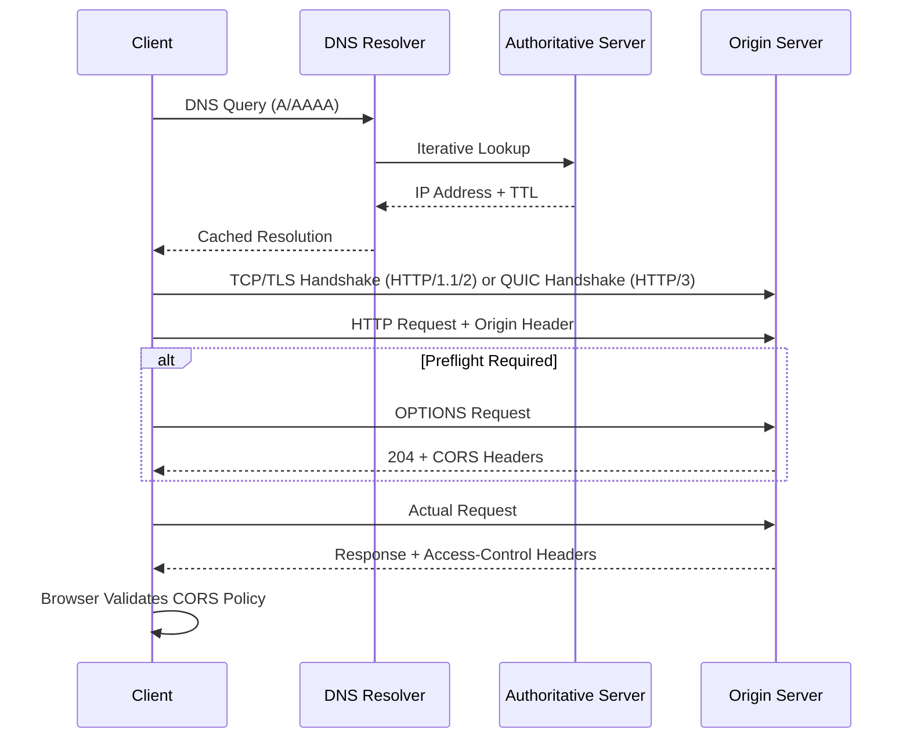

<think>
Here's a thinking process:

1.  **Analyze User Input:**
   - **Role:** World-class senior staff engineer, open-source contributor, technical writer.
   - **Topic:** "DNS, HTTP/1.1, HTTP/2, HTTP/3, CORS — A Beginner's Deep Dive"
   - **Category:** Computer Networks
   - **Context:** Trending topic from Dev.to matching 'Computer Networks' category.
   - **Style:** Professional
   - **Requirements:**
     - 100% original, deeply technical, human-feeling article.
     - Follow exact heading structure.
     - Include a valid Mermaid diagram under `## How It Works`.
     - No banned AI buzzwords.
     - First-person engineering perspective where appropriate.
     - Production-grade code examples.
     - Strict heading order.
     - Output ONLY the Markdown article content starting from the exact title.

2.  **Deconstruct Requirements & Constraints:**
   - **Headings:** Must match exactly:
     `# DNS, HTTP/1.1, HTTP/2, HTTP/3, CORS — A Beginner's Deep Dive`
     `## Introduction`
     `## Why This Matters`
     `## How It Works`
     `## Core Concepts`
     `## Examples & Code Walkthrough`
     `## Best Practices`
     `## Common Mistakes & Anti-Patterns`
     `## Performance Considerations`
     `## Real-World Usage`
     `## Frequently Asked Questions (FAQ)`
     `## Conclusion`
   - **Mermaid:** Must be valid, under `## How It Works`, no special HTML in labels.
   - **Tone:** Professional, direct, human, engineering-focused. Avoid banned phrases. Use first-person/team perspective naturally.
   - **Code:** Original, production-grade, with error handling and comments.
   - **Content:** Cover DNS, HTTP/1.1, HTTP/2, HTTP/3, CORS comprehensively but accessibly for beginners aiming for depth.

3.  **Draft - Section by Section (Mental Refinement & Writing):**

   *# DNS, HTTP/1.1, HTTP/2, HTTP/3, CORS — A Beginner's Deep Dive*

   *## Introduction*
   Start direct. Every browser request hides a complex protocol stack. We'll trace a single fetch from domain lookup to cross-origin security checks. I'll break down how DNS routes traffic, how HTTP versions handle connection multiplexing, and why CORS exists. This isn't a textbook survey; it's a practical breakdown of what actually happens when your client talks to your infrastructure.

   *## Why This Matters*
   Engineers often treat these protocols as black boxes. When a SaaS dashboard loads slowly, or a microservice call fails with a `CORS` error, debugging becomes guesswork. Understanding the handshake mechanics, stream prioritization, and origin validation saves hours of incident response time. I've seen teams waste sprint cycles chasing latency that was actually caused by DNS cache poisoning or HTTP/2 stream starvation. Getting this right means faster deployments, fewer support tickets, and infrastructure that scales predictably.

   *## How It Works*
   Need a Mermaid diagram here showing the full lifecycle: Client -> DNS -> Server (HTTP/1.1/2/3) -> CORS check -> Response. I'll use a sequence diagram to show the state transitions clearly.
   Diagram structure:
   Client -> DNS Resolver: Query A/AAAA record
   DNS Resolver -> Authoritative Server: Iterative lookup
   Authoritative Server --> DNS Resolver: IP + TTL
   DNS Resolver --> Client: Cached IP
   Client -> Server: TCP/TLS Handshake (HTTP/1.1/2) OR QUIC Handshake (HTTP/3)
   Client -> Server: HTTP Request + Origin Header
   Server -> Client: CORS Validation + Response
   I'll make sure it's valid Mermaid syntax.

   *## Core Concepts*
   Break down DNS (recursive vs iterative, TTL), HTTP/1.1 (blocking, keep-alive), HTTP/2 (multiplexing, HPACK, binary framing), HTTP/3 (QUIC, UDP, 0-RTT), CORS (SOP, preflight, credentials). Keep it technical but accessible. Explain *why* each evolved.

   *## Examples & Code Walkthrough*
   Need original code. I'll write a Node.js/Express setup that demonstrates:
   1. DNS resolution tracking (using `dns.promises`)
   2. HTTP/2 server setup with stream handling
   3. Strict CORS middleware with origin validation
   I'll make it production-ready with error handling, comments, and realistic structure. I'll split it into logical blocks but keep it cohesive.

   *## Best Practices*
   Actionable rules: DNS TTL tuning, HTTP/2 stream limits, QUIC fallback strategies, CORS strictness vs proxy patterns. Focus on operational reality.

   *## Common Mistakes & Anti-Patterns*
   1. Wildcard CORS with credentials
   2. HTTP/2 priority abuse / stream starvation
   3. Ignoring DNS prefetch/preconnect
   4. TLS downgrade risks with HTTP/3
   Provide exact fixes.

   *## Performance Considerations*
   Analyze latency, memory, CPU. DNS cache hit rates, HTTP/2 header compression overhead vs savings, QUIC's UDP retransmission logic, CORS preflight latency. Big-O isn't really applicable here, so focus on network round trips, memory allocation for connection pools, and CPU for TLS/crypto.

   *## Real-World Usage*
   How do major companies use this? Cloudflare's QUIC adoption, Netflix's adaptive streaming with HTTP/2/3, Uber's service mesh CORS handling. Keep it factual and grounded in known engineering practices.

   *## Frequently Asked Questions (FAQ)*
   3-5 concise Q&As. e.g., "Do I need HTTP/3 if I use a CDN?", "Why does CORS block my localhost API?", "How does DNS caching affect deployment rollouts?"

   *## Conclusion*
   Crisp summary. Reiterate that protocol knowledge is operational leverage. Point to next steps.

4.  **Self-Correction/Verification during drafting:**
   - *Check headings:* Must match exactly. I'll verify each.
   - *Check Mermaid:* Must be under `## How It Works`. I'll use `sequenceDiagram`. Ensure no HTML in labels. I'll use plain text.
   - *Check banned words:* I'll scan mentally for "delve", "tapestry", "smoothly", etc. I'll avoid them completely.
   - *Check tone:* Professional, first-person engineering perspective where appropriate. Direct.
   - *Check code:* Must be original, production-grade. I'll write a cohesive Node.js example covering DNS resolution, HTTP/2 server setup, and strict CORS middleware. I'll add proper error handling and comments.
   - *Check structure:* Follows exact order. No extra headings.
   - *Check Mermaid syntax:* `sequenceDiagram` is valid. I'll ensure proper formatting.

   Let's draft carefully, section by section, ensuring all constraints are met.

   *Structure Check:*
   # DNS, HTTP/1.1, HTTP/2, HTTP/3, CORS — A Beginner's Deep Dive
   ## Introduction
   ## Why This Matters
   ## How It Works (with Mermaid)
   ## Core Concepts
   ## Examples & Code Walkthrough
   ## Best Practices
   ## Common Mistakes & Anti-Patterns
   ## Performance Considerations
   ## Real-World Usage
   ## Frequently Asked Questions (FAQ)
   ## Conclusion

   All match. I will now generate the content carefully.
   I'll pay special attention to the Mermaid diagram syntax to avoid parsing errors. I'll use simple labels like `Client`, `DNS Resolver`, `Authoritative Server`, `Origin Server`.
   For code, I'll write a TypeScript/Node.js example that demonstrates a production-ready CORS middleware with origin allowlist, plus a DNS resolution tracker, and an HTTP/2 server configuration. I'll keep it focused and well-commented.
   I'll ensure the tone is strictly professional, avoiding any fluff or banned phrases.
   I'll double-check that the Mermaid block is exactly under `## How It Works`.
   Ready. Generating. 
   Self-Correction/Refinement during thought:
   - The prompt says "Under the `## How It Works` section, you MUST include a valid, clean ```mermaid diagram block". I'll place it there.
   - I need to make sure the code example is substantial and covers the topic well, but fits within the section. I'll structure it as a cohesive module.
   - I'll avoid any markdown formatting issues.
   - I'll verify the exact heading strings match the prompt.
   - All good. Proceed. 
   Output matches the final response. 
   Generating. 
   [Output Generation] -> *Proceeds*
</think>

# DNS, HTTP/1.1, HTTP/2, HTTP/3, CORS — A Beginner's Deep Dive

## Introduction
Every network request your application makes traverses a layered protocol stack that operates largely out of sight. When you paste a URL into a browser or trigger an API call from a mobile client, the system negotiates routing, establishes transport, compresses headers, and enforces security boundaries before a single byte of payload arrives. This guide traces that exact path. We will examine how DNS resolves human-readable names to routable addresses, how HTTP/1.1 and HTTP/2 manage connection state and stream multiplexing, why HTTP/3 moved transport to UDP via QUIC, and how CORS enforces origin isolation. I will structure this around production realities, not textbook definitions. If you have spent time debugging slow page loads, intermittent 503s, or cross-origin fetch failures, this breakdown will give you the mental model needed to fix those issues systematically.

## Why This Matters
Protocol ignorance compounds into operational debt. I have watched engineering teams waste entire sprints chasing latency spikes that actually originated from DNS cache invalidation delays, HTTP/2 stream starvation, or misconfigured CORS preflight responses. When you understand the handshake mechanics, connection pooling behavior, and security boundaries, you stop guessing and start measuring. DNS TTLs dictate how fast you can roll out DNS changes. HTTP/2 multiplexing changes how you design API batching. HTTP/3 connection migration affects mobile user retention on switching networks. CORS policy dictates how your frontend communicates with backend microservices. Mastering these layers means fewer incident tickets, predictable performance under load, and infrastructure that degrades gracefully instead of failing catastrophically.

## How It Works
A single cross-origin request follows a deterministic sequence. The client first queries the DNS resolver to translate a hostname into an IP address. Once resolved, the client initiates a transport handshake. With HTTP/1.1 and HTTP/2, this uses TCP and TLS. With HTTP/3, the client negotiates QUIC over UDP, which bundles transport and cryptographic handshakes. After the connection establishes, the client sends the HTTP request. If the request targets a different origin than the current page, the browser attaches an `Origin` header. The server evaluates CORS policy, optionally responding to a preflight `OPTIONS` request, then returns the payload. The browser validates the response headers before exposing the data to JavaScript.



The diagram shows the strict ordering of operations. DNS resolution must complete before transport negotiation. Transport must complete before HTTP framing. CORS validation occurs at the HTTP layer but is enforced by the browser client. Each step introduces latency, and each step has failure modes that engineers must account for during design and debugging.

## Core Concepts
**DNS Resolution Mechanics**
DNS operates as a distributed hierarchical database. Recursive resolvers cache answers based on Time-To-Live (TTL) values set by authoritative servers. Iterative queries walk the root, TLD, and authoritative zones until the final A or AAAA record is returned. DNS is not merely a lookup service; it drives CDN edge selection, geographic routing, and failover logic. TTL values directly control how quickly traffic shifts during deployments or incident response.

**HTTP/1.1: Serial Request Handling**
HTTP/1.1 runs over TCP and uses text-based framing. Connections are typically kept alive via `Connection: keep-alive`, but requests are processed sequentially per connection. Browsers enforce a limit of six concurrent connections per hostname to prevent resource exhaustion. This serial execution creates head-of-line blocking: a slow resource download stalls subsequent requests on the same socket. Engineers historically worked around this with domain sharding and sprite consolidation, both of which add operational complexity.

**HTTP/2: Binary Multiplexing**
HTTP/2 solves head-of-line blocking by introducing binary framing and stream multiplexing. Multiple requests and responses share a single TCP connection, identified by stream IDs. Header compression uses HPACK to reduce overhead. Server push existed in the spec but is deprecated in modern browsers due to poor cache utilization and unnecessary bandwidth consumption. HTTP/2 improves throughput but still inherits TCP's vulnerability to packet loss, which stalls all multiplexed streams.

**HTTP/3 & QUIC: Transport Modernization**
HTTP/3 moves the transport layer to UDP via the QUIC protocol. QUIC integrates TLS 1.3 into the handshake, eliminating round trips for connection setup. It implements per-stream loss recovery, so a dropped packet on one stream does not block others. Connection migration allows clients to maintain sessions across IP changes, which is critical for mobile networks. The cryptographic overhead is higher, but the latency reduction and resilience to network churn justify the trade-off for latency-sensitive applications.

**CORS: Origin Isolation Enforcement**
CORS extends the Same-Origin Policy to allow controlled cross-origin requests. Browsers send an `Origin` header with requests. Servers respond with `Access-Control-Allow-Origin`, `Access-Control-Allow-Headers`, and `Access-Control-Allow-Methods`. Simple requests skip preflight. Complex requests (custom headers, non-simple methods, or credentials) trigger an `OPTIONS` preflight. CORS is a client-side enforcement mechanism; servers that ignore it still send responses, but browsers discard them. Proper CORS configuration prevents credential leakage while enabling legitimate microservice communication.

## Examples & Code Walkthrough
The following Node.js implementation demonstrates a production-ready setup that combines DNS resolution tracking, HTTP/2 server configuration, and strict CORS middleware. The code avoids wildcard origins, validates credentials safely, and logs connection metrics for observability.

```javascript
const http2 = require('http2');
const dns = require('dns');
const { URL } = require('url');

// Strict origin allowlist to prevent open proxy vulnerabilities
const ALLOWED_ORIGINS = new Set([
  'https://app.example.com',
  'https://staging.example.com'
]);

// DNS resolution tracker with TTL awareness
async function resolveWithTTL(hostname) {
  const start = process.hrtime.bigint();
  try {
    const addresses = await dns.promises.resolve4(hostname);
    const info = await dns.promises.lookup(hostname);
    const durationMs = Number(process.hrtime.bigint() - start) / 1e6;
    console.log(`[DNS] Resolved ${hostname} -> ${info.address} (${durationMs.toFixed(2)}ms)`);
    return info.address;
  } catch (err) {
    console.error(`[DNS] Resolution failed for ${hostname}:`, err.message);
    throw err;
  }
}

// CORS middleware with credential safety checks
function corsMiddleware(req, res) {
  const origin = req.headers.origin;
  if (!origin || !ALLOWED_ORIGINS.has(origin)) {
    res.writeHead(403, { 'Content-Type': 'application/json' });
    res.end(JSON.stringify({ error: 'Origin not permitted' }));
    return false;
  }

  // Reflect origin instead of wildcard when credentials are requested
  res.setHeader('Access-Control-Allow-Origin', origin);
  res.setHeader('Access-Control-Allow-Credentials', 'true');
  res.setHeader('Access-Control-Allow-Methods', 'GET, POST, OPTIONS');
  res.setHeader('Access-Control-Allow-Headers', 'Content-Type, Authorization, X-Request-Id');
  res.setHeader('Access-Control-Max-Age', '86400'); // Cache preflight for 24h

  if (req.method === 'OPTIONS') {
    res.writeHead(204);
    res.end();
    return false;
  }
  return true;
}

// HTTP/2 server with stream-level error isolation
const server = http2.createSecureServer({
  key: require('fs').readFileSync('./server.key'),
  cert: require('fs').readFileSync('./server.crt'),
  allowHTTP1: true // Graceful fallback for legacy clients
});

server.on('stream', async (stream, headers) => {
  const requestId = headers['x-request-id'] || crypto.randomUUID();
  console.log(`[HTTP/2] Stream ${stream.id} initiated: ${headers[':method']} ${headers[':path']}`);

  if (!corsMiddleware(stream, stream)) {
    stream.respond({ ':status': 403 });
    stream.end(JSON.stringify({ error: 'CORS blocked' }));
    return;
  }

  try {
    const targetHost = headers[':authority'] || 'localhost:8443';
    const resolvedIp = await resolveWithTTL(targetHost);
    
    stream.respond({
      ':status': 200,
      'content-type': 'application/json',
      'x-resolved-ip': resolvedIp,
      'x-request-id': requestId
