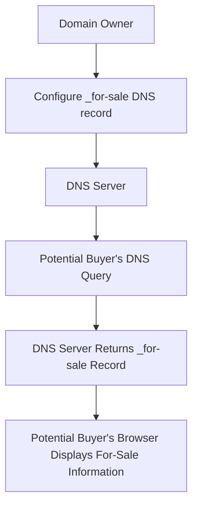

# _for-sale DNS records

## Introduction
When a domain name is put up for sale, the owner typically wants to make it easy for potential buyers to find and purchase the domain. One way to achieve this is by using _for-sale DNS records. These records allow domain owners to advertise their domain's availability for sale directly through the DNS. In this article, we'll explore how _for-sale DNS records work, their benefits, and how to implement them.

## Why This Matters
_for-sale DNS records matter because they provide a standardized way for domain owners to signal that their domain is available for sale. This can be particularly useful for domain owners who want to attract potential buyers without having to resort to third-party marketplaces or brokers. By including _for-sale DNS records in their domain's DNS configuration, owners can increase the visibility of their domain and potentially attract more buyers.

## How It Works
The _for-sale DNS record is a type of TXT record that contains information about the domain's availability for sale. Here's an overview of how it works:

When a potential buyer queries the DNS for information about the domain, the DNS server returns the _for-sale DNS record, which contains details about the domain's availability for sale.

## Core Concepts
To understand how _for-sale DNS records work, it's essential to grasp some core concepts:

* **TXT records**: These are a type of DNS record that allows domain owners to associate arbitrary text with their domain.
* **_for-sale subdomain**: This is a subdomain that is specifically designated for advertising the domain's availability for sale.
* **DNS query**: This is the process by which a client (such as a web browser) requests information about a domain from a DNS server.

## Examples & Code Walkthrough
Here's an example of how to configure a _for-sale DNS record using BIND:
```bash
$TTL 1h
@ IN SOA ns1.example.com. hostmaster.example.com. (
                  1       ; Serial
             3600       ; Refresh
              600       ; Retry
            604800       ; Expire
             3600 )    ; Minimum TTL
;
; _for-sale record
_for-sale IN TXT "This domain is for sale. Contact example@example.com for more information."
```
In this example, the `_for-sale` subdomain is configured with a TXT record that contains information about the domain's availability for sale.

## Best Practices
When implementing _for-sale DNS records, keep the following best practices in mind:

* **Keep the record up-to-date**: Make sure to update the _for-sale record if the domain's availability for sale changes.
* **Use a clear and concise format**: Use a clear and concise format for the TXT record to ensure that potential buyers can easily understand the information.
* **Test the record**: Test the _for-sale record to ensure that it is correctly configured and visible to potential buyers.

## Common Mistakes & Anti-Patterns
Here are some common mistakes to avoid when implementing _for-sale DNS records:

* **Incorrect record format**: Using an incorrect format for the TXT record can prevent potential buyers from understanding the information.
* **Outdated records**: Failing to update the _for-sale record when the domain's availability for sale changes can lead to confusion and missed opportunities.
* **Insufficient testing**: Failing to test the _for-sale record can lead to configuration errors and reduced visibility.

## Performance Considerations
_for-sale DNS records have minimal performance impact, as they are simply an additional TXT record that is returned with the DNS response. However, it's essential to consider the following:

* **DNS query overhead**: Adding an additional record to the DNS response can increase the overhead of DNS queries.
* **Record size**: Keeping the TXT record concise can help minimize the overhead of DNS queries.

## Real-World Usage
Industry leaders such as domain registrars and marketplaces use _for-sale DNS records to advertise domains for sale. For example, a domain registrar may use _for-sale DNS records to promote domains that are available for sale through their platform.

## Frequently Asked Questions (FAQ)
Here are some frequently asked questions about _for-sale DNS records:

* Q: What is the purpose of _for-sale DNS records?
A: _for-sale DNS records allow domain owners to advertise their domain's availability for sale directly through the DNS.
* Q: How do I configure a _for-sale DNS record?
A: The configuration process varies depending on the DNS server software being used. Consult the documentation for your specific DNS server software for instructions.
* Q: Can I use _for-sale DNS records for other purposes?
A: No, _for-sale DNS records are specifically designed for advertising domains for sale and should not be used for other purposes.

## Conclusion
_for-sale DNS records provide a standardized way for domain owners to advertise their domain's availability for sale. By understanding how _for-sale DNS records work and following best practices, domain owners can increase the visibility of their domain and potentially attract more buyers. As the domain name market continues to evolve, _for-sale DNS records are likely to play an increasingly important role in facilitating domain name sales.
