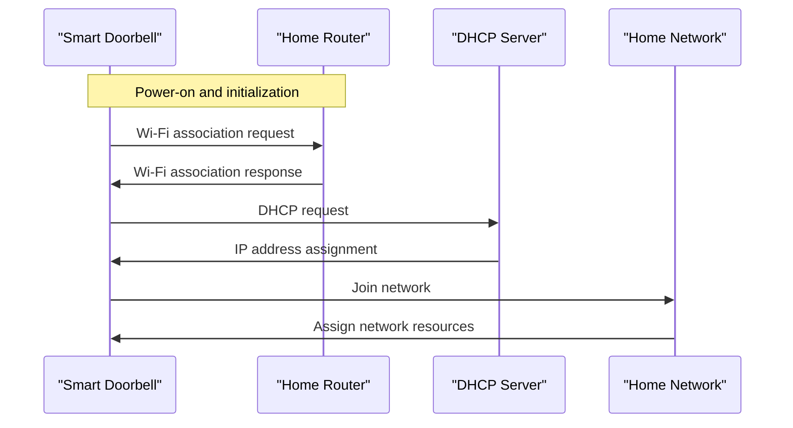

# From your doorbell to your home network

## Introduction
When I installed a smart doorbell at my house, I was surprised by how much it revealed about the intricacies of my home network. The doorbell, which is essentially a camera with Wi-Fi capabilities, needed to connect to my network to stream video and send notifications. This got me thinking - what's the journey of data from my doorbell to my home network, and how does it impact my overall network security and performance?

## Why This Matters
As more devices become connected to our home networks, understanding how they interact with each other and the network infrastructure is crucial. This knowledge can help us identify potential security vulnerabilities, optimize network performance, and ensure reliable connectivity. For software engineers, grasping these concepts is essential for designing and developing smart home devices, network protocols, and security systems that can effectively manage the increasing number of connected devices.

## How It Works
The communication between my doorbell and home network involves several components, including the doorbell's Wi-Fi module, my router, and the network's DHCP server. Here's a high-level overview of the process:

The doorbell first associates with my router using Wi-Fi, and then sends a DHCP request to obtain an IP address. Once it receives an IP address, it joins my home network and can communicate with other devices.

## Core Concepts
To understand how devices interact with home networks, it's essential to grasp the following core concepts:
- **Wi-Fi protocols**: Devices use Wi-Fi protocols like 802.11ac or 802.11ax to connect to the network.
- **DHCP**: The Dynamic Host Configuration Protocol assigns IP addresses to devices on the network.
- **Network topology**: The physical and logical arrangement of devices on the network, including routers, switches, and access points.
- **Network security**: Measures to protect the network from unauthorized access, including firewalls, encryption, and access control lists.

## Examples & Code Walkthrough
To illustrate how devices interact with home networks, let's consider a simple example using Python and the Scapy library to simulate a DHCP request:
```python
from scapy.all import *

# Define the DHCP request packet
packet = Ether(src="00:11:22:33:44:55") / IP(src="0.0.0.0", dst="255.255.255.255") / UDP(sport=68, dport=67) / BOOTP(chaddr="00:11:22:33:44:55") / DHCP(options=[("message-type", "request"), ("requested_addr", "192.168.1.100")])

# Send the packet and capture the response
response = sr1(packet, timeout=2, verbose=0)

# Print the assigned IP address
if response:
    print("Assigned IP address:", response[DHCP].options[1][1])
else:
    print("No response received")
```
This code sends a DHCP request packet and captures the response, which contains the assigned IP address.

## Best Practices
When designing and developing devices that interact with home networks, follow these best practices:
- **Implement robust network security measures**, such as encryption and access control lists.
- **Use secure protocols** for communication, like HTTPS or CoAP over DTLS.
- **Optimize network performance** by minimizing packet loss and latency.
- **Ensure device compatibility** with different network configurations and devices.

## Common Mistakes & Anti-Patterns
Some common mistakes to avoid when dealing with home networks include:
- **Inadequate network security**, which can lead to unauthorized access and data breaches.
- **Insufficient network capacity**, resulting in poor performance and dropped connections.
- **Incompatible devices**, which can cause connectivity issues and network instability.
- **Poor network configuration**, leading to IP address conflicts and routing problems.

## Performance Considerations
When evaluating the performance of devices on home networks, consider the following factors:
- **Network latency**: The time it takes for data to travel between devices.
- **Packet loss**: The percentage of packets that are lost during transmission.
- **Throughput**: The amount of data that can be transmitted per unit time.
- **CPU and memory usage**: The resources required by devices to process network traffic.

## Real-World Usage
Industry leaders like Amazon, Google, and Apple are leveraging home networks to enable smart home devices, voice assistants, and streaming services. For example, Amazon's Echo devices use Wi-Fi to connect to home networks and communicate with the cloud to provide voice-activated services.

## Frequently Asked Questions (FAQ)
- Q: What is the difference between a router and a switch?
A: A router connects multiple networks, while a switch connects multiple devices within a network.
- Q: How do I secure my home network?
A: Use strong passwords, enable WPA2 encryption, and install a firewall.
- Q: Can I use a Wi-Fi range extender to improve network coverage?
A: Yes, but it may introduce additional latency and packet loss.
- Q: How do I troubleshoot network connectivity issues?
A: Check the physical connections, restart devices, and use network diagnostic tools.
- Q: What is the role of DHCP in home networks?
A: DHCP assigns IP addresses to devices, allowing them to communicate with each other.

## Conclusion
Understanding how devices interact with home networks is crucial for designing and developing smart home devices, network protocols, and security systems. By grasping the core concepts, following best practices, and avoiding common mistakes, engineers can create reliable, secure, and high-performance home networks that support the growing number of connected devices. As we continue to innovate and push the boundaries of home networking, it's essential to prioritize network security, performance, and compatibility to ensure a seamless and enjoyable user experience.
