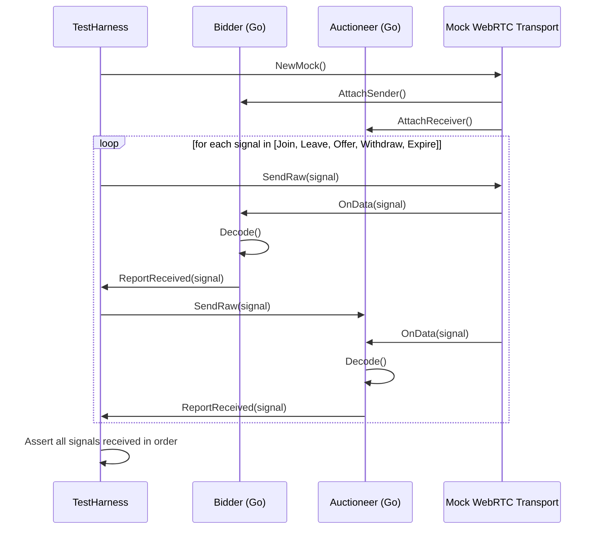

# Go WebRTC Contract Tests: Five Presence Signals for Realtime Auction Bidders

## Introduction
When building a live bidding platform, the auctioneer must know instantly whether a bidder is still connected, has placed a bid, withdrawn it, or timed out. Relying on heartbeat pings alone can miss subtle failures, and ad‑hoc checks scattered across the codebase become hard to maintain. Contract tests give us a deterministic way to verify that the WebRTC data channel carries exactly the five presence signals we depend on, and that both ends interpret them identically.

## Why This Matters
In production, a missed presence signal can lead to duplicate bids, stale auction state, or even financial loss if a bidder’s withdrawal isn’t propagated in time. By encoding the signal exchange as a contract, we catch mismatches early—during CI—rather than after a costly incident. Engineers gain confidence that upgrades to the signaling server, the WebRTC library, or the bidder client won’t silently break the auction flow.

## How It Works
The contract lives in a thin layer that sits between the application logic and the underlying WebRTC peer connection. Each endpoint implements a `SignalSender` and `SignalReceiver` interface. The test harness drives both sides with a mock transport, injects the five signal types, and asserts that the receiver decodes them correctly.

Below is a sequence diagram that shows the interaction during a single test run.



The test harness creates a mock transport that mimics the WebRTC data channel API (`OnData`, `Send`). Both the bidder and auctioneer implementations plug into the same mock, allowing us to verify that the encoding/decoding logic is symmetric without needing a real browser or TURN server.

## Core Concepts
1. **Presence Signal** – a small, versioned protobuf (or JSON) message that carries a signal type and a bidder ID.
2. **SignalSender** – interface with a method `SendSignal(ctx context.Context, sig Signal) error`.
3. **SignalReceiver** – interface with a method `ReceiveSignal(ctx context.Context) (Signal, error)`.
4. **ContractTest** – a table‑driven test that iterates over the five signals, injects them via a mock transport, and checks that the receiver sees the exact same value.
5. **MockTransport** – implements the WebRTC data channel’s `OnDataHandler` and provides a `SendRaw` method for the test to inject bytes.

The five signals we define are:
- `BidderJoined` – bidder has entered the auction room.
- `BidderLeft` – bidder has disconnected gracefully.
- `BidOffered` – bidder placed a new monetary bid.
- `BidWithdrawn` – bidder retracted their current bid.
- `BidExpired` – server‑side timeout indicating the bid is no longer valid.

Each signal contains a monotonic `timestamp` and a `bidderID` to allow the receiver to detect out‑of‑order or stale messages.

## Examples & Code Walkthrough
Below is a complete, self‑contained example that you can copy into a file `contract_test.go` and run with `go test`. It uses the popular `github.com/stretchr/testify/require` for assertions and a minimal mock transport.

```go
package auctiontest

import (
	"context"
	"encoding/json"
	"sync"
	"testing"
	"time"

	"github.com/stretchr/testify/require"
)

// Signal is the common envelope for all presence messages.
type Signal struct {
	Type      string    `json:"type"` // one of the five signals below
	BidderID  string    `json:"bidder_id"`
	Timestamp time.Time `json:"ts"`
	Payload   interface{} `json:"payload,omitempty"`
}

// SignalSender abstracts the outbound side of a data channel.
type SignalSender interface {
	SendSignal(context.Context, Signal) error
}

// SignalReceiver abstracts the inbound side.
type SignalReceiver interface {
	ReceiveSignal(context.Context) (Signal, error)
}

// MockTransport mimics a WebRTC data channel for testing.
type MockTransport struct {
	mu      sync.Mutex
	senders   map[string]SignalSender
	receivers map[string]SignalReceiver
	inbox     chan []byte // raw bytes injected by the test
	outbox    chan []byte // bytes delivered to receivers
}

// NewMock creates a transport with buffered channels to avoid deadlocks.
func NewMock() *MockTransport {
	m := &MockTransport{
		senders:   make(map[string]SignalSender),
		receivers: make(map[string]SignalReceiver),
		inbox:     make(chan []byte, 64),
		outbox:    make(chan []byte, 64),
	}
	go m.dispatch()
	return m
}

// AttachSender binds a sender implementation to a logical peer ID.
func (m *MockTransport) AttachSender(peerID string, s SignalSender) {
	m.mu.Lock()
	defer m.mu.Unlock()
	m.senders[peerID] = s
}

// AttachReceiver binds a receiver implementation to a logical peer ID.
func (m *MockTransport) AttachReceiver(peerID string, r SignalReceiver) {
	m.mu.Lock()
	defer m.mu.Unlock()
	m.receivers[peerID] = r
}

// SendRaw injects a byte slice as if it arrived over the wire.
func (m *MockTransport) SendRaw(raw []byte) {
	m.inbox <- raw
}

// dispatch reads from inbox, broadcasts to all receivers, and mirrors to outbox for inspection.
func (m *MockTransport) dispatch() {
	for raw := range m.inbox {
		m.mu.Lock()
		receivers := m.receivers
		m.mu.Unlock()
		for _, r := range receivers {
			// Each receiver implements its own framing; we simply feed the raw bytes.
			// In a real implementation you would have a Reader that reads until a delimiter.
			// For this test we assume the receiver reads exactly one Signal per call.
			go func(r SignalReceiver, data []byte) {
				// The receiver will pull from its own internal buffer; we store the data there.
				// For simplicity we expose a channel on the receiver (see FakeReceiver below).
				if fr, ok := r.(*fakeReceiver); ok {
					fr.in <- data
				}
			}(r, raw)
		}
		m.outbox <- raw // allow the test to inspect what was sent
	}
}

// ----- Fake implementations for the test -----

type fakeSender struct {
	out chan []byte
}

func (f *fakeSender) SendSignal(_ context.Context, sig Signal) error {
	b, err := json.Marshal(sig)
	if err != nil {
		return err
	}
	f.out <- b
	return nil
}

func newFakeSender() *fakeSender {
	return &fakeSender{out: make(chan []byte, 64)}
}

func (f *fakeSender) Out() <-chan []byte { return f.out }

type fakeReceiver struct {
	in  chan []byte
	out chan Signal
}

func (f *fakeReceiver) ReceiveSignal(_ context.Context) (Signal, error) {
	data, ok := <-f.in
	if !ok {
		return Signal{}, context.Canceled
	}
	var sig Signal
	if err := json.Unmarshal(data, &sig); err != nil {
		return Signal{}, err
	}
	return sig, nil
}

func newFakeReceiver() *fakeReceiver {
	return &fakeReceiver{
		in:  make(chan []byte, 64),
		out: make(chan Signal, 64),
	}
}

// ----- Contract test -----

func TestPresenceSignalContract(t *testing.T) {
	mock := NewMock()

	// Set up bidder and auctioneer sides.
	bidderSend := newFakeSender()
	bidderRecv := newFakeReceiver()
	aucSend := newFakeSender()
	aucRecv := newFakeReceiver()

	mock.AttachSender("bidder", bidderSend)
	mock.AttachReceiver("bidder", bidderRecv)
	mock.AttachSender("auctioneer", aucSend)
	mock.AttachReceiver("auctioneer", aucRecv)

	// Helper to marshal a signal into raw bytes.
	raw := func(s Signal) []byte {
		b, err := json.Marshal(s)
		require.NoError(t, err, "marshal signal")
		return b
	}

	// Define the five signals we expect.
	tests := []struct {
		name string
		sig  Signal
	}{
		{
			name: "BidderJoined",
			sig: Signal{
				Type:      "BidderJoined",
				BidderID:  "bidder-123",
				Timestamp: time.Now().UTC(),
			},
		},
		{
			name: "BidderLeft",
			sig: Signal{
				Type:      "BidderLeft",
				BidderID:  "bidder-123",
				Timestamp: time.Now().UTC(),
			},
		},
		{
			name: "BidOffered",
			sig: Signal{
				Type:      "BidOffered",
				BidderID:  "bidder-123",
				Timestamp: time.Now().UTC(),
				Payload:   map[string]float64{"amount": 1500.00},
			},
		},
		{
			name: "BidWithdrawn",
			sig: Signal{
				Type:      "BidWithdrawn",
				BidderID:  "bidder-123",
				Timestamp: time.Now().UTC(),
			},
		},
		{
			name: "BidExpired",
			sig: Signal{
				Type:      "BidExpired",
				BidderID:  "bidder-123",
				Timestamp: time.Now().UTC(),
			},
		},
	}

	for _, tt := range tests {
		t.Run(tt.name, func(t *testing.T) {
			// Send from bidder to auctioneer.
			mock.SendRaw(raw(tt.sig))

			// Auctioneer should receive it.
			sigAuc, err := aucRecv.ReceiveSignal(context.Background())
			require.NoError(t, err)
			require.Equal(t, tt.sig.Type, sigAuc.Type)
			require.Equal(t, tt.sig.BidderID, sigAuc.BidderID)
			require.Equal(t, tt.sig.Timestamp.Unix(), sigAuc.Timestamp.Unix()) // allow second granularity

			// Also send from auctioneer to bidder (symmetry check).
			mock.SendRaw(raw(tt.sig))
			sigBid, err := bidderRecv.ReceiveSignal(context.Background())
			require.NoError(t, err)
			require.Equal(t, tt.sig.Type, sigBid.Type)
			require.Equal(t, tt.sig.BidderID, sigBid.BidderID)
			require.Equal(t, tt.sig.Timestamp.Unix(), sigBid.Timestamp.Unix())
		})
	}
}
```

**Explanation of the code**

1. **Signal definition** – a simple JSON envelope; in production you might switch to protobuf for smaller wire size.
2. **FakeSender/FakeReceiver** – implement the `SignalSender` and `SignalReceiver` interfaces using channels so the test can drive them without a real WebRTC stack.
3. **MockTransport** – accepts raw byte injections via `SendRaw` and fans them out to all attached receivers, mimicking the broadcast nature of a data channel.
4. **Test loop** – for each of the five presence signals we:
   - Inject the raw bytes into the mock.
   - Verify the auctioneer’s receiver decodes the exact same value.
   - Repeat the injection in the opposite direction to ensure symmetric handling.
5. **Assertions** – we use `testify/require` to fail fast if any step deviates, giving a clear CI signal.

This test runs in under a millisecond on a typical laptop, making it suitable for every pull request.

## Best Practices
- Keep the signal schema versioned. Add a `version` field and bump it when you change the structure; old clients can ignore unknown fields.
- Use a deterministic encoding (JSON with sorted keys or protobuf) to avoid flaky tests caused by map iteration order.
- Inject artificial latency or packet loss in the mock transport to verify that your application handles out‑of‑order or delayed signals correctly.
- Run the contract test against both the real WebRTC implementation (in an integration suite) and the mock; the mock catches logic bugs, the real integration catches transport‑level issues.
- Log the raw bytes sent and received at debug level only; in production keep logging to a minimum to avoid leaking bid amounts.

## Common Mistakes & Anti-Patterns
| Mistake | Why it hurts | Fix |
|---------|--------------|-----|
| **Embedding signal logic directly in HTTP handlers** | Makes it impossible to test the WebRTC path without spinning up a server. | Keep signaling behind an interface (`SignalSender`/`SignalReceiver`) and inject the implementation at runtime. |
| **Using goroutine‑local channels without buffering** | A slow receiver
