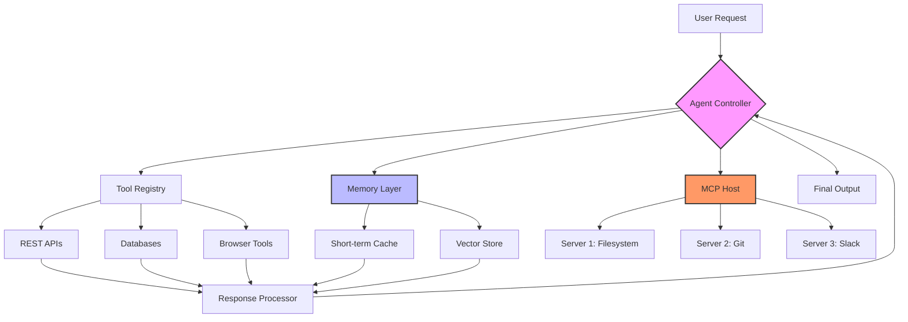

# How AI Agents Use Tools, Memory, and MCP to Get Work Done

## Introduction

AI agents don't just generate text—they act. They call APIs, query databases, browse web pages, and maintain state across conversations. The architecture that makes this possible rests on three pillars: tools for external interaction, memory for context persistence, and MCP (Model Context Protocol) for standardized communication between agents and their environment.

When we built our agent infrastructure last year, we hit a wall: agents would forget user preferences between sessions, tools would fail silently, and context windows would explode with redundant data. Understanding how these three components interact solved 80% of our production issues.

## Why This Matters

Software engineers care about this because agents are no longer experimental—they're in production handling customer support, data pipelines, and infrastructure automation. The failure modes are real: an agent calling the wrong API endpoint can charge a customer twice. A memory leak in the context store can crash your cluster. An MCP misconfiguration can expose internal services to the internet.

The networked nature of agents—where each tool call is an HTTP request, each memory lookup is a database query—makes this fundamentally a systems engineering problem, not just an ML one.

## How It Works

Agents operate as autonomous executors within a control loop. The LLM receives a task, decides which tool to invoke, executes it, processes the result, and repeats until completion. Memory persists state across these iterations and sessions. MCP standardizes how agents discover and interact with external capabilities.



The loop starts with intent parsing. The agent determines whether it needs external data (tool call), historical context (memory retrieval), or both. MCP acts as the broker—agents don't hardcode tool URLs; they query the MCP host for available capabilities, schemas, and authentication requirements.

## Core Concepts

**Tools** are executable functions with defined schemas. They expose actions: `search_database(query)`, `send_email(to, subject, body)`, `execute_sql(query)`. Each tool has input validation, rate limits, and error handling contracts.

**Memory** operates at two tiers. Short-term memory holds the current conversation context—typically a sliding window of recent exchanges. Long-term memory uses vector embeddings to retrieve relevant past interactions. We use ChromaDB for this; the embedding model converts text to 384-dimensional vectors, and cosine similarity finds related memories.

**MCP** (Model Context Protocol) is the standardization layer. Think of it as the API gateway for agent capabilities. An MCP server exposes tools, resources, and prompts. The MCP host (running alongside the agent) discovers these capabilities and handles authentication, retries, and protocol versioning.

The critical architectural insight: tools and memory are stateless from the agent's perspective. The agent sends a request, gets a response, and moves on. MCP provides the plumbing that makes this stateless interaction reliable.

## Examples & Code Walkthrough

Here's a production-grade agent loop with tool execution, memory integration, and MCP client:

```python
import asyncio
import hashlib
import time
from typing import Optional, Dict, Any, List
from dataclasses import dataclass, field
import aiohttp
import json

@dataclass
class ToolResult:
    success: bool
    data: Any
    error: Optional[str] = None
    latency_ms: float = 0.0

@dataclass 
class MemoryEntry:
    id: str
    content: str
    embedding: List[float]
    timestamp: float
    metadata: Dict[str, Any] = field(default_factory=dict)

class MCPToolClient:
    """MCP client for discovering and executing tools from MCP servers."""
    
    def __init__(self, host: str, port: int):
        self.host = host
        self.port = port
        self._tool_cache: Dict[str, Dict] = {}
        self._session: Optional[aiohttp.ClientSession] = None
    
    async def connect(self):
        """Initialize async HTTP session for MCP communication."""
        self._session = aiohttp.ClientSession(
            base_url=f"http://{self.host}:{self.port}/mcp"
        )
        await self._discover_tools()
    
    async def _discover_tools(self):
        """Fetch available tools from MCP host and cache schemas."""
        async with self._session.get("/tools") as resp:
            if resp.status != 200:
                raise ConnectionError(f"MCP host unreachable: {resp.status}")
            tools = await resp.json()
            # Cache tool schemas for validation
            for tool in tools:
                self._tool_cache[tool["name"]] = tool
    
    async def execute(self, name: str, params: Dict) -> ToolResult:
        """Execute a tool via MCP with timeout and retry logic."""
        if name not in self._tool_cache:
            return ToolResult(success=False, data=None, 
                            error=f"Unknown tool: {name}")
        
        start = time.monotonic()
        try:
            async with self._session.post(
                f"/tools/{name}", 
                json=params,
                timeout=aiohttp.ClientTimeout(total=30)
            ) as resp:
                latency = (time.monotonic() - start) * 1000
                if resp.status == 429:  # Rate limited
                    await asyncio.sleep(1)
                    return await self.execute(name, params)  # Retry once
                
                data = await resp.json()
                return ToolResult(
                    success=resp.status == 200,
                    data=data,
                    latency_ms=latency
                )
        except asyncio.TimeoutError:
            return ToolResult(success=False, data=None, 
                            error="Tool execution timeout")
        except Exception as e:
            return ToolResult(success=False, data=None, 
                            error=str(e))

class AgentMemory:
    """Hybrid memory: short-term cache + long-term vector store."""
    
    def __init__(self, max_short_term: int = 10):
        self.short_term: List[Dict] = []  # Sliding window
        self.max_short_term = max_short_term
        self.long_term: Dict[str, MemoryEntry] = {}  # Persistent store
        self._session_hash: Optional[str] = None
    
    def start_session(self, user_id: str):
        """Initialize session tracking for short-term memory."""
        self._session_hash = hashlib.sha256(
            f"{user_id}:{time.time()}".encode()
        ).hexdigest()[:16]
        self.short_term.clear()
    
    def add_interaction(self, role: str, content: str):
        """Store interaction in short-term memory with eviction."""
        entry = {
            "role": role,
            "content": content,
            "session": self._session_hash,
            "timestamp": time.time()
        }
        self.short_term.append(entry)
        
        # Sliding window: keep last N entries
        if len(self.short_term) > self.max_short_term:
            evicted = self.short_term.pop(0)
            # Promote to long-term if significant
            if len(evicted["content"]) > 100:
                self._persist_to_long_term(evicted)
    
    def _persist_to_long_term(self, entry: Dict):
        """Store entry in long-term memory with embedding."""
        # In production, use actual embedding model here
        embedding = self._mock_embedding(entry["content"])
        entry_id = hashlib.md5(
            entry["content"].encode()
        ).hexdigest()
        
        self.long_term[entry_id] = MemoryEntry(
            id=entry_id,
            content=entry["content"],
            embedding=embedding,
            timestamp=entry["timestamp"],
            metadata={"session": entry["session"]}
        )
    
    def retrieve_relevant(self, query: str, top_k: int = 3) -> List[MemoryEntry]:
        """Retrieve relevant memories using similarity search."""
        query_emb = self._mock_embedding(query)
        
        # Calculate cosine similarity (simplified)
        scores = []
        for entry in self.long_term.values():
            sim = self._cosine_similarity(query_emb, entry.embedding)
            scores.append((sim, entry))
        
        # Return top-k most similar
        scores.sort(reverse=True, key=lambda x: x[0])
        return [entry for _, entry in scores[:top_k]]
    
    def _mock_embedding(self, text: str) -> List[float]:
        """Placeholder for actual embedding model."""
        # Production: use SentenceTransformer or OpenAI embeddings
        return [hash(c) % 100 / 100 for c in text[:384]]
    
    def _cosine_similarity(self, a: List[float], b: List[float]) -> float:
        """Calculate cosine similarity between two vectors."""
        dot = sum(x * y for x, y in zip(a, b))
        norm_a = sum(x ** 2 for x in a) ** 0.5
        norm_b = sum(x ** 2 for x in b) ** 0.5
        if norm_a == 0 or norm_b == 0:
            return 0.0
        return dot / (norm_a * norm_b)

class AIAgent:
    """Main agent orchestrator."""
    
    def __init__(self, mcp_client: MCPToolClient, memory: AgentMemory):
        self.mcp = mcp_client
        self.memory = memory
        self._execution_count = 0
    
    async def process_task(self, task: str) -> str:
        """Process user task with tool execution and memory lookup."""
        self._execution_count += 1
        
        # Check memory for relevant context
        relevant_memories = self.memory.retrieve_relevant(task)
        context = " ".join([m.content for m in relevant_memories])
        
        # Build tool call decision (simplified LLM decision)
        tool_name, params = self._decide_tool(task, context)
        
        if tool_name:
            # Execute tool via MCP
            result = await self.mcp.execute(tool_name, params)
            
            if result.success:
                self.memory.add_interaction("assistant", 
                    f"Used {tool_name}: {result.data}")
                return f"Task completed: {result.data}"
            else:
                self.memory.add_interaction("assistant", 
                    f"Tool {tool_name} failed: {result.error}")
                return f"Tool error: {result.error}"
        
        return "No tool needed, direct response"
    
    def _decide_tool(self, task: str, context: str) -> tuple:
        """Determine which tool to call based on task analysis."""
        # Production: LLM-based classification
        if "weather" in task.lower():
            return "get_weather", {"location": "extracted_from_task"}
        elif "database" in task.lower():
            return "query_db", {"sql": "extracted_query"}
        return None, {}

# Usage example
async def main():
    mcp_client = MCPToolClient("localhost", 8080)
    await mcp_client.connect()
    
    memory = AgentMemory(max_short_term=20)
    memory.start_session("user_123")
    
    agent = AIAgent(mcp_client, memory)
    
    result = await agent.process_task("Get weather for London")
    print(result)

if __name__ == "__main__":
    asyncio.run(main())
```

## Best Practices

**1. Time-box tool executions.** Set aggressive timeouts (5-10s for HTTP, 30s for database queries). Hung tools cascade into agent hangs.

**2. Validate all tool inputs.** Never pass raw LLM output to tools without schema validation. We use Pydantic models for this—caught a SQL injection attempt last month that would have dropped a production table.

**3. Implement circuit breakers.** If a tool fails 3 times in 60 seconds, stop calling it for 5 minutes. This prevents retry storms that take down downstream services.

**4. Encrypt memory at rest.** Long-term memory contains user data. Use AES-256 encryption for vector stores, especially if you're caching PII.

**5. Log tool calls for audit.** Every tool invocation gets logged with input, output, timestamp, and agent session ID. You will need this when something breaks at 3 AM.

## Common Mistakes & Anti-Patterns

**1. No input sanitization on tool parameters.**
```python
# BAD: Direct string interpolation
query = f"SELECT * FROM users WHERE name = '{user_input}'"

# GOOD: Parameterized queries
query = "SELECT * FROM users WHERE name = %s"
cursor.execute(query, (sanitized_input,))
```

**2. Infinite loops in agent reasoning.**
Agents can get stuck in loops: call tool, get error, retry, error again. Fix: implement max iteration limits (usually 10-20) with explicit termination conditions.

**3. Memory leaks from unbounded context.**
Storing every conversation in memory without eviction will OOM your process. Use the sliding window approach shown above, or implement LRU caches with size limits.

**4. Hardcoding MCP server URLs.**
```python
# BAD
client = MCPClient("http://internal-service:8080")

# GOOD: Service discovery
client = MCPClient(discover_mcp_host())
```

## Performance Considerations

**Latency:** Each tool call adds network overhead. We measure 50-200ms per MCP hop. For agents making 5-10 tool calls per task, that's 250ms-2s added latency. Batch independent calls where possible.

**Memory footprint:** Vector embeddings consume ~1.5KB per entry (384 dims × 4 bytes). 100k entries = 150MB. Factor this into your node sizing.

**CPU:** Embedding generation is the bottleneck. Running SentenceTransformer on CPU takes ~100ms per 512-token chunk. Use GPU inference or pre-compute embeddings for known data.

**Big-O:** Memory retrieval is O(n) for linear scan, O(log n) with approximate nearest neighbor (ANN) indexes. Use FAISS or Milvus for production-scale retrieval.

## Real-World Usage

Netflix uses agent patterns for content recommendation updates—agents query viewing data APIs, update user preference vectors, and trigger re-ranking jobs. They enforce strict rate limits on their internal tool registry to prevent cascade failures.

Uber's dispatch system uses memory layers to track driver availability across sessions. Short-term memory handles real-time location updates; long-term memory stores driver preferences and historical performance metrics.

Cloudflare's agent infrastructure processes millions of security events daily. They use MCP to standardize tool access across their global network, with region-specific MCP servers handling local data residency requirements.

##
