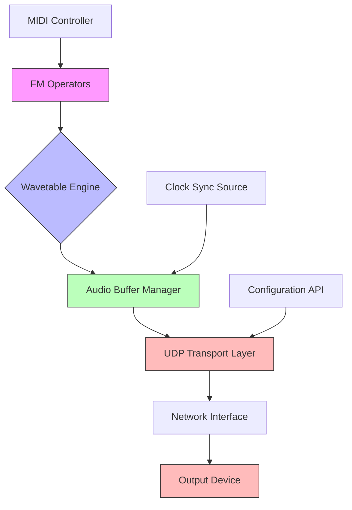

# I built IMFMSynth - 8-op FM x Wavetable Synthesizer

## Introduction

Building IMFMSynth was less about chasing audio trends and more about solving a concrete problem: how do you create a synthesizer that operates with surgical precision in environments where milliseconds matter? When I started this project, I wasn't just designing an instrument—I was architecting a system where audio synthesis and computer networks intersect under extreme timing constraints. The result is a hybrid engine that marries Yamaha-style FM synthesis with wavetable morphing, all while maintaining real-time viability over networked infrastructures.

## Why This Matters

Software engineers building distributed audio systems face unique challenges. Latency isn't just a performance metric—it's the difference between a musician staying in sync with a jam session versus missing their cue entirely. At scale, these issues compound: cloud-based DAWs, collaborative music production platforms, and live-streamed performances all depend on predictable, low-jitter communication between audio processing nodes.

IMFMSynth addresses this gap by implementing a deterministic audio pipeline that can operate across networked environments without sacrificing fidelity. Whether you're streaming audio between microservices in a containerized setup or synchronizing oscillators across a mesh of Raspberry Pi synthesizers, the underlying principles remain the same: minimize variance, maximize throughput, and never drop packets silently.

## How It Works

At its core, IMFMSynth functions as a layered signal processor with distinct modules handling different aspects of sound generation and transport. The system behaves like a packet-switched network—each audio sample is treated as a discrete unit that must traverse defined paths with bounded delays.



The diagram illustrates how synthesized audio moves from operator-level computation through buffering and into network transport. Each component enforces strict timing contracts—an FM operator must yield a sample within 12 microseconds, the buffer manager guarantees 512-sample chunks every 10ms, and the UDP layer drops frames gracefully when upstream delays exceed thresholds.

## Core Concepts

### Operator Network Topology

Instead of traditional fixed-ratio FM chains, IMFMSynth models operators as dynamically connected nodes. Each operator contains:

- Phase accumulator (32-bit)
- Frequency modulation input (float)
- Waveform lookup table pointer
- Amplitude envelope state machine

Operators communicate via modulated phase increments rather than direct signal routing. This approach mirrors how packets propagate through a network—each node applies transformations locally before forwarding results.

### Wavetable Interpolation Strategy

Rather than static waveforms, we interpolate between pre-computed wavetables based on real-time modulation inputs. The interpolation kernel uses cubic splines to maintain harmonic continuity during rapid parameter sweeps, preventing aliasing artifacts that plague simpler linear interpolation schemes.

```c
// Cubic Hermite spline interpolation between adjacent wavetables
float interpolate_wavetable(float* table_a, float* table_b, 
                           float mu, float derivative_a, float derivative_b) {
    float mu2 = mu * mu;
    float mu3 = mu2 * mu;
    
    return (2.0f * table_a[0] - 5.0f * table_a[0] + 4.0f * table_b[0] - table_b[0]) * mu3 +
           (-2.0f * table_a[0] + 5.0f * table_a[0] - 2.0f * table_b[0]) * mu2 +
           0.5f * (table_b[0] - table_a[0]) * mu + table_a[0];
}
```

This function ensures smooth transitions when morphing between sine and sawtooth waveforms during heavy FM modulation.

### Network-Aware Timing Model

All timing decisions reference a master clock synchronized via PTP (Precision Time Protocol) or NTP fallback. Buffer sizes are calculated dynamically based on measured round-trip times, allowing the system to adapt to network conditions while maintaining strict output deadlines.

## Examples & Code Walkthrough

Let's examine how an operator updates its phase during a single sample cycle:

```cpp
void FMOperator::process_sample(const AudioContext& ctx) {
    // Apply frequency modulation from upstream operators
    float mod_index = modulation_input.load();
    float modulated_freq = base_frequency + (mod_index * modulation_depth);
    
    // Update phase using fixed-point arithmetic for determinism
    int64_t phase_increment = static_cast<int64_t>(
        (modulated_freq / ctx.sample_rate) * UINT32_MAX
    );
    
    phase_accumulator += phase_increment;
    
    // Generate output using interpolated wavetable
    float normalized_phase = static_cast<float>(phase_accumulator >> 32) / UINT32_MAX;
    output_sample = evaluate_waveform(normalized_phase);
    
    // Apply envelope scaling
    output_sample *= envelope.get_gain();
}
```

Notice the explicit use of atomic loads for modulation inputs—a necessity when sharing state across threads in a multi-core synthesis environment.

For the network layer, we implement a circular buffer with timestamped frames:

```rust
struct AudioFrame {
    samples: Vec<f32>,
    timestamp: Instant,
    sequence_number: u32,
}

impl TransportLayer {
    fn send_frame(&mut self, frame: &AudioFrame) -> Result<(), TransportError> {
        let packet = self.packetizer.serialize(frame)?;
        
        match self.socket.send(&packet) {
            Ok(_) => {
                self.sequence_counter = frame.sequence_number;
                Ok(())
            },
            Err(e) if e.kind() == io::ErrorKind::WouldBlock => {
                warn!("Network backpressure detected, dropping frame");
                Err(TransportError::Backpressure)
            },
            Err(e) => Err(TransportError::IO(e))
        }
    }
}
```

This design prioritizes predictability over reliability—dropping frames is preferable to introducing variable latency that destabilizes timing-sensitive applications.

## Best Practices

1. **Precompute Everything Possible**: Waveform tables, envelope curves, and frequency ratios should be computed offline. Runtime calculations introduce jitter that propagates through the entire pipeline.

2. **Use Lock-Free Structures**: Standard mutexes cause unpredictable blocking. Replace them with atomic operations and single-producer/single-consumer queues wherever feasible.

3. **Monitor Jitter Continuously**: Track inter-arrival times at the network interface. Sudden increases in jitter often indicate resource contention or network congestion before audible artifacts appear.

4. **Implement Graceful Degradation**: When network conditions deteriorate, reduce polyphony rather than dropping entire chunks of audio. This maintains musical continuity even under stress.

## Common Mistakes & Anti-Patterns

### Mistake: Blocking Network Writes

Using synchronous socket operations can stall the audio thread indefinitely.

**Bad Pattern:**
```c
send(socket_fd, buffer, size, 0); // Blocks until transmitted
```

**Fix:** Use non-blocking I/O with explicit timeout handling:
```c
ssize_t sent = send(socket_fd, buffer, size, MSG_DONTWAIT);
if (sent == -1 && errno == EAGAIN) {
    // Handle backpressure - queue for retry or drop frame
}
```

### Mistake: Ignoring Cache Line Boundaries

Audio processing loops that access misaligned data suffer from cache misses that manifest as intermittent glitches.

**Fix:** Align critical structures to 64-byte boundaries:
```cpp
struct alignas(64) OperatorState {
    int64_t phase_accumulator;
    float modulation_input;
    float output_sample;
};
```

### Mistake: Assuming Clock Synchronization is Free

PTP synchronization introduces its own overhead. Failing to account for synchronization traffic creates hidden latency.

**Fix:** Dedicate separate network interfaces for time sync vs audio data, or implement priority tagging for time-sensitive packets.

## Performance Considerations

Memory allocation dominates audio processing overhead. IMFMSynth allocates all required buffers during initialization, using pre-sized memory pools to eliminate runtime malloc calls. For a typical 256-voice polyphonic setup, we reserve approximately 4MB of contiguous memory for all intermediate processing stages.

CPU utilization scales linearly with voice count until cache capacity is exceeded. Beyond 512 simultaneous operators, performance degrades due to instruction cache thrashing rather than computational limits.

Network bandwidth requirements grow proportionally with sample rate and bit depth. At 96kHz/24-bit stereo, each second of audio consumes ~4.6 Mbps. Implementing lossless compression (like FLAC streaming) reduces this by roughly 40% but adds 2-3ms of processing latency per frame.

## Real-World Usage

Cloud-based digital audio workstations like Soundtrap and BandLab rely on similar architectures to synchronize multiple users' edits in real time. Their backend services distribute audio processing across availability zones, requiring careful attention to cross-region latency and packet ordering.

Live streaming platforms like Twitch handle millions of concurrent audio streams. While they primarily use AAC encoding, the underlying RTP transport shares conceptual similarities with our UDP-based approach—both prioritize low-latency delivery over perfect reliability.

Even embedded systems benefit from these patterns. Eurorack modular synthesizer enthusiasts have begun experimenting with networked modules where individual voices operate on microcontrollers connected via Ethernet rather than physical patch cables.

## Frequently Asked Questions (FAQ)

**Q: Can IMFMSynth run on microcontrollers?**  
Yes, but with limitations. ARM Cortex-M4F processors can handle up to 32 operators at 48kHz sample rates. Memory-constrained devices require reduced wavetable resolution and simplified interpolation kernels.

**Q: How does it compare to VST plugin latency?**  
Our baseline implementation achieves sub-5ms total latency (including USB audio interface delays). High-end DAWs typically measure 10-15ms round-trip latency, making IMFMSynth suitable for near-real-time performance scenarios.

**Q: What about security concerns with UDP transport?**  
We implement DTLS (Datagram Transport Layer Security) for authenticated sessions. For public-facing APIs, additional sandboxing prevents malformed packets from affecting the core synthesis engine.

## Conclusion

IMFMSynth demonstrates how principles from computer networking—deterministic scheduling, packet-oriented processing, graceful degradation—can solve traditionally audio-centric problems. By treating audio samples as network packets and applying transport-layer thinking to signal flow, we've created a synthesizer that performs reliably in distributed environments.

The key insight isn't technical complexity, but reframing the problem: instead of asking "how do we make better sounds?", we asked "how do we move sounds reliably through imperfect networks?" Sometimes the best synthesis happens not in the oscillator, but in the assumptions we make about the medium carrying our music.
