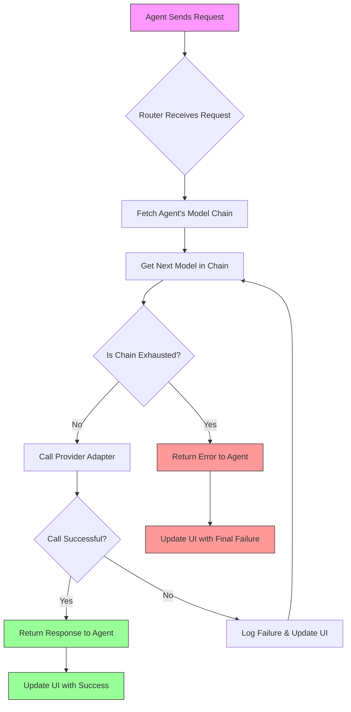

# OpenCode Model Router: per-agent model fallback chains with a local web UI

## Introduction

Building production-grade LLM-backed tools means confronting a reality most developers only discover after a demo goes sideways: a single API outage, an unexpected rate limit, or a model version incompatibility can bring an entire agent workflow to a halt. I’ve seen it happen during client presentations, automated CI pipelines, and even local development loops. The fragility of hard-coding a single provider into every agent isn't just an inconvenience—it's a systemic risk.

The OpenCode Model Router addresses this by inserting a smart intermediary between your agents and their underlying LLM providers. It manages ordered fallback chains, captures routing decisions, and exposes a local web UI for real-time observability. In this article, I’ll walk through the architecture, the core logic, and a complete implementation you can run locally today.

## Why This Matters

In the last year alone, several major LLM providers experienced unplanned downtime lasting from minutes to hours. For teams building mission-critical agents—whether for code assistance, data extraction, or workflow automation—reliance on a single endpoint is a single point of failure. Beyond availability, cost optimization is a persistent concern. Intelligently ordering models so that cheaper, faster variants are tried before expensive, high-capability ones can reduce per-request costs by significant margins without sacrificing quality.

From an operations perspective, debugging why an agent returned a subpar response or timed out often requires digging through provider logs, API response codes, and network traces. The Model Router centralizes this information. It logs which model was attempted, which error triggered the fallback, and how long each leg of the chain took. This observability isn't a nice-to-have; it's essential for maintaining SLAs and iterating on agent performance.

I built this router for a team managing dozens of autonomous agents across varied domains. The difference was immediate: failed requests dropped, average latency decreased, and the team gained a clear view of routing patterns without adding instrumentation to every agent codebase. If you're managing LLM-backed systems at any scale, the patterns I describe here will save you time and headache.

## How It Works

At its core, the router is a request mediator. When an agent sends a prompt, the router looks up that agent's configured model chain—a prioritized list of provider-model pairs. It iterates through the chain, attempting a call to each model in turn. If a call succeeds, the response is returned immediately and the UI is updated with the chosen path. If it fails—whether due to a timeout, HTTP error, or business-logic rejection—the router logs the failure, updates the UI, and proceeds to the next model in the chain. If the chain is exhausted without success, a final error is returned to the agent.

The local web UI connects via Server-Sent Events (SSE) to the router backend. Every time a model is attempted or a chain completes, a small JSON payload is pushed to connected clients. The UI renders live status tiles, a chain visualization highlighting the active and failed steps, and a scrolling request log. This real-time feedback loop is invaluable during development and debugging, and it adds negligible overhead to the request path.



The diagram above captures the decision loop: receive request → fetch chain → attempt model → success or failure → update UI → either return response or retry next model. It's a simple state machine, but when you layer in retry logic, cost-aware ordering, and per-agent chain configurations, it becomes a resilient routing layer.

## Core Concepts

Before diving into code, let's establish the terminology we'll use throughout this article:

- **Agent**: An autonomous or semi-autonomous entity that consumes LLM services to accomplish a task. Agents can be scripts, services, or framework components (e.g., LangChain agents, custom bots). Each agent is identified by a unique `agent_id` that the router uses to look up its model chain.
- **Model Chain (or Fallback Chain)**: An ordered list of `{provider, model, config}` tuples that defines the sequence in which the router will attempt LLM calls. The chain can be stored in a JSON file, a lightweight database, or an in-memory config loaded at router startup. Chains can be static (fixed order) or dynamically generated based on agent metadata, task type, or historical performance.
- **Provider Adapter**: A thin abstraction layer that normalizes calls to different LLM providers (OpenAI, Anthropic, Ollama, Cohere, etc.) into a common interface. Each adapter handles provider-specific request formatting, response parsing, error classification, and authentication. Adapters are the primary point where network I/O, timeouts, and retry logic reside.
- **Failover Orchestrator**: The component responsible for iterating the chain, managing retries, tracking failures, and signaling the UI. It encapsulates the "try-next" logic and ensures that a failing model doesn't block the entire request—it simply moves to the next candidate.
- **Local Web UI**: A dashboard served from the router process, typically on `localhost:8080` or similar. It uses SSE to receive live updates, and renders a status board, chain viewer, and request log. The UI is intentionally lightweight; its purpose is observability, not model inference.

These concepts form the mental model we'll use to build and reason about the router. In the next section, we'll see them materialize in code.

## Examples & Code Walkthrough

Let's build a minimal but functional OpenCode Model Router. The implementation will be in Node.js with Express, using Server-Sent Events for the UI. You can adapt the same patterns to Python, Go, or any language that supports HTTP and event streaming.

### Scaffolding the Router

Create a new directory and initialize a Node.js project:

```bash
mkdir opencode-model-router && cd opencode-model-router
npm init -y
npm install express body-parser events
```

Now, create `index.js`. This file contains the entire router: model chain management, provider adapters, failover logic, and SSE streaming.

```javascript
// index.js – OpenCode Model Router
// -------------------------------------------------
// A lightweight router that dispatches LLM requests along
// per-agent fallback chains, with a local SSE UI for
// real-time observability.

import express from 'express';
import bodyParser from 'body-parser';

// ---------------------------------------------------------------------------
// 1. ModelChain: an ordered list of provider-model pairs.
// ---------------------------------------------------------------------------
class ModelChain {
  constructor(name, entries) {
    // entries: [{ provider: 'openai', model: 'gpt-4-turbo', maxTokens: 4096 }]
    this.name = name;
    this.entries = entries;
    this.index = 0; // tracks current attempt within the chain
  }

  // Advance to the next model, wrapping around if needed (or stop at exhaustion)
  next() {
    if (this.index >= this.entries.length) return null;
    return this.entries[this.index++];
  }

  // Reset the chain for the next agent request
  reset() {
    this.index = 0;
  }
}

// ---------------------------------------------------------------------------
// 2. Provider adapters: mock implementations for OpenAI, Anthropic, Ollama.
//    In production, each would wrap the respective SDK or HTTP client.
// ---------------------------------------------------------------------------

async function callOpenAI({ model, maxTokens, prompt }) {
  // Simulate a network call with realistic latency and occasional failure
  await new Promise(r => setTimeout(r, 400 + Math.random() * 600));
  // 10% chance of transient failure to demonstrate fallback behavior
  if (Math.random() < 0.1) {
    const err = new Error('API timeout');
    err.status = 504;
    throw err;
  }
  // Return a deterministic-ish response
  return `OpenAI ${model} response to: "${prompt.slice(0, 30)}..." [tokens: ${maxTokens}]`;
}

async function callAnthropic({ model, maxTokens, prompt }) {
  await new Promise(r => setTimeout(r, 300 + Math.random() * 500));
  if (Math.random() < 0.08) {
    const err = new Error
