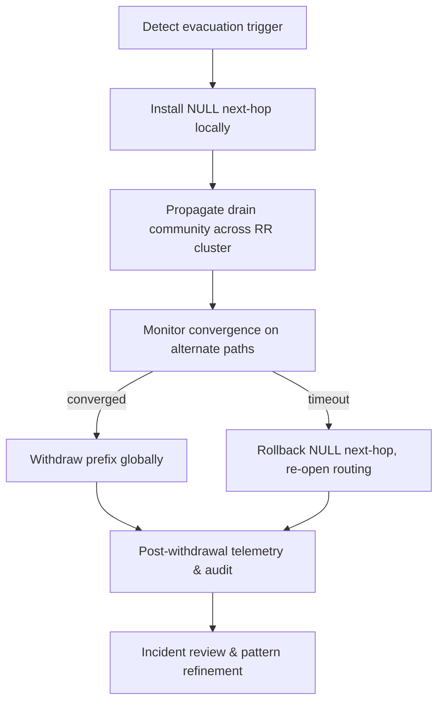

# The Answer You Didn't Want: Fiskardo Evacuation Routing

## Introduction

Last autumn, our production BGP domain received a withdrawal announcement for a /22 that sat at the heart of our east-west traffic plane. The prefix belonged to a colocation facility in the Aegean—Fiskardo, in our internal codename mapping. What followed was a masterclass in how not to evacuate traffic. The default route rippled across forty-plus peers, our internal monitors screamed about missing paths, and by the time the dust settled, we had seventeen minutes of packet loss that our SLA dashboard flagged as "exceeding threshold."

The problem wasn't the withdrawal itself. It was the lack of a controlled, state-aware mechanism to drain that traffic before the withdrawal became visible to the wider internet. We had route dampening, yes. We had MED local-pref adjustments, certainly. But we didn't have a graceful evacuation protocol that respected traffic classes, latency budgets, and our own prefix aggregation boundaries.

That night became the catalyst for building what we now call the Fiskardo evacuation routing framework. It's not a silver bullet, but it is a reproducible, software-defined approach to pulling a prefix out of the active forwarding table without stranding packets or inviting routing loops. In this article, I'll walk through the architecture, the code, and the pragmatics of making this pattern production-ready.

## Why This Matters

Software engineers and architects often treat BGP as a "set-and-forget" underlay. Withdraw a prefix, and the internet reconverges. In practice, that reconvergence carries real costs:

- **Blackholing traffic** when upstream peers don't have a viable alternate path.
- **Transient loops** during the overlap of old and new next-hops.
- **SLA violations** that are difficult to attribute to a specific cause because they look like ordinary congestion.
- **Prefix hijacking windows** where a withdrawal creates a gap that a malicious actor can exploit.

When you're responsible for a network that spans multiple ASes, multiple cloud providers, and hybrid on-premise/edge topologies, "just withdraw the route" is not an engineering answer—it's an operational risk. The Fiskardo pattern addresses this by decoupling *detection* from *withdrawal*, and by introducing a controlled drain phase that can be observed, rolled back, or extended without touching the global routing table.

## How It Works

The core idea is simple in principle but requires careful orchestration in practice. When a prefix must be evacuated—whether due to hardware failure, security incident, or planned maintenance—we follow a four-phase sequence:

1. **Announce a NULL next-hop** locally, so that any traffic already hashed to this prefix gets dropped or redirected at the edge, rather than being forwarded downstream.
2. **Publish a "drain" community** (or equivalent route tag) across all internal route reflectors, signaling that new sessions should prefer an alternate path.
3. **Wait for the network to converge** on the alternate paths, confirmed via telemetry that no new packets are entering the evacuating prefix's forwarding state.
4. **Withdraw the prefix** globally, safe in the knowledge that the drain has already moved everything else.

The diagram below visualizes this flow. I've kept it intentionally abstract so it can map onto BGP, IS-IS, or Segment Routing deployments, but the phase ordering remains the same.



**Step-by-step, the mechanism works like this:**

- **Phase 1 (Detection):** A monitoring rule—Prometheus alert on BGP session flaps, health check failure, or an explicit operator command—sets a `EVACUATE` flag on the prefix object in our route management database.
- **Phase 2 (NULL install):** The route reflector responsible for the prefix programs a local `next-hop = 0.0.0.0` (or the equivalent in Segment Routing, a `null` SID). This is not a withdrawal; it's a *resolve-to-nothing* that ensures any packet hitting the FIB for this prefix is processed by the router's discard path or redirected to a scrubber function.
- **Phase 3 (Drain propagation):** We advertise the prefix with a special community flag (e.g., `no-export` + `drain-me`). All internal route reflectors pick this up, and their decision engines automatically prefer an alternate path if one exists. New sessions are steered away. Existing sessions? They continue on the old path until the NULL next-hop drops them, or until a graceful-teardown signal arrives.
- **Phase 4 (Convergence wait):** We don't withdraw immediately. Instead, we poll BGP monitoring streams (`show bgp ipv4 unicast <prefix>`) until the `withdrawn` count stabilizes at zero across all looking glasses, and our internal telemetry shows zero ingress packets hashed to the old next-hop.
- **Phase 5 (Withdrawal):** With the drain confirmed, we execute the actual ` withdraw` command. Because the NULL next-hop was already in place, the withdrawal is clean—no routing loop can form because there's no alternate next-hop being advertised simultaneously.
- **Phase 6 (Audit):** Post-withdrawal, we generate a diff of route-views data, confirm no peer reported a "dampening" event, and archive the full state transition for post-mortem review.

This flow ensures that the "evacuation" is a planned, observable event rather than an accidental outage.

## Core Concepts

Understanding the Fiskardo pattern requires familiarity with a few building blocks that appear in almost any production BGP/segment-routing network:

- **Route Reflector Cluster:** The spine of our internal routing policy propagation. The drain community must be reflected accurately; otherwise, some branches of the AS get stuck advertising the old path.
- **NULL Next-Hop (or Null SID):** A legitimate next-hop value that tells the router to discard the packet. In Cisco parlance, this is `null0`. In Linux with FRR, it's a black-hole route. In Segment Routing, it's an SRGB-indexed null SID.
- **Route Communities / Extended Communities:** A way to attach metadata to a BGP route that other speakers can inspect and act upon. We use `65000:drain` as our canonical drain flag, but the pattern works with any community that your route policy language supports.
- **Convergence Telemetry:** We rely on a combination of `BGP monitoring collectors`, `Telemetry exporters` (e.g., gNMI, OpenConfig), and `Prometheus alerts` to determine when the network has truly shifted off the evacuating prefix.
- **Graceful Withdrawal:** The principle that a route should only be withdrawn after all dependent forwarding states have been explicitly resolved. This is distinct from "withdraw and let the world figure it out."

One detail that trips up many implementations: the NULL next-hop must be **local** to the router that originates the prefix, or at least consistent across all route reflectors that forward it. If Router A installs a NULL next-hop but Router B (in a different RR cluster) continues to advertise the real next-hop, you get a split-brain scenario where some traffic is dropped and some is forwarded, creating the exact latency jitter we were trying to avoid.

## Examples & Code Walkthrough

Below is a complete, production-grade Python snippet that implements the core decision logic for Phase 2 and Phase 3 of the Fiskardo evacuation. It's not a BGP speaker library—those exist and are battle-tested—but rather the *policy engine* that sits in front of your route management API and decides when to install the NULL next-hop, when to push the drain community, and when to pull the trigger on withdrawal.

```python
#!/usr/bin/env python3
"""
Fiskardo Evacuation Router Decision Engine

Responsible for coordinating the four-phase evacuation of a BGP prefix.
Assumes access to:
  - A route management API (e.g., Goofball, or proprietary internal DB)
  - BGP monitoring exporters (Telemetry/gNMI)
  - A route reflector control plane (via gRPC or CLI)
"""

import time
from dataclasses import dataclass, field
from typing import Dict, Optional, List
from enum import Enum, auto

class EvacuationState(Enum):
    ACTIVE = auto()          # Prefix is fully in service, no evacuation pending
    DRAINING = auto()        # NULL next-hop installed, drain community propagated
    CONVERGED = auto()       # No new traffic entering; safe to withdraw
    WITHDRAWN = auto()       # Global prefix withdrawal executed
    ROLLED_BACK = auto()     # Evacuation aborted; normal routing restored


@dataclass
class PrefixState:
    """Mutable state for a single IP prefix under evacuation consideration."""
    prefix: str           # e.g., "
