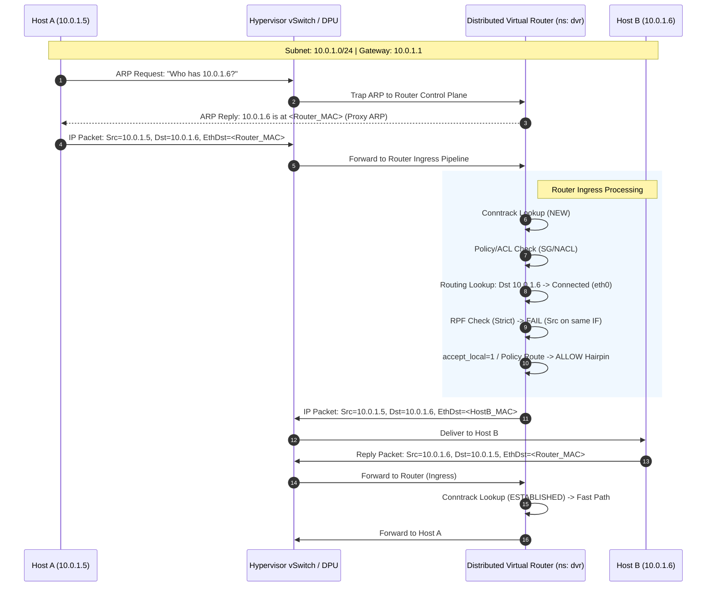

# Two hosts, one wire, and a hairpin through the router

## Introduction

You provision two instances in the same subnet. Same availability zone. Same VPC. You `ping` one from the other, expecting sub-millisecond latency. Instead, you see 1.2 ms, sometimes spiking to 3 ms. You run `tcpdump` on the sender. The destination MAC isn't the receiver's interface—it's the default gateway.

Congratulations. You’ve just discovered the hairpin.

In traditional networking, two hosts on the same L2 segment talk directly. ARP resolves the MAC, frames switch, done. But in modern cloud VPCs, container overlays (Cilium, Calico), and secured on-prem fabrics (Cisco ACI, VMware NSX), that direct path is often intentionally broken. The "wire" is a logical construct. The router—whether a distributed virtual router (DVR), a centralized gateway, or a Linux box running FRR—sits in the middle of every conversation, even between neighbors.

This article dissects why this happens, what it breaks (performance, MTU, stateful inspection), and how to detect and control it in Linux environments.

## Why This Matters

If you treat the cloud like a flat L2 network, you will bleed money and latency.

**The production pain points are specific:**
*   **Latency tax:** Every packet traverses the hypervisor switch, hits the router namespace (or appliance), undergoes conntrack lookup, NAT evaluation, policy evaluation, then hairpins back out the same interface. That’s 5–15 µsec per hop per packet *best case*. Under load, conntrack lock contention adds milliseconds.
*   **MTU surprises:** Overlay encapsulation (VXLAN, Geneve) adds 50+ bytes. If the router doesn't clamp MSS or fragment, TCP stalls silently. I’ve seen `kubectl exec` hang for 15 seconds because a 1500-byte packet hit a 1450-byte tunnel MTU on the return path *inside the same subnet*.
*   **Stateful firewall bypass/overload:** If your security group / NetworkPolicy allows egress but denies ingress, hairpin traffic often matches the *ingress* rule on the return leg (source=peer, dest=me). You end up blocking your own traffic or, worse, filling the conntrack table with `ESTABLISHED` entries for localhost-to-localhost traffic.
*   **Observability gaps:** `tcpdump` on `eth0` shows the gateway MAC. You lose visibility into the actual peer. eBPF tools (like `bpftrace` or Cilium Hubble) become mandatory because the kernel sees the packet *after* the routing decision.

## How It Works

The mechanism relies on **Proxy ARP** and **Local Route Injection**.

When Host A (10.0.1.5) ARPs for Host B (10.0.1.6), the router (10.0.1.1) answers with its own MAC address—*if* Proxy ARP is enabled on the router's interface facing that subnet. Host A sends frames to the router. The router sees the destination IP (10.0.1.6) matches a connected route on the *same* interface it received the packet on. It performs a routing lookup, realizes the next-hop is directly attached on `eth0`, but because `rp_filter` (Reverse Path Filtering) is usually strict (`1`), it would drop the packet unless **`accept_local`** is toggled or the route table forces a hairpin via a specific rule.

In Linux VPC implementations (AWS Nitro, GCP Andromeda, Azure VNet), this is enforced by the control plane programming the host's vSwitch/DPU with a "Local Route" entry pointing to the router function, effectively disabling L2 learning between workload ports.



### Step-by-Step Breakdown

1.  **ARP Interception:** Host A broadcasts ARP. The vSwitch/DPU traps this to the control plane (or local router namespace) instead of flooding to Host B.
2.  **Proxy ARP Reply:** The router replies with its own MAC. Host A believes the gateway *is* Host B.
3.  **Ingress Processing:** Packet hits the router. Conntrack state `NEW`. ACLs evaluate.
4.  **The Hairpin Decision:** Routing table says "10.0.1.6 is connected on eth0". Standard kernel logic (strict `rp_filter`) drops packets arriving on an interface where the source IP isn't routable *back* out that interface. Since Src=10.0.1.5 is on eth0, but packet *came in* eth0, RPF fails.
5.  **The Knob:** `net.ipv4.conf.eth0.accept_local=1` (or equivalent policy route) tells the kernel: "Accept this packet even though RPF fails, because I know I'm hairpinning."
6.  **Egress:** Router rewrites destination MAC to Host B's real MAC (learned via its own ARP table or control plane) and transmits back out `eth0`.

## Core Concepts

### 1. Proxy ARP (`/proc/sys/net/ipv4/conf/<iface>/proxy_arp`)
The mechanism allowing the router to answer ARP requests on behalf of other hosts. In cloud VPCs, this is almost always **ON** for the gateway interface. It effectively splits the broadcast domain.

### 2. Reverse Path Filtering (`rp_filter`)
*   **Mode 0 (Disabled):** No validation. Asymmetric routing works, but spoofing is trivial.
*   **Mode 1 (Strict):** Kernel validates source IP against FIB. If the best route to Src IP isn't the ingress interface, drop. **This kills hairpinning by default.**
*   **Mode 2 (Loose):** Kernel only checks if Src IP is reachable *via any* interface. Allows hairpinning but weakens spoof protection.

### 3. `accept_local` (`/proc/sys/net/ipv4/conf/<iface>/accept_local`)
The specific toggle to allow the router to accept packets destined for local IPs (or connected subnets) arriving on the interface where that subnet lives. **Required for hairpin on Linux routers with `rp_filter=1`.**

### 4. Conntrack Zones & Hairpin
When the router hairpins, it sees both directions of the flow.
*   **Ingress:** Tuple `(A:port -> B:port)`.
*   **Egress:** Tuple `(A:port -> B:port)` (same tuple).
The conntrack entry is created on the first packet. The return packet (B->A) matches the *reply* tuple. This doubles the conntrack lookup cost for intra-subnet traffic and consumes entries for traffic that never leaves the host.

## Examples & Code Walkthrough

Let's reproduce this in a lab using Linux Network Namespaces. We simulate a Cloud Hypervisor host with a Router Namespace and two Workload Namespaces.

```bash
#!/bin/bash
# hairpin-lab.sh
# Reproduces L2 isolation + Hairpin routing via Linux NetNS
# Requires: root, iproute2, iptables, conntrack-tools

set -euo pipefail

# Cleanup function
cleanup() {
    ip netns del router 2>/dev/null || true
    ip netns del host-a 2>/dev/null || true
    ip netns del host-b 2>/dev/null || true
    # Remove veth pairs if namespaces gone but interfaces remain
    ip link del veth-router-a 2>/dev/null || true
    ip link del veth-router-b 2>/dev/null || true
}
trap cleanup EXIT

echo "[+] Creating Namespaces..."
ip netns add router
ip netns add host-a
ip netns add host-b

echo "[+] Creating veth pairs (Host <-> Router)..."
# Host A <-> Router
ip link add veth-a type veth peer name veth-router-a
ip link set veth-a netns host-a
ip link set veth-router-a netns router

# Host B <-> Router
ip link add veth-b type veth peer name veth-router-b
ip link set veth-b netns host-b
ip link set veth-router-b netns router

echo "[+] Configuring Host A (10.0.1.5/24)..."
ip netns exec host-a ip addr add 10.0.1.5/24 dev veth-a
ip netns exec host-a ip link set veth-a up
ip netns exec host-a ip link set lo up
ip netns exec host-a ip route add default via 10.0.1.1 dev veth-a

echo "[+] Configuring Host B (10.0.1.6/24)..."
ip netns exec host-b ip addr add 10.0.1.6/24 dev veth-b
ip netns exec host-b ip link set veth-b up
ip netns exec host-b ip link set lo up
ip netns exec host-b ip route add default via 10.0.1.1 dev veth-b

echo "[+] Configuring Router Interfaces..."
# Router side IPs (Gateway IP .1 on both interfaces simulates shared L3 gateway)
ip netns exec router ip addr add 10.0.1.1/24 dev veth-router-a
ip netns exec router ip addr add 10.0.1.1/24 dev veth-router-b
ip netns exec router ip link set veth-router-a up
ip netns exec router ip link set veth-router-b up
ip netns exec router ip link set lo up

echo "[+] ENABLING HAIRPIN MAGIC on Router..."
# 1. Enable Proxy ARP: Router answers ARP for .5 on .6's port and vice versa
ip netns exec router sysctl -w net.ipv4.conf.veth-router-a.proxy_arp=1 >/dev/null
ip netns exec router sysctl -w net.ipv4.conf.veth-router-b.proxy_arp=1 >/dev/null

# 2. Enable Forwarding
ip netns exec router sysctl -w net.ipv4.ip_forward=1 >/dev/null

# 3. CRITICAL: accept_local=1 allows router to accept packet from .5 destined for .6 
#    arriving on veth-router-a (where .5 lives) and route it back out veth-router-a.
ip netns exec router sysctl -w net.ipv4.conf.veth-router-a.accept_local=1 >/dev/null
ip netns exec router sysctl -w net.ipv4.conf.veth-router-b.accept_local=1 >/dev/null

# 4. RPF Strict (Default) + accept_local = Hairpin Works.
#    If we used rp_filter=2 (Loose), accept_local not strictly needed but less secure.
ip netns exec router sysctl -w net.ipv4.conf.all.rp_filter=1 >/dev/null

echo "[+] Adding explicit LOCAL routes on Router for Hairpin logic..."
# Without this, router might think '10.0.1.6' is reachable via veth-router-b 
# and try to send it out there (which works but isn't the 'hairpin' path we want to test).
# We force the router to know both hosts are on 'local' scope for the specific interface.
# Actually, standard 'connected' route covers this. The magic is accept_local.

echo "[+] Verification: Host A pings Host B..."
# We expect: Host A -> Router (veth-router-a) -> Router (veth-router-a) -> Host B
ip netns exec host-a ping -c 3 10.0.1.6

echo "[+] Verification: Check Conntrack on Router..."
ip netns exec router conntrack -L -s 10.0.1.5 -d 10.0.1.6

echo "[+] Verification: TCPDUMP on Router Interface A (Ingress + Egress)..."
timeout 5 ip netns exec router tcpdump -n -i veth-router-a -e icmp || true

echo "[+] Lab Complete. Namespaces persist for manual inspection. Run 'cleanup' to remove."
# Keep namespaces alive for inspection
trap - EXIT
read -p "Press [Enter] to cleanup and exit..."
cleanup
```

### Code Commentary

1.  **Shared Gateway IP (10.0.1.1):** We assign the *same* IP to both router interfaces (`veth-router-a`, `veth-router-b`). This mimics a Distributed Virtual Router (DVR) where the gateway IP is anycast/present on every hypervisor. It forces the routing table to have two "connected" routes for 10.0.1.0/24.
2.  **`proxy_arp=1`**: This is the enabler. Without it, Host A's ARP for 10.0.1.6 times out (Host B never sees it because vSwitch isolates ports). The router replies "I am 10.0.1.6".
3.  **`accept_local=1`**: This is the *safety valve*. With strict `rp_filter=1`, the kernel calculates: "Packet from 10.0.1.5 arrived on veth-router-a. Route to 10.0.1.5 is via veth-router-a. But packet came *from* wire, not *to* wire. Drop." `accept_local` says "I generated this route locally (or it's my subnet), trust it."
4.  **Conntrack Output:** You will see a single entry `ESTABLISHED` for the flow. Note the `[UNREPLIED]` -> `[ASSURED]` transition happening entirely inside the router namespace.

## Best Practices

1.  **Clamp MSS at the Router:** If you run overlay (VXLAN/Geneve), the router *must* clamp TCP MSS on the ingress/egress interfaces (`iptables -t mangle -A FORWARD -p
