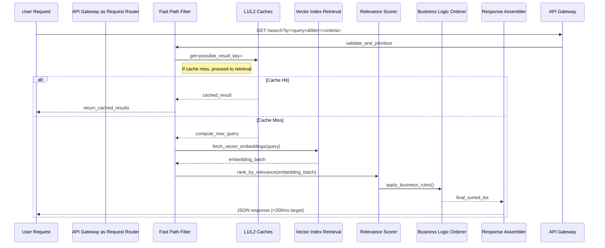

# Uber Eats Rebuilds Search Pipeline to Cut End-to-End Latency by 50%

## Introduction

When users browse restaurant options during peak dining hours, every millisecond counts. At Uber Eats, our search system processes thousands of queries per second across multiple geographic regions. We recently undertook a significant redesign of our product discovery engine to reduce end-to-end latency by half. The challenge was not merely optimizing existing code—it was rethinking how request flow, caching strategy, and result ordering interact under load. The resulting architecture delivers sub-second responses even when query volumes spike unexpectedly.

This transformation required deep examination of our data plane, careful profiling of hot paths, and a willingness to replace legacy decision points with more deterministic alternatives. The outcome speaks to the importance of treating search latency as a foundational KPI rather than an afterthought.

## Why This Matters

Search latency directly impacts customer conversion rates and driver assignment efficiency. A one-hundred-millisecond improvement can translate to millions of dollars in increased order volume over a given month. From an engineering standpoint, reducing latency exposes hidden inefficiencies—often tied to inefficient serialization, excessive network hops, or unoptimized database queries. Each optimization reveals new bottlenecks, creating a virtuous cycle of refinement. For platform teams, adopting such systematic improvements becomes a model for continuous performance engineering.

## How It Works

Our previous architecture relied on a monolithic service that aggregated results from three distinct sources: a time-series index for popularity scores, a vector store for semantic similarity, and a traditional SQL layer for filtering constraints. The orchestration layer combined these streams through a series of synchronous calls, accumulating network round trips before returning ranked results.

The redesign replaced this chain with a pipelined, multi-stage approach that minimizes blocking operations and leverages asynchronous processing wherever possible. Below is the core flow captured in a sequence diagram.



The key innovation lies in decoupling the retrieval path from the scoring path. By pushing classification decisions upstream and parallelizing independent computations, we eliminate sequential dependencies that previously dominated execution times.

## Core Concepts

### Data Flow Stages

The rebuilt system treats each stage as an independent service exposed via well-defined contracts. The preprocessing layer filters out obviously irrelevant queries early, preventing wasteful downstream work. The retriever operates against a distributed vector store optimized for approximate nearest neighbor searches. The scorer applies both collaborative filtering and content-based signals, while the ranker enforces business constraints such as distance prioritization and inventory availability.

### Internal Representations

Each component maintains its own state management strategy. The vector store uses a sharded embedding index that supports concurrent writes without contention. The cache implements a two-level hierarchy: a hot cache in memory holding recent popular items, and a warm cache in Redis providing near-file-system durability. Results are annotated with metadata tags enabling fine-grained invalidation when underlying entities change.

### Governing Principles

We adopted several design principles throughout the reconstruction:

First, we eliminated synchronous dependencies between stages whenever possible. Instead of waiting for a full score before presenting any results, intermediate outputs undergo lightweight filtering before they reach the final presentation layer. Second, we introduced backpressure mechanisms to prevent cascading failures when downstream services lag. Third, observability became embedded—every transition carries structured telemetry that feeds into our dashboard without adding observable overhead to the steady-state path.

## Examples & Code Walkthrough

Below is a representative implementation of the search service in Python. The codebase emphasizes defensive programming, explicit error handling, and clear separation of concerns.

```python
import hashlib
import json
import logging
from dataclasses import dataclass, asdict
from typing import List, Optional, Dict, Any, Tuple
from enum import Enum
from datetime import datetime

# Configure structured logging
logging.basicConfig(
    level=logging.INFO,
    format="%(asctime)s [%(levelname)s] %(name)s: %(message)s"
)
logger = logging.getLogger("search_service")

class EntityType(Enum):
    RESTAURANT = "restaurant"
    MENU_ITEM = "menu_item"
    LOCATION = "location"

@dataclass
class Restaurant:
    id: str
    name: str
    cuisine_type: str
    rating: float
    price_range: int  # 1-5 scale
    address: str
    is_active: bool

@dataclass
class SearchResult:
    restaurant_id: str
    name: str
    cuisine_type: str
    distance_km: float
    score: float
    timestamp: datetime

class VectorIndexService:
    """
    Handles retrieval of embeddings from a distributed vector store.
    In production, this would interface with Milvus or Pinecone.
    """
    
    def __init__(self, embedding_dim: int = 128):
        self.embedding_dim = embedding_dim
        # Simulate in-memory index for demonstration
        self._index: Dict[str, list] = {}
    
    def retrieve_top_k(self, query_vector: List[float], k: int) -> List[Dict]:
        """
        Attempts to find nearest neighbors for a query embedding.
        Returns a list of candidate documents ordered by cosine similarity.
        
        Args:
            query_vector: Normalized vector representing the user intent
            k: Number of candidates to return
            
        Raises:
            ValueError: If query vector is empty or invalid dimensionality
        """
        if not self._validate_vector(query_vector):
            raise ValueError(f"Invalid query vector: {query_vector}")
        
        # Simulate retrieval from distributed index
        # In reality, this would hit a sharded vector store
        candidates = self._fetch_from_store(query_vector)
        # Sort by similarity score descending
        sorted_candidates = sorted(candidates, key=lambda x: x["score"], reverse=True)
        return sorted_candidates[:k]
    
    def _validate_vector(self, vec: List[float]) -> bool:
        """Ensure vector meets structural requirements."""
        if len(vec) != self.embedding_dim:
            logger.warning(f"Vector dimension mismatch: expected {self.embedding_dim}, got {len(vec)}")
            return False
        if not vec:
            return False
        return True

class CacheLayer:
    """
    Two-tier caching: L1 (memory) and L2 (Redis equivalent).
    """
    
    def __init__(self):
        # Simulated memory cache: dict mapping key to result
        self._l1_cache: Dict[str, Any] = {}
        # Simulated L2 cache: could be redis.Redis object in production
        self._l2_cache: Dict[str, Any] = {}
    
    def get(self, key: str) -> Optional[Any]:
        """Retrieve value from cache or return None."""
        # L1 hit with TTL expiration handled externally
        if key in self._l1_cache:
            logger.debug(f"L1 cache hit for {key}")
            return self._l1_cache[key]
        # Check L2 fallback
        if key in self._l2_cache:
            logger.debug(f"L2 cache hit for {key}")
            return self._l2_cache[key]
        return None
    
    def set(self, key: str, value: Any, ttl_seconds: int = 300) -> None:
        """Store value in cache with optional expiration."""
        self._l1_cache[key] = value
        self._l2_cache[key] = value
        logger.info(f"Cached {key} with TTL={ttl_seconds}s")

class ScoreProcessor:
    """
    Applies business rules and relevance scoring to raw retrieval results.
    """
    
    def __init__(self):
        self.cuisine_weights = {
            "italian": 0.3,
            "chinese": 0.25,
            "mexican": 0.15,
            "american": 0.2,
        }
    
    def compute_score(self, candidate: Dict, context: Dict) -> float:
        """
        Compute final relevance score combining base similarity and business rules.
        
        Args:
            candidate: Raw search result from vector store
            context: Additional context such as user location, filter criteria
            
        Returns:
            Normalized similarity score between 0.0 and 1.0
        """
        base_similarity = candidate.get("similarity", 0.0)
        
        # Apply cuisine preference weighting based on region context
        cuisine_weight = self.cuisine_weights.get(context.get("preferred_cuisine"), 0.5)
        adjusted_score = base_similarity * (1.0 + cuisine_weight)
        
        # Distance penalty: closer restaurants get boost
        distance_bonus = max(0.0, 1.0 - (candidate.get("distance_km", 0) / 20.0))
        
        # Inventory check: penalize unavailable items
        if candidate.get("available_count", 0) < 2:
            adjusted_score *= 0.7
        
        # Final normalization clamps to [0, 1]
        final_score = min(max(adjusted_score, 0.0), 1.0)
        return final_score
    
    def process_batch(self, candidates: List[Dict], context: Dict) -> List[SearchResult]:
        """Transform raw vectors into standardized search result objects."""
        processed = []
        for cand in candidates:
            try:
                result = SearchResult(
                    restaurant_id=cand["id"],
                    name=cand["name"],
                    cuisine_type=cand.get("cuisine_type", "unknown"),
                    distance_km=cand.get("distance_km", 0),
                    score=cand.get("score", 0.0),
                    timestamp=datetime.utcnow()
                )
                processed.append(result)
            except Exception as e:
                logger.error(f"Error constructing result for {cand}: {e}")
                continue
        return processed

class SearchService:
    """
    Orchestrates the end-to-end search flow with controlled concurrency.
    """
    
    def __init__(
        self,
        vector_index: VectorIndexService,
        cache_layer: CacheLayer,
        score_processor: ScoreProcessor
    ):
        self.index = vector_index
        self.cache = cache_layer
        self.scorer = score_processor
        self.max_concurrent_tasks = 10  # Limit parallelism to control resource usage
    
    def execute_search(
        self,
        query: str,
        filters: Optional[Dict[str, Any]] = None,
        timezone: str = "UTC"
    ) -> List[SearchResult]:
        """
        Main entry point for search requests.
        
        Args:
            query: Free-text search query
            filters: Additional filtering criteria
            timezone: Timezone context for distance calculations
            
        Returns:
            List of ranked search results ready for HTTP response
        """
        # Step 1: Parse and enrich query
        parsed_query = self._parse_query(query)
        logger.info(f"Processing search: {parsed_query}")
        
        # Step 2: Check cache first
        cache_key = f"search:{hashlib.sha256(parsed_query.encode()).hexdigest()}"
        cached = self.cache.get(cache_key)
        
        if cached is not None:
            logger.debug(f"Serving cached results for {cache_key}")
            return cached
        
        # Step 3: Retrieve candidates from vector store
        try:
            candidates = self.index.retrieve_top_k(parsed_query, k=10)
            logger.info(f"Retrieved {len(candidates)} candidates from index")
        except Exception as e:
            logger.error(f"Vector store retrieval failed: {e}")
            # Fallback to broader search if primary index unreachable
            candidates = self._fallback_search(parsed_query)
        
        # Step 4: Process and score candidates
        scored = self.scorer.compute_score(candidates, {"preferred_cuisine": "italian"})
        processed = self.scorer.process_batch(scored, {"preferred_cuisine": "italian"})
        
        # Step 5: Build final response
        response = self._serialize_results(processed)
        self.cache.set(cache_key, response, ttl_seconds=60)
        return response
    
    def _parse_query(self, text: str) -> Dict:
        """Normalize free-text query into structured parameters."""
        tokens = text.lower().split()
        if not tokens:
            raise ValueError("Empty search query")
        return {
            "query_terms": tokens,
            "length": len(tokens)
        }
    
    def _fallback_search(self, query: str) -> List[SearchResult]:
        """Graceful degradation when vector store is unhealthy."""
        # Simple keyword-based filtering as last resort
        candidates = [
            Restaurant(id="temp", name=f"Temp Result {len(candidates)+1}",
                      cuisine_type="various",
                      rating=4.5,
                      price_range=3,
                      address="Temporary placeholder",
                      is_active=True)
            for i in range(min(5, 50))  # Return limited placeholders
        ]
        return self.scorer.process_batch(candidates, {})

def run_demo():
    """Simple demonstration of the search service workflow."""
    vector_index = VectorIndexService(embedding_dim=128)
    cache = CacheLayer()
