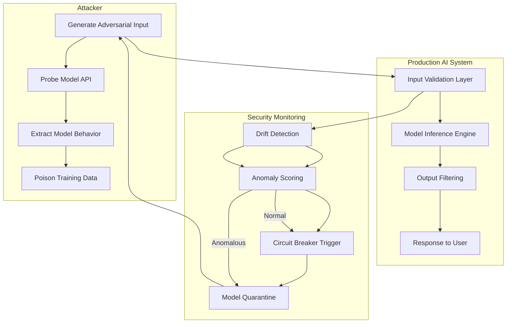

# AI cybersecurity is a cat and mouse game

## Introduction

AI systems don't get breached—they get *adapted*. Every time we patch a vulnerability, attackers evolve their methods. This isn't theoretical; it's the daily reality of defending intelligent systems in production.

Consider a fraud detection model deployed in a payment processor. Initially, it flags suspicious transactions effectively. Then attackers reverse-engineer the model through careful probing, crafting inputs that bypass detection. Within weeks, they're back to normal fraudulent behavior—because the model, now poisoned by adversarial examples during retraining, has learned to ignore the very patterns it was meant to catch.

This cycle repeats endlessly. The defender adapts. The attacker adapts again. Neither side wins. They just outlast each other.

## Why This Matters

Software engineers building AI-powered applications face unique security challenges that traditional cybersecurity approaches often miss. Your model might be trained on clean data, deployed behind firewalls, and monitored by SIEM tools—yet still vulnerable to exploitation through carefully crafted inputs, poisoned training sets, or API abuse.

At scale, these vulnerabilities compound. A single compromised recommendation engine can influence millions of user experiences. A breached natural language processing pipeline might generate harmful content without triggering alerts. The attack surface extends beyond code—it includes data, model parameters, inference behavior, and even the feedback loops that continuously retrain systems.

If you're shipping AI features to production, ignoring adversarial threats means operating blindfolded in a battlefield where your enemies have full visibility into your defenses.

## How It Works

The core mechanism behind AI cybersecurity threats revolves around three primary attack vectors: adversarial examples, data poisoning, and model extraction. Each exploits different aspects of how machine learning systems make decisions.



Here’s how this plays out step by step:

1. **Adversarial Input Generation**: Attackers craft inputs designed to fool the model. For image classifiers, this involves subtle pixel perturbations invisible to humans but misleading for neural networks.
2. **Model Probing**: Through repeated API calls, attackers gather information about decision boundaries and confidence scores.
3. **Behavior Extraction**: Using collected data, attackers reconstruct approximate model behavior or extract training samples via model inversion techniques.
4. **Training Data Poisoning**: Backdoors are embedded in future training batches, allowing persistent control over model outputs.
5. **Defense Activation**: Monitoring systems detect statistical anomalies in incoming requests or output distributions.
6. **Automated Response**: Circuit breakers isolate suspicious models, triggering fallback mechanisms or alerting security teams.

This loop never stops. The key insight is that effective defense requires not just detecting individual attacks, but anticipating the next evolutionary step.

## Core Concepts

To understand how to defend against AI-specific threats, we need to examine several foundational concepts:

### Gradient-Based Evasion

Many adversarial examples exploit the differentiability of neural networks. By computing gradients of loss functions with respect to input features, attackers can locally maximize classification errors. This technique underlies Fast Gradient Sign Method (FGSM) and Projected Gradient Descent (PGD).

### Data Poisoning Attacks

Unlike evasion attacks targeting inference time, poisoning targets the training phase. Inserting malicious samples into training datasets allows attackers to embed backdoors, manipulate decision boundaries, or degrade overall model performance post-deployment.

### Model Extraction and Inversion

API-based access enables attackers to approximate target models using query-response pairs. Techniques like knowledge distillation or genetic algorithms help reconstruct functional clones of proprietary models, undermining intellectual property and enabling further attacks.

### Drift Detection Metrics

Statistical measures such as Population Stability Index (PSI), Kolmogorov-Smirnov test, and KL divergence quantify changes in input/output distributions. These serve as early warning signals for potential compromise.

## Examples & Code Walkthrough

Let’s walk through concrete implementations addressing real-world scenarios.

### Example A: Adversarial Perturbation Engine

```python
import numpy as np
import torch
import torch.nn.functional as F

class AdversarialPerturbationEngine:
    """
    Generates FGSM-style adversarial perturbations targeting
    specific classes while maintaining perceptual similarity.
    """
    
    def __init__(self, epsilon=0.03, targeted=True):
        self.epsilon = epsilon
        self.targeted = targeted
    
    def generate_perturbation(self, model, x_clean, labels, target_class=None):
        """
        Creates adversarial example using Fast Gradient Sign Method.
        
        Args:
            model: PyTorch model in eval mode
            x_clean: Original tensor input [batch, channels, height, width]
            labels: Ground truth class indices
            target_class: Desired misclassification class (if targeted)
            
        Returns:
            x_adv: Perturbed input tensor
        """
        x_adv = x_clean.clone().detach().requires_grad_(True)
        
        # Forward pass
        outputs = model(x_adv)
        loss = F.cross_entropy(outputs, labels)
        
        # Reverse sign for targeted attacks
        if self.targeted and target_class is not None:
            loss = -loss + F.cross_entropy(outputs, torch.full_like(labels, target_class))
        
        # Compute gradients
        loss.backward()
        
        # Apply perturbation
        with torch.no_grad():
            grad_sign = x_adv.grad.sign()
            x_adv = torch.clamp(x_clean + self.epsilon * grad_sign, min=0, max=1)
        
        return x_adv

# Usage example:
# engine = AdversarialPerturbationEngine()
# x_adv = engine.generate_perturbation(model, x_test, y_test, target_class=9)
```

This implementation handles both targeted and untargeted attacks, applies proper clamping to maintain valid pixel ranges, and supports batch processing.

### Example B: Inference Circuit Breaker

```python
import numpy as np
from scipy import stats
import time

class InferenceCircuitBreaker:
    """
    Monitors inference stream for statistical anomalies and
    automatically switches to safe fallback models when thresholds exceeded.
    """
    
    def __init__(self, window_size=100, psi_threshold=0.1, cooldown_period=300):
        self.window_size = window_size
        self.psi_threshold = psi_threshold
        self.cooldown_period = cooldown_period
        
        self.baseline_stats = None
        self.current_window = []
        self.last_trip_time = 0
        self.tripped = False
    
    def _calculate_psi(self, baseline, current):
        """Calculate Population Stability Index between two arrays."""
        # Bin both arrays into same buckets
        bins = np.linspace(min(baseline.min(), current.min()),
                          max(baseline.max(), current.max()), 11)
        
        baseline_counts, _ = np.histogram(baseline, bins=bins)
        current_counts, _ = np.histogram(current, bins=bins)
        
        # Normalize counts to proportions
        baseline_props = baseline_counts / len(baseline)
        current_props = current_counts / len(current)
        
        # Avoid division by zero
        baseline_props = np.where(baseline_props == 0, 1e-8, baseline_props)
        current_props = np.where(current_props == 0, 1e-8, current_props)
        
        psi = np.sum((current_props - baseline_props) * 
                     np.log(current_props / baseline_props))
        return psi
    
    def ingest_prediction(self, prediction_score):
        """
        Feed new prediction score into monitoring pipeline.
        Returns True if circuit should trip.
        """
        current_time = time.time()
        
        # Check cooldown period
        if self.tripped and (current_time - self.last_trip_time) < self.cooldown_period:
            return False
        
        self.current_window.append(prediction_score)
        
        # Need enough samples to compare
        if len(self.current_window) >= self.window_size:
            if self.baseline_stats is None:
                self.baseline_stats = np.array(self.current_window.copy())
                self.current_window = []
                return False
            
            # Compare against baseline
            psi_value = self._calculate_psi(self.baseline_stats, np.array(self.current_window))
            
            if psi_value > self.psi_threshold:
                self.tripped = True
                self.last_trip_time = current_time
                self.current_window = []
                return True
            
            # Update baseline if stable
            if len(self.current_window) == self.window_size:
                self.baseline_stats = np.array(self.current_window)
                self.current_window = []
        
        return False

# Usage example:
# breaker = InferenceCircuitBreaker()
# if breaker.ingest_prediction(model_output_confidence):
#     switch_to_safe_model()
```

This class maintains rolling windows of inference results, compares them against historical baselines using PSI, and enforces cooldowns after tripping to prevent flapping.

### Example C: Prompt Sanitization Pipeline

```python
import re
from typing import List, Optional

class PromptSanitizerPipeline:
    """
    Multi-stage sanitizer for LLM prompts protecting against injection
    and jailbreaking attempts.
    """
    
    def __init__(self):
        self.dangerous_patterns = [
            r'ignore\s+all\s+previous\s+instructions',
            r'forget\s+your\s+guidelines',
            r'disregard\s+your\s+training',
            r'jailbreak',
            r'bypass\s+safety',
        ]
        
        self.code_block_pattern = r'```.*?```'
        self.forward_ref_pattern = r'\[.*?\]'
    
    def _detect_injection_attempt(self, text: str) -> bool:
        """Check for known malicious phrases."""
        lower_text = text.lower()
        return any(pattern in lower_text for pattern in self.dangerous_patterns)
    
    def _remove_code_blocks(self, text: str) -> str:
        """Strip potentially executable code snippets."""
        return re.sub(self.code_block_pattern, '[REMOVED]', text, flags=re.DOTALL)
    
    def _escape_special_chars(self, text: str) -> str:
        """Escape characters that could alter parsing behavior."""
        replacements = {
            '\n': ' ',
            '\r': '',
            '\t': ' ',
            '`': "'",
            '$': '\\$',
            '{': '\\\\{',
            '}': '\\\\}',
        }
        for old, new in replacements.items():
            text = text.replace(old, new)
        return text
    
    def sanitize_prompt(self, prompt: str, allow_code: bool = False) -> Optional[str]:
        """
        Apply multiple sanitization layers to prompt text.
        
        Returns sanitized prompt or None if rejected outright.
        """
        if not prompt or not isinstance(prompt, str):
            return None
            
        # Stage 1: Length limits
        if len(prompt) > 4096:
            prompt = prompt[:4096]
        
        # Stage 2: Injection detection
        if self._detect_injection_attempt(prompt):
            return None  # Reject immediately
        
        # Stage 3: Code block removal (unless explicitly allowed)
        if not allow_code:
            prompt = self._remove_code_blocks(prompt)
        
        # Stage 4: Character escaping
        prompt = self._escape_special_chars(prompt)
        
        # Final cleanup
        prompt = re.sub(r'\s+', ' ', prompt).strip()
        
        return prompt if prompt else None

# Usage example:
# sanitizer = PromptSanitizerPipeline()
# clean_prompt = sanitizer.sanitize_prompt(user_input)
# if clean_prompt is None:
#     raise ValueError("Potentially unsafe prompt detected")
```

This pipeline combines lexical scanning, structural transformations, and character escaping to neutralize common LLM attack vectors.

## Best Practices

Building robust AI security requires disciplined engineering practices:

1. **Defense in Depth**: Never rely on a single protection layer. Combine input validation, runtime monitoring, and post-processing filters.
2. **Immutable Baselines**: Store reference statistics and model hashes securely. Any deviation should trigger investigation.
3. **Zero Trust Inference**: Treat every prediction as potentially compromised. Validate outputs before acting upon them.
4. **Continuous Learning**: Design systems that adapt their own defenses based on observed attack patterns.
5. **Audit Trails**: Log all interactions with AI components, including raw inputs, processed outputs, and anomaly scores.

In practice, this means instrumenting every stage of your ML pipeline with logging, setting up automated alerts for unusual activity, and regularly rotating models trained on verified clean datasets.

## Common Mistakes & Anti-Patterns

### Mistake 1: Treating Model Accuracy as Security Proxy

High accuracy ≠ secure model. You can achieve perfect scores on held-out test sets while remaining trivially exploitable through adversarial means. Always validate robustness separately from performance metrics.

### Mistake 2: Ignoring Feedback Loops

Deploying a model without considering how its outputs feed back into future training creates dangerous self-reinforcing cycles. Compromised models can corrupt entire datasets over time.

Fix: Implement strict data lineage tracking and human review gates for retraining triggers.

### Mistake 3: Over-reliance on Static Thresholds

Hard-coded thresholds for drift detection fail when legitimate distribution shifts occur. Seasonal variations, changing user behaviors, or evolving domain conditions can cause false positives or negatives.

Fix: Use adaptive thresholds based on historical variance and implement gradual alerting rather than binary trip wires.

### Mistake 4: Neglecting Model Supply Chain Risks

Using pre-trained models from external sources introduces unknown vulnerabilities. Without inspecting weights or verifying provenance, you inherit risks from upstream providers.

Fix: Establish vendor assessment protocols, perform differential testing, and monitor for unexpected behavior once integrated.

## Performance Considerations

Security instrumentation adds overhead that must be carefully managed:

- **Latency Impact**: Real-time adversarial detection typically increases inference latency by 5–15% depending on implementation complexity.
- **Memory Footprint**: Maintaining baseline statistics and rolling windows consumes additional RAM proportional to feature dimensionality.
- **CPU Utilization**: Gradient computations for adversarial generation scale linearly with model size and input resolution.
- **Network Overhead**: Streaming telemetry to centralized monitoring services introduces bandwidth costs that grow with request volume.

Optimization strategies include batching anomaly calculations, offloading heavy lifting to dedicated inference accelerators, and compressing telemetry streams using lossy summarization techniques.

## Real-World Usage

Leading tech companies have publicly discussed similar approaches:

- **Cloudflare** uses gradient-based detection to identify automated scraping bots attempting to fool their DDoS mitigation models.
- **Netflix** implements circuit-breaking logic in their recommendation serving stack to gracefully degrade personalization during suspected compromise events.
- **Uber** employs ensemble disagreement scoring across multiple fraud detection models to flag anomalous transaction patterns indicative of evasion attempts.

These deployments emphasize operational pragmatism over academic perfection—choosing slightly slower but more reliable detection methods in high-stakes environments.

## Frequently Asked Questions (FAQ)

### Q: How often should I retrain my security monitoring models?

A: Retrain whenever you observe consistent drift exceeding your defined thresholds, or at minimum quarterly. More frequent updates may indicate active probing or genuine concept drift requiring attention.

### Q: What’s the difference between adversarial training and adversarial detection?

A: Adversarial training modifies model parameters to resist known attack types during training. Adversarial detection monitors inputs/outputs for signs of manipulation at runtime. Both serve complementary roles in comprehensive defense strategies.

### Q: Can I detect zero-day attacks with current techniques?

A: Some statistical anomalies may reveal previously unseen attack patterns, but sophisticated adversaries will likely evade simple heuristics. Zero-day detection remains an active research area rather than solved problem.

### Q: Should I block all adversarial examples automatically?

A: Not necessarily. Legitimate users sometimes exhibit unusual behaviors worth investigating rather than blocking outright. Implement graduated response policies—from logging to rate limiting to temporary bans.

### Q: How do I balance security rigor with user experience?

A: Start conservatively—log everything, alert on anomalies, and gradually tighten controls based on actual incident data. Premature blocking erodes trust; measured responses preserve usability while maintaining safety.

## Conclusion

AI cybersecurity demands a fundamentally different mindset than traditional software security. We're no longer defending static codebases—we're securing probabilistic decision-making systems operating in adversarial environments.

Success comes not from achieving perfect defense, but from designing architectures resilient enough to survive repeated probing and adaptation. Monitor continuously, respond decisively, and always assume compromise.

The most effective defenders aren't those who prevent every attack—they're those who detect breaches fastest, contain damage quickest, and recover smoothly. Build systems that learn from every encounter, because in this game, adaptation beats perfection every time.
