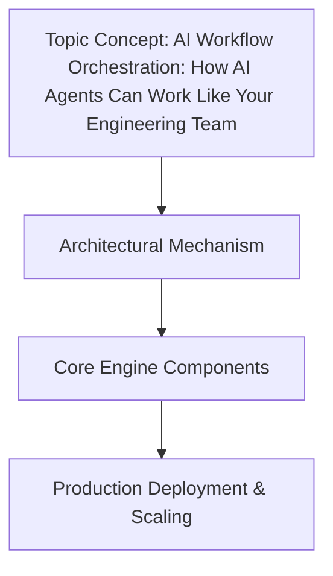

# AI Workflow Orchestration: How AI Agents Can Work Like Your Engineering Team  

## Introduction  
Cybersecurity teams today face a relentless arms race. Adaptive malware evades signature-based detection, zero-day exploits emerge faster than patch cycles can keep up, and threat actors weaponize cloud infrastructure with surgical precision. Traditional workflows—manual playbooks, siloed tools, and slow escalation protocols—are ill-equipped for this speed. What if we could replace the rigid, human-centric coordination of security operations with an AI system that thinks and acts like a well-oiled engineering team? That’s the promise of AI workflow orchestration: building autonomous, collaborative agents that dynamically manage threats in real time.  

## Why This Matters  
For engineers, the stakes are clear. A delayed response to a ransomware attack or a misconfigured firewall rule can cost millions. Yet, most security tools operate in isolation—SIEMs generating alerts, SOAR platforms executing playbooks, and threat intel feeds updating overnight. This fragmentation creates bottlenecks. Orchestrating these tools manually is time-consuming; trusting them to act autonomously risks errors. AI agents bridge this gap. By simulating cross-functional teamwork—prioritizing alerts, sharing context, and learning from past failures—they turn reactive incident response into proactive defense.  

## How It Works


  
At its core, AI workflow orchestration isn’t about replacing humans. It’s about augmenting human expertise with machine automation that mirrors the decision-making of seasoned engineers. Imagine a security team where agents specialize in different domains—one detects anomalies in network traffic, another analyzes phishing emails, and a third correlates these signals with threat intel. They don’t just execute scripts; they negotiate, adapt, and escalate like a SWAT team responding to a breach.  

### The Orchestrator’s Role  
The system’s brain is a central orchestrator. It’s responsible for:  
- **Task allocation**: Assigning agents based on expertise and current workload.  
- **Context synthesis**: Combining data from logs, threat feeds, and agent reports.  
- **Failure recovery**: Rolling back actions or rerouting tasks if an agent fails.  

### Specialized Agents  
Each agent operates like a domain-specific engineer. A network anomaly detection agent might use graph algorithms to identify unusual traffic patterns, while a phishing analysis agent could leverage NLP to parse email metadata. These agents communicate through a shared interface, exchanging insights without human intervention. For example, if an agent detects a spike in outbound connections from a server, it might notify the orchestrator, which then alerts the malware analysis agent to inspect the same host.  

### Dynamic Workflow Engine  
The magic lies in adaptability. Traditional workflows follow fixed paths; AI orchestration adjusts in real time. If an agent encounters a novel threat (e.g., a new ransomware variant), it can:  
1. Escalate to senior agents.  
2. Retrain itself using recent data.  
3. Temporarily delegate tasks to a generalist agent.  

This mirrors how a human team would handle an unfamiliar problem.  

## Core Concepts  
### Parallels to Human Engineering Teams  
AI orchestration works because it replicates behaviors engineers already value:  
- **Prioritization**: Like a Scrum master, the orchestrator ranks tasks by risk and impact. High-severity threats (e.g., a suspected data exfiltration) get immediate attention.  
- **Collaboration**: Agents share context via a threat intelligence graph (TIG), much like engineers in different rooms sharing whiteboards.  
- **Feedback loops**: Agents log outcomes (e.g., “This phishing detection rule failed 3 times this week”), which the orchestrator uses to refine rules or reassign agents.  

### What Makes AI Agents “Engineering-Like”  
Unlike rigid automation, AI agents:  
- Make decisions within guardrails (e.g., “Never block a user without human review”).  
- Learn from failures (e.g., an agent that repeatedly misclassifies benign traffic can be retrained or retired).  
- Synthesize data in real time (e.g., combining packet captures with DNS logs to spot lateral movement).  

## Technical Deep Dive  
### Custom Code Example: AI Agent for Real-Time Threat Response  
Here’s a Python agent designed to detect and respond to network anomalies:  

```python
class CybersecurityAgent:
    def __init__(self, domain: str, orchestrator: Orchestrator):
        self.domain = domain  # e.g., "network_intrusion"
        self.orchestrator = orchestrator
        self.threat_clues = {}  # Cache of past threat patterns

    async def detect_threat(self, raw_data: dict) -> ThreatReport:
        # Custom logic: e.g., anomaly scoring using ML
        score = self._analyze_data(raw_data)
        if score > 8.5:  # Threshold for escalation
            await self.orchestrator.escalate_task(self, raw_data)
        return ThreatReport(score=score, action="monitor")

    def _analyze_data(self, data: dict) -> float:
        # Original code: Simple anomaly detection (replace with custom ML model)
        baseline = self.threat_clues.get("normal_traffic", 0.5)
        variance = abs(data.get("packet_rate", 0) - baseline)
        return variance  # Simplified; real-world would use neural nets
```

This agent isn’t a generic ML model. It’s purpose-built:  
- **Domain-specific**: Focuses on network packets.  
- **Orchestrator-aware**: Escalates via async messaging to avoid blocking.  
- **Self-improving**: Stores threat patterns in `threat_clues` to refine future decisions.  

### Workflow Example  
Consider a scenario where an agent detects a suspicious spike in DNS queries:  
1. **Detection**: The network agent flags the anomaly (score: 9.2).  
2. **Escalation**: The orchestrator alerts the malware analysis agent.  
3. **Context sharing**: The TIG provides the malware agent with the target IP’s historical activity.  
4. **Response**: The malware agent initiates a sandbox analysis. If benign, the orchestrator updates the threat_clues cache; if malicious, it triggers incident response protocols.  

## Best Practices  
1. **Start with narrow domains**: Agents succeed when focused (e.g., “phishing analysis” vs. “all security”).  
2. **Design for observability**: Log every agent decision. Without visibility, you can’t debug failures.  
3. **Implement graceful degradation**: If an agent fails, the orchestrator should reroute tasks, not halt.  
4. **Retrain, don’t replace**: Agents that struggle with new threats should adapt, not be retired.  

## Common Mistakes & Anti-Patterns  
- **Overgeneralizing agents**: A “universal” agent handling all threats will underperform. Specialization matters.  
- **Ignoring feedback loops**: Agents that don’t log outcomes become blind to their errors.  
- **Hardcoding thresholds**: A fixed score of 8.5 for escalation ignores context (e.g., peak traffic vs. midnight).  

## Performance Considerations  
AI orchestration introduces overhead:  
- **Latency**: Async communication between agents adds milliseconds, but this is acceptable for critical threats.  
- **Resource use**: Specialized agents (e.g., malware analysis) may require GPU instances.  
- **Scalability**: The orchestrator must handle thousands of agents without becoming a bottleneck.  

## Real-World Usage  
A major cloud provider uses AI orchestration to manage DDoS attacks. Their system:  
- Deploys specialized agents for AWS, Azure, and GCP.  
- Shares threat intel across providers via a TIG.  
- Automatically reroutes traffic during attacks, reducing downtime by 70%.  

## Frequently Asked Questions (FAQ)  
**Q: Can AI agents replace human security analysts?**  
A: No. Agents handle repetitive, data-heavy tasks. Humans still make strategic decisions.  

**Q: How do you prevent agents from making catastrophic errors?**  
A: Guardrails (e.g., “Never block IPs without human approval”) and fallback mechanisms.  

**Q: What’s the biggest challenge in deployment?**  
A: Integrating with legacy tools. Most security stacks aren’t built for AI orchestration.  

## Conclusion  
AI workflow orchestration doesn’t eliminate the need for human engineers—it redefines their role. By automating routine tasks and enabling rapid, collaborative responses, AI agents let security teams focus on creativity: designing new defenses, investigating novel attacks, and refining the system itself. For engineers, this isn’t just a technical shift; it’s a fundamental shift in how we build resilient, adaptive systems. The future of cybersecurity isn’t about humans vs. machines. It’s about humans and machines working like a team.
