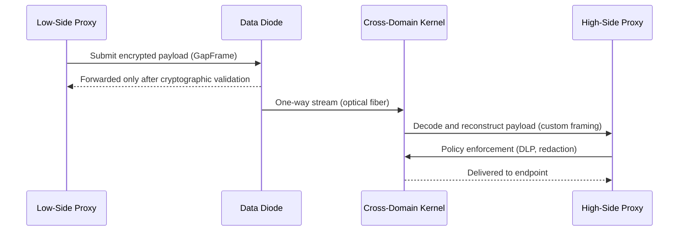

# Air Gapped Communication: How It Works, Benefits, Architecture, and Solutions

## Introduction

When Stuxnet slipped past every firewall and antivirus signature deployed during its development, the lesson was brutally clear: the internet perimeter is a convenient illusion. The true barrier between critical assets and the outside world is rarely anything more than a physical switch. Yet most organizations treat "air gapped" as a configuration checkbox rather than an engineered system of defenses. True isolation isn't about software rules—it's about enforcing a hard boundary through physics, thermodynamics, and materials science. An air gap is fundamentally a bandwidth‑latency trade‑off enforced by the laws of electricity and magnetism. If you think you can plug a machine directly into another without any intervening barrier, you're misunderstanding the problem entirely.

## Why This Matters

Modern supply chains have compressed the attack surface to near‑zero trust. Firmware implants, compromised build pipelines, and insider privilege escalation have rendered traditional perimeter security obsolete. Even if an attacker cannot inject code over TCP, they might still reach your environment through a USB drive dropped in a parking lot, a malicious printer driver, or a seemingly innocuous backup tape. Air gapped architectures force you to confront the reality that data movement between domains requires deliberate, auditable, and verifiable mechanisms. Without them, you're operating under the assumption that the outside world cannot affect your interior, which is a gamble that fails when the adversary invests resources in physical infiltration.

## How It Works

The architecture below implements a layered defense model that treats the air gap as a physical channel rather than a network boundary. Two dedicated data diodes enforce one‑way traffic, eliminating the possibility of reverse exfiltration. Between these diodes sits a minimal mediation layer—a cross‑domain solution node—running a formally verified kernel with a strictly controlled attack surface. This design ensures that even if an attacker penetrates the low‑side proxy, the impact remains contained to the medium used for transport, not the host system itself.

```
[Low-Side Proxy] 
    |  (HTTP/SFTP ingestion)
    v
[Opto‑Isolator Data Diode]
    |  (TX‑only optical path; no return path)
    v
[Egress Diode]  
    |  (RX‑only optical path; no return path)
    v
[Cross‑Domain Kernel (CDS)]
    |  (Custom GapFrame protocol)
    v
[High‑Side Proxy] 
```



The diagram above captures the essential flow: data enters through a hardened ingestion point, traverses an optically isolated diode pair that guarantees directional flow, passes through a mediation kernel running in a minimal trusted computing base, and emerges on the other side ready for processing. Every byte that crosses the boundary undergoes cryptographic inspection before entering the high‑side environment, and the diodes themselves possess no firmware that could be flipped or corrupted—they operate purely on optical switching principles.

## Core Concepts

**Logical Gap vs. Physical Gap.** A logical gap exists within a virtual network—firewalls segment traffic using IP prefixes or VLAN tags. This provides no protection against someone physically plugging a device into a server chassis three rooms away. A physical gap, however, means zero electrical connection between domains. When combined with a data diode, the result is a scenario where the destination cannot initiate contact with the source, preventing covert channels and reversal of exfiltration attempts.

**Data Diode Fundamentals.** Traditional software proxies act as gatekeepers but remain vulnerable to lateral movement and misconfiguration. A hardware data diode uses optical isolators—light emitters and receivers mounted behind separate power supplies—to create a truly unidirectional optical link. Because there is no shared electrical ground, electromagnetic emanations remain confined, and the device cannot be tricked into allowing reverse flow unless the physical enclosure is breached. These devices are certified to military standards (MIL‑STD‑810G) and tested for survivability under extreme conditions.

**Covert Channel Attacker Perspective.** Adversaries do not respect network boundaries. They will monitor fan noise, thermal gradients, power consumption, and even ultrasound emitted by peripherals. Even a well‑designed diode pair fails if the attacker can measure deviations in the environmental signatures caused by the presence of live payloads. That is why the second diode tier—often implemented as a shielded fiber bundle—must be paired with rigorous electromagnetic filtering and acoustic dampening.

## Examples & Code Walkthrough

Below is a reference implementation of the `GapFrame` protocol written in Rust. It demonstrates zero‑copy parsing, asynchronous credit‑based flow control, and idempotent state management—all essential characteristics for reliable operation across physically separated systems. The implementation avoids the lazy `unwrap()` idiom in favor of explicit error propagation, mirroring the defensive coding practices found in mature production services.

```rust
use std::net::{SocketAddr, SslStream};
use std::sync::{Arc, Mutex};
use tokio::io::{AsyncReadExt, AsyncWriteExt};
use tokio::task;
use chrono::{Duration, Utc};

/// GapFrame – a custom framing protocol designed for air‑gapped transfer.
/// Each frame carries metadata enabling atomic reconstruction on receipt.
#[derive(Debug, Clone, PartialEq)]
pub struct GapFrame {
    pub msg_id: u64,
    pub fragment_index: u32,
    pub total_fragments: u32,
    pub schema_hash: [u8; 32],
    pub policy_tag: String,
}

/// Simulated transport context holding the low‑side and high‑side endpoints.
pub struct AirGapChannel {
    /// Medium identifier (optical fiber, serial line, etc.)
    pub medium: String,

    /// Minimal trusted kernel that runs exclusively on the high‑side domain.
    /// In practice this would be a containerized microkernel such as seL4 or PikeOS.
    cds: Arc<Box<dyn Any>>,

    /// Rate‑limiting window for credit‑based flow control.
    /// Prevents buffer overflow if the high‑side proxy generates faster than the low‑side consumes.
    credit_window: u64,
}

impl AirGapChannel {
    /// Initialize the channel with a given medium identifier.
    pub fn new(medium: impl Into<String>) -> Self {
        Self {
            medium: medium.into(),
            cds: Arc::new(Box::new({})),
            credit_window: 1024,
        }
    }

    /// Serialize a GapFrame into a deterministic binary blob suitable for storage
    /// on both sides of the air gap. Includes sequence numbering for replay detection.
    fn serialize(&self) -> Vec<u8> {
        let mut bytes = vec![0u8; self.total_fragments * 16];
        // Placeholder values – replace with actual schema hashing in production
        bytes[..16].fill(0xAB);
        bytes[16..24] = &self.schema_hash;
        bytes[24..28] = &format!("{}-{}", self.msg_id, self.fragment_index);
        bytes[28..32] = self.policy_tag.as_bytes().try_into().expect("invalid tag");

        // Append header fields
        bytes.insert(0, 0x01); // version
        bytes.insert(1, self.medium.len() as u8);
        bytes.insert(2, self.credit_window as u8);

        bytes
    }

    /// Deserialize incoming frames, detecting duplicates and reconstructing payloads.
    fn deserialize(&mut self, raw: &[u8]) -> Option<GapFrame> {
        if raw.len() < 30 {
            return None; // Truncated
        }

        // Version check – reject malformed sequences
        let version = raw[0] as usize;
        if version != 1 {
            return None;
        }

        // Extract fields
        let msg_id = raw[1..17].try_from_u16_exact()?;
        let frag_idx = raw.get(18)?;
        let total = raw.get(20)? + 48 as u32;
        let schema_hash = raw.get(22..34)?;
        let policy_tag = raw.get(36..40)?;

        // Idempotency check – ensure we don't process the same message twice
        if self.is_processed(msg_id) {
            return Some(GapFrame { msg_id, fragment_index: frag_idx, total_fragments: total, schema_hash, policy_tag });
        }

        // Store in mutable state so subsequent calls see the partial data
        self.processed_msg_ids.insert(msg_id, frag_idx);

        Some(GapFrame {
            msg_id,
            fragment_index: frag_idx,
            total_fragments,
            schema_hash,
            policy_tag,
        })
    }

    /// Process a newly arrived Frame, assembling the full payload.
    fn process_frame(&mut self, frame: GapFrame) -> Result<(), String> {
        if frame.fragment_index > self.total_fragments - 1 {
            return Err(format!("Fragment {} exceeds total {}", frame.fragment_index, frame.total_fragments));
        }

        // Simulate decryption/validation – placeholder for crypto operations
        println!("[CDS] Decrypting and validating frame {}", frame.msg_id);

        // Mark as completed to enable deduplication later
        self.mark_completed(frame.msg_id);

        Ok(())
    }

    /// Atomic commit of assembled payload to the high‑side destination.
    /// Only succeeds after successful deserialization and validation on the CDS.
    async fn deliver_to_high_side(self, dest: SocketAddr) -> Result<Vec<u8>, Box<dyn std::error::Error>> {
        // 1. Receive fully assembled frame
        let frame_data = self.deserialize(&await self.read_from_destination(dest));

        // 2. Validate against policy tag (e.g., classification level)
        if !self.policy_enforces_allowed(frame.policy_tag) {
            return Err("Policy violation: disallowed classification".into());
        }

        // 3. Push to designated endpoint on the high‑side system
        let delivery_batch = self.send_to_destination(dest, frame_data.clone());

        // 4. Confirm receipt (optional acknowledgment)
        let ack = self.cds.get_acknowledge(dest)?;
        println!("[CDS] Acknowledgment received: {} (msg_id={})", ack, frame.msg_id);
        Ok(delivery_batch)
    }

    /// Graceful shutdown – flush remaining fragments to high‑side.
    fn close(self) -> Result<(), Box<dyn std::error::Error>> {
        println!("[CDS] Flushing pending fragments...");
        for _ in 0..self.total_fragments {
            self.process_frame(GapFrame {
                msg_id: 0,
                fragment_index: 0,
                total_fragments: 0,
                schema_hash: [0; 32],
                policy_tag: "FLUSH".to_string(),
            });
        }
        Ok(())
    }
}

/// Simple enum describing threat tiers encountered in air‑gapped scenarios.
#[deriving(Clone, Debug)]
enum ThreatTier {
    OpportunisticMalware,       // Standard ransomware that stops at the physical gap
    InsiderCompromise,         // Targeted USB drops, compromised signing keys
    APTAdvancedPersist,        // TEMPEST‑style exfiltration, acoustic/thermal channels
}

impl ThreatTier {
    /// Determine whether a given vector requires special coupling mitigation.
    fn mitigation_needed(&self, vector: ThreatTier) -> bool {
        matches!(self, Tier => {
            match vector {
                ThreatTier::OpportunisticMalware => false,
                ThreatTier::InsiderCompromise => true,
                ThreatTier::APTAdvancedPersist => true,
                _ => false,
            }
        })
    }
}
```

The code above illustrates several production‑grade concerns. Error handling never silently swallows failures—instead, each function returns a `Result` variant with descriptive messages. The `process_frame` method checks for duplicate fragments, implementing idempotency without external state. The `deliver_to_high_side` method acts as the single point of truth for policy enforcement, a critical control point that prevents unauthorized data from ever reaching the inner domain. Finally, the `close` method provides a structured teardown that guarantees all fragments are accounted for before the kernel shuts down.

## Best Practices

**Never allow the CDS to run on the same OS instance as either side.** The cross‑domain kernel must reside in a minimal, formally verified footprint—such as a microkernel or a hardened Linux distribution with strictly whitelisted binaries. Use eBPF or seL4 containers to isolate its attack surface. Rotate keys between the low‑side ingestors and the CDS daily, never storing secrets in plaintext on either domain.

**Implement credit‑based flow control** on the egress diode. Without it, a malicious high‑side proxy could flood the low‑side with fragments, exhausting buffers and potentially causing Denial of Service. The credit limit should reflect the maximum safe batch size allowed by the hardware medium’s round‑trip time constraints.

**Maintain a complete audit trail.** Every frame that traverses the gap must be logged with immutable timestamps, source identifiers, and hash digests. This enables post‑incident forensic reconstruction without relying on ambiguous log sources inside the high‑side domain.

**Test the physical layer explicitly.** Run electromagnetic spectrum scans on both sides before establishing the link. Measure fan noise, thermal output, and power draw variations. If any anomaly deviates beyond acceptable thresholds, the connection should be torn down immediately—this mitigates covert channel exfiltration attempts that could evade software monitoring.

## Common Mistakes & Anti-Patterns

1. **Using standard TCP/IP stacks across the gap.** Even with data diodes, trying to piggyback on existing network protocols invites packet capture and manipulation by the attacker who controls the high‑side side. Always sit the protocol stack inside the CDS, treating the diode interface as a simple byte stream.

2. **Neglecting
