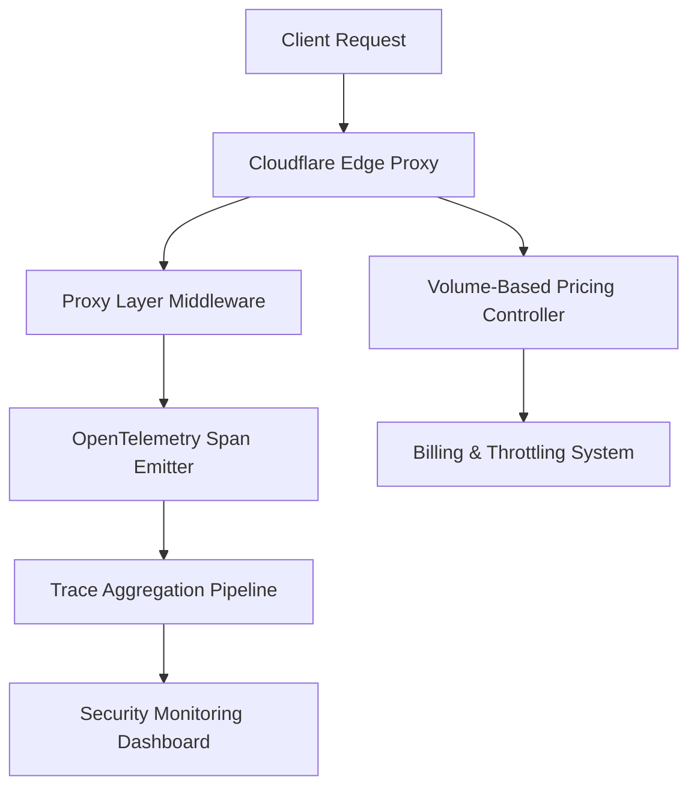

# Cloudflare Traces Turns the Proxy Layer into OpenTelemetry Spans, with New Volume-Based Pricing

## Introduction
In large-scale production environments, the proxy layer sits at the intersection of networking, security, and user experience. For years, engineering teams have treated this layer as a black box: requests enter, responses exit, and visibility ends at the edge. But as distributed systems grow and security threats become more sophisticated, that blind spot becomes expensive. I've seen teams scramble to retroactively correlate a WAF block with a latency spike, only to discover that critical metadata was lost in transit. Cloudflare Traces changes that calculus by instrumenting the proxy layer to emit OpenTelemetry spans natively, and pairing it with a volume-based pricing model that aligns cost with actual instrumentation overhead. This isn't just a technical upgrade; it's a rethinking of how observability and security intersect at the edge.

## Why This Matters
If you've ever tried to trace a request across a CDN, WAF, and origin backend, you know the fragmentation problem. Traditional logging gives you tails, not trails. Metrics tell you *that* something happened, but not *why* or *how* it propagated. In cybersecurity contexts, this gap is critical: threat actors rely on opacity, and defenders need every byte of context to detect lateral movement, credential abuse, or policy violations. By turning the proxy layer into a first-class OpenTelemetry source, we gain structured, queryable spans that carry method, path, edge location, TLS version, and custom security attributes—all without adding a separate sidecar or sacrificing performance. The volume-based pricing model further ensures that this visibility scales economically: you pay for the cardinality and volume you actually generate, not for an arbitrary quota that doesn't reflect your traffic patterns.

## How It Works
At its core, Cloudflare Traces integrates an OpenTelemetry collector directly into the proxy request pipeline. When a request hits an edge node, the middleware extracts or creates a context, starts a span, and attributes it with proxy-specific data: `cloudflare.edge_id`, `http.scheme`, `http.user_agent_hash`, and optionally a computed `security.risk_score` based on real-time WAF signals. The span is then exported to a backend via the standard OTLP protocol, where it joins a distributed trace that might span edge, regional, and origin services. The volume-based pricing kicks in at the export layer: traces are batched, sampled adaptively, and metered by attribute cardinality and byte size. This means high-cardinality fields (like full query strings) are automatically down-sampled, while low-cardinality, high-signal attributes remain at full resolution.

The diagram above illustrates the end-to-end flow: from the ingress request, through the instrumented proxy middleware that emits an OTel span, into a centralized aggregation pipeline that feeds security analytics, while a parallel pricing controller meters volume and enforces billing thresholds before data reaches the billing system.

## Core Concepts
- **Span Emission at the Edge**: Unlike traditional tracing that requires instrumenting application code, the proxy layer emits spans automatically for every inbound and outbound connection. This includes TLS handshakes, HTTP method, response status codes, and WAF rule matches.
- **Attribute Hygiene**: Not all attributes are created equal. High-cardinality keys (e.g., `user_id` per request) are flagged for adaptive sampling, while low-cardinality keys like `edge_country` or `protocol_version`
