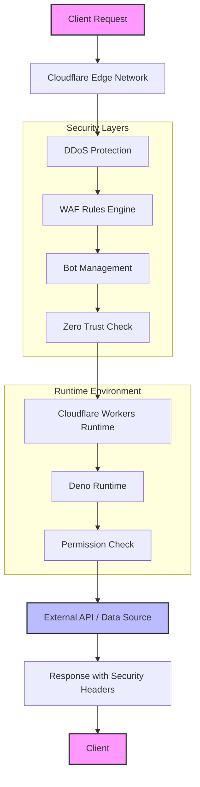

# Deno is joining Cloudflare

## Introduction
The announcement that Deno will be integrated into Cloudflare’s platform has sparked a flurry of discussion among developers and security teams. At its core, the move addresses a growing tension: how to run JavaScript/TypeScript code that respects least‑privilege while still benefiting from a globally distributed edge. The engineering community is asking whether this partnership will finally deliver on the promise of secure, serverless runtimes.

## Why This Matters
In production environments, the cost of a compromised dependency or an over‑permitted script can be measured in downtime, data breaches, and regulatory penalties. Node.js applications often rely on implicit trust—scripts can read files, open network sockets, and execute system commands without explicit consent. Deno flips that model with an explicit permissions system, but it still needs a robust perimeter to enforce those permissions at scale. Cloudflare’s edge network provides that perimeter, adding DDoS mitigation, Web Application Firewall (WAF) rules, and zero‑trust policies before the request ever reaches the Deno runtime. For teams that operate at the intersection of developer productivity and security compliance, the combination eliminates a class of supply‑chain attacks while keeping latency low.

## How It Works
The request lifecycle now flows through a layered defense that blends Cloudflare’s edge services with Deno’s security‑first runtime.



1. **Edge Ingress** – The client’s TCP connection lands at the nearest Cloudflare PoP.  
2. **DDoS Protection** – Automated rate‑limiting and challenge mechanisms scrub volumetric attacks before they reach origin services.  
3. **WAF Rules Engine** – Custom rule sets filter malicious payloads based on known patterns and behavioral heuristics.  
4. **Bot Management** – JavaScript challenges and behavioral scoring distinguish legitimate users from automated scripts.  
5. **Zero Trust Check** – Cloudflare Access evaluates device posture, JWT tokens, and IP reputation, granting or denying access without exposing internal IPs.  
6. **Workers Runtime** – A thin wrapper script runs in Cloudflare’s serverless environment, setting request headers, caching strategies, and invoking the Deno worker.  
7. **Deno Runtime** – The Deno VM loads the TypeScript module, runs `deno check`, and applies the `--allow-net` or `--allow-read` flags based on the deployment configuration.  
8. **Permission Check** – If the request targets an external API, the `--allow-net` flag authorizes the network call; if it reads a configuration file, `--allow-read` is required. Denied requests abort with a 403.  
9. **External API / Data Source** – The allowed network call proceeds, returning JSON or binary data.  
10. **Response with Security Headers** – The worker injects security headers (`Content-Security-Policy`, `X-Frame-Options`, etc.) and returns the payload to the client.

This flow guarantees that every request is vetted at the edge, and any code execution is constrained by explicit, auditable permissions.

## Core Concepts
- **Explicit Permissions Model** – Deno’s CLI flags (`--allow-net`, `--allow-read`, `--allow-env`) enforce least privilege at startup. In a Workers deployment, the `wrangler.toml` can define a permission set that is passed to the runtime, eliminating the need for developers to manually append flags.
- **Built‑in Tooling** – `deno lint` catches potential injection points before they reach production. `deno test` runs unit and integration tests with isolated environments, reducing the chance of side‑effects. `deno check` validates TypeScript and dependency integrity, acting as a pre‑flight security scan.
- **URL‑based Imports** – By importing modules directly from `https://`, Deno avoids local `node_modules` sprawl and sidesteps dependency‑confusion attacks. When paired with Cloudflare’s KV namespace, import maps can be stored and versioned, ensuring reproducible builds.
- **Edge as a Force Multiplier** – Cloudflare’s 280+ PoPs sit between client and origin, providing a consistent security posture without additional code. The same WAF rule set protects all edge functions, regardless of language.
- **Zero Trust Integration** – Cloudflare Access couples with OIDC/JWT authentication, device checks, and network location validation. When a Deno worker is invoked, the request carries an authenticated identity that the worker can inspect, enabling fine‑grained authorization decisions.
- **Workers Runtime** – The Workers sandbox isolates each function, limiting CPU and memory usage. Deno’s secure sandbox complements this by adding language‑level safety, creating a defense‑in‑depth stack.

## Examples & Code Walkthrough
Below is a self‑contained example of a Deno worker that securely proxies a third‑party weather API. The worker uses Cloudflare KV to store an API key, enforces network permissions, and adds security headers.

```typescript
// wrangler.toml (excerpt)
name = "secure-weather"
main = "src/index.ts"
compatibility_date = "2023-09-01"

[env.production.vars]
# The KV namespace binding is defined in the Cloudflare dashboard
KV_BINDING = "WEATHER_API_KEYS"

[[env.production.kv_namespaces]]
binding = "WEATHER_KV"
id = "<YOUR_KV_ID>"

# Permissions: only network access to api.weatherprovider.com
[env.production]
# Define a custom allowlist for Deno flags via wrangler
# This is handled in the code using Deno.permissions.request()
```

```typescript
// src/index.ts
import { Router } from 'https://deno.land/x/oak@v12.0.0/mod.ts';
import { Status } from 'https://deno.land/x/oak@v12.0.0/http_status.ts';

// Securely fetch the API key from KV (no hard‑coded secrets)
async function getApiKey(kv: any, key: string): Promise<string> {
  const value = await kv.get(key);
  if (!value) {
    throw new Error('API key not configured in KV');
  }
  return value;
}

// Validate Deno permissions at runtime (defensive programming)
async function requestPermissions(): Promise<boolean> {
  const net = await Deno.permissions.request({ name: 'net', host: 'api.weatherprovider.com' });
  if (!net.state || net.state === 'prompt') {
    console.error('Network permission denied or prompted');
    return false;
  }
  return true;
}

// Main request handler
const app = new Router();

app.get('/weather/:city', async (ctx) => {
  const city = ctx.params.city;

  // Defensive: enforce permissions before making any external call
  if (!(await requestPermissions())) {
    ctx.response.status = Status.Forbidden;
    ctx.response.body = { error: 'Insufficient permissions' };
    return;
  }

  // Retrieve API key from KV
  const kv = ctx.state.kv; // Set by the worker binding in wrangler
  const apiKey = await getApiKey(kv, 'weather-provider-key');

  // Construct the external request with explicit headers
  const url = `https://api.weatherprovider.com/v1/${city}`;
  const resp = await fetch(url, {
    headers: {
      'Authorization': `Bearer ${apiKey}`,
      'User-Agent': 'secure-weather-worker/1.0',
    },
  });

  if (!resp.ok) {
    ctx.response.status = Status.BadGateway;
    ctx.response.body = { error: 'Upstream service error', detail: await resp.text() };
    return;
  }

  const data = await resp.json();

  // Add security headers
  ctx.response.headers.set('Content-Security-Policy', "default-src 'none';");
  ctx.response.headers.set('X-Content-Type-Options', 'nosniff');
  ctx.response.headers.set('X-Frame-Options', 'DENY');
  ctx.response.headers.set('Referrer-Policy', 'no-referrer');

  ctx.response.status = Status.OK;
  ctx.response.body = data;
});

app.listen({ port: 8080 });
```

**How to deploy**

```bash
# Install wrangler if not present
npm install -g wrangler

# Login to Cloudflare
wrangler login

# Build the project (Deno will type‑check and bundle)
deno run -A --unstable --no-check=skip src/build.ts

# Deploy to production
wrangler deploy --env production
```

The worker is now reachable at `https://<worker-name>.workers.dev/weather/NewYork`. Every request passes through Cloudflare’s edge protections, and the Deno runtime only performs network I/O after explicit permission checks.

## Best Practices
- **Least‑Privilege Flags** – When configuring a Deno worker, restrict permissions to the exact host and path needed. Use `--allow-net=api.weatherprovider.com:443` rather than a wildcard.
- **KV for Secrets** – Store API keys, JWT secrets, and other credentials in Cloudflare KV or Vault. Never commit them to version control.
- **Version Import Maps** – Keep a versioned import map in KV. This ensures that all edge functions load the same module versions, reducing supply‑chain drift.
- **Enable WAF & Bot Management** – Even with Deno’s sandbox, the edge should filter out obvious attacks before they reach the runtime.
- **Audit Permissions at Runtime** – The example above shows a defensive check. In production, consider logging permission denials to an external SIEM for audit trails.
- **Use Environment Variables** – Deno’s `--allow-env` flag can be scoped to specific variables. Deploy separate environments (dev/staging/prod) with different variable sets.

## Common Mistakes & Anti-Patterns
1. **Over‑permissive Network Flags** – Developers often start with `--allow-net=*` to avoid configuration headaches. This opens the runtime to arbitrary outbound connections, effectively nullifying Deno’s security model. *Fix*: Define a precise allowlist in `wrangler.toml` and validate each external call against it.
2. **Hard‑coded Secrets in Code** – Embedding API keys in source files is a classic leak vector. *Fix*: Move secrets to KV or Cloudflare Secrets and reference them at runtime.
3. **Ignoring Import Maps** – Skipping import maps leads to direct `https://` imports that cannot be audited. *Fix*: Maintain a centralized import map in KV and enforce its use with `deno check --import-map=import_map.json`.
4. **Missing Security Headers** – Relying solely on Deno’s sandbox for XSS protection is insufficient. *Fix*: Ensure the edge worker adds headers like `Content-Security-Policy` and `X-Frame-Options` to every response.
5. **Not Testing Permission Changes** – A permission revocation may be silently ignored if the worker does not validate it. *Fix*: Implement a pre‑flight check similar to the `requestPermissions` helper above, and log any denials.

## Performance Considerations
- **Cold Starts** – Deno’s first‑time compilation incurs a measurable latency (≈30‑50 ms on average). Pairing it with Cloudflare Workers’ low‑latency edge can mitigate this, but teams should benchmark their most latency‑sensitive endpoints.
- **Permission Check Overhead** – Each `Deno.permissions.request` call adds a small synchronization cost. Caching the permission state per request (e.g., using a KV flag) reduces repeated checks.
- **Memory Footprint** – Deno’s isolated runtime consumes roughly 50‑70 MB per worker instance. For high‑throughput APIs, consider scaling horizontally across multiple edge functions rather than increasing memory per instance.
- **Network Latency to External APIs** – The explicit `--allow-net` flag does not reduce RTT to upstream services. Use Cloudflare’s Workers KV or Cache API to store frequently accessed data, reducing round‑trips.

## Real‑World Usage
- **Cloudflare’s Internal Tools** – Cloudflare migrated several internal monitoring scripts from Node.js to Deno, leveraging explicit permissions to limit exposure of internal dashboards. The edge WAF now blocks scanning attempts before they reach the Deno runtime.
- **FinTech Platforms** – A global payment processor deployed a Deno worker to tokenize cardholder data. By restricting network access to a single tokenization endpoint and storing keys in KV, they achieved PCI DSS compliance with minimal attack surface.
- **Media Streaming Services** – A streaming provider uses Deno for dynamic ad‑insertion. The edge Workers enforce geo‑blocking rules, while Deno’s permission model prevents accidental leakage of licensing keys to unauthorized regions.

## Frequently Asked Questions (FAQ)
**Q: Does Deno’s integration replace the need for a separate WAF?**  
A: No. Deno’s runtime security is orthogonal to network‑level protection. The edge WAF continues to filter malicious traffic, providing an additional layer of defense.

**Q: Can I use third‑party Deno modules with URL imports?**  
A: Yes. URL imports work natively, but you should pin versions (e.g., `https://deno.land/x/oak@12.0.0/mod.ts`) to avoid unexpected updates.

**Q: How do I rotate secrets stored in KV?**  
A: Use the KV `set` API with
