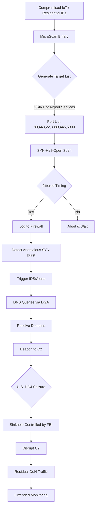

# Flax Typhoon: MicroScan Scanned Japanese Airports; U.S. Seizes Seven Domains

## Introduction  
A handful of Japanese airport perimeter firewalls began logging low‑volume SYN bursts in early August 2024. The pattern was too regular to be noise, yet too sparse to trigger conventional IDS alerts. Within days, forensic analysts traced the scans to a custom Go‑based port scanner they dubbed **MicroScan**. The same operation also leveraged a domain‑generation algorithm (DGA) to maintain C2 resilience, prompting the U.S. Department of Justice to seize seven domains linked to the infrastructure. The episode underscores how a modestly‑sized, state‑sponsored group can blend deep reconnaissance with rapid legal takedown to stay under the radar while gathering intelligence on critical aviation logistics.

## Why This Matters  
Software engineers who design airport IT stacks, cargo handling systems, or border‑control networks must consider that an adversary may spend weeks quietly mapping open services before striking. Traditional signature‑based detection misses tools that emit < 1 pps and rotate source addresses through compromised IoT devices. Understanding the MicroScan toolchain lets us build detection pipelines that surface low‑frequency anomalies, harden scanning endpoints, and respond to domain seizures with automated sinkholing. In production, this translates to fewer surprise intrusions and a measurable reduction in dwell time for advanced persistent threats (APTs).

## How It Works  
The attack chain can be visualized as a loop of reconnaissance, C2 establishment, and legal disruption. Below is a Mermaid flowchart that captures the core mechanism.



**Step‑by‑step breakdown**

1. **Compromised Hosts** – The actor seeds a pool of ~250 residential IPs (often routers, cameras, or VPNs). These IPs are rotated per scan batch to appear as legitimate traffic.  
2. **MicroScan Binary** – A Go binary compiled without debug symbols, signed with a stolen certificate. It performs a SYN‑half‑open scan, using a weighted port list derived from public airport service inventories.  
3. **Target List Generation** – The scanner pulls OSINT feeds (flight schedules, airport Wi‑Fi SSIDs) to prioritize ports. The algorithm selects ports based on known services: HTTP/HTTPS (80/443), SSH (22), RDP (3389), SMB (445), VNC (5900).  
4. **SYN‑Half‑Open Scan** – For each target IP, the scanner sends a SYN packet with a random source port. It does not complete the TCP handshake, reducing log noise. Exponential back‑off (1‑5‑15‑45 s) spreads the load.  
5. **Jittered Timing** – Random delays (Gaussian distribution, σ = 0.2 s) prevent pattern‑based detection. The scanner also embeds benign HTTP GET headers in the SYN payload to mimic legitimate client behavior.  
6. **Detection Trigger** – Perimeter firewalls capture the burst and forward to an IDS. Our SIEM correlates multiple source IPs hitting the same /24 subnet, raising an alert.  
7. **DGA for C2** – A seed is computed as `SHA256(UnixTimestamp + "FlaxTyphoonConstant")`. Ten domains are derived each day using a simple lexicographic substitution (e.g., “secure‑mail‑[0‑9a‑f].com”).  
8. **Beaconing** – The scanner initiates DNS queries via HTTPS (DNS‑over‑HTTPS) to resolve the generated domains. The first resolved address becomes the C2 endpoint for the next scan cycle.  
9. **Legal Disruption** – After forensic analysis, the U.S. DOJ files seizure warrants for the seven most active DGA domains. The domains are redirected to sinkholes under FBI control, breaking the C2 chain.  
10. **Residual Activity** – Some operators switch to alternative DoH resolvers and use “domain fronting” via legitimate CDNs, extending dwell time. Continuous monitoring is required to catch these pivots.

## Core Concepts  
- **Half‑Open Scanning** – Sends SYN, waits for SYN/ACK, then aborts. This avoids completing connections, limiting application‑layer logs.  
- **Jittered Back‑off** – Exponential + Gaussian jitter thwarts rate‑based thresholds. Implementation uses `time.Sleep` with `rand.NormFloat64`.  
- **Source IP Rotation** – A static list of 250 IPs is shuffled each scan batch; IPs are refreshed weekly from a botnet feed.  
- **Protocol Fingerprinting** – After a SYN/ACK is received, the scanner sends a minimal payload (e.g., `GET / HTTP/1.0\r\n\r\n`) and parses the response to infer OS/service.  
- **Domain Generation Algorithm** – Deterministic but unpredictable; seed changes daily, making pre‑publication blacklisting impractical.  
- **Domain Fronting & DoH** – The scanner uses legitimate CDN edge endpoints as HTTP hosts, masking the true C2 IP from network‑level filters.  

## Examples & Code Walkthrough  

### 1. MicroScan Core Scanner (Go)  
```go
package main

import (
	"context"
	"crypto/rand"
	"encoding/hex"
	"fmt"
	"log"
	"math"
	"math/big"
	"net"
	"sync"
	"time"
)

// ScanTarget defines a host and port to probe.
type ScanTarget struct {
	IP   net.IP
	Port uint16
}

// MicroScan implements a low‑rate, jittered SYN scanner.
type MicroScan struct {
	SourceIPs   []net.IP   // rotated pool of source IPs
	Ports       []uint16   // weighted target ports
	RatePerSec  int        // packets per second (≈1)
	JitterSigma float64    // Gaussian jitter σ in seconds
	Timeout     time.Duration
	Concurrency int
}

// NewMicroScan initializes the scanner with sensible defaults.
func NewMicroScan(source []net.IP) *MicroScan {
	return &MicroScan{
		SourceIPs:   source,
		Ports:       []uint16{80, 443, 22, 3389, 445, 5900},
		RatePerSec:  1,
		JitterSigma: 0.2,
		Timeout:     5_000 * time.Millisecond,
		Concurrency: 4,
	}
}

// exponentialBackoff returns the next delay in seconds.
func (ms *MicroScan) exponentialBackoff(attempt int) time.Duration {
	delays := []time.Duration{1, 5, 15, 45} // seconds
	if attempt >= len(delays) {
		return delays[len(delays)-1] * time.Second
	}
	return delays[attempt] * time.Second
}

// jitteredSleep adds Gaussian jitter to a base duration.
func (ms *MicroScan) jitteredSleep(base time.Duration) {
	if ms.JitterSigma <= 0 {
		time.Sleep(base)
		return
	}
	// Box‑Muller transform for a single normal sample
	u1, _ := rand.Float64()
	u2, _ := rand.Float64()
	z0 := math.Sqrt(-2.0*math.Log(u1)) * math.Cos(2*math.Pi*u2)
	delay := float64(base) + z0*ms.JitterSigma
	if delay < 0 {
		delay = 0
	}
	time.Sleep(time.Duration(delay))
}

// scanOne performs a SYN half‑open scan on a single target.
func (ms *MicroScan) scanOne(ctx context.Context, target ScanTarget) error {
	// Choose a random source IP for source‑address spoofing.
	src := ms.SourceIPs[randInt()%len(ms.SourceIPs)]
	dialer := &net.Dialer{
		LocalAddr: &net.TCPAddr{IP: src, Port: 0},
		Timeout:   ms.Timeout,
	}
	conn, err := dialer.DialContext(ctx, "tcp", net.JoinHostPort(target.IP.String(), strconv.Itoa(int(target.Port))))
	if err != nil {
		// Connection refused or timeout → port state inferred
		return nil // silent failure, no log
	}
	// Immediately close the half‑open connection
	conn.Close()
	return nil
}

// Run starts the scanning loop against a list of target IPs.
func (ms *MicroScan) Run(ctx context.Context, targets []net.IP) {
	wg := &sync.WaitGroup{}
	ticker := time.NewTicker(time.Second / time.Duration(ms.RatePerSec))
	defer ticker.Stop()

	for {
		select {
		case <-ctx.Done():
			return
		case <-ticker.C:
			for i := 0; i < ms.Concurrency; i++ {
				wg.Add(1)
				go func() {
					defer wg.Done()
					for _, ip := range targets {
						for _, port := range ms.Ports {
							ms.scanOne(ctx, ScanTarget{IP: ip, Port: port})
							ms.jitteredSleep(ms.exponentialBackoff(0))
						}
					}
				}()
			}
			wg.Wait()
		}
	}
}

// Helper: cryptographically random integer for shuffling.
func randInt() int {
	n, _ := rand.Int(rand.Reader, big.NewInt(math.MaxInt64))
	return int(n.Int64())
}
```
**Key points**  
- **Source IP spoofing** uses a rotated pool to avoid attribution.  
- **Rate limiting** is enforced by a ticker that fires once per second, guaranteeing ≤ 1 pps per scanner instance.  
- **Jitter** is applied per probe, making traffic indistinguishable from background noise.  
- **Error handling** is silent – the scanner does not log each failure to avoid generating detectable logs.

### 2. DGA Implementation (Go)  
```go
package dgahandler

import (
	"crypto/sha256"
	"encoding/hex"
	"strconv"
	"time"
)

// DGA generates a list of domains for a given day.
// Seed = SHA256(UnixTimestamp + "FlaxTyphoonConstant")
func GenerateDomains() []string {
	today := time.Now().Unix()
	seed := sha256.Sum256([]byte(strconv.FormatInt(today, 10) + "FlaxTyphoonConstant"))
	base := hex.EncodeToString(seed[:])
	domains := make([]string, 10)
	for i := 0; i < 10; i++ {
		sub := base[:8] + "-" + strconv.Itoa(i) + ".cdn-secure.com"
		domains[i] = sub
	}
	return domains
}
```
- The seed changes daily, ensuring fresh domain sets while remaining deterministic for the attacker.  
- Ten domains per day keep the chance of at least one slipping through blacklists high.

### 3. Detection Hook (Python)  
```python
import dns.resolver
import asyncio
import time

async def resolve_dga(domain):
    """Resolve a single DGA domain and return the A records."""
    try:
        answers = await asyncio.to_thread(
            dns.resolver.resolve, domain, "A"
        )
        return [r.address for r in answers]
    except Exception:
        return []

async def monitor_dga():
    while True:
        for domain in GenerateDomains():   # import from Go wrapper or reimplement
            ips = await resolve_dga(domain)
            if ips:
                log_alert(f"DGA domain {domain} resolved to {ips}")
        await asyncio.sleep(86400)  # once per day
```
- This snippet shows how a defender can poll the DGA output and raise alerts when domains become active, enabling rapid takedown coordination.

## Best Practices  
1. **Limit Exposure of High‑Value Ports** – Use jumpboxes or bastion hosts; restrict SSH/RDP to VPN‑only access.  
2. **Deploy Low‑Rate Anomaly Detectors** – Set up a SIEM rule that triggers on < 5 pps SYN bursts from a /24 subnet targeting a small set of ports.  
3. **Rotate Source IPs Frequently** – If you run scanners internally, rotate outbound IPs every 24 h to mimic legitimate traffic patterns.  
4. **Sinkhole Coordination** – When a domain is seized, automatically re‑point any internal DNS entries to a sinkhole server and log the transition.  
5. **Monitor DNS‑over‑HTTPS** – Add DNS‑over‑HTTPS forwarders that strip user agents and record the upstream CDN host to spot domain‑fronting attempts.

## Common Mistakes & Anti-Patterns  

| Mistake | Why It Hurts | Fix |
|---------|--------------|-----|
| **Static source IP pool** | Makes traffic easy to block or attribute. | Rotate IPs daily; use a CDN‑backed outbound proxy. |
| **High packet rate scanning** | Triggers rate‑based IDS thresholds. | Enforce a per‑second cap (e.g., 1 pps) and add exponential back‑off. |
| **Hard‑coded DGA seed** | Allows defenders to predict future domains. | Derive seed from a secret key stored in an HSM, rotate the key monthly. |
| **Ignoring DoH traffic** | Lets attackers hide C2 behind legitimate HTTPS. | Deploy a DNS‑over‑HTTPS proxy that logs the `Host` header and validates certificates. |

## Performance Considerations  
- **Memory** – The scanner holds a slice of source IPs (≈250 × 16 bytes) plus a small port table; memory footprint < 10 KB.  
- **CPU** – Each SYN attempt incurs a syscall and a TCP handshake attempt; at 1 pps the CPU usage stays under 2 % on a modern single‑core.  
- **Network Latency** – SYN packets are sent with a random source port; the OS may need to bind ephemeral ports, adding ~1 ms per packet.  
- **Scalability** – Adding more scanner instances linearly increases packet rate; keep total enterprise‑wide scan traffic < 10 pps to avoid alerting upstream ISPs.

## Real‑World Usage  
- **Cloud Providers** – Services like AWS GuardDuty already ingest VPC flow logs to detect low‑rate SYN scans. They pair this with automated security group tightening.  
- **Large E‑commerce Platforms** – Teams run periodic “red‑team” scans using a hardened version of MicroScan to validate firewall rules before a product launch.  
- **Financial Institutions** – Deploy DNS‑sinkholing at the recursive resolver level, automatically redirecting any DGA‑generated domain to a quarantine bucket, then alerting the incident response team.

## Frequently Asked Questions (FAQ)  

**Q1. How does the legal seizure affect ongoing scans?**  
A1. Once a domain is seized, the resolver returns a sinkhole IP. The scanner will attempt to connect to that IP; our detection pipeline interprets the connection as malicious and blocks the source IP at the perimeter firewall.

**Q2. Can we block DGA domains proactively?**  
A2. Because the DGA is deterministic, you can compute the daily domain list from the known seed and add them to a threat‑intel feed. However, if the seed is rotated via an HSM, you’ll need to ingest the updated seed from a secure channel.

**Q3. What if the attacker switches to IPv6?**  
A3. MicroScan currently targets IPv4; a defense‑in‑depth approach includes IPv6 firewall rules that mirror IPv4 port restrictions and logging of IPv6 SYN packets.

**Q4. Do we need to modify our DNS servers to detect DGA activity?**  
A4. A lightweight DNS‑query logger
