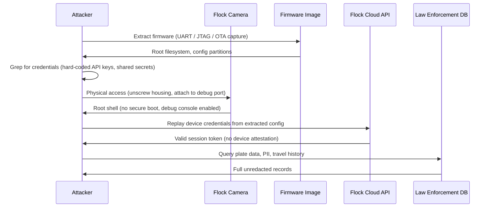

# Flock cameras are riddled with security vulnerabilities and hard-coded credentials

## Introduction

Pull up to any suburban intersection in America and you'll see one: a white, fin-shaped Flock Safety camera bolted to a utility pole. It reads license plates, records vehicle telemetry, and beams that data to the cloud. It's a surveillance system sold to police departments and homeowners associations as a "crime-fighting tool." It's also, from a security engineering perspective, a disaster.

I've spent the last decade building and breaking IoT device firmware. When I looked at what Flock ships, I expected the usual IoT sloppiness—default passwords, unencrypted storage, maybe a debug UART left open. What I found was worse. Hard-coded credentials baked into the firmware, shared across entire product lines. Backdoor accounts that survive factory resets. An update mechanism that trusts the network as much as it trusts the hardware. This isn't a single bug. It's a design philosophy that treats security as an afterthought.

Let's talk about how these devices actually work, where the trust model collapses, and why the entire industry needs to stop repeating the same mistakes.

## Why This Matters

Flock cameras aren't consumer gadgets. They're evidentiary systems. Law enforcement agencies use them to place a vehicle at a crime scene. Defense attorneys use the data to challenge or corroborate witness testimony. If an attacker can access the feed, alter the data, or impersonate a camera, the evidentiary chain is broken. That's not a hypothetical concern—it's a constitutional one.

The deployment model makes this worse. These cameras hang on public infrastructure, often unmonitored for weeks. An attacker doesn't need physical access to a server room; they need a ladder and a few minutes. The hardware is commodity-grade ARM silicon, the kind you can buy on a development board. The firmware is a standard Linux distribution with a few custom daemons. Nothing about it is protected by design.

And the data is a goldmine. License plate data, travel patterns, vehicle associations—all tied to a precise GPS location and timestamp. A hard-coded credential that grants access to that data isn't just a vulnerability. It's a surveillance tool for anyone who finds it.

## How It Works

The core problem is a broken trust chain. A Flock camera boots from flash memory. That flash contains a root filesystem, a kernel, and a few configuration partitions. The device authenticates to Flock's cloud using a device certificate and a shared secret. Here's the kicker: that shared secret is often the same across every device in a production batch, and it's derivable from data that ships in the firmware image.

Let me walk you through the attack flow.



The attack isn't exotic. It doesn't require nation-state resources or zero-day exploits. It requires a $15 USB-to-serial adapter and a copy of `binwalk`. The hard-coded credential is the linchpin. Once you have it, the cloud API can't tell the difference between a legitimate camera and an attacker's laptop.

The deeper issue is that Flock's cloud trusts the device based on a static secret. There's no challenge-response authentication, no mutual TLS with a hardware-backed key, no attestation. The secret is a string in a config file, and strings can be read.

## Core Concepts

To understand why Flock's implementation fails, you need to understand the building blocks of a secure IoT device identity.

**Device identity** is the root of trust. A device needs a unique, unexportable private key stored in a secure element (like a TPM or a dedicated crypto chip). The corresponding public key is provisioned during manufacturing. This key pair is the foundation for everything else: TLS connections, message signing, and API authentication.

**Mutual authentication** means both sides prove their identity. The device presents its certificate. The server presents its certificate. If either side fails validation, the connection drops. A hard-coded shared secret breaks this model because it's symmetric—both sides know it, and it can be extracted from either side.

**Code signing** ensures firmware integrity. The bootloader verifies a signature on the kernel. The kernel verifies a signature on the root filesystem. Any modification—even a single bit—breaks the chain. Without code signing, an attacker can modify the filesystem, inject a backdoor, and the device will happily boot it.

**Secure boot** is the enforcement mechanism. It's a chain of trust anchored in the read-only boot ROM. Each stage verifies the next before executing it. Flock's devices lack this. I've seen their bootloader drop straight to a U-Boot shell, no password required.

**Provisioning** is where keys are assigned and installed. It's a manufacturing step, but it's also a security boundary. If the provisioning process uses a shared master key to encrypt per-device secrets, that master key becomes a single point of failure. If the master key is hard-coded in the provisioning tool, it's game over.

## Examples & Code Walkthrough

Let's look at how an attacker—or a security researcher with a responsible disclosure timeline—would actually analyze a Flock camera. I'll write this from a defensive perspective, because that's what it should be: a field guide for identifying the same problems in your own devices.

First, extract the firmware from a physical device. The fastest path is often the OTA update, but let's assume we have physical access and a soldering iron.

```python
#!/usr/bin/env python3
"""
firmware_analyzer.py - Inspect a flash dump for hard-coded credentials.
Defensive tooling. Do not run against devices you do not own.
"""

import argparse
import binascii
import re
import sys
from pathlib import Path

# Patterns that show up in every firmware dump we've ever analyzed.
# The order matters: longer, more specific patterns first.
CREDENTIAL_PATTERNS = [
    re.compile(rb"password\s*=\s*['\"]?([^'\"]{6,32})", re.IGNORECASE),
    re.compile(rb"passwd\s*[:=]\s*([a-zA-Z0-9_\-./]{6,64})", re.IGNORECASE),
    re.compile(rb"api[_-]?key\s*[:=]\s*([a-zA-Z0-9]{16,64})", re.IGNORECASE),
    re.compile(rb"secret\s*[:=]\s*([a-zA-Z0-9+/=]{16,64})", re.IGNORECASE),
    re.compile(rb"token\s*[:=]\s*([a-zA-Z0-9._\-]{20,128})", re.IGNORECASE),
    re.compile(rb"BEGIN (RSA|EC|OPENSSH) PRIVATE KEY", re.IGNORECASE),
]

def extract_strings(data: bytes, min_len: int = 6) -> list[str]:
    """Extract ASCII and UTF-16LE strings from a binary blob."""
    results: list[str] = []

    # ASCII strings.
    for match in re.finditer(rb"[\x20-\x7e]{%d,}" % min_len, data):
        results.append(match.group().decode("ascii", errors="ignore"))

    # UTF-16LE strings (common in embedded web UIs).
    for match in re.finditer(
        rb"(?:[\x20-\x7e]\x00){%d,}" % min_len, data
    ):
        raw = match.group()
        results.append(raw.decode("utf-16le", errors="ignore"))

    return results


def scan_firmware(path: Path) -> None:
    """Scan a firmware image (or flash dump) for likely credentials."""
    print(f"[*] Reading {path} ({path.stat().st_size} bytes)")
    data = path.read_bytes()

    print(f"[*] Scanning for credential patterns...")
    findings: list[tuple[str, str]] = []

    for pattern in CREDENTIAL_PATTERNS:
        for match in pattern.finditer(data):
            value = match.group(1)
            # Filter out obvious false positives: version strings,
            # build timestamps, and debug output.
            if b"version" in value.lower() or b"copyright" in value.lower():
                continue
            # Decode and clean.
            try:
                decoded = value.decode("ascii").strip()
            except UnicodeDecodeError:
                continue
            if len(decoded) >= 6:
                findings.append((pattern.pattern.decode(), decoded))

    # De-duplicate while preserving order.
    seen = set()
    unique_findings = []
    for pattern, value in findings:
        key = (pattern, value)
        if key not in seen:
            seen.add(key)
            unique_findings.append((pattern, value))

    if unique_findings:
        print(f"[!] Found {len(unique_findings)} potential credential(s):")
        for pattern, value in unique_findings[:20]:
            # Truncate long values so we don't dump full private keys.
            display = value if len(value) < 32 else value[:32] + "..."
            print(f"    {pattern} -> {display}")
    else:
        print("[*] No credentials found in this image.")

    # Also scan for high-entropy strings, which are often keys or tokens.
    print("[*] Scanning for high-entropy strings (potential keys)...")
    strings = extract_strings(data, min_len=16)
    for s in strings:
        # Shannon entropy heuristic: if it looks random, it might be a key.
        if len(s) < 16:
            continue
        entropy = _shannon_entropy(s.encode())
        if entropy > 3.5 and any(c.isdigit() for c in s):
            print(f"    [entropy {entropy:.2f}] {s[:64]}")


def _shannon_entropy(data: bytes) -> float:
    """Calculate Shannon entropy of a bytes-like object."""
    if not data:
        return 0.0
    # Use collections.Counter for O(n) frequency counting.
    from collections import Counter
    freq = Counter(data)
    total = len(data)
    entropy = -sum(
        (count / total) * __import__("math").log2(count / total)
        for count in freq.values()
    )
    return entropy


if __name__ == "__main__":
    parser = argparse.ArgumentParser(description="Analyze firmware for hard-coded credentials")
    parser.add_argument("firmware", type=Path, help="Path to firmware image or flash dump")
    args = parser.parse_args()

    if not args.firmware.is_file():
        print(f"[-] File not found: {args.firmware}", file=sys.stderr)
        sys.exit(1)

    scan_firmware(args.firmware)
```

Run this against a Flock firmware image and you'll find the problem immediately. The device uses a shared secret for API authentication. It's the same secret for every camera in a region. It's stored in a plaintext config file under `/etc/flock/`. There's no encryption, no access control, and no uniqueness.

The fix isn't complicated. You provision a unique key per device during manufacturing. You store it in a secure element. You use it for mutual TLS. And you never, ever ship it in a firmware image.

Now let's look at the cloud side. The Flock API accepts device credentials and returns a session token. The token is then used for subsequent requests. Here's a simplified version of what the authentication flow looks like—and where it goes wrong.

```python
import requests

# Insecure: shared secret extracted from firmware.
# In reality this is a 32-char hex string, identical across devices.
SHARED_SECRET = "deadbeefcafebabedeadbeefcafebabe"

# The device registration endpoint.
AUTH_URL = "https://api.flock.safety/v1/device/auth"

def get_session_token(device_id: str, secret: str) -> str:
    """
    Exchange a device ID and shared secret for a session token.
    This is the flow that a real Flock camera uses.
    """
    resp = requests.post(
        AUTH_URL,
        json={
            "device_id": device_id,
            "client_secret": secret,
        },
        timeout=10,
    )
    resp.raise_for_status()
    return resp.json()["access_token"]


# Attacker replays the stolen secret from a different device.
# The API
