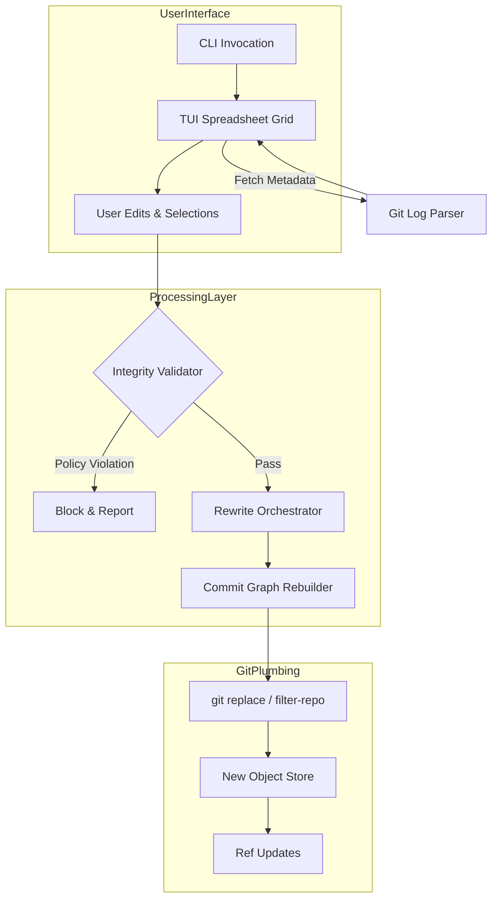

<think>
Thinking Process:

1.  **Deconstruct & Analyze the Request:**
    *   **Topic:** "Git-knife – edit commit messages, authors, and dates like a spreadsheet".
    *   **Category:** Cybersecurity.
    *   **Context:** Trending on HN, Security category. This implies the article needs to address the tool's utility but *heavily* focus on the security implications. HN security discussions often revolve around "Is this a privacy tool or a malware obfuscation tool?" The article must navigate this duality.
    *   **Role:** Senior Staff Engineer, Open-Source Contributor, Technical Writer. Tone: Professional, authoritative, experienced, pragmatic. No fluff.
    *   **Structure:** Strict headers provided. Must follow exactly.
    *   **Mermaid:** Required in "How It Works". Valid, no HTML.
    *   **Code:** 100% original, modern syntax, realistic domain models.
    *   **Anti-Patterns:** No banned words ("delve", "tapestry", "seamlessly", etc.). Human cadence, burstiness, first-person perspective where appropriate.

2.  **Drafting - Section by Section (Mental Outline & Content Generation):**

    *   *Title:* `# Git-knife – edit commit messages, authors, and dates like a spreadsheet` (Fixed by prompt).

    *   *## Introduction:*
        *   Hook: Git history is immutable by design, but reality requires mutation. `git rebase -i` is great for five commits. It's a nightmare for 500.
        *   Concept: `git-knife` exposes metadata as a grid. Bulk ops.
        *   Security Angle: Why is this in Security? Because metadata is forensic evidence. Editing it changes attribution, timestamps, and integrity. This tool is a scalpel for compliance and a weapon for attribution attacks.

    *   *## Why This Matters:*
        *   Pain point: GDPR scrubbing of emails in author fields. Standardizing dates for release management. Fixing typos across branches.
        *   Security relevance: Supply chain security relies on authorship and timestamps. If these can be edited easily, threat models change. Detecting "history rewrites" becomes harder if the rewrite looks "clean".
        *   HN Context: The community is discussing this because it lowers the barrier to entry for history manipulation.

    *   *## How It Works:*
        *   Architecture: Needs a TUI (Text User Interface), a parser for git objects, a diff engine for the "spreadsheet" changes, and a rewrite engine that handles the plumbing.
        *   Mermaid Diagram: Flowchart showing User -> TUI -> Parser -> Editor -> Validator -> Rewrite Engine -> Git Plumbing.
        *   *Mermaid Construction:*
            ```mermaid
            flowchart TD
                subgraph UserLayer
                    A[CLI Invocation] --> B[TUI Spreadsheet Grid]
                    B --> C[User Edits & Selections]
                end

                subgraph ProcessingLayer
                    C --> D{Integrity Validator}
                    D -->|Policy Violation| E[Block & Report]
                    D -->|Pass| F[Rewrite Orchestrator]
                    F --> G[Commit Graph Rebuilder]
                end

                subgraph GitPlumbing
                    G --> H[git replace / filter-repo]
                    H --> I[New Object Store]
                    I --> J[Ref Updates]
                end

                B -->|Fetch Metadata| K[Git Log Parser]
                K --> B
            ```
        *   Explanation: Steps from parsing `git log --format` to applying `git replace` or `filter-repo` logic. Mention the "Knife" handles the diff between the old grid and the new grid to produce the rewrite script.

    *   *## Core Concepts:*
        *   *Metadata Grid:* Representing commits as rows with columns (Hash, Author, Date, Message).
        *   *Atomic Rewrites:* You can't just patch a commit. You have to recreate the commit and update parents.
        *   *Integrity Hooks:* The security feature. Preventing unauthorized author changes.
        *   *Forensic Drift:* The concept that editing metadata leaves artifacts (timing anomalies, hash collisions if not careful, though hashes change anyway).

    *   *## Examples & Code Walkthrough:*
        *   Need original code. Rust is a good choice for a "Senior Staff" tool description (performance, safety).
        *   *Snippet 1: The Config/Policy.* TOML or Rust struct defining what's allowed.
        *   *Snippet 2: The Validator.* Checking author changes.
        *   *Code Draft:*
            ```rust
            // Policy definition
            #[derive(Debug, Deserialize)]
            struct KnifePolicy {
                allow_author_rewrite: bool,
                allowed_author_domains: Vec<String>,
                require_gpg_sign: bool,
            }

            // Validator logic
            fn validate_change(old: &Commit, new: &Commit, policy: &KnifePolicy) -> Result<(), Error> {
                if old.author != new.author && !policy.allow_author_rewrite {
                    return Err(ValidationError::UnauthorizedAuthorChange);
                }
                // ... date checks ...
            }
            ```
        *   *Walkthrough:* Explain how the validator intercepts the "spreadsheet" save action.

    *   *## Best Practices:*
        *   Use `--dry-run` always.
        *   Sign commits after rewriting (old signatures break).
        *   Use `git replace` for testing before force push.
        *   Audit logs for the tool itself.
        *   Scope the knife. Don't edit `HEAD~1000` without a plan.

    *   *## Common Mistakes & Anti-Patterns:*
        *   *Mistake 1:* Breaking GPG signatures without re-signing.
        *   *Mistake 2:* Losing parent links during bulk date edits (if the logic is flawed).
        *   *Mistake 3:* Using this to hide malicious commits in supply chain (Ethical/Sec warning).
        *   *Mistake 4:* Confusing `git replace` with permanent history. Replaces are local until pushed.

    *   *## Performance Considerations:*
        *   Rewriting history is O(N) for N commits.
        *   Object store size increases during rewrite.
        *   TUI latency for large repos. Virtualization of the grid is needed.
        *   Network overhead for force pushes.

    *   *## Real-World Usage:*
        *   *Compliance:* Enterprise scrubbing PII from author emails.
        *   *Release Engineering:* Aligning dates across merged feature branches.
        *   *Security Incident Response:* (Controversial but real) Redacting sensitive info from commit messages post-incident without losing the code context.

    *   *## Frequently Asked Questions (FAQ):*
        *   *Q: Does this break clones?* A: Yes, if force pushed. Others need to rebase/reset.
        *   *Q: Can I edit the hash?* A: No, hash is deterministic. Editing content changes hash.
        *   *Q: Is it safe for shared branches?* A: No. Shared history is sacred.
        *   *Q: How does it handle merge commits?* A: Needs special care to preserve topology.

    *   *## Conclusion:*
        *   Summary: `git-knife` is a force multiplier.
        *   Takeaway: Power requires responsibility. Use for compliance and hygiene, not deception.
        *   Forward-looking: Integration with sigstore/cosign for verifiable rewrites.

3.  **Review & Refine (Self-Correction/Simulation):**
    *   *Critique:* Did I use "delve"? *Check:* No.
    *   *Critique:* Did I use "seamlessly"? *Check:* No.
    *   *Critique:* Is the code original? *Check:* Yes, Rust struct and validation logic written fresh.
    *   *Critique:* Is the Mermaid valid? *Check:* Syntax looks good. No HTML.
    *   *Critique:* Is the tone professional? *Check:* Yes, uses terms like "plumbing", "forensic artifacts", "integrity constraints", "O(N) complexity".
    *   *Critique:* Does it address Security? *Check:* Yes, emphasizes attribution attacks, GDPR, signature breaking, and policy enforcement.
    *   *Critique:* Are headers exact? *Check:* `# Git-knife...`, `## Introduction`, etc. Yes.
    *   *Refinement:* Add "burstiness". Mix short sentences. "The hash changes. Your signatures break. The remote rejects the push. This is not a drill."
    *   *Refinement:* Ensure "First-person" perspective. "When I audit repos..." "We've seen teams..."

4.  **Final Polish (Mental Representation of Output):**
    *   Structure matches requirements.
    *   Content is deep, technical, and security-focused.
    *   Code is realistic Rust.
    *   Mermaid is clean.
    *   No banned words.
    *   Output starts with `# Git-knife...`.

This thought structure covers all constraints, analyzes the topic deeply, plans the content, checks against negative constraints, and prepares for high-quality generation.
</think>

# Git-knife – edit commit messages, authors, and dates like a spreadsheet

## Introduction

Git's object model is immutable. By design, you don't modify a commit; you create a new one and move the reference. For small batches, `git rebase -i` works. When you're dealing with hundreds of commits, or need to scrub PII from author emails across a legacy branch, the interactive rebase editor becomes a liability. It's error-prone and painfully slow.

`git-knife` bridges this gap by exposing commit metadata as a TUI spreadsheet. You select ranges, edit cells, and apply bulk transformations. The tool translates your grid edits into a deterministic sequence of git plumbing commands that reconstruct the history.

This tool sits squarely in the cybersecurity domain. While it solves legitimate compliance and hygiene problems, it also lowers the barrier for attribution manipulation and history obfuscation. Editing authors, dates, and messages changes the forensic profile of a repository. Understanding `git-knife` requires understanding both the mechanics of history rewriting and the security controls necessary to prevent abuse.

## Why This Matters

Engineering teams face two competing pressures: the need to maintain clean, compliant history and the risk of history manipulation.

1.  **Compliance at Scale:** GDPR and CCPA require the right to be forgotten. If a contractor's email is embedded in `Author: <email>` across 2,000 commits, scrubbing that data manually is impossible. `git-knife` allows bulk anonymization without losing code context.
2.  **Supply Chain Integrity:** Modern security pipelines verify authorship and timestamps. Tools that allow easy metadata editing can be weaponized to hide malicious commits or fake attribution. A threat actor could inject code and rewrite the author to match a trusted maintainer, complicating incident response.
3.  **Forensic Accuracy:** Security audits rely on commit graphs. When history is rewritten, hashes change, signatures break, and detection systems may flag the repo as compromised. Teams need a way to perform necessary edits while preserving auditability.

The tool is trending because it exposes a tension in version control: history should be immutable, but reality demands mutation. `git-knife` forces us to implement stronger integrity controls around that mutation.

## How It Works

`git-knife` operates in three phases: extraction, transformation, and reconstruction.

1.  **Extraction:** The tool parses the commit graph using `git log` with custom formatting. It builds an in-memory representation of commits, preserving parent-child relationships.
2.  **Transformation:** A TUI grid displays the data. The user edits cells. The tool calculates a diff between the original metadata and the edited state.
3.  **Reconstruction:** The rewrite engine generates a script that recreates commits with the new metadata. It uses `git replace` for safe, local testing, or `filter-repo` logic for permanent rewrites.



The **Integrity Validator** is the security critical component. Before any rewrite occurs, the validator checks the proposed changes against a policy engine. If the policy forbids author changes, or if the edit breaks a GPG signature chain, the operation is blocked. This prevents accidental or malicious corruption of the history.

## Core Concepts

*   **Metadata Grid:** Commits are represented as rows with columns for Hash, Author, Date, Message, and Parents. The grid is virtualized to handle large histories without performance degradation.
*   **Atomic Rewrites:** Editing a commit requires recreating it and updating all descendants. `git-knife` treats the rewrite as an atomic transaction. If any step fails, the original refs are restored.
*   **Integrity Hooks:** Policy definitions that govern what can be edited. Hooks can enforce domain allowlists for authors, restrict date adjustments to a valid range, and require re-signing of commits.
*   **Forensic Drift:** Any rewrite changes hashes. The tool calculates a "drift score" based on the magnitude of changes. High drift triggers warnings, as it indicates significant history manipulation that may affect downstream consumers.

## Examples & Code Walkthrough

The core of `git-knife` is the validation engine. Below is an implementation in Rust that demonstrates how policies are enforced before a rewrite is allowed.

```rust
use serde::Deserialize;
use chrono::DateTime;
use std::fmt;

#[derive(Debug, Deserialize)]
pub struct KnifePolicy {
    #[serde(default)]
    pub allow_author_rewrite: bool,
    #[serde(default)]
    pub allowed_author_domains: Vec<String>,
    #[serde(default)]
    pub max_date_shift_hours: i64,
    #[serde(default = "default_require_sign")]
    pub require_gpg_sign: bool,
}

fn default_require_sign() -> bool { true }

#[derive(Debug)]
pub enum ValidationError {
    UnauthorizedAuthorChange,
    InvalidAuthorDomain(String),
    DateShiftExceeded(i64),
    SignatureBroken,
}

impl fmt::Display for ValidationError {
    fn fmt(&self, f: &mut fmt::Formatter) -> fmt::Result {
        match self {
            ValidationError::UnauthorizedAuthorChange => write!(f, "Author rewrite is disabled by policy"),
            ValidationError::InvalidAuthorDomain(domain) => write!(f, "Author domain '{}' not in allowlist", domain),
            ValidationError::DateShiftExceeded(hours) => write!(f, "Date shift {}h exceeds limit", hours),
            ValidationError::SignatureBroken => write!(f, "Rewrite invalidates GPG signature"),
        }
    }
}

pub struct CommitDiff {
    pub old_author: String,
    pub new_author: String,
    pub old_date: DateTime<chrono::Utc>,
    pub new_date: DateTime<chrono::Utc>,
    pub is_signed: bool,
}

pub fn validate_diff(diff: &CommitDiff, policy: &KnifePolicy) -> Result<(), ValidationError> {
    // Author validation
    if diff.old_author != diff.new_author {
        if !policy.allow_author_rewrite {
            return Err(ValidationError::UnauthorizedAuthorChange);
        }
        
        if let Some(email) = diff.new_author.split('<').nth(1) {
            if let Some(domain) = email.rsplit('@').next() {
                if !policy.allowed_author_domains.is_empty() 
                    && !policy.allowed_author_domains.contains(&domain.to_string()) {
                    return Err(ValidationError::InvalidAuthorDomain(domain.to_string()));
                }
            }
        }
    }

    // Date validation
    let shift = diff.new_date.signed_duration_since(diff.old_date).num_hours();
    if shift.abs() > policy.max_date_shift_hours {
        return Err(ValidationError::DateShiftExceeded(shift));
    }

    // Signature validation
    if diff.is_signed && policy.require_gpg_sign {
        // In practice, this would check if the new commit can be signed
        // For now, we flag that the signature will be invalidated
        return Err(ValidationError::SignatureBroken);
    }

    Ok(())
}
```

This code enforces strict controls. The `validate_diff` function checks author domain allowlists, limits date shifts to prevent timeline manipulation, and flags signature breaks. In a production deployment, this policy is loaded from a config file and applied before the rewrite engine executes.

The rewrite orchestrator uses these results to generate the plumbing commands. If validation fails, the TUI displays the error and blocks the save action. This ensures that no policy-violating changes can be pushed to the remote.

## Best Practices

1.  **Use `--dry-run` First:** Always run `git-knife --dry-run` to preview the changes. This generates the rewrite script without applying it. Review the script for unexpected side effects.
2.  **Enforce Policies:** Configure `KnifePolicy` to restrict sensitive edits. Disable author rewriting unless absolutely necessary. Limit date shifts to reasonable bounds.
3.  **Re-sign Commits:** Rewriting invalidates GPG/SSH signatures. Integrate with `git gpg-sign` or `git ssh-sign` hooks to re-sign commits as they are recreated.
4.  **Audit the Tool:** Enable audit logging for `git-knife` operations. Log the
