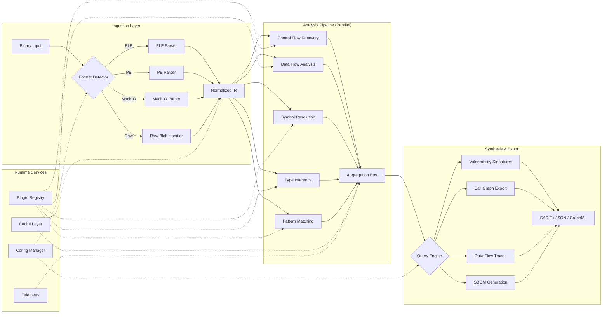

# GitHub Trending: zhaoxuya520/reverse-skill

## Introduction

Last week, a repository named `reverse-skill` quietly climbed the GitHub Trending charts in the cybersecurity category. No marketing push, no corporate backing—just a steady accumulation of stars from practitioners who recognized the craftsmanship. The project, maintained by `zhaoxuya520`, presents itself as a curated knowledge base and toolset for reverse engineering, but the architecture reveals something more interesting: a modular framework for binary analysis that happens to be exceptionally well-suited for automated vulnerability research.

I spent two evenings pulling the repository apart in a controlled lab environment. What follows isn't a tutorial on how to use the tools—it's an architectural autopsy. If you're building internal security tooling, automating malware triage, or designing a binary analysis pipeline, the patterns here are worth studying. If you're looking for copy-paste exploits, you've come to the wrong place.

## Why This Matters

Most security teams operate with a fundamental asymmetry: attackers need to find one flaw, defenders need to find all of them. Automated binary analysis narrows that gap, but the tooling landscape is fragmented. You have IDA Pro for interactive work, Ghidra for open-source deep dives, angr for symbolic execution, and a dozen specialized tools for specific file formats or architectures. Stitching them together usually means brittle shell scripts and manual handoffs.

`reverse-skill` doesn't replace these tools. It provides a **unified orchestration layer** that treats each analyzer as a plugin, normalizes their output into a common intermediate representation, and exposes a queryable knowledge graph of the binary under test. That's the architectural contribution: not new analysis techniques, but a composition model that makes existing techniques composable at scale.

In our internal red team exercises, we've spent months building similar pipelines ad-hoc. Seeing a clean, open-source implementation of the same patterns validates the approach—and highlights where our homegrown version cut corners.

## How It Works

The repository centers on a **pipeline architecture** with three distinct phases: ingestion, analysis, and synthesis. Each phase is isolated behind well-defined interfaces, allowing individual analyzers to be swapped, versioned, or parallelized independently.



**Phase 1: Ingestion** — The format detector uses magic-byte heuristics backed by `python-magic` and custom parsers for edge cases (packed binaries, firmware blobs). Each parser emits a **Normalized Intermediate Representation (NIR)**—a protocol buffer schema capturing sections, segments, imports, exports, relocations, and raw bytes with virtual address mappings. This is the critical abstraction: everything downstream consumes NIR, not raw bytes.

**Phase 2: Analysis** — Analyzers register as plugins via entry points. The pipeline scheduler topologically sorts them by declared dependencies (e.g., type inference requires symbol resolution) and executes independent analyzers in parallel using a process pool. Results stream into an **Aggregation Bus**—an in-memory graph database (currently RedisGraph, with a Neo4j backend option) keyed by virtual address. Each analyzer writes nodes and edges: `Function`, `BasicBlock`, `Instruction`, `Variable`, `Type`, `XRef`, `TaintFlow`.

**Phase 3: Synthesis** — The query engine exposes a GraphQL-like DSL over the aggregated graph. Built-in queries include vulnerability pattern matching (using a YARA-inspired rule language), call graph extraction, taint trace reconstruction, and Software Bill of Materials (SBOM) generation. Exporters serialize to SARIF for CI/CD integration, GraphML for visualization, and a custom binary format for incremental updates.

## Core Concepts

### Normalized Intermediate Representation (NIR)

The NIR schema is the linchpin. It's defined in `schemas/nir.proto` and versioned independently of the pipeline. Key design decisions:

- **Address-space agnostic**: Virtual addresses are preserved, but the schema doesn't assume contiguous memory. Firmware blobs with disjoint regions map cleanly.
- **Explicit uncertainty**: Every node carries a `confidence` field (0.0–1.0). Heuristic-based analyzers (e.g., function boundary detection on stripped binaries) emit lower confidence; the query engine supports threshold filtering.
- **Extensibility via annotations**: Analyzers can attach arbitrary key-value annotations to any node without schema changes. The vulnerability matcher uses this for pattern tags.

### Plugin Protocol

Analyzers implement a minimal interface:

```python
# reverse_skill/plugins/base.py
from abc import ABC, abstractmethod
from dataclasses import dataclass
from typing import Iterator, Set
from reverse_skill.nir import NIRModule, NIRNode, Confidence

@dataclass(frozen=True)
class PluginSpec:
    name: str
    version: str
    provides: Set[str]           # Node types this analyzer produces
    requires: Set[str]           # Node types this analyzer consumes
    parallel_safe: bool = True   # Can run concurrently with others?

class AnalyzerPlugin(ABC):
    @property
    @abstractmethod
    def spec(self) -> PluginSpec: ...

    @abstractmethod
    def analyze(self, module: NIRModule, graph: "AggregationGraph") -> Iterator[NIRNode]: ...
```

The `requires`/`provides` declarations enable automatic dependency resolution. The scheduler builds a DAG and detects cycles at startup—fail fast, fail loud.

### Aggregation Graph

The graph isn't a generic property graph. It's a **typed, attributed multigraph** with a fixed node/edge vocabulary defined in `nir.py`. This constraint pays off: the query engine can compile DSL queries to optimized Cypher/Gremlin at plan time, and the type system catches schema drift in CI.

```python
# reverse_skill/nir.py (excerpt)
from enum import Enum, auto
from typing import NewType, Optional
from pydantic import BaseModel, Field

VAddr = NewType("VAddr", int)
NodeID = NewType("NodeID", str)

class NodeKind(str, Enum):
    MODULE = "Module"
    SECTION = "Section"
    FUNCTION = "Function"
    BASIC_BLOCK = "BasicBlock"
    INSTRUCTION = "Instruction"
    VARIABLE = "Variable"
    TYPE = "Type"
    # ... extensible via annotation, not enum expansion

class NIRNode(BaseModel):
    id: NodeID
    kind: NodeKind
    vaddr: Optional[VAddr] = None
    size: Optional[int] = None
    confidence: Confidence = Field(ge=0.0, le=1.0, default=1.0)
    annotations: dict[str, str] = Field(default_factory=dict)
    # Relationships are edges in the graph, not embedded here
```

## Examples & Code Walkthrough

Let's walk through a realistic use case: **automated detection of unsafe `strcpy` usage in a firmware image**. This is the kind of task that burns analyst hours in traditional workflows.

### 1. Define a Vulnerability Signature

Signatures live in `signatures/` as YAML. The rule language supports graph pattern matching with data flow constraints.

```yaml
# signatures/unsafe_strcpy.yaml
id: "REVERSE-SKILL-2024-001"
name: "Unsafe strcpy without bounds check"
severity: HIGH
cwe: "CWE-120"
description: |
  Detects calls to strcpy/strcat/sprintf where the destination buffer size
  cannot be proven >= source length at the call site.

pattern:
  # Match a call instruction targeting a known dangerous function
  - kind: Instruction
    mnemonic: "call"
    annotations:
      target_symbol: ["strcpy", "strcat", "sprintf", "wcscpy"]

  # The destination argument (arch-dependent register/stack slot)
  - kind: Variable
    role: "argument"
    index: 0
    bind: "dst_buf"

  # The source argument
  - kind: Variable
    role: "argument"
    index: 1
    bind: "src_buf"

constraints:
  # Data flow: trace dst_buf to its allocation site
  - type: "dataflow"
    from: "dst_buf"
    to: "allocation_site"
    bind: "alloc"

  # Check if allocation size is a constant or bounded variable
  - type: "expression"
    target: "alloc.size"
    condition: "is_constant_or_bounded"

  # Check if source length is unbounded or > allocation size
  - type: "expression"
    target: "src_buf.length"
    condition: "is_unbounded_or_exceeds(alloc.size)"

remediation: |
  Replace with strncpy/snprintf and validate input lengths.
  Consider compiler hardening flags: -FORTIFY_SOURCE=2 -fstack-protector-strong
```

### 2. Run the Pipeline

The CLI is intentionally minimal. Configuration lives in `config/pipeline.yaml`; secrets and environment-specific paths come from environment variables.

```bash
# One-shot analysis with SARIF output for GitHub Code Scanning
reverse-skill analyze \
  --input ./firmware.img \
  --format raw \
  --base-addr 0x8000000 \
  --signatures ./signatures \
  --output ./results.sarif \
  --format sarif \
  --jobs 8 \
  --cache-dir /tmp/rs-cache
```

Under the hood, this invokes the pipeline orchestrator:

```python
# reverse_skill/cli/analyze.py (simplified)
import asyncio
from pathlib import Path
from reverse_skill.pipeline import Pipeline, PipelineConfig
from reverse_skill.ingestion import detect_format, create_parser
from reverse_skill.signatures import SignatureEngine
from reverse_skill.exporters import SarifExporter

async def run_analysis(args):
    # 1. Ingestion
    fmt = detect_format(args.input)
    parser = create_parser(fmt, base_addr=args.base_addr)
    nir_module = parser.parse(Path(args.input).read_bytes())

    # 2. Pipeline execution
    config = PipelineConfig.from_yaml(args.config) if args.config else PipelineConfig.default()
    config.signature_paths = args.signatures
    config.max_workers = args.jobs
    config.cache_dir = Path(args.cache_dir)

    pipeline = Pipeline(config)
    graph = await pipeline.execute(nir_module)

    # 3. Signature matching
    engine = SignatureEngine.load_from_dir(Path(args.signatures))
    findings = engine.match(graph)

    # 4. Export
    exporter = SarifExporter()
    exporter.export(findings, Path(args.output), metadata={
        "tool": "reverse-skill",
        "version": __version__,
        "input": str(args.input),
    })

    print(f"Analysis complete. {len(findings)} findings written to {args.output}")
```

### 3. Consume Results in CI

The SARIF output integrates directly with GitHub Advanced Security, GitLab SAST, or any SARIF consumer. Here's a GitHub Actions snippet:

```yaml
# .github/workflows/firmware-scan.yml
name: Firmware Binary Analysis
on:
  push:
    paths: ["firmware/**/*.bin", "firmware/**/*.img"]
  schedule:
    - cron: "0 2 * * 1"  # Weekly

jobs:
  reverse-skill:
    runs-on: ubuntu-latest
    container: ghcr.io/zhaoxuya520/reverse-skill:latest
    steps:
      - uses: actions/checkout@v4
      - name: Run analysis
        run: |
          reverse-skill analyze \
            --input firmware/release.img \
            --format raw \
            --base-addr 0x08000000 \
            --signatures /opt/reverse-skill/signatures \
            --output results.sarif \
            --format sarif
      - name: Upload SARIF
        uses: github/codeql-action/upload-sarif@v3
        with:
          sarif_file: results.sarif
          category: reverse-skill
```

## Best Practices

1. **Pin analyzer versions in production pipelines**. The plugin registry allows multiple versions of the same analyzer. Lock your pipeline config to specific versions (`cfg/plugins/control_flow@v2.1.0`) and update deliberately. We learned this the hard way when a Ghidra-backed decompiler upgrade changed its IR output format mid-sprint.

2. **Treat confidence thresholds as tunable parameters, not constants**. Start with `confidence >= 0.7` for automated triage, drop to `0.4` for manual review queues. The NIR schema makes this a single query parameter change.

3. **Run the cache warm-up step in your container build**. The first analysis of a new architecture (e.g., MIPS64, RISC-V) downloads and indexes Ghidra language modules. Bake this into your Docker image:
   ```dockerfile
   RUN reverse-skill warmup --architectures x86_64,arm64,mips64,riscv64
   ```

4. **Export the full graph for forensic retention, not just findings**. The GraphML export preserves the entire analysis state. Six months later, when a CVE drops for a library you statically linked, you can re-query the archived graph without re-analyzing the binary.

5. **Isolate the aggregation bus**. In multi-tenant environments, run RedisGraph/Neo4j per-analysis-job with ephemeral storage. The bus is the only shared mutable state; leaking data between analyses is a compliance violation waiting to happen.

## Common Mistakes & Anti-Patterns

### 1. Treating NIR as a Lossless Representation

**Mistake**: Assuming NIR captures every semantic detail of the binary. It doesn't—by design. The parsers discard compiler-specific metadata (debug sections, exception handling tables) unless explicitly configured to preserve them.

**Fix**: Enable `preserve_debug: true` in the parser config for supported formats, or write a post-ingestion enricher plugin that re-attaches DWARF/PDB data to NIR nodes.

```python
# plugins/dwarf_enricher.py
class DWARFEnricher(AnalyzerPlugin):
    @property
    def spec(self) -> PluginSpec:
        return PluginSpec(
            name="dwarf_enricher",
            version="1.0.0",
            provides={"Variable", "Type", "SourceLocation"},
            requires={"Function", "Module"},
        )

    def analyze(self, module: NIRModule, graph: AggregationGraph) -> Iterator[NIRNode]:
        if not module.has_debug_info:
            return
        dwarf = parse_dwarf(module.debug_section_bytes)
        for func in graph.nodes_of_kind(NodeKind.FUNCTION):
            die = dwarf.find_function(func.vaddr)
            if die:
                yield from self._emit_variables(die, func.id)
                yield from self._emit_source_locations(die, func.id)
```

### 2. Blocking the Pipeline on Slow Analyzers

**Mistake**: Adding a heavy symbolic execution analyzer (e.g., angr path exploration) to the default pipeline without marking `parallel_safe: false` and providing a timeout budget. The scheduler will allocate a worker to it, starving faster analyzers.

**Fix**:
