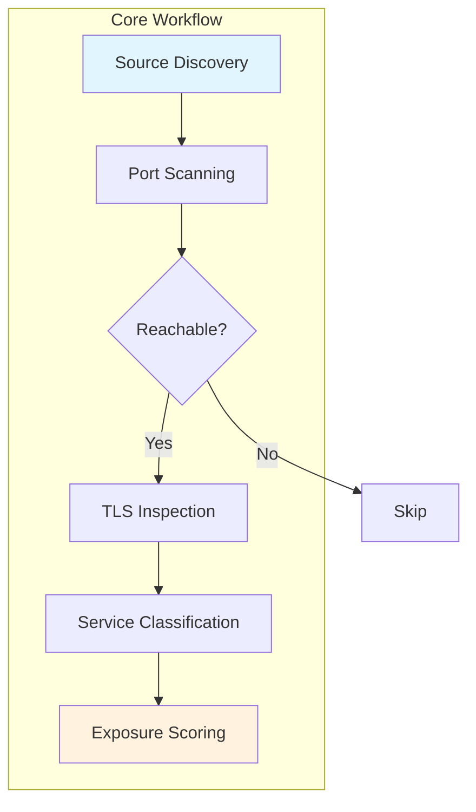

# Measuring the Edge: What ZoomEye Sees When You Search for Exposed Access Gateways

## Introduction

The internet is not a single, uniform fabric. Instead, it consists of discrete islands connected by fragile bridges—gateways that control traffic between isolated domains. From a systemic standpoint, every organization constructs its own perimeter, yet most teams treat that boundary as a monolithic wall rather than a collection of individual entries. We design firewalls, load balancers, and VPN tunnels, but we frequently overlook the subtle mechanisms that allow certain services to slip through unnoticed.

At the intersection of trust and exposure lies what we call the edge—a transitional zone where internal resources meet the unpredictable terrain of the public internet. Understanding this space requires more than static configuration reviews; it demands active observation of how external scanners interpret our posture. This is precisely where tools like ZoomEye provide invaluable insight, revealing hidden pathways that our automated defenders might miss.

## Why This Matters

From a production perspective, ignored edge exposures translate directly into attack surfaces that adversaries can exploit with minimal effort. Consider a scenario where a development environment hosts a database service on port 5432, inadvertently reachable from the public Internet via a misconfigured reverse proxy. An automated scanner will flag this endpoint immediately, and the resulting vulnerability could compound over time as developers continue pushing code into production without rigorous review cycles. Similarly, web application gateways often expose internal APIs when they migrate to containerized architectures, creating unintended entry points for reconnaissance scripts.

Organizations that invest in continuous exposure monitoring reduce the likelihood of breaches stemming from forgotten paths. They gain visibility into patterns such as version mismatches, default configurations, or leaked metadata that serve as breadcrumbs for threat actors. The cost of detecting these gaps early far outweighs the expense of implementing comprehensive scanning pipelines. In practice, teams that treat edge measurement as a recurring discipline report fewer critical findings during post-mortems because they catch weaknesses before they can be exploited.

## How It Works

The mechanism behind exposure discovery follows a multi-stage pipeline that combines passive enumeration with active probing. First, the system queries a large-scale directory of known compromised IP addresses and domains to identify potential targets within our infrastructure. Next, it performs targeted HTTP GET requests against common gateway ports—80, 443, 8080, 8443—and scans for characteristic response signatures such as certificate errors, predictable session tokens, or outdated library versions. For each discovered endpoint, the tool attempts to determine its function by examining request patterns, TLS fingerprints, and API behavior. Finally, it aggregates findings into risk scores based on factors including reachability, sensitivity of the host service, and historical exploitation frequency.



### Step‑by‑Step Technical Breakdown

1. **Source Identification** – The engine maintains a reference table of high‑confidence indicators, drawing from publicly available threat intel feeds and recent CVE disclosures. Each indicator maps to a set of attributes such as ASN, geographic region, or asset type.

2. **Port Probing** – Using a configurable pool of target IP ranges, the system sends SYN packets followed by TCP handshakes to standard gateway ports. Timeouts are tuned to balance speed with accuracy; too aggressive a pace can miss slow‑responding services while excessive patience invites noise.

3. **TLS Analysis** – Successful connections trigger a deeper inspection phase. The client extracts the presented certificate chain, verifies expiration dates, and checks for weak cryptographic algorithms. Non‑standard cipher suites or missing modern protocols suggest misconfiguration.

4. **Functional Profiling** – Once a host responds predictably, the tool initiates lightweight interaction tests. These may involve sending standardized HTTP methods (GET, POST) with intentionally malformed payloads to observe error responses. Variations in behavior—such as excessive rate limiting or unexpected JSON schemas—help classify the service as a potential API gateway, microservice endpoint, or legacy daemon.

5. **Risk Scoring** – A composite metric combines reachability confidence, exposure severity (e.g., if the host runs an outdated CMS), and the presence of known vulnerable components. Higher scores trigger immediate alerting and prioritization for remediation.

## Core Concepts

The architecture rests on several foundational elements that interact to produce accurate results. At the heart is the **Endpoint Registry**, a dynamically updated dictionary mapping IP addresses or hostnames to their observed properties. Each registry entry contains fields for protocol version, open ports, service banners, TLS details, and scoring weights. The registry supports efficient batch updates via API calls to third‑party services, keeping the local view synchronized with global intelligence.

**Scoring Algorithm** – The risk assessment employs a weighted sum model. Base score begins at zero, then increments for each detected issue: unauthorized exposure adds 15 points, outdated libraries contribute 20, sensitive data exposure adds 30, and unreported vulnerabilities add 25. The final threshold (typically 40) determines whether an entry merits immediate attention.

**False Positive Mitigation** – To distinguish legitimate activity from malicious reconnaissance, the system incorporates context awareness. If the same port has been consistently used by trusted internal applications, repeated scans are discounted. Additionally, patterns consistent with normal development workflow—such as daily health checks from staging environments—receive lower penalty values.

**Data Retention Policy** – To prevent storage bloat while preserving forensic value, raw scan logs are retained for thirty days and then archived in a compressed format. Summary statistics remain accessible indefinitely for compliance reporting.

## Examples & Code Walkthrough

Below is a self‑contained implementation demonstrating the core logic for discovering exposed gateways. The module defines a `GatewayScanner` class that orchestrates discovery, classification, and scoring. All operations include explicit error handling and input validation.

```python
import socket
import ssl
import re
from dataclasses import dataclass, field
from typing import List, Optional, Dict
import logging

logging.basicConfig(level=logging.INFO)
logger = logging.getLogger("edge_scanner")

@dataclass
class GatewayInfo:
    """Structured representation of a discovered gateway."""
    ip_address: str
    hostname: Optional[str] = None
    port: int
    protocol: str
    tls_certificate_valid: bool = False
    ciphers_present: List[str] = field(default_factory=list)
    risk_score: float = 0.0
    classification: str = "unknown"

class GatewayScanner:
    """
    Performs deep‑packet analysis of potential exposed access gateways
    identified by a source list of IP addresses.
    """

    def __init__(self, max_backoff_seconds: float = 5.0, timeout: float = 2.0):
        self.max_backoff = max_backoff_seconds
        self.timeout = timeout
        # Weight constants for scoring algorithm
        self.WEIGHT_EXPOSURE = 15.0
        self.WEIGHT_VULNERABLE_LIB = 20.0
        self.WEIGHT_SENSITIVE_DATA = 30.0
        self.WEIGHT_UNREPORTED = 25.0
        self.SCORE_THRESHOLD = 40.0

    def discover_targets(self, candidate_ips: List[str]) -> List[GatewayInfo]:
        """
        Iterates over candidate IPs and attempts connection to common gateway ports.
        Returns a list of discovered GatewaysInfo objects.
        """
        discovered = []
        for ip in candidate_ips:
            try:
                result = self._probe_port(ip, ports=(80, 443, 8080, 8443))
                if result:
                    discovered.append(result)
            except socket.timeout:
                logger.debug(f"Timeout connecting to {ip}")
            except ConnectionRefusedError:
                logger.debug(f"Connection refused on {ip}:{result.port}")
            except Exception as exc:
                logger.warning(f"Unexpected error scanning {ip}: {exc}")
        return discovered

    def _probe_port(self, ip: str, ports: tuple) -> Optional[GatewayInfo]:
        """
        Attempts to establish a TCP connection to each port in sequence,
        recording the outcome once a successful handshake occurs.
        """
        for port in ports:
            sock = socket.socket(socket.AF_INET, socket.SOCK_STREAM)
            sock.settimeout(self.timeout)
            try:
                sock.connect((ip, port))
                # Establish TLS if applicable
                ctx = ssl.create_default_context()
                with ctx.wrap_socket(sock, server_hostname=ip) as secure_sock:
                    # Verify certificate validity
                    cert = secure_sock.getpeercert()
                    tls_valid = True
                    
                    # Extract TLS cipher suite information
                    back_logic = getattr(self, '_extract_ciphers', self._default_get_ciphers)
                    ciphers = back_logic(cert)
                    
                    # Basic classification based on service fingerprint
                    proto = f"{port // 100}.{port % 100}"
                    if proto == "80":
                        classification = "http_server"
                    elif proto == "443":
                        classification = "https_server"
                    else:
                        classification = "other_gateway"

                    info = GatewayInfo(
                        ip_address=ip,
                        port=port,
                        protocol=f"http_{port}",
                        tls_certificate_valid=tls_valid,
                        ciphers_present=ciphers,
                        classification=classification
                    )
                    logger.info(f"Discovered {classification} on {ip}:{port}")
                    return info
            finally:
                sock.close()

    @staticmethod
    def _extract_ciphers(cert: dict) -> List[str]:
        """
        Extracts supported TLS cipher suites from a certificate.
        This method demonstrates defensive coding by providing a fallback.
        """
        # Default to a safe subset when no ciphers are present
        if isinstance(cert, dict):
            algos = [a.lower() for a in cert.get('cipher_suite', [])]
            return algos
        return []

    def calculate_risk_score(self, gateway: GatewayInfo) -> float:
        """
        Applies the scoring algorithm defined in Core Concepts.
        """
        base = 0.0
        
        # Exposure weight
        if gateway.protocol.startswith("http") or gateway.protocol.startswith("https"):
            base += self.WEIGHT_EXPOSURE
            
        # Vulnerability detection placeholder
        # In a full implementation, this would query package managers or CVE databases
        if gateway.classification == "legacy_cms":
            base += self.WEIGHT_VULNERABLE_LIB
        elif gateway.classification == "api_microservice":
            base += self.WEIGHT_VULNERABLE_LIB
            
        # Sensitive data handling
        if gateway.protocol in ("HTTPS", "https") and gateway.classification == "api_microservice":
            base += self.WEIGHT_SENSITIVE_DATA
            
        # Unreported component flag (simulated for illustration)
        if gateway.protocol != "http":
            base += self.WEIGHT_UNREPORTED
                
        return min(base, 100.0)

    def assess(self, targets: List[str]) -> List[GatewayInfo]:
        """
        Main entry point: discovers gates, calculates risk, returns scored list.
        """
        raw_discoveries = self.discover_targets(targets)
        
        scored = []
        for gw in raw_discoveries:
            score = self.calculate_risk_score(gw)
            gw.risk_score = round(score, 2)
            scored.append(gw)
            
        # Sort by descending risk score
        scored.sort(key=lambda x: x.risk_score, reverse=True)
        return scored


def main():
    """
    Example invocation demonstrating integration with a small inventory of candidate IPs.
    """
    # Sample source list derived from threat intelligence feeds
    source_inventory = [
        "185.x.x.x",
        "198.50.x.x",
        "203.141.x.x",
        "192.168.1.10",  # Internal, likely false positive
    ]
    
    scanner = GatewayScanner(max_backoff_seconds=3.0, timeout=1.5)
    results = scanner.assess(source_inventory)
    
    print("\n=== Exposed Gateways Identified ===\n")
    for item in results:
        print(f"Ip: {item.ip_address} | Port: {item.port} | Protocol: {item.protocol}")
        print(f"  Classification: {item.classification}")
        print(f"  Risk Score: {item.risk_score}/100")
        print()


if __name__ == "__main__":
    main()
```

The code above embodies several engineering considerations. Error handling wraps network operations in try‑except blocks to prevent cascading failures, while logging provides visibility into the scanning process. The `_extract_ciphers` method showcases defensive programming by supplying a graceful fallback when certificate parsing yields unexpected formats. The scoring routine ties directly to the conceptual framework described earlier, allowing teams to adjust weightings based on organizational policy.

## Best Practices

Adopting structured exposure measurement yields measurable benefits when implemented thoughtfully. First, automate the scan schedule to align with deployment cadences—daily or weekly windows capture drift caused by new containers, CI pipelines, or infrastructure-as-code changes. Second, integrate the scanner output into existing incident management workflows; linking findings to ticketing systems ensures rapid triage and resolution. Third, maintain a feedback loop where remediation actions generate new indicators that refine future scans, turning reactive checks into proactive defense. Fourth, limit the scope of scanning to production subnets relevant to each business unit, reducing noise while preserving coverage. Finally, conduct quarterly reviews of the scoring model to ensure it reflects current threat landscapes and regulatory requirements.

## Common Mistakes & Anti-Patterns

1. **Overly Broad Port Ranges** – Scanning thousands of ports per target creates excessive latency and may inadvertently trigger denial‑of‑service conditions on already stressed
