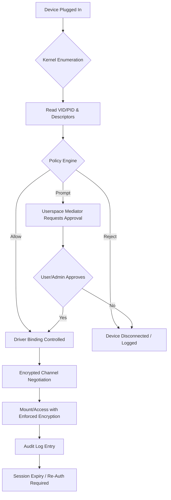

# Media Encryption & Port Protection Deep Dive: USB Control, Encryption & Device Authorization

## Introduction

Every engineer who has supported an enterprise fleet or managed a fleet of developer workstations has encountered the moment a new USB device is plugged in. The familiar chime, the `/dev/sdx` entry, the rapid appearance of a mount point. For decades, the USB port has been the convenient gateway for storage, input peripherals, and diagnostic tools. It has also been the attack vector of choice for state-level actors, ransomware operators, and insider-threat programs.

Recent incidents have made it clear that perimeter-only defenses are insufficient. A compromised firmware image, a maliciously crafted HID device, or a stolen credential stored on a removable medium can bypass network firewalls and endpoint antivirus in seconds. The industry's response has been a patchwork of group policies, endpoint agents, and driver-level filters. But a coherent architectural strategy—one that binds device authorization, cryptographic integrity, and kernel-level control into a single enforceable model—remains rare.

This article walks through a production-grade approach to USB and media security. We'll examine the transaction lifecycle at the kernel level, explore authorization patterns that operate at the port, and implement concrete code that you can audit, extend, and deploy. The goal is not to fear the port, but to bring it under the same policy-driven control that governs network connections and process execution.

## Why This Matters

Software architects often treat security as a layer added after the fact: a firewall rule here, an ACL there. When it comes to USB and removable media, that approach fails because the trust boundary is physical. A device that is electrically present on the bus already has the host's attention. The kernel's default behavior is to accept whatever the device declares through its descriptors, configure the requested endpoints, and bind the appropriate driver.

In practice, this means:

- A device presenting a valid VID/PID pair for a known vendor can still execute unauthorized code if its firmware has been altered.
- USB mass-storage devices can be used to exfiltrate data at speeds exceeding many network interfaces.
- HID-class devices (rubber ducky-style payloads) can inject keystrokes and commands at rates that bypass human-in-the-loop approvals.
- Encrypted containers are only as secure as the authorization model that unlocks them. If the host automatically mounts a device based on plug-in event, the encryption provides defense-in-depth, not primary protection.

The pain point is clear: without integrated device authorization and port-level enforcement, the USB subsystem is an unlocked front door. We need to move the decision point from "after the device is mounted" to "before the kernel binds a driver." This requires kernel-aware policy engines, firmware integrity checks, and a chain of trust that extends from the host controller to the application layer.

## How It Works

At the heart of USB security is the enumeration sequence. When a device is plugged into a host controller, the host sends a reset, reads the device descriptor, and iterates through configuration and interface descriptors. The kernel then binds a driver based on class codes, subclass information, and the ever-reliable VID/PID pairing. Attackers exploit this trust model by presenting forged descriptors, leveraging device firmware vulnerabilities, or using devices that initially enumerate as one class and switch modes after driver binding.

A robust authorization architecture intercepts this flow at multiple points:

1. **Bus-level event capture**: Monitor `uevent` sequences as the kernel detects new hardware.
2. **Descriptor validation**: Verify that reported VID/PID, serial numbers, and string descriptors match an allowlist or trust anchor.
3. **Policy evaluation**: A policy engine decides whether the device is permitted, requires user approval, or is rejected outright.
4. **Driver binding control**: Prevent automatic driver attachment for unapproved devices, forcing a userspace mediator to handle configuration.
5. **Encrypted channel provisioning**: If authorized, negotiate a session key or mount parameters that enforce encryption before any user-space process can access the device's storage.

The following mermaid flowchart visualizes this core mechanism, from physical connection through policy decision to encrypted data access.



**Step-by-step breakdown:**

- **A → B**: The host controller detects a reset event and the kernel generates a `uevent` with `DEVNAME`, `ID_VENDOR_ID`, `ID_MODEL_ID`, and other sysfs attributes.
- **B → C**: The policy engine reads the full set of descriptors (device, configuration, interface, endpoint) from the sysfs `descriptors` file or via a `libusb`/`pyusb` query. It computes a fingerprint (e.g., SHA-256 of the concatenated descriptor bytes) and checks it against a signed allowlist or allowlist hash database.
- **C → D**: The policy engine applies rules: whitelist match → allow; blacklist match → reject; unknown → prompt or default-deny. Rules can be time-bound, location-bound (e.g., only on docked workstations), or role-bound (e.g., engineering laptops vs. kiosks).
- **D → E/F/G**: If allowed, the system either permits kernel driver binding or intercepts it via a `usbguard` or `minifilter` layer. If prompted, a userspace daemon (e.g., `usbguard-daemon`, custom `systemd-ask-password` helper) presents a challenge to the authenticated user. Approval triggers the controlled binding path; rejection triggers immediate device disable and audit logging.
- **E → I**: Upon controlled binding, the system negotiates an encrypted session. This could be a FUSE-based encrypted block device, a kernel keyring entry, or a userspace FUSE daemon that requires a passphrase before any `read()`/`write()` operation succeeds.
- **I → J**: Access is only granted after the encryption handshake completes. The mount point appears, but read/write operations fail with `EKEYREJECTED` or `EACCES` until the user authenticates through the designated PAM module or policy agent.
- **J → K**: Every access event, approval, and rejection is logged to a centralized audit backend (e.g., syslog, Elasticsearch, or a local immutable append-only file). This satisfies compliance requirements and provides forensic data in the event of a breach.
- **K → L**: Sessions have a defined TTL. After expiry, re-authorization is required, ensuring that a stolen or compromised device cannot maintain persistent access.

This flow moves the trust decision from "the device is from a known vendor" to "the device is authorized for this host at this time under these conditions." It is the difference between a static allowlist and a dynamic, context-aware enforcement point.

## Core Concepts

Several foundational concepts underpin a production-grade USB authorization and encryption stack. Understanding these will make the code walkthrough and deployment patterns that follow far more intuitive.

**Device Identity & Fingerprinting**
Every USB device reports a vendor ID (VID) and product ID (PID), optionally supplemented by a serial number string descriptor. In a secure deployment, these three fields alone are insufficient because they can be spoofed via firmware updates or `libusb` overrides. A fingerprint combines the VID/PID/serial tuple with additional entropy: the device's reported USB revision, the maximum packet size of the default endpoint, and a hash of the first 256 bytes of the device descriptor. This fingerprint is then signed by a trusted key management service and distributed to enforcement points as a compact, verifiable blob.

**Policy as Code**
Authorization rules should be expressible as declarative configuration, not hard-coded branches. A typical policy entry looks like:

```json
{
  "fingerprint": "sha256:3a7d...cf1e",
  "allowed_on": ["docked", "development"],
