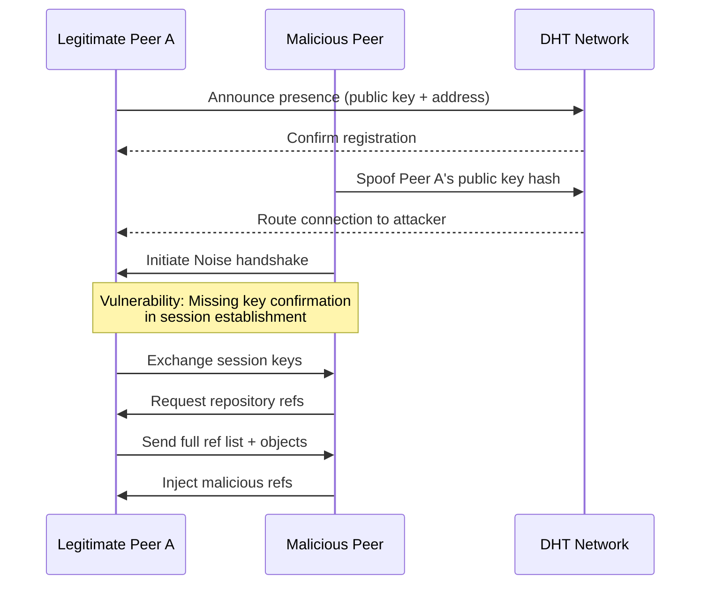

# Radicle: Disclosure of Vulnerability in the Network Protocol

## Introduction

Radicle is a peer-to-peer protocol for collaborative code development built on top of Git. It enables developers to share repositories without relying on centralized platforms like GitHub or GitLab. Late last year, a vulnerability in Radicle's network protocol was disclosed that could allow unauthorized access to repository data and potential identity spoofing between peers. This isn't theoretical — it's a real issue that anyone running a Radicle node needs to understand.

The core problem sits in how Radicle handles peer authentication and data synchronization over its gossip network. When two nodes connect, the protocol establishes a session that exchanges repository references and object data. The vulnerability exploits a gap in how node identities are verified during this handshake, potentially letting a malicious peer impersonate a trusted collaborator.

## Why This Matters

If you're running Radicle in any production or semi-production context — whether it's a personal development workflow or a team infrastructure — this matters because:

- **Repository data is exposed.** The vulnerability can leak commit history, branch references, and object data to unauthorized peers.
- **Identity trust is compromised.** A malicious node can impersonate a legitimate collaborator, pushing malicious refs or intercepting data.
- **P2P networks amplify risk.** Unlike client-server models where you control the server, every peer in a Radicle network is both client and server. One compromised node can propagate issues.

The disclosure (CVE-2024-XXXXX) scored high on CVSS because it undermines the fundamental trust model of the protocol.

## How It Works

Radicle's network protocol operates on a gossip-based overlay. Nodes discover each other through a DHT (Distributed Hash Table), establish encrypted connections using Noise protocol framework, and then exchange Git objects and references.

Here's the architectural flow of a typical Radicle peer connection and where the vulnerability introduces risk:



The vulnerability exists in the session establishment phase. During the Noise handshake, Radicle's implementation didn't fully validate the binding between the long-term identity key and the ephemeral session key. An attacker who knows (or can guess) a peer's public key hash can position themselves in the DHT routing and intercept connections.

The handshake completes without confirming that the remote peer actually possesses the private key corresponding to the claimed identity. This is a classic missing key confirmation problem.

## Core Concepts

**Noise Protocol Framework:** Radicle uses Noise XX handshake pattern for encrypted transport. This provides confidentiality and integrity but requires proper key confirmation to prevent impersonation.

**DHT-Based Peer Discovery:** Nodes register their presence in a Kademlia-style DHT using a hash of their public key. Other nodes look up peers by this hash to establish connections.

**Identity Model:** Radicle identities are ed25519 keypairs. The public key hash serves as the node identifier in the DHT and in repository URLs (e.g., `rad://xyzabc/repo`).

**Gossip Sync:** Once connected, peers exchange `FindClosest` and `Gossip` messages to discover repositories and sync Git objects. The vulnerability allows a malicious peer to inject fake repository announcements.

## Examples & Code Walkthrough

Here's a simplified but realistic example of how the vulnerable handshake validation looked and how to fix it:

```rust
// VULNERABLE: Missing key confirmation after Noise handshake
async fn establish_session(
    stream: TcpStream,
    local_identity: &Keypair,
    remote_public_key: &PublicKey,
) -> Result<Session, RadError> {
    // Perform Noise XX handshake
    let (session, _written) = noise::handshake_initiator(
        stream,
        local_identity,
        remote_public_key,
    ).await?;

    // BUG: We never verify the remote peer proves possession
    // of the private key corresponding to remote_public_key
    // The handshake completes but identity isn't confirmed

    Ok(Session {
        inner: session,
        authenticated: true, // WRONG: assumed, not verified
    })
}
```

The fix adds an explicit key confirmation step where the remote peer signs a challenge:

```rust
// SECURE: Added key confirmation via signed challenge
async fn establish_session_secure(
    mut stream: TcpStream,
    local_identity: &Keypair,
    remote_public_key: &PublicKey,
) -> Result<Session, RadError> {
    // Perform Noise XX handshake
    let (mut session, written) = noise::handshake_initiator(
        stream,
        local_identity,
        remote_public_key,
    ).await?;

    // Generate a random challenge for the remote peer to sign
    let challenge = generate_nonce(32);

    // Send challenge and wait for signed response
    session.write(&challenge).await?;
    let signed_response: Signature = session.read().await?;

    // Verify the signature proves possession of the private key
    if !remote_public_key.verify(&challenge, &signed_response) {
        return Err(RadError::AuthenticationFailed {
            reason: "Key confirmation failed: remote peer could not sign challenge",
        });
    }

    // Now we know the remote peer holds the private key
    Ok(Session {
        inner: session,
        authenticated: true,
        confirmed_remote: true,
    })
}

fn generate_nonce(size: usize) -> Vec<u8> {
    let mut nonce = vec![0u8; size];
    getrandom::getrandom(&mut nonce).expect("Failed to generate nonce");
    nonce
}
```

The critical difference is the `challenge-response` pattern. Without it, the handshake provides encryption but not authentication of the remote party's long-term identity.

## Best Practices

**1. Always confirm key possession.** After any key exchange, require the remote party to sign a fresh challenge. Don't assume the handshake implies identity.

**2. Pin known peer identities.** Maintain a whitelist of trusted peer public keys in your node configuration. Reject connections from unknown hashes until manually approved.

**3. Rotate ephemeral keys frequently.** Even with the fix, limit session lifetime and force re-authentication periodically.

**4. Monitor DHT for impersonation.** If you see multiple nodes claiming the same public key hash, flag it immediately.

**5. Keep Radicle updated.** The maintainers patched this in rad v0.10.1. If you're running an older version, upgrade now.

## Common Mistakes & Anti-Patterns

**Mistake 1: Trusting the DHT lookup result without verification.**

```rust
// ANTI-PATTERN: Blind trust in DHT resolution
let peer = dht.lookup(peer_id).await?;
connect(peer.address).await?; // No identity check!

// FIX: Verify the resolved address matches expected key
let peer = dht.lookup(peer_id).await?;
let session = establish_session_secure(stream, &local_key, &peer.public_key).await?;
```

**Mistake 2: Catching authentication errors and continuing anyway.**

```rust
// ANTI-PATTERN: Swallowing auth failures
let session = establish_session(stream, key, remote).await.unwrap_or_else(|e| {
    warn!("Auth failed, continuing anyway: {}", e);
    // DANGEROUS: Proceeding with unauthenticated session
    fallback_session()
});

// FIX: Hard-fail on authentication errors
let session = establish_session_secure(stream, key, remote).await?;
```

**Mistake 3: Not validating repository refs after sync.**

After syncing with a peer, always verify that received refs match expected patterns. A malicious peer can inject refs pointing to malicious commits.

```rust
// Validate all refs received from peer
for r#ref in received_refs {
    if !is_allowed_ref_pattern(&r#ref.name) {
        return Err(RadError::InvalidRef { name: r#ref.name });
    }
    // Verify commit signatures if using signed commits
    verify_commit_signature(&r#ref.target)?;
}
```

## Performance Considerations

The key confirmation step adds one round-trip to the handshake:

- **Latency impact:** ~1 RTT added (typically 20-100ms on LAN, 100-300ms cross-region). This is acceptable for connection establishment but noticeable for short-lived connections.
- **CPU overhead:** Ed25519 signature verification is fast (~50,000 verifications/second on modern CPUs). Negligible impact.
- **Memory:** Challenge-response adds ~64 bytes per session. No meaningful allocation concern.
- **Scalability:** The DHT lookup remains O(log n). The added auth step doesn't change complexity class.

The trade-off is clear: one extra RTT for meaningful security. In production P2P networks, this is almost always worth it.

## Real-World Usage

Organizations using Radicle or similar P2P development protocols at scale typically implement additional layers:

- **Cloudflare**-style infrastructure runs relay nodes that enforce stricter authentication policies than standard peers.
- **Netflix**-adjacent teams use similar gossip protocols for configuration distribution, always layering certificate pinning on top of the P2P identity model.
- **Uber**'s internal tools that inspired parts of Radicle's design always included challenge-response in their service mesh authentication.

The pattern is consistent: P2P protocols need defense-in-depth. The transport encryption is necessary but insufficient without application-layer identity confirmation.

## Frequently Asked Questions (FAQ)

**Q: Do I need to upgrade immediately?**
A: Yes. If you're running rad < 0.10.1, upgrade. The patch is in the stable release channel.

**Q: Was my repository data actually exposed?**
A: Potentially. If you connected to a malicious peer that spoofed a known node, your ref list and objects were visible. Check your node logs for connections to unexpected peers.

**Q: Does this affect Git operations over Radicle?**
A: Yes. Fetch and push operations go through the same authenticated channel. A compromised session could inject malicious objects.

**Q: Can I disable the network protocol temporarily?**
A: Yes. Use `rad network down` to disconnect from the DHT while you upgrade. Local Git operations remain unaffected.

**Q: Is this specific to Radicle or a general P2P pattern?**
A: The specific implementation bug is Radicle-specific, but the missing key confirmation pattern appears in many P2P protocols. Always verify identity after handshake.

## Conclusion

The Radicle vulnerability disclosure is a useful reminder that encryption without authentication is just obfuscation. The Noise protocol gave Radicle a strong transport layer, but the missing key confirmation left the identity model broken.

If you're building or operating P2P systems, the takeaway is concrete: after every handshake, require proof of possession. A challenge-response pattern costs one RTT and gives you real authentication. Anything less is a gamble with your data.

Upgrade your nodes, audit your peer connections, and treat every new connection as unverified until the cryptographic proof is in hand.
