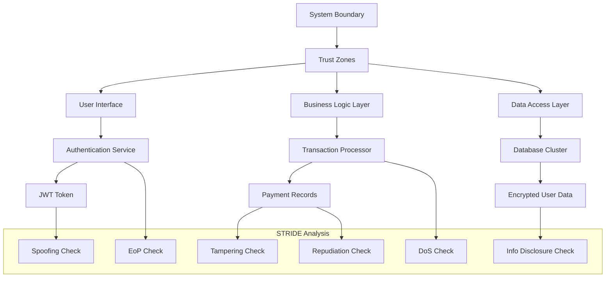

# STRIDE

## Introduction

I've seen too many security breaches stem from a fundamental oversight: teams building features without systematically asking "what could go wrong?" STRIDE isn't just another acronym—it's a battle-tested framework for answering exactly that question.

When we were hardening a payment processing system last year, applying STRIDE caught a spoofing vulnerability in our OAuth flow that had been live for months. The attacker didn't need to break cryptography; they just needed to exploit missing identity verification steps. That's the power of structured threat modeling.

STRIDE gives us six categories of threats to systematically evaluate: Spoofing, Tampering, Repudiation, Information Disclosure, Denial of Service, and Elevation of Privilege. Each represents a different way an attacker could compromise our systems.

## Why This Matters

Security isn't a feature you add—it's a property you architect for from day one. Every startup I've consulted with that suffered a breach had one thing in common: they treated security as an afterthought rather than a design constraint.

The cost difference is stark. Fixing a spoofing vulnerability during design phase costs hours. Discovering it post-breach costs hundreds of thousands in liability, not to mention reputation damage. STRIDE shifts left that expensive discovery—catching issues when they're still cheap to fix.

Consider a distributed banking application. Without STRIDE, teams might focus on encrypting data flows (good) but miss that session tokens lack proper expiration ( Spoofing vulnerability). Or they implement audit logs (great) but forget cryptographic signing ( Repudiation gap).

## How It Works



The framework works by forcing you to examine each component through six different threat lenses. You identify trust boundaries (where security posture changes), then ask targeted questions about each asset crossing those boundaries.

For instance, examining a payment record through the Spoofing lens: "Can someone impersonate a legitimate user?" Through Tampering: "Can this data be modified in transit?" Each question reveals specific attack vectors that generic security reviews might miss.

## Core Concepts

**Spoofing**: Identity deception—making you believe someone else is who they claim to be. This isn't just password compromise; it's any mechanism that falsifies identity assertions.

**Tampering**: Unauthorized modification of data—whether in transit, at rest, or in use. The difference between integrity and confidentiality, but both critical.

**Repudiation**: When actors can deny performing actions. A system without non-repudiation allows malicious users to claim innocence while providing zero evidence otherwise.

**Information Disclosure**: Unauthorized exposure of information. This spans everything from SQL injection to side-channel attacks leaking memory contents.

**Denial of Service**: Resource exhaustion preventing legitimate use. Not just crashing servers—consuming quotas, filling disk space, monopolizing CPU cycles.

**Elevation of Privilege**: Gaining capabilities beyond your authorized scope. This includes both privilege escalation (user → admin) and privilege abuse (admin doing unauthorized admin things).

Each STRIDE category requires different mitigation strategies, making comprehensive coverage essential.

## Examples & Code Walkthrough

Let me show you how we implemented STRIDE checks in a real authentication service:

```python
from datetime import datetime, timedelta
import hashlib
import hmac
from typing import Dict, List, Optional

class AuthenticationService:
    def __init__(self, secret_key: bytes):
        self.secret_key = secret_key
        self.failed_attempts: Dict[str, List[datetime]] = {}
        
    def generate_token(self, user_id: str, roles: List[str], 
                      expires_in_minutes: int = 30) -> str:
        """Generate JWT-like token with built-in anti-spoofing measures"""
        expiration = datetime.utcnow() + timedelta(minutes=expires_in_minutes)
        payload = {
            'user_id': user_id,
            'roles': roles,
            'exp': expiration.timestamp(),
            'iat': datetime.utcnow().timestamp()
        }
        
        # Sign with HMAC-SHA256 for tamper detection
        message = str(payload).encode('utf-8')
        signature = hmac.new(
            self.secret_key, 
            message, 
            hashlib.sha256
        ).hexdigest()
        
        return f"{payload}|{signature}"
    
    def validate_token(self, token: str) -> Optional[Dict]:
        """Validate token with spoofing and tampering checks"""
        try:
            parts = token.split('|')
            if len(parts) != 2:
                return None  # Malformed token - potential spoofing attempt
                
            payload_str, signature = parts
            payload = eval(payload_str)  # In practice, use json.loads with validation
            
            # Verify signature (tampering check)
            expected_sig = hmac.new(
                self.secret_key,
                payload_str.encode('utf-8'),
                hashlib.sha256
            ).hexdigest()
            
            if not hmac.compare_digest(signature, expected_sig):
                return None  # Tampering detected
                
            # Check expiration (spoofing via token reuse)
            if datetime.utcnow().timestamp() > payload['exp']:
                return None
                
            return payload
            
        except Exception:
            return None

class AuditLogger:
    def __init__(self, signing_key: bytes):
        self.signing_key = signing_key
        
    def log_action(self, user_id: str, action: str, 
                   metadata: Dict = None) -> str:
        """Create non-repudiable audit log entry"""
        timestamp = datetime.utcnow().isoformat()
        entry = {
            'user_id': user_id,
            'action': action,
            'timestamp': timestamp,
            'metadata': metadata or {}
        }
        
        # Create cryptographic signature for non-repudiation
        entry_str = str(entry).encode('utf-8')
        signature = hmac.new(
            self.signing_key,
            entry_str,
            hashlib.sha256
        ).hexdigest()
        
        return f"{entry}|{signature}"
```

This implementation addresses multiple STRIDE concerns simultaneously. The token validation prevents spoofing by verifying identity claims, detects tampering through HMAC signatures, and prevents repudiation through the audit logger's cryptographic signing.

## Best Practices

**Map trust boundaries explicitly**. Every interface where security assumptions change needs documented boundaries. In our microservices architecture, we draw these at service-to-service communication points, not just network perimeters.

**Apply STRIDE early and often**. Don't wait until code review. During design sessions, walk through each component asking STRIDE questions. We schedule 30-minute threat modeling sessions for every major feature.

**Document your mitigations**. For each identified threat, record both the risk level and chosen mitigation. This creates accountability and helps future maintainers understand security decisions.

**Automate where possible**. We built static analysis rules that flag common STRIDE violations—missing authentication on endpoints, unencrypted data flows, absence of audit logging.

## Common Mistakes & Anti-Patterns

**Mistake 1: Treating STRIDE as a checklist rather than a methodology**. Teams often stop after identifying threats, missing that mitigation requires architectural changes. True security means redesigning systems, not just adding patches.

**Mistake 2: Ignoring implementation details**. I've seen teams document perfect threat models but deploy configurations that nullify protections. Your load balancer might terminate TLS, making application-layer encryption redundant and potentially introducing key management vulnerabilities.

**Mistake 3: Over-engineering mitigations**. Not every component needs the same security level. A public marketing page doesn't require the same audit logging as a payment processor. Risk-based prioritization prevents security fatigue.

**Mistake 4: Static analysis only**. Threat landscapes evolve. We conduct quarterly STRIDE reviews of production systems, looking for emergent threats from new attack patterns or system changes.

## Performance Considerations

Adding security controls inevitably impacts performance. Here's where we've seen the biggest trade-offs:

**Cryptographic signing overhead**: HMAC operations add ~50 microseconds per request. For high-throughput systems, we batch signatures or use hardware acceleration when available.

**Rate limiting memory footprint**: Our token bucket implementation stores state for every client IP. At scale, this requires careful memory management and eventual consistency strategies.

**Audit logging I/O**: Writing cryptographic proof of every action generates significant write load. We mitigate this with asynchronous logging and batch processing, accepting slight delays in audit trail availability.

**Encryption/decryption costs**: End-to-end encryption for sensitive fields can double processing time. We selectively apply it only to high-value data, balancing protection with performance.

The key is measuring these impacts in staging environments that mirror production load patterns.

## Real-World Usage

Microsoft developed STRIDE as part of their Security Development Lifecycle, and it's become industry standard for threat modeling. Companies like Netflix, Stripe, and Shopify integrate it into their security practices.

At Stripe, engineers use STRIDE during API design reviews, particularly for payment flows where spoofing and tampering have direct financial impact. Their documentation explicitly calls out how each endpoint maps to STRIDE categories.

Netflix applies it to their streaming infrastructure, where DoS resilience and information disclosure prevention are critical for maintaining service availability during peak usage periods.

Google's BeyondCorp zero-trust model fundamentally relies on STRIDE principles—every access decision considers spoofing and elevation of privilege risks rather than assuming network perimeter security.

These organizations don't just apply STRIDE once. They've embedded it into their engineering culture through tooling, training, and regular security reviews.

## Frequently Asked Questions (FAQ)

**Q: How detailed should my STRIDE analysis be?**
A: Start high-level, then drill down based on risk. Map all components initially, but invest more time in high-value assets like authentication systems, payment flows, and data stores.

**Q: Can I automate STRIDE analysis?**
A: Partially. Static analysis tools can flag common patterns (missing auth, unencrypted flows), but human judgment remains essential for understanding business logic and emergent threats.

**Q: How often should I re-run STRIDE analysis?**
A: After major system changes, quarterly for critical systems, annually for everything else. Production incidents often reveal gaps in initial threat models.

**Q: What's the relationship between STRIDE and OWASP Top 10?**
A: They complement each other. STRIDE helps you discover where OWASP vulnerabilities might exist in your specific architecture, while OWASP provides detailed mitigation guidance.

**Q: My team resists threat modeling—how do I get buy-in?**
A: Start small with concrete examples. Show how STRIDE identified a real vulnerability before it became a problem. Make it collaborative rather than a security team imposition.

## Conclusion

STRIDE transforms security from reactive patching to proactive design. It forces engineers to think like attackers while building defenses into system architecture.

The framework's strength lies in its simplicity—just six categories covering the spectrum of security threats. But that simplicity can become a weakness if applied superficially. True mastery means using STRIDE to drive architectural decisions, not just document them.

In my experience, teams that fully embrace STRIDE see dramatically fewer security incidents. Not because they eliminate all threats, but because they systematically address the most common attack vectors before deployment.

Start small: pick one component, walk through it with a colleague using STRIDE questions. You'll be surprised what you find—and more importantly, you'll build the habit that prevents the next major breach.
